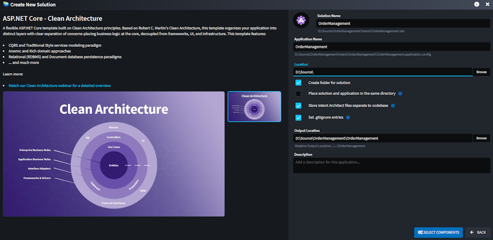

# Release notes: Intent Architect version 4.5

## Version 4.5.18

### Features in 4.5.18

- Feature: It is now possible to convert element types, this is particularly useful after using importers and it is sometimes needed to fix some imported element types:

  

  The feature can be accessed on element context menus under the `Advanced` option:

  

### Improvements in 4.5.18

- Improvement: Designers will now indicate which elements are dirty (i.e. have changes that have not yet been saved) in the tree-view:

  

- Improvement: Implemented file system caching on most operations to improve hot Software Factory performance.
- Improvement: Dynamic form tree-view now supports setting the `expandedIcon` which renders when the node is expanded.
- Improvement: Added support for open directory functionality in dynamic forms.

### Issues fixed in 4.5.18

- Fixed: Memory leaks in the hot Software Factory. Also ensure you are running the following minimum module versions to for the best possible hot Software Factory experience:
  - `Intent.Common` version `3.9.1`.
  - `Intent.Common.CSharp` version `3.9.7-pre.0`.
- Fixed: Advanced Mapping errors on source elements not disappearing after the new mapping is specified.
- Fixed: Filter being ignored when bulk selecting tree-view elements in dynamic forms.
- Fixed: Association mappings being silently removed when the mapping option doesn't exist in the settings.
- Fixed: Basic Mapping dialog cannot be opened if mapping is in a broken state (e.g. the target element has been deleted).

## Version 4.5.17

### Improvements in 4.5.17

- Improvement: 🔥 The Software Factory now supports hot-restarting provided you have version `3.9.1-pre.0` or higher of the `Intent.Common` module installed in your application. When the Software Factory hot restarts it does not tear down the process, preventing the requirement of reloading DLLs and also allowing the CLR's runtime optimizations to be longer lived and more effective.
- Improvement: Ignored Software Factory changes now have their processing skipped which can greatly speed up Software Factory execution times in cases where there are many ignored files.
- Improvement: It is now possible to hide ignored Software Factory changes:

  

  The options are as follows:

  - **Hide All Ignored** - All ignored changes are hidden.
  - **Hide Unchanged Ignored** - (Recommended) Ignored changes are hidden, except for changes which are different from the previous Software Factory execution.
  - **Show Ignored** - This is the legacy behaviour where all ignored files were visible.

  It is recommended to use the `Hide Unchanged Ignored` option as this will show ignored files which have changed since they were initially ignored. This option can facilitate progressively resolving reasons for files being ignored in the first place without the need to try "fix" all ignored files at once.
- Improvement: Added `Open metadata location` option to Applications in the Solution Explorer

### Issues fixed in 4.5.17

- Fixed: ModelLoader crashing in situations when applications exist within a solution that don't share the same designers
- Fixed: Open in IDE will now also work when for Visual Studio versions other than 2022 release versions, such as preview, insider, or newer versions.

## Version 4.5.16

### Issues fixed in 4.5.16

- Fixed: Certain users would experience a license validation error when trying to create a new application.

## Version 4.5.15

### Improvements in 4.5.15

- Improvement: (Module Building) Various additions to the SDK to enable additional features for output targeting designers (such as the Visual Studio designer) towards being able to support multiple `Template Output` items for the same template, but in different locations:
  - May now specify dependencies which templates can use to determine scope in which to search for other template instances.
  - `IOutputTarget` now has `Emit` and `On` methods allowing scope based "publishing" of events where only the same or referencing projects will receive emitted events.
  - May now specify on Template Outputs whether they are enabled / disabled.
  - May now specify filters on Template Outputs for model per template which models should apply.
- Improvement: Template Outputs can now be created multiple times, once for each matching `Role`.

### Issues fixed in 4.5.15

- Fixed: Under rare circumstances the agent would shut itself down when an error occurs during software factory execution.
- Fixed: Metadata exporting and installation ignored metadata entries on packages.
- Fixed: ApplicationId is passed to solution-based metadata provider to prevent returning metadata from all applications.

## Version 4.5.14

### Improvements in 4.5.14

- Feature: Added `Package as Module...` option to applications in the Solution Explorer. This option opens a dialog which the user can use to package the selected application's metadata into a Module for sharing with other application (e.g. across repositories).
- Improvement: Performance optimizations for Selectable Tree-View.
- Improvement: Dynamic Form support for layout using `columns` field (experimental)
- Improvement: Added `hintType` to Dynamic Form Field configurations to control the colour and icon of the hint.
- Improvement: Added `alert` field type to Dynamic Forms.
- Improvement: Loading spinner will no show in tree-views when expanding to display large numbers (>1000) of child elements

### Issues fixed in 4.5.14

- Fixed: Type Reference dropdown options for target elements in the Advanced Mapping being cut off and not fully visible.
- Fixed: zIndex fields in visual metadata files can lead to many unnecessary changes in version control, creating noise and increasing the chance of merge conflicts.
- Fixed: Tree-model suggestions misaligned when no diagram has been loaded.
- Fixed: (macOS) Only the first module task execution during an Intent Architect session would launch and any further module task execution attempts would do nothing until Intent Architect was completely restarted.

## Version 4.5.13

### Improvements in 4.5.13

- Improvement: Dynamic Forms now support pages in a wizard with asynchronous `onInitialize` and `onContinue` hook points for each page. This functionality has been applied to enhance the experience of the Database Importer.
- Improvement: Added a button to expand and compress the Advanced Mapping dialog in and out of full screen.

### Issues fixed in 4.5.13

- Fixed: SF changes appearing after SF has completed in scenarios where the `intent` folder is inside of the `Output Location`.
- Fixed: Metadata installer not setting Diagram Target Package Id to new folder's Id on installation.
- Fixed: Advanced Mapping duplicating new complex types for the same source mapping type.
- Fixed: Advanced Mapping creating unnecessary new properties with "auto-mapping" on root nodes.
- Fixed: Advanced Mapping not providing correct auto-mapping options when `Override Map to Parent Function` is active.
- Fixed: Diagram `New diagram elements` changes dropdown not saving unless diagram is opened.

## Version 4.5.12

### Improvements in 4.5.12

- Improvement: Package as Sample feature now allows the user to specify whether the source code should be included and whether the application can be renamed.

- Improvement: JS API now exposes as `getPreviousName()` function on elements. This allows name changes to be detected in designer scripts.
- Improvement: JS API now exposes `applicationId` and `designerId` on packages. This is useful to, for example, detect if elements are from external applications.
- Improvement: Added `Try Auto-Map` (with `space` shortcut) to mappable elements in the Advanced Mapping dialog.
- Improvement: Suggestions now show in the tree-view Model.
- Improvement: Warning with resolution message shown on package references if the packageId is misconfigured in the metadata.

### Issues fixed in 4.5.12

- Fixed: Reordering DTO-Fields in the Advanced Mapping not working when there are Generic Arguments present (e.g. when a Query returns a PagedResult<T>)
- Fixed: Source of scripts not showing in Output Console for Element Setting Extensions in certain circumstances.
- Fixed: On-changed events no longer get triggered by child element changes if the child is deleted and then an undo is applied.
- Fixed: Module config (e.g. disabled templates) not getting installed with Sample system.
- Fixed: Shutting down SF from dialog causes unexpected focus requests to the Intent Architect application.

## Version 4.5.11

### Improvements in 4.5.11

- Improvement: Comments textarea now automatically resizes to fit its text.

### Issues fixed in 4.5.11

- Fixed: Designer null reference errors can potentially occur on any scripts (validation, accelerators, on-change events, etc.) which are working with empty stereotype values.

## Version 4.5.10

### New Features in 4.5.10

- New Feature: A popover will appear below diagram elements when hovering over any element. The popover will display the full name of the element, its comments in markdown (if any), and its package name.


### Improvements in 4.5.10

- Improvement: "Update Available" icon will now pulsate if a new update is available. The pulsating will stop permanently for the user's current session once they click on the icon. This is aimed at ensuring users are aware of updates and to help users stay updated with the latest version of the platform.
- Improvement: Associations from package references will now show syntax highlighting (e.g. in the advanced mapping view between the Services and Domain)
- Improvement: When dragging and dropping elements, there is now an indicator to more clearly show whether the element will be inserted above, below or within the destination element if dropped.
- Improvement: Added `ctrl + shift + z` as an additional shortcut for *Redo*.
- Improvement: `ctrl + enter` on diagrams now adds the visual to empty space in the diagram.
- Improvement: Copy + Paste on diagrams now adds the new element to the diagram automatically.
- Improvement: `ctrl + click` on applied Stereotypes will take you to the Stereotype Definition if it exists in the current solution.
- Improvement: Updated Advanced Mapping `Is Required` validation behaviour to no longer validate but instead indicate that the mapping dialog should be launched automatically on element creation.

### Issues fixed in 4.5.10

- Fixed: Double-clicking on diagram wouldn't open it.
- Fixed: Mapping errors would sometimes show due to an error when being initialized.
- Fixed: The Software Factory would sometimes fail with a "Failed to compare two elements in the array" error.
- Fixed: Current selection in the tree view would be collapsed and lost after closing the Advanced Mapping dialog.
- Fixed: Empty `Values` set on Elements would sometimes result in a value of `""` being persisted rather their value should be been set to `null`.
- Fixed: On the Advanced Mapping screen the root node mapping anchor would be slightly cut off and hidden.
- Fixed: Deleting applied Stereotypes from the diagram popover would disable suggestions from being shown.

## Version 4.5.9

### Improvements in 4.5.9

- Improvement: Package Referenced Elements now support syntax highlighting and `ctrl + click` navigation.
- Improvement: Recently opened solutions on the home screen will now appear and refresh more quickly, one at a time as their additional data is read.
- Improvement: Improved display of error messages when unable to communicate with a module server.
- Improvement: Suggestions now support custom icons and ordering configuration.
- Improvement: Users are now able to inline set element values in the tree model.
- Improvement: Styling of dividers on context-menus in dark theme made more subtle and clear.
- Improvement: JS API Support for controlling `Is Navigable` on Type References (i.e. `getIsNavigable()` and `setIsNavigable(value: boolean)`).

### Issues fixed in 4.5.9

- Fixed: Script dependencies on Events not being loaded when the script is called.
- Fixed: Service operation types don't navigate to type when `ctrl + clicked` on the diagrams.
- Fixed: If a recently opened `.isln` file had malformed XML, it was not possible to open or create any solutions.
- Fixed: Searching Solution Explorer by id wouldn't show the application's designers.
- Fixed: Application Settings getting removed when multiple concurrent Module reinstalls triggered through mass module repository updates.
- Fixed: Script options on associations disabled permanently; Added undo/redo to `createAdvancedMapping()` JS API method on elements and associations.
- Fixed: Applications created from application templates would not respect the specifically selected Intent Architect artifact repositories when installing application metadata.

## Version 4.5.8

### Improvements in 4.5.8

- Improvement: Dynamic Forms can now set the icon used of the dialog.
- Improvement: Added useful `addChild(...)` method to `IElementApi` in JS API.
- Improvement: Extended `IElementVisualAPI` with `getElement()` method to access backing element API.
- Improvement: Auto layout system aligns to grid more closely.

### Issues fixed in 4.5.8

- Fixed: Bulk updating of icons in stereotypes not working.
- Fixed: Double-click not working on Dynamic Form tree-view controls.
- Fixed: Switching between search categories quickly on the "Create New Solution" can show previous category's results.
- Fixed: Additional Settings on Architecture Templates never showing.
- Fixed: Diagram JS API available before the diagram has been initialized which causes bugs in execution.

## Version 4.5.7

### Improvements in 4.5.7

- Improvement: Added `promptIfUnsavedChangesAsync(): Promise<boolean>` to the JS API which allows for programmatic prompting of the user to save any unsaved changes.

### Issues fixed in 4.5.7

- Fixed: Advanced mapping validations that failed to initialize don't show errors in the designer.
- Fixed: Unsaved changes prompt triggering if a save is requested and a software factory execution is requested in short succession.
- Fixed: Save All stopping and restarting Software Factory execution for each tab individually, instead of once for the Save All process.
- Fixed: Software Factory processes not being shut down properly when exiting a solution back to the home screen.
- Fixed: Save All becoming permanently disabled when clicked while a Module Manager tab is open.

## Version 4.5.6

### Improvements in 4.5.6

- Improvement: The Intent Software Factory CLI tool now allows use of Organization Access Tokens instead of requiring credentials for an Intent Architect user account. Refer to [this section in the  Software Factory CLI article](xref:tools.software-factory-cli#do-i-have-to-use-the-credentials-of-a-user-license) for more information.

### Issues fixed in 4.5.6

- Fixed: Dynamic Form Tree-view causes items to be un-ticked when using the filter and certain items are pre-selected.
- Fixed: Add association suggestions showing even when the associated element doesn't have visuals configured.

## Version 4.5.5

### Issues fixed in 4.5.5

- Fixed: Renaming of elements would sometimes not reflect in the tree views until the designer was reloaded.

## Version 4.5.4

### Improvements in 4.5.4

- Improvement: Extended the Dynamic Form Open File Dialog configuration to include Title, Default Path and Button Label.
- Improvement: Navigate focus from the diagram to the tree view by pressing `escape` twice (first will unselect current selection, second will shift the focus).

### Issues fixed in 4.5.4

- Fixed: Dynamic Form Tree-view can now have multiple instances that operate independently and their selected/pre-selected values are correctly managed.
- Fixed: Dynamic Form Open File Dialog file path will resort to providing the full absolute path and no longer just the filename.
- Fixed: Overall stability improvements using the Dynamic Form system.
- Fixed: Associations incorrectly reorder themselves on an element when they are changed.
- Fixed: Find in Diagram context menu option on elements not shifting focus to the diagram.
- Fixed: Warnings on application creation.

## Version 4.5.3

### Improvements in 4.5.3

- Improvement: Support for cross-designer JS scripting. You can now programmatically navigate the user to another designer and execute a script once the designer is active. For example:

    ``` JS
    const serviceDesignerId = "81104ae6-2bc5-4bae-b05a-f987b0372d81";
    navigateToDesigner(serviceDesignerId, {
        executeScript: `await CrudApi.createCQRSService(getPackages()[0], lookup('${element.id}'));`, // Execute this in the services designer
        scriptDependencies: ["61a8411f-b5bc-4a00-9a37-a967e0893d9d"] // Script dependency on CRUD Script
    });
    ```

    As an example, this has allowed the team upgrade the `Intent.Modelers.Services.DomainInteractions` module to offer suggestions to the user in the Domain that will be executed in the Services designer:

    

    *Note: to access this feature you will need to update `Intent.Modelers.Services.DomainInteractions` to `2.3.0-pre.0` or later.*

- Improvement: Added additional JS API functions to the `IDiagramApi` (e.g. `selectVisuals(...)` and `getViewPort()`). These new functions have, for example, made it possible to call the "Create CRUD..." accelerators directly from a diagram in the Services Designer (a simpler paradigm and easier to discover than right-clicking the package).

### Issues fixed in 4.5.3

- Fixed: Auto-focus of drop-downs not working in dynamic forms
- Fixed: Associations added to diagrams are not aligned with the center of the target element.
- Fixed: Error trying to reopen an application that had an incompatibilities warning that was cancelled by the user.
- Fixed: Ctrl + dragging package reference elements into the diagram can fail to lay out the elements and place them on top of each other.
- Fixed: Dynamic Form `tree-view` control not respected the `isSelected` default from the form configuration.
- Fixed: Missed places where "deviation" name was not changed to "customization".
- Fixed: Auto-mapping in Advanced Mapper not working in the new Invocation Mappings for Perform Invocation interactions.
- Fixed: Unexpected Error dialog popping up with "Software Factory Task could not be shut down after 5 retries" when I/O taking very long.
- Fixed: designer reloads not happening when they should in certain circumstances on updating modules
- Fixed: Select in diagram centered visual incorrectly;

## Version 4.5.2

### Issues fixed in 4.5.2

- Fixed: Fixed issue where module migrations were not running.

## Version 4.5.1

### Issues fixed in 4.5.1

- Fixed: Fixed errors running Software Factories related to uninitialized **User Settings**.

## Version 4.5.0

Intent Architect v4.5.0 is the latest release focused on making integrated AI capabilities accessible to developers and on improving usability and discoverability of the platform's capabilities.

The 4.5 beta is available as a side-by-side install, so you can keep your current version of Intent Architect running alongside the beta. The beta can be acquired from our [downloads page](https://intentarchitect.com/#/downloads) in the `Pre-Release(s)` section.

### Highlights in 4.5.0

#### Revamped Get Started

The **Get Started** process has been completely re-imagined to simplify the creation of new solutions. Users can now choose from one of the existing **Architecture Templates** or jump straight into one of the [Sample Applications](#samples-and-sample-creation). The new experience includes clearer descriptions, rich visuals, and helpful materials such as screenshots and videos — all aimed at guiding you to select the right architecture for your needs quickly and confidently.

The new **Architecture Template** selection screen - easily browse and compare available architecture options with a more visual, intuitive layout:


The new **Template Details** screen - get in-depth information, visuals, and supporting content to help you choose the best starting point:



#### Hosted Module Tasks (AI Tasks)

The new **Hosted Module Task** system introduces a powerful way to execute custom tasks asynchronously in the background, as well as **suggest changes to selected files** based on the outcome or processing of the task.  This functionality is leveraged by Intent Architect’s AI modules to interact with the selected LLM and present intelligent code modification suggestions seamlessly within Intent Architect.

While originally designed with AI integration in mind, Hosted Module Tasks are fully extensible and can be utilized by Module Builders for a wide range of scenarios, including (but not limited to):

- **Querying a database**, such as connecting to an existing SQL Server instance to extract and import schema metadata into Intent Architect
- **Calling external HTTP endpoints**, for example, retrieving OpenAPI specifications from a remote service to generate corresponding client code
- **Executing external applications or scripts**, such as running a custom PowerShell script to gather environment-specific configuration data
- **Suggesting file updates based on analysis or external input**

This system provides a flexible and extensible foundation for building richer, more dynamic, and intelligent module behavior.

AI-powered functionality is currently available in the [Intent.AI.AutoImplementation](https://docs.intentarchitect.com/articles/modules-dotnet/intent-ai-autoimplementation/intent-ai-autoimplementation.html) and [Intent.AI.UnitTests](https://docs.intentarchitect.com/articles/modules-dotnet/intent-ai-unittests/intent-ai-unittests.html) modules:


#### Samples and Sample Creation

The new **Sample System** makes it easy to create new Intent Architect solutions from fully functional, ready-to-run sample applications — complete with source code.

Sample Selection:


Sample Details:


In addition to consuming existing samples, you can now package any solution you've built in Intent Architect as a sample.

Creating a new sample from an existing solution:


Capture the details of the sample:


### Performance Enhancements for Module Manager

Performance when searching, inspecting and downloading modules in the Module Manager has been greatly improved. Most actions are now near instantaneous, this is particularly noticeable on the "Upgrades" tab.

Furthermore, module downloads are now served directly from our CDN's infrastructure and automatically cached in a [data center of theirs which is geographically nearest to you](https://www.cloudflare.com/network/). This improvement will have a particularly noticeable affect when installing or restoring modules on both developer machines and continuous integration servers.

> [!NOTE]
>
> These changes necessitated updates on the <https://intentarchitect.com/> and client organization deployed [Module Servers](xref:tools.module-server). Until client organization deployed Module Servers are updated to the latest available version, in Intent Architect 4.5 and newer only module restoration will work from them. Other operations such as searching for modules or application templates will show an error in Intent Architect stating that they need to be updated. Updated Module Servers will remain compatible with previous versions of Intent Architect.

### Custom User Settings

Modules can now define **User Settings** — configuration values that are specific to an individual user and excluded from source control. This allows sensitive information, such as API keys, to be safely configured within Intent Architect without the risk of being committed to a repository.

This new capability is currently utilized by the Intent AI modules to securely store user-specific AI provider details, including API keys:


### Improved Application Settings Screen

The **Application Settings** screen has been significantly improved for better usability and consistency:

- Full-text search with result highlighting makes it easier to quickly locate specific settings:


- The **Application Settings** screen now supports the global `Save All` button, saving all settings in one action - no more saving each section individually. Included is automatic change detection and save prompt when running the Software Factory, aligning its behavior with other Designers.


### In-app Explanations and Documentation

Implemented in-app explanations and further support for "inline" documentation throughout the platform. This, for example, includes explanations of Stereotypes, dialogs, and element properties that appear as a popover when the user hovers over the subject. The feature aims to make it easier for new users of Intent Architect to easily understand the function of the feature or applied metadata.

For example, selecting Stereotypes now displays a description:


Explanation of applied stereotypes can also be found by hovering over the stereotype. Properties with a dotted underline also indicate that there is an explanation for that property:


These explanations and documentation is applied from the modules simply by capturing the explanation in the Comments field for the Element Settings, Stereotype, or Stereotype Property. Note that you must be running the latest Module Builder for this information to be added to your module.

### Improvements in 4.5.0

- Enhanced "Search Everywhere" search to include Stereotype Definitions and produce better search results.
- New Application and Module screens now will remember your selected repository and whether Include Prerelease and Include Incompatible have been checked.
- Stereotypes can now indicate that they are a trait, which will then be extended to the element on which the stereotype is applied.
- Dynamic Form support for `open-file` and `button` control types with support for markdown in hints and error messages.
- Dynamic Form tree-views now support specifying the tree data explicitly.
- Implemented an "always" hot modal stack for dialogs so that they open instantly.
- Software Factory now stop on first error.
- Highlight `ElementException` exceptions during Software Factory Executions better to indicate that can be clicked.
- Improved dialog styling.
- Documentation ("Help") Dialog now allows you to choose whether to filter on all topics or just those in the current context.
- Aligned Application Settings to standard "Tab Saving" paradigm. Saving Application Settings will restart the application's SF if running.
- Added Open in IDE option to changes from Software Factory Execution and Hosted Module Tasks.
- Support for `Ctrl + click` to navigate from diagram to types in the tree-view Model.
- Copy + paste on root elements like Classes, Commands, Queries will copy them now.
- Added `navigateToDesigner` method to MacroApiFactory.ts which also allows a script to get executed once navigation completes.
- Added `isReference()` to Element JS API.
- Can now search applications by ID in the solution explorer. Supports space delimited list of application IDs to find multiple applications.
- Renamed Deviations to Customizations.
- Added "Order Priority" support to Module Settings' Fields to allow for control of ordering of fields. Fields are sorted first by OrderPriority, then by Title.
- Added `FriendlyException` to Intent.SoftwareFactory.SDK and upgraded client to render the error message with markdown. For example, this can be useful for Module Building where you want to throw errors to the user that has links to documentation.
- Element properties and applied stereotypes can be collapsed and expanded by clicking on the heading.

### Issues fixed in 4.5.0

- Fixed: Unnecessary designer reloads on module reinstall.
- Fixed: Modules listed in the Manage Modules and Topics in the Documentation dialog not displaying selected font-awesome icons.
- Fixed: Copy Application function not creating new Ids for packages, causing unexpected errors and challenges in various places in the system.
- Fixed: Copy pasting a folder on itself creates an infinite hierarchy.
- Fixed: Copy paste of elements with generics causes duplicate Id errors
- Fixed: Modules' Installed tab not finding the module for pre-release installed modules.
- Fixed: Copy paste not renaming advanced mapping expressions correctly.
- Fixed: Ctrl + dragging to copy elements in the designers not working in certain scenarios.
- Fixed: Order persisted on associations is incorrect when generic arguments are specified on the Element.
- Fixed: Generic Arguments not showing correct options in the Type Reference properties.
- Fixed: associations not unregistering themselves from referenced elements on deletion, making them linger when accessing the `getAssociations()` method on the Designer JS API.
- Fixed: Persisted ordering of application settings not alphabetical leading to inconsistent changes.
- Fixed: Associations that exist only in package references not showing in diagrams.
- Fixed: Stereotype icons not showing in diagrams on package referenced elements.
- Fixed: Solution Explorer search filter not expanding folders and not showing underlying designers for found applications.
