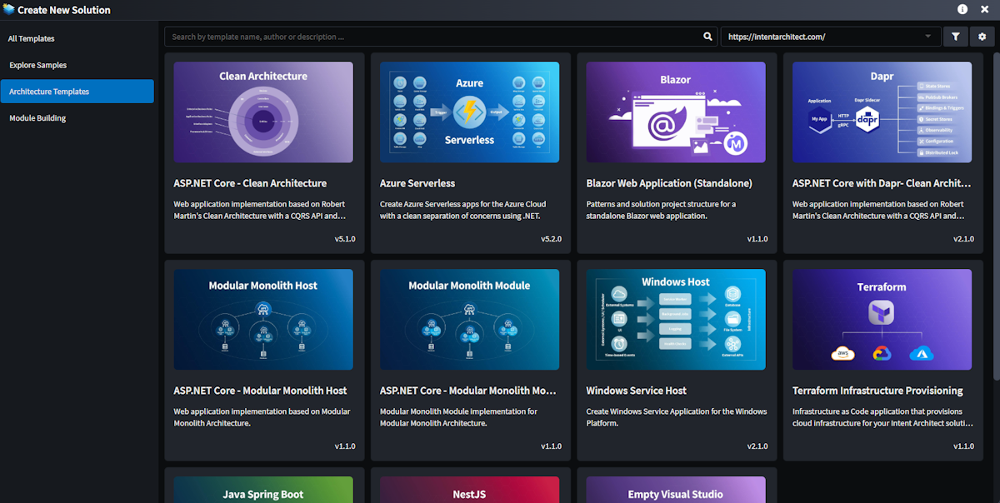
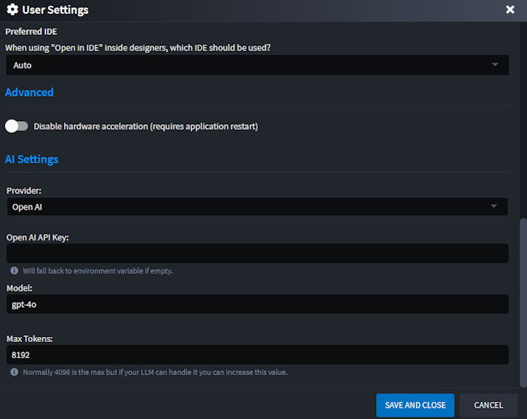

# Release notes: Intent Architect version 4.5

## Version 4.5.0

Intent Architect v4.5.0 is the latest release focused on making integrated AI capabilities accessible to developers and on improving usability and discoverability of the platform's capabilities.

The 4.5 beta is available as a side-by-side install, so you can keep your current version of Intent Architect running alongside the beta. The beta can be acquired from our [downloads page](https://intentarchitect.com/#/downloads) in the `Pre-Release(s)` section.

### Highlights in 4.5.0

#### Revamped Get Started

The **Get Started** process has been completely re-imagined to simplify the creation of new solutions. Users can now choose from one of the existing **Architecture Templates** or jump straight into one of the [Sample Applications](#samples-and-sample-creation). The new experience includes clearer descriptions, rich visuals, and helpful materials such as screenshots and videos — all aimed at guiding you to select the right architecture for your needs quickly and confidently.

The new **Architecture Template** selection screen - easily browse and compare available architecture options with a more visual, intuitive layout:

The new **Template Details** screen - get in-depth information, visuals, and supporting content to help you choose the best starting point:

#### Hosted Module Tasks (AI Tasks)

The new **Hosted Module Task** system introduces a powerful way to execute custom tasks asynchronously in the background, as well as **suggest changes to selected files** based on the outcome or processing of the task.  This functionality is leveraged by Intent Architect’s AI modules to interact with the selected LLM and present intelligent code modification suggestions seamlessly within Intent Architect.

While originally designed with AI integration in mind, Hosted Module Tasks are fully extensible and can be utilized by Module Builders for a wide range of scenarios, including (but not limited to):

- **Querying a database**, such as connecting to an existing SQL Server instance to extract and import schema metadata into Intent Architect
- **Calling external HTTP endpoints**, for example, retrieving OpenAPI specifications from a remote service to generate corresponding client code
- **Executing external applications or scripts**, such as running a custom PowerShell script to gather environment-specific configuration data
- **Suggesting file updates based on analysis or external input**

This system provides a flexible and extensible foundation for building richer, more dynamic, and intelligent module behavior.

#### Samples and Sample Creation

The new **Sample System** makes it easy to create new Intent Architect solutions from fully functional, ready-to-run sample applications — complete with source code.

Sample Selection:

Sample Details:

In addition to consuming existing samples, you can now package any solution you've built in Intent Architect as a sample.

Creating a new sample from an existing solution:

Capture the details of the sample:

### Performance Enhancements for Module Manager

Performance when searching, inspecting and downloading modules in the Module Manager has been greatly improved. Most actions are now near instantaneous, this is particularly noticeable on the "Upgrades" tab.

Furthermore, module downloads are now served directly from our CDN's infrastructure and automatically cached in a [data center of theirs which is geographically nearest to you](https://www.cloudflare.com/network/). This improvement will have a particularly noticeable affect when installing or restoring modules on both developer machines and continuous integration servers.

> [!NOTE]
>
> These changes necessitated updates on the <https://intentarchitect.com/> and client organization deployed [Module Servers](xref:tools.module-server). Until client organization deployed Module Servers are updated to the latest available version, in Intent Architect 4.5 and newer only module restoration will work from them. Other operations such as searching for modules or application templates will show an error in Intent Architect stating that they need to be updated. Updated Module Servers will remain compatible with previous versions of Intent Architect.

### Custom User Settings

Modules can now define **User Settings** — configuration values that are specific to an individual user and excluded from source control. This allows sensitive information, such as API keys, to be safely configured within Intent Architect without the risk of being committed to a repository.

This new capability is currently utilized by the Intent AI modules to securely store user-specific AI provider details, including API keys:

### Improvements in 4.5.0

- Enhanced "Search Everywhere" search to include Stereotype Definitions and produce better search results.
- New Application and Module screens now will remember your selected repository and whether Include Prerelease and Include Incompatible have been checked.

_(documentation coming soon)_

### Issues fixed in 4.5.0

_(documentation coming soon)_