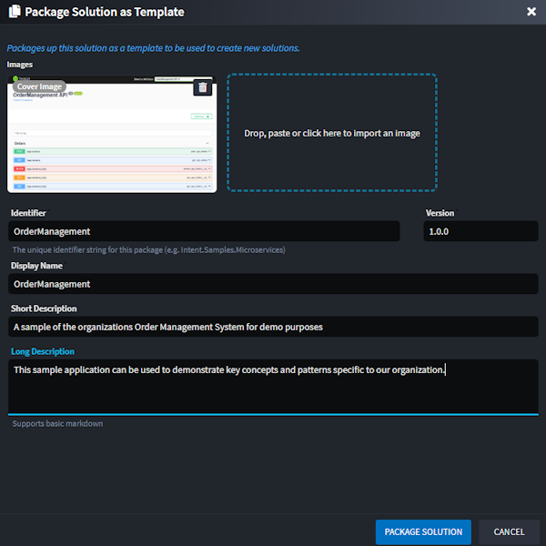

# Release notes: Intent Architect version 4.5

## Version 4.5.5

### Issues fixed in 4.5.5

- Fixed: Renaming of elements would sometimes not reflect in the tree views until the designer was reloaded.

## Version 4.5.4

### Improvements in 4.5.4

- Improvement: Extended the Dynamic Form Open File Dialog configuration to include Title, Default Path and Button Label.

### Issues fixed in 4.5.4

- Fixed: Dynamic Form Tree-view can now have multiple instances that operate independently and their selected/pre-selected values are correctly managed.
- Fixed: Dynamic Form Open File Dialog file path will resort to providing the full absolute path and no longer just the filename.
- Fixed: Overall stability improvements using the Dynamic Form system.

## Version 4.5.3

### Improvements in 4.5.3

- Improvement: Support for cross-designer JS scripting. You can now programmatically navigate the user to another designer and execute a script once the designer is active. For example:

    ``` JS
    const serviceDesignerId = "81104ae6-2bc5-4bae-b05a-f987b0372d81";
    navigateToDesigner(serviceDesignerId, {
        executeScript: `await CrudApi.createCQRSService(getPackages()[0], lookup('${element.id}'));`, // Execute this in the services designer
        scriptDependencies: ["61a8411f-b5bc-4a00-9a37-a967e0893d9d"] // Script dependency on CRUD Script
    });
    ```

    As an example, this has allowed the team upgrade the `Intent.Modelers.Services.DomainInteractions` module to offer suggestions to the user in the Domain that will be executed in the Services designer:
    
    _Note: to access this feature you will need to update `Intent.Modelers.Services.DomainInteractions` to `2.3.0-pre.0` or later._

- Improvement: Added additional JS API functions to the `IDiagramApi` (e.g. `selectVisuals(...)` and `getViewPort()`). These new functions have, for example, made it possible to call the "Create CRUD..." accelerators directly from a diagram in the Services Designer (a simpler paradigm and easier to discover than right-clicking the package).

### Issues fixed in 4.5.3

- Fixed: Auto-focus of drop-downs not working in dynamic forms
- Fixed: Associations added to diagrams are not aligned with the center of the target element.
- Fixed: Error trying to reopen an application that had an incompatibilities warning that was cancelled by the user.
- Fixed: Ctrl + dragging package reference elements into the diagram can fail to lay out the elements and place them on top of each other.
- Fixed: Dynamic Form `tree-view` control not respected the `isSelected` default from the form configuration.
- Fixed: Missed places where "deviation" name was not changed to "customization".
- Fixed: Auto-mapping in Advanced Mapper not working in the new Invocation Mappings for Perform Invocation interactions.
- Fixed: Unexpected Error dialog popping up with "Software Factory Task could not be shut down after 5 retries" when I/O taking very long.
- Fixed: designer reloads not happening when they should in certain circumstances on updating modules
- Fixed: Select in diagram centered visual incorrectly;

## Version 4.5.2

### Issues fixed in 4.5.2

- Fixed: Fixed issue where module migrations were not running.

## Version 4.5.1

### Issues fixed in 4.5.1

- Fixed: Fixed errors running Software Factories related to uninitialized **User Settings**.

## Version 4.5.0

Intent Architect v4.5.0 is the latest release focused on making integrated AI capabilities accessible to developers and on improving usability and discoverability of the platform's capabilities.

The 4.5 beta is available as a side-by-side install, so you can keep your current version of Intent Architect running alongside the beta. The beta can be acquired from our [downloads page](https://intentarchitect.com/#/downloads) in the `Pre-Release(s)` section.

### Highlights in 4.5.0

#### Revamped Get Started

The **Get Started** process has been completely re-imagined to simplify the creation of new solutions. Users can now choose from one of the existing **Architecture Templates** or jump straight into one of the [Sample Applications](#samples-and-sample-creation). The new experience includes clearer descriptions, rich visuals, and helpful materials such as screenshots and videos — all aimed at guiding you to select the right architecture for your needs quickly and confidently.

The new **Architecture Template** selection screen - easily browse and compare available architecture options with a more visual, intuitive layout:


The new **Template Details** screen - get in-depth information, visuals, and supporting content to help you choose the best starting point:


#### Hosted Module Tasks (AI Tasks)

The new **Hosted Module Task** system introduces a powerful way to execute custom tasks asynchronously in the background, as well as **suggest changes to selected files** based on the outcome or processing of the task.  This functionality is leveraged by Intent Architect’s AI modules to interact with the selected LLM and present intelligent code modification suggestions seamlessly within Intent Architect.

While originally designed with AI integration in mind, Hosted Module Tasks are fully extensible and can be utilized by Module Builders for a wide range of scenarios, including (but not limited to):

- **Querying a database**, such as connecting to an existing SQL Server instance to extract and import schema metadata into Intent Architect
- **Calling external HTTP endpoints**, for example, retrieving OpenAPI specifications from a remote service to generate corresponding client code
- **Executing external applications or scripts**, such as running a custom PowerShell script to gather environment-specific configuration data
- **Suggesting file updates based on analysis or external input**

This system provides a flexible and extensible foundation for building richer, more dynamic, and intelligent module behavior.

AI-powered functionality is currently available in the [Intent.AI.AutoImplementation](https://docs.intentarchitect.com/articles/modules-dotnet/intent-ai-autoimplementation/intent-ai-autoimplementation.html) and [Intent.AI.UnitTests](https://docs.intentarchitect.com/articles/modules-dotnet/intent-ai-unittests/intent-ai-unittests.html) modules:


#### Samples and Sample Creation

The new **Sample System** makes it easy to create new Intent Architect solutions from fully functional, ready-to-run sample applications — complete with source code.

Sample Selection:


Sample Details:


In addition to consuming existing samples, you can now package any solution you've built in Intent Architect as a sample.

Creating a new sample from an existing solution:


Capture the details of the sample:



### Performance Enhancements for Module Manager

Performance when searching, inspecting and downloading modules in the Module Manager has been greatly improved. Most actions are now near instantaneous, this is particularly noticeable on the "Upgrades" tab.

Furthermore, module downloads are now served directly from our CDN's infrastructure and automatically cached in a [data center of theirs which is geographically nearest to you](https://www.cloudflare.com/network/). This improvement will have a particularly noticeable affect when installing or restoring modules on both developer machines and continuous integration servers.

> [!NOTE]
>
> These changes necessitated updates on the <https://intentarchitect.com/> and client organization deployed [Module Servers](xref:tools.module-server). Until client organization deployed Module Servers are updated to the latest available version, in Intent Architect 4.5 and newer only module restoration will work from them. Other operations such as searching for modules or application templates will show an error in Intent Architect stating that they need to be updated. Updated Module Servers will remain compatible with previous versions of Intent Architect.

### Custom User Settings

Modules can now define **User Settings** — configuration values that are specific to an individual user and excluded from source control. This allows sensitive information, such as API keys, to be safely configured within Intent Architect without the risk of being committed to a repository.

This new capability is currently utilized by the Intent AI modules to securely store user-specific AI provider details, including API keys:


### Improved Application Settings Screen

The **Application Settings** screen has been significantly improved for better usability and consistency:

- Full-text search with result highlighting makes it easier to quickly locate specific settings:


- The **Application Settings** screen now supports the global `Save All` button, saving all settings in one action - no more saving each section individually. Included is automatic change detection and save prompt when running the Software Factory, aligning its behavior with other Designers.


### In-app Explanations and Documentation

Implemented in-app explanations and further support for "inline" documentation throughout the platform. This, for example, includes explanations of Stereotypes, dialogs, and element properties that appear as a popover when the user hovers over the subject. The feature aims to make it easier for new users of Intent Architect to easily understand the function of the feature or applied metadata.

For example, selecting Stereotypes now displays a description:


Explanation of applied stereotypes can also be found by hovering over the stereotype. Properties with a dotted underline also indicate that there is an explanation for that property:


These explanations and documentation is applied from the modules simply by capturing the explanation in the Comments field for the Element Settings, Stereotype, or Stereotype Property. Note that you must be running the latest Module Builder for this information to be added to your module.

### Improvements in 4.5.0

- Enhanced "Search Everywhere" search to include Stereotype Definitions and produce better search results.
- New Application and Module screens now will remember your selected repository and whether Include Prerelease and Include Incompatible have been checked.
- Stereotypes can now indicate that they are a trait, which will then be extended to the element on which the stereotype is applied.
- Dynamic Form support for `open-file` and `button` control types with support for markdown in hints and error messages.
- Dynamic Form tree-views now support specifying the tree data explicitly.
- Implemented an "always" hot modal stack for dialogs so that they open instantly.
- Software Factory now stop on first error.
- Highlight `ElementException` exceptions during Software Factory Executions better to indicate that can be clicked.
- Improved dialog styling.
- Documentation ("Help") Dialog now allows you to choose whether to filter on all topics or just those in the current context.
- Aligned Application Settings to standard "Tab Saving" paradigm. Saving Application Settings will restart the application's SF if running.
- Added Open in IDE option to changes from Software Factory Execution and Hosted Module Tasks.
- Support for `Ctrl + click` to navigate from diagram to types in the tree-view Model.
- Copy + paste on root elements like Classes, Commands, Queries will copy them now.
- Added `navigateToDesigner` method to MacroApiFactory.ts which also allows a script to get executed once navigation completes.
- Added `isReference()` to Element JS API.
- Can now search applications by ID in the solution explorer. Supports space delimited list of application IDs to find multiple applications.
- Renamed Deviations to Customizations.
- Added "Order Priority" support to Module Settings' Fields to allow for control of ordering of fields. Fields are sorted first by OrderPriority, then by Title.
- Added `FriendlyException` to Intent.SoftwareFactory.SDK and upgraded client to render the error message with markdown. For example, this can be useful for Module Building where you want to throw errors to the user that has links to documentation.
- Element properties and applied stereotypes can be collapsed and expanded by clicking on the heading.

### Issues fixed in 4.5.0

- Fixed: Unnecessary designer reloads on module reinstall.
- Fixed: Modules listed in the Manage Modules and Topics in the Documentation dialog not displaying selected font-awesome icons.
- Fixed: Copy Application function not creating new Ids for packages, causing unexpected errors and challenges in various places in the system.
- Fixed: Copy pasting a folder on itself creates an infinite hierarchy.
- Fixed: Copy paste of elements with generics causes duplicate Id errors
- Fixed: Modules' Installed tab not finding the module for pre-release installed modules.
- Fixed: Copy paste not renaming advanced mapping expressions correctly.
- Fixed: Ctrl + dragging to copy elements in the designers not working in certain scenarios.
- Fixed: Order persisted on associations is incorrect when generic arguments are specified on the Element.
- Fixed: Generic Arguments not showing correct options in the Type Reference properties.
- Fixed: associations not unregistering themselves from referenced elements on deletion, making them linger when accessing the `getAssociations()` method on the Designer JS API.
- Fixed: Persisted ordering of application settings not alphabetical leading to inconsistent changes.
- Fixed: Associations that exist only in package references not showing in diagrams.
- Fixed: Stereotype icons not showing in diagrams on package referenced elements.
- Fixed: Solution Explorer search filter not expanding folders and not showing underlying designers for found applications.
