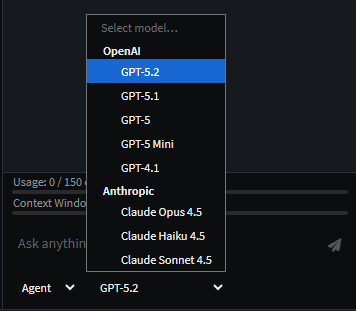
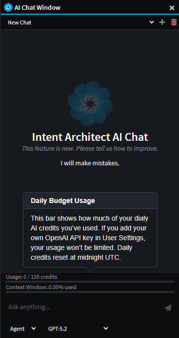

# Release notes: Intent Architect version 4.6

## Version 4.6.0

We're super excited to announce the release of Intent Architect v4.6.0, which focuses on integrating AI directly into the platform and a step closer to offering an "AI-native" experience to users. To enable this, we've introduced an Integrated AI Chat as the flagship feature for 4.6.0, allowing seemless access to documentation and  agentic control of the platform's designers.

The 4.6 beta is available as a side-by-side install, so you can keep your current version of Intent Architect running alongside the beta. The beta can be acquired from our [downloads page](https://intentarchitect.com/#/downloads) in the `Pre-Release(s)` section.

### Highlights in 4.6.0

#### Integrated AI Chat

The new Integrated AI Chat feature provides an in-product assistant to help developers understand and evolve their solution design. It has access to the entire Intent Architect documentation site, and several powerful tools to access and modify the existing design of the systems. 

Developers can use it to answer questions about the current workspace, explain how existing elements fit together, and propose design changes to meet new requirements. The assistant can also inspect models and diagrams to summarize structure, highlight dependencies, and identify gaps or inconsistencies.

_Example chat to create a simple e-commerce domain. The agent was able to design the domain from a simple natural language prompt._

The Integrated IA Chat has 3 different modes:
- **Ask** - For analyzing and answering questions with read-only access to the designers.
- **Agent** - For instructing the LLM to read and make simple modifications to the designers.
- **Plan** - For larger tasks, Plan mode offers the user a way to design a step-by-step implementaiton plan with the LLM and then to convert this into a structured execution plan.

##### Multiple Provider Integration
The Intengrated AI Chat can also be connected to the most popular AI providers (e.g. Open AI, Azure Open AI, Anthropic, Gemini, etc.). This can be done simply by specifying an API Key for the relevant provider in the [User Settings](https://docs.intentarchitect.com/articles/modules-common/intent-common-ai/intent-common-ai.html#user-settings).

_Example showing both Open AI and Anthropic models availalbe when both are configured._

##### Daily Budget
In an effort to make this new feature accessible to our entire community, and to show our appreciation to you all, we've made the feature accessible to all existing users and created a Daily Budget of 150 FREE credits for use with Open AI models. Note that this is for a limited period of time and may change later.

No API Key is required to access these free credits, however adding your own Open AI API Key in the User Settings will remove the limit completely and no longer access Open AI through the Intent Architect organization's account. We also understand that some organizations would want this option disabled, which can be done by emailing this request to support@intentarchitect.com.

### Synchronize code changes back into designers

A common request we've received is being able to take changes made to files in your IDE and have them imported back into Intent Architect, particularly for simple changes like the adding or changing of a property type.

The Software Factory will now offer this for templates which have had support added to them for this.

For example, perhaps a `Notes` property has been added to an entity in your IDE and when running the Software Factory it wants to remove it:

Intent Architect will now showing a "synchronize changes" icon next to such files:

On clicking the icon the Software Factory minimizes, the relevant designer will be opened and focussed, and the changes applied. In the following screenshot notice the dirty the indicator on the `Notes` attribute.

You can then save and the Software Factory will no longer want to remove those changes from the file.

Initially this functionality has been added to the Domain Entity classes and contract DTOs, but we will be progressively rolling it out to other templates over time.

#### Application Overview Tab

The Application Overview tab aims to make the mechanisms of Intent Architect clear, particularly for new users, by highlighting the flow of Designer metadata, Architecture and Settings into the Software Factory executions to drive code changes in the Codebase. Each of the components can be clicked to navigate to its aspect of the system.

### Improvements in 4.6.0

- Improvement: Icons added to tabs.

  

- Improvement: Focus is highlighted more clearly in the Solution Explorer.
- Improvement: Software Factories now auto-start when opening up new solutions. This enhancement aims to make it more obvious when there are outstanding changes and to "warm up" the Software Factory ahead of the user's changes. Which applications have active Software Factories is now saved to the user's solution preferences so that they are started automatically when the solution is opened again in the future.
- Improvement: The Software Factory close button now minimizes the dialog instead of shutting down the process. This aims to ensure that software factories remain "hot" and active by avoiding reflexive shutting down of the process. To shut down the Software Factory, the user can right-click the task in the taskbar and select the `Shutdown` option, or simply use the middle mouse click on the process.
- Improvement: Restyled the login page to align with the new website design.
- Improvement: Association End Properties now hide disabled `Is Navigable`, `Is Nullable` and `Is Collection` options if their value is also `false`.
- Improvement: The Dynamic Form Tree-view control now features a display-function per node to provide a rich text display over the ordinary plain text.

### Issues fixed in 4.6.0

- Fixed: Domain suggestions to create CRUD CQRS Services fail to find the new Entity if the designer has not already been saved.
- Fixed: Stereotype Properties not listed in `Search Everywhere` when searching by their ID.
- Fixed: Reopening of previous tabs sometimes changed their order.
