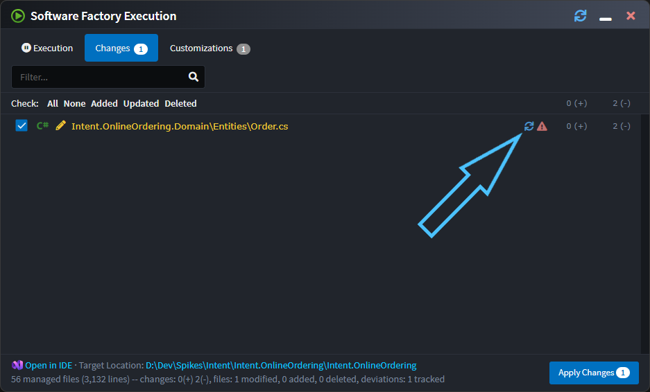

# Release notes: Intent Architect version 4.6

## Version 4.6.0

### Highlights in 4.6.0

### Synchronize code changes back into designers

A common request we've received is being able to take changes made to files in your IDE and have them imported back into Intent Architect, particularly for simple changes like the adding or changing of a property type.

The Software Factory will now offer this for templates which have had support added to them for this.

For example, perhaps a `Notes` property has been added to an entity in your IDE and when running the Software Factory it wants to remove it:

Intent Architect will now showing a "synchronize changes" icon next to such files:

On clicking the icon the Software Factory minimizes, the relevant designer will be opened and focussed, and the changes applied. In the following screenshot notice the dirty the indicator on the `Notes` attribute.

You can then save and the Software Factory will no longer want to remove those changes from the file.

Initially this functionality has been added to the Domain Entity classes and contract DTOs, but we will be progressively rolling it out to other templates over time.

### Improvements in 4.6.0

- Improvement: Icons added to tabs.

  

- Improvement: Focus is highlighted more clearly in the Solution Explorer.
- Improvement: Software Factories now auto-start when opening up new solutions. This enhancement aims to make it more obvious when there are outstanding changes and to "warm up" the Software Factory ahead of the user's changes. Which applications have active Software Factories is now saved to the user's solution preferences so that they are started automatically when the solution is opened again in the future.
- Improvement: The Software Factory close button now minimizes the dialog instead of shutting down the process. This aims to ensure that software factories remain "hot" and active by avoiding reflexive shutting down of the process. To shut down the Software Factory, the user can right-click the task in the taskbar and select the `Shutdown` option, or simply use the middle mouse click on the process.
- Improvement: Restyled the login page to align with the new website design.
- Improvement: Association End Properties now hide disabled `Is Navigable`, `Is Nullable` and `Is Collection` options if their value is also `false`.

### Issues fixed in 4.6.0

- Fixed: Domain suggestions to create CRUD CQRS Services fail to find the new Entity if the designer has not already been saved.
- Fixed: Stereotype Properties not listed in `Search Everywhere` when searching by their ID.
- Fixed: Reopening of previous tabs sometimes changed their order.
