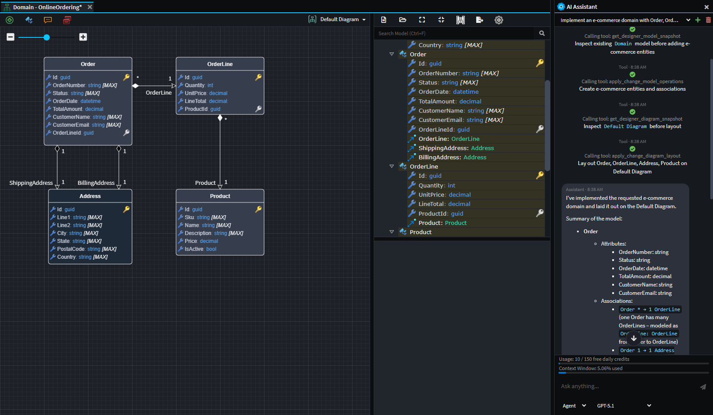
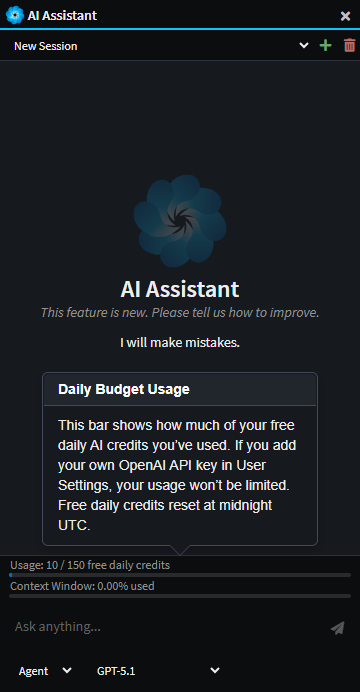
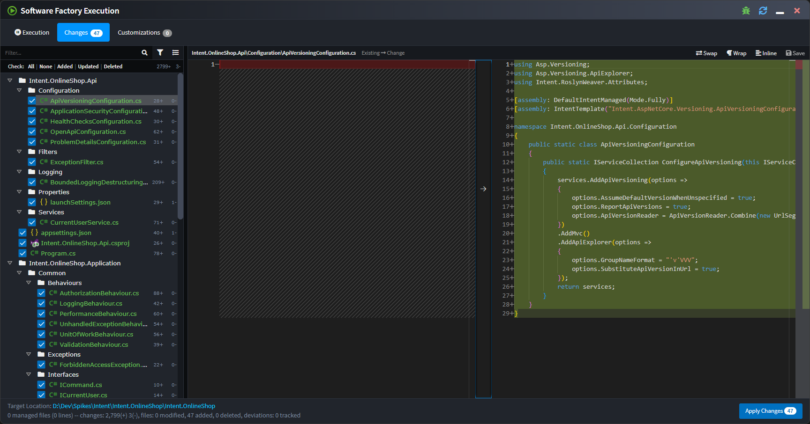
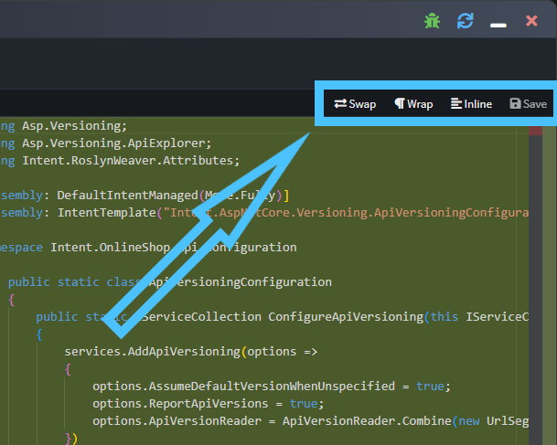
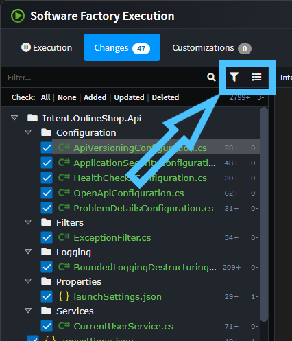
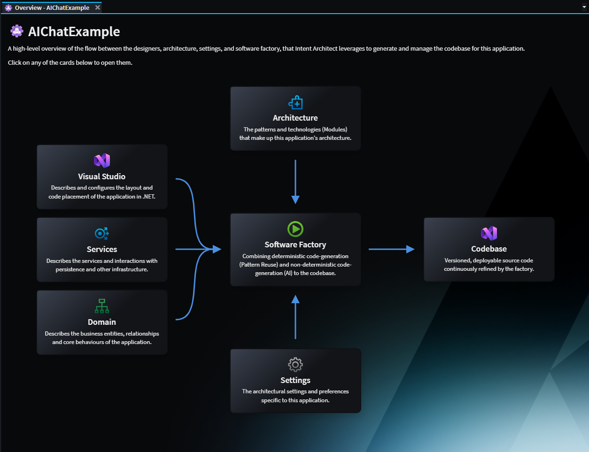

# Release notes: Intent Architect version 4.6

## Version 4.6.0

We're super excited to announce the release of Intent Architect v4.6.0, which focuses on integrating AI directly into the platform and a step closer to offering an "AI-native" experience to users. To enable this, we've introduced an Integrated AI Assistant as the flagship feature for 4.6.0, allowing seamless access to documentation and agentic control of the platform's designers.

### Highlights in 4.6.0

#### Integrated AI Assistant

The new Integrated AI Assistant feature provides an in-product assistant to help developers understand and evolve their solution design. It has access to the entire Intent Architect documentation site, and several powerful tools to access and modify the existing design of the systems.

Developers can use it to answer questions about the current workspace, explain how existing elements fit together, and propose design changes to meet new requirements. The assistant can also inspect models and diagrams to summarize structure, highlight dependencies, and identify gaps or inconsistencies.

_Example use of the AI assistant to create a simple e-commerce domain. The agent was able to design the domain from a simple natural language prompt._

The Integrated IA Assistant has 3 different modes:

- **Ask** - For analyzing and answering questions with read-only access to the designers.
- **Agent** - For instructing the LLM to read and make simple modifications to the designers.
- **Plan** - For larger tasks, Plan mode offers the user a way to design a step-by-step implementation plan with the LLM and then to convert this into a structured execution plan.

##### Multiple Provider Integration

The Integrated AI Assistant can also be connected to the most popular AI providers (e.g. Open AI, Azure Open AI, Anthropic, Gemini, etc.). This can be done simply by specifying an API Key for the relevant provider in the [User Settings](https://docs.intentarchitect.com/articles/modules-common/intent-common-ai/intent-common-ai.html#user-settings).

_Example showing both Open AI and Anthropic models available when both are configured._

##### Daily Budget

In an effort to make this new feature accessible to our entire community, and to show our appreciation to you all, we've made the feature accessible to all existing users and created a Daily Budget of 150 FREE credits for use with Open AI models. Note that this is for a limited period of time and may change later.

No API Key is required to access these free credits, however adding your own Open AI API Key in the User Settings will remove the limit completely and no longer access Open AI through the Intent Architect organization's account. We also understand that some organizations would want this option disabled, which can be done by emailing this request to <support@intentarchitect.com>.

### Integrated diff tool in the Software Factory

To make it even simpler to review pending Software Factory changes Intent Architect has now integrated file diffing capabilities directly into the Software Factory changes dialogue:

Typical diff viewing options as well as the ability to save changes are available above the right side of the diff:

As part of the above changes, the list of files has been changed to be a tree view so as to require less screen real estate as well as making it more clear where files are being output to.

The toolbar buttons above the file list can be used to choose filtering options or toggle between "flat" and "tree" views of the change list:

### Synchronize code to design

A common request we've received is being able to take changes made to files in your IDE and have them imported back into Intent Architect, particularly for simple changes like the adding or changing of a property type.

The Software Factory will now offer this for templates which have had support added to them.

For example a `Notes` property has been added to an entity in your IDE and when running the Software Factory it wants to remove it, but it is also showing the "Synchronize code to design" button next to the change:

On clicking the icon the Software Factory minimizes, the relevant designer will be opened and focussed, and the changes applied. In the following screenshot notice the dirty indicator on the `Notes` attribute:

You can then save and the Software Factory will no longer want to remove those changes from the file.

Initially this functionality has been added to the Domain Entity classes and contract DTOs, but we will be progressively rolling it out to other templates over time.

To try out this functionality, install at least these versions of the following modules:

- Intent.Application.Dtos 4.5.0-pre.2
- Intent.Entities 5.2.0-pre.3

#### Application Overview Tab

The Application Overview tab aims to make the mechanisms of Intent Architect clear, particularly for new users, by highlighting the flow of Designer metadata, Architecture and Settings into the Software Factory executions to drive code changes in the Codebase. Each of the components can be clicked to navigate to its aspect of the system.

### Potentially breaking changes in 4.6.0

> [!IMPORTANT]
>
> ### .NET 10 SDK now required for running the Software Factory CLI on CI/CD servers
>
> At least version 10 of of the .NET SDK is now required to be installed on CI/CD servers making use of the [Software Factory CLI](xref:tools.software-factory-cli).
>
> For reasons of [performance improvements](https://devblogs.microsoft.com/dotnet/performance-improvements-in-net-10/) and to allow module authors to leverage the latest .NET features, Intent Architect has been internally upgraded to run on .NET 10.
>
> Our [Software Factory CLI article](xref:tools.software-factory-cli#the-settings-file-in-the-tools-nuget-package-is-invalid-settings-file-dotnettoolsettingxml-was-not-found-in-the-package) has an example of installing additional .NET SDKs on Azure Pipelines while other CI/CD environments should be very similar, but please don't hesitate to reach out to our support should you like any assistance.
>
> NOTE: This requirement is not applicable to the Intent Architect the desktop application as it ships with its own runtime.

### Improvements in 4.6.0

- Improvement: Icons added to tabs.

  

- Improvement: Focus is highlighted more clearly in the Solution Explorer.
- Improvement: Software Factories now auto-start when opening up new solutions. This enhancement aims to make it more obvious when there are outstanding changes and to "warm up" the Software Factory ahead of the user's changes. Which applications have active Software Factories is now saved to the user's solution preferences so that they are started automatically when the solution is opened again in the future.
- Improvement: The Software Factory close button now minimizes the dialog instead of shutting down the process. This aims to ensure that software factories remain "hot" and active by avoiding reflexive shutting down of the process. To shut down the Software Factory, the user can right-click the task in the taskbar and select the `Shutdown` option, or simply use the middle mouse click on the process.
- Improvement: Restyled the login page to align with the new website design.
- Improvement: Association End Properties now hide disabled `Is Navigable`, `Is Nullable` and `Is Collection` options if their value is also `false`.
- Improvement: The Dynamic Form Tree-view control now features a display-function per node to provide a rich text display over the ordinary plain text.
- Improvement: Upgraded Intent Architect to internally use .NET 10 which has [performance improvements](https://devblogs.microsoft.com/dotnet/performance-improvements-in-net-10/) as well as allowing module authors to use any .NET features only available from .NET 10.
- Improvement: Added `?` icon documentation link to components in the Create New Application(s) wizard.
- Improvement: Added `Show installed only` to the Modules Manager's Template, which defaults to true. This aims to reduce the noise of the other architectural components and to bring the application's current architectural stack into focus.
- Improvement: Improved performance for indicating when module updates are available.
- Improvement: Added confirmation to Unloading Packages if they are dirty since unsaved changes could be lost.

### Issues fixed in 4.6.0

- Fixed: Domain suggestions to create CRUD CQRS Services fail to find the new Entity if the designer has not already been saved.
- Fixed: Stereotype Properties not listed in `Search Everywhere` when searching by their ID.
- Fixed: Reopening of previous tabs sometimes changed their order.
- Fixed: When renaming an Application not within an `intent` folder, an `Index was outside the bounds of the array.` error would occur.
- Fixed: Module migrations and other module tasks would not work for modules with the "Enable Factory Extensions" module setting unchecked.
- Fixed: Clearing out a tree view filter manually doesn't automatically scroll to the selected element. Now will scroll that selected element into the center of the panel.
- Fixed: Markdown displayed in popovers in the designers would not correctly render certain markdown.
- Fixed: Diagram popover width could become too large and overflow out of the visual diagram.
- Fixed: Checkboxes in the Software Factory would use operating system colors which could make them visually clash with the rest of Intent Architect's colors.
