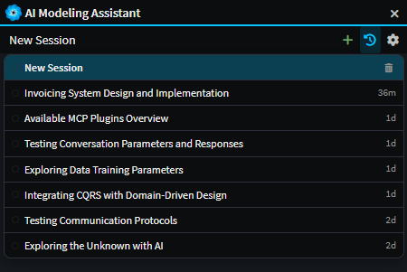
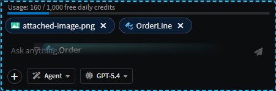

# Release notes: Intent Architect version 5.0

We're super excited to announce perhaps the most significant release of Intent Architect in the last few years - version 5.0! This release brings the full power of AI into the heart of Intent Architect, delivering an end-to-end software development experience that allows developers to visually model sophisticated software systems into reality. Beyond the major features and enhancements, the product team has focused extensively on polish and providing a world class experience to developers in as many areas as we had capacity for.

We hope that you, our users, enjoy this new release and get a step up in value that remains true to the core principles that you've come to expect from us - high-quality code, consistency, clear design, complete control, etc. We thank each and every one of you for your continued support and guidance in helping us build the next generation of software engineering platforms.

Lastly, as with our last release, this is just a stepping stone along the journey. Our roadmap and the features we plan to release over the next few months are incredibly exciting and promise huge potential. Please share your thoughts, ideas, and feedback to help us make this the development platform you've always wished for 🚀!

---

## Extenstive upgrade to AI chat systems

In version 4.6 of Intent Architect, we released our AI Assistant - a chat system with tooling to control Intent Architect's designers. As part of this release we've upgraded this system massively and made the system substantially more transparent, intuitive and powerful. Tools calls are now more obvious, interactive and clear. We've used colours to help the user identify reads from creates, updates and deletes made in their models. As per our last release, model changes are made in memory and not saved without the user's consent.

_Example screenshot of the AI Modeling Assistant implementing a change to the domain._

Beyond the visual enhancements and "face lift", the new AI chat systems come with several key features and enhancements:

- **Conversation history & persistence** — past conversations persist, can be deleted. The status of each task (e.g. in-progress, awaiting approval, completed, etc.) is visible in the history dropdown.

    

- **Model / File attachments** — drag-and-drop files and model elements, paste files (including images), open and select files from hard drive, directly into the chat. Attachments are passed to the

    

- **Tool-call visualisation** — interactive chips for tool calls, composite tool-call collapsing, "modifications" lists, etc. This feature aims to make it clear and obvious to the user what the agent has done at each step. The chips are interactive in that the user can click them and navigate to them wherever they are in the system. Colours are used to indicate whether a change was a read (blue), create (green), update (yellow), or delete (red).

    

- **AI Configuration dialog** - To make it as easy as possible to get value out Intent Architect's AI capabilities we created an AI configuration dialog that can be launched by clicking on the `cog` icon button in the AI Assistant toolbar. This dialog lists the compatible providers and makes it easy to provide API keys to integrate with your account. It also provides details on our [Intent MCP](https://fix-this.com) and how to configure [MCP Servers](https://fix-this.com) that agents in Intent Architect can use.

    

- **Approvals system** — tools can require user approval before running.
- **Conversation steering** — ability to redirect the agent mid-flow.
- **Slash Commands**

## AI Coding Agents in the Software Factory

Coding Agents in the Software Factory provides a key mechanism to realize the subtle, and often sophisticated, business logic that's required for applications to function. While deterministic code-generation systems can roll out the architecture, infrstructure and boilerplate for our application's design, these coding agents will "colour in" between the lines. 

A "golden path" of development that we strive to consistenly achieve is one where the developer can describe the design of their system, run the Software Factory Execution, run all coding agents, and out the other side comes working software - perfectly architected, consistent, readable and maintainable. The following features help support this:

- **Auto-created AI Tasks** — an AI Tasks panel (bottom right) helps the user visualize ongoing agent activity and indicate the status of each agent's process. AI tasks can be _auto-created_ by modules (i.e. where code implementation work is detected for the file, for example as detecting a `throw new NotImplementedException(...)`), created manually by the user, or even by coding agents themselves.

- **Optimized Context Engineering** — behind the coding agents is a sophisticated and powerful context engineering system that informs coding agents on how to deal with specific files. This ensures that they conform to the architecture, standards and structure of the application.

- **Comprehensive AI Tooling** — supporting the coding agenst is a suite of tools that allow it to to discover the codebase, analyze it, and implement features within it (e.g. grep, glob, read file, patch file, etc.). The result is a harness on par with most of the capabilities offered by other AI harnesses in the market.

---

## AI Agent Framework — Markdown-defined, config-driven

A new agent system replacing hardcoded behaviour:

- **Markdown agent definitions** (`.agents` folder) with a tool registry — agents can be authored declaratively.
- **Slash-command picker** in chat (with `aiSlashPicker` directive, keyboard nav, "hide on blur").
- **Skills support** — `SKILL.md` files from Copilot and Claude Code formats are discovered and invocable.
- **Instructions support** — `.instruction.md` files loaded from `.github/instructions` or `.claude/rules`.
- **AI rules from designer settings** — designers can contribute rules into the agent context.
- **Plan Mode rebuilt from scratch** — new question/answer wizard ("plan-file shell tab"), a proper backend, and cleaned-up planning system. Old planning system ripped out.
- **Agent context model** unified: `agentId`/`agentType` → `agentContext`.

> **Screenshot placeholder:** _Slash-command picker showing available agents and skills._
> ``

> **Screenshot placeholder:** _New Plan Mode question wizard._
> ``

---

## MCP Server (Intent Architect as MCP host)

Intent Architect now exposes itself as an MCP server with a substantial tool suite:

- **MCP server moved out of the Electron process** (VS Code compatibility) into its own process; release builds compile and ship the MCP server.
- **Tools added/improved**: `apply_staged_file_changes`, `check_if_file_intent_managed`, `create_ai_task`, `delete_code_file`, `dotnet_build`, `dotnet_test`, `find_designer_elements`, `get_designer_*` family (model snapshot, element details, package references, diagram snapshot), `glob`, `grep`, `patch_file`, `read_file`, `write_file`, `run_software_factory`, `run_task`, `search_docs`, `search_files`, `use_skill`, `apply_change_diagram_layout`, `apply_change_model_operations`.
- **AI Configuration dialog** — new home for MCP config (replacing the old MCP dialog), with validation and Electric Blue theming.
- **Reliability** — DI tests for MCP tool resolution, robust solution-open flow, EPIPE fixes, weak-reference fixes, race-condition fixes, handling of missing invocation handlers, and signal-on-cancel so tools don't hang.
- **Cross-process eventing** — `McpEventAggregator` can invoke handlers registered by SF instances; SignalR re-registration on reconnect.
- **AnthropicCacheControlHandler** for cache-control markers on outbound messages.

> **Screenshot placeholder:** _AI Configuration dialog with MCP server list._
> ``

> **Screenshot placeholder:** _External MCP client (e.g. Claude Code) using Intent Architect tools._
> ``

---

## Software Factory Revamp

- **Layout restructured** — top-level pills moved to a left-hand sidebar; SF/task/process tabs.
- **Codebase Explorer** — a unified tree view spanning changes and the full codebase, with filtered views.
- **Per-change & per-folder Apply / Undo** — context-menu options on individual changes; folders can apply or undo all contained changes; folders highlight when they contain changes (and mute when empty).
- **Override / Reset system** — users can override an SF change with manual edits, with `IsOverridden` propagated to UI.
- **Undo committed changes** — revert codebase files to their original.
- **Review AI changes** button, **Apply Selected** button on multi-diff, and a **floating apply button**.
- **Multi-diff view** when more than one change is selected.
- **Open in IDE** for diffs.
- **Codebase files (not changes) show in "file" mode Monaco editor**, with line-through styling on deleted changes that have been applied.
- **Build & Test buttons** in SF wired to terminal tasks with running-task counts.
- **Tracked changes persist** — changes never disappear between runs.
- **Binary file handling** — diffs hide binary content with a placeholder, but binaries are now applyable.

> **Screenshot placeholder:** _New SF sidebar layout with Codebase Explorer._
> ``

> **Screenshot placeholder:** _Folder-level apply/undo in change tree._
> ``

> **Screenshot placeholder:** _Multi-diff view with Apply Selected._
> ``

> **Screenshot placeholder:** _Override indicator on a change._
> ``

---

## Pop-out Tabs

Viewport tabs can now be popped out into independent windows:

- **"Copy into New Window"** for any viewport tab.
- Custom toolbar for popped windows; closing/focus behaviour fixed (clicking a popped window no longer steals focus to main).
- SF dialog **maintains maximized state** when restoring main window, and **doesn't minimize** when on another monitor.

> **Screenshot placeholder:** _A popped-out diagram window beside the main app window._
> ``

---

## File Editor (Monaco)

- **Monaco-based File Editor as a tab type** — view and edit single files inside Intent Architect.
- **Enhanced syntax highlighting** via `vscode-textmate` + `vscode-oniguruma`.
- **File watching with debounced reload** of editor contents.
- **View Code** context-menu option that ensures SF is running first; **View in File Explorer** on files and folders.

> **Screenshot placeholder:** _Monaco file editor open in a tab with syntax highlighting._
> ``

---

## Terminal & Tasks

- **node-pty terminal** integration with full task management.
- **Terminal Tasks Service** — sidebar-integrated, supports stop/restart, reuses existing task slots, tracks running counts, and parses errors (including a dotnet error parser with detailed cards in the output tree view).
- **`RunTaskTool`** wired to the new terminal architecture.
- Focus management on terminal when creating/running tasks; Ctrl+C copies on selection; external links open in browser.

> **Screenshot placeholder:** _Terminal task running with the new sidebar integration._
> ``

> **Screenshot placeholder:** _Detailed error card in the output tree view._
> ``

---

## File-modification Tools (for AI)

- **`PatchFileTool`** — surgical, fuzzy-matching code patches with indentation preservation, full-file match detection, and blank-line tolerance. Extensive test coverage.
- **`WriteFileTool`** improvements and unit tests.
- **Formatter pipeline**: CSharpier integration for C#, dprint plugins for HTML/XML/YAML/CSS, Prettier for TypeScript (no longer forces double quotes). Roslyn-based diagnostic/indentation correction for C#.
- **Search Code Tool → Search File Tool** with better intention output; **Grep tool** enhancements (now finds virtual folders, improved intention output) and a new **Glob tool**.
- **`GetProjectOverviewTool`** and a **`GetPackageReferences`** tool for searching referenced packages.

---

## Tree View & UX Polish

- **Ctrl+F to filter** in SF; selected node remains visible after filter clear; highlighting in filtered tree-views.
- **Filtering performance** improved; collapse/expand state preservation fixed.
- **Compacted indentation**, consistent shortcuts (down/escape), generalised filtering across tree-views.
- **Context-menu suggestions** for elements and associations.
- **Re-parenting** of elements via `parentId` on `UpdateElementOperation`.
- **Drag/drop** generalised via `IDragItem` and `getSelectedDragItems`.
- **Newly-added (unsaved) elements** indicated with a subtle faded green background; modified/dirty stay yellow.
- Stereotype-text display now updates correctly under undo/redo.

> **Screenshot placeholder:** _Tree-view filter with Ctrl+F and highlighted matches._
> ``

> **Screenshot placeholder:** _Element added/dirty colour indicators._
> ``

---

## Visual Polish

- **About Dialog revamp** with test mode and improved update actions UI.
- **Generic CTA button styles** unified across components; Font Awesome upgraded.
- **Electric Blue theme accents** in AI Configuration; light-theme styling fixes; light/dark theme parity for browser windows.
- AI chat: timeline layout, left-aligned tool calls, refined "Thinking…" indicator, model-aware attachment icons.
- **Open in IDE** actions and stats consolidated to a single line in SF.
- Diff stats coloured green/red for insertions/deletions.

> **Screenshot placeholder:** _Revamped About dialog._
> ``

---

## Linux & macOS

- Fixes to the application launcher, MCP server, and SF process for **Linux** (and likely macOS).
- New-application creation now works on Linux.

> **Screenshot placeholder:** _Intent Architect running on Linux._
> ``

---

## Reliability & Infrastructure

- **SF process refactor** — IPC eventing rebuilt, magical events removed, ProcessManager extracted, `SoftwareFactoryProcessService` introduced, `SoftwareFactoryChangesService` works under the MCP process.
- **`VirtualCodebaseService`** replaces `CachingFileSystem`; reads from SF staged results before disk; serves the on-disk file for one-off (non-updatable) generated files.
- **Conversation hydration** working properly; AI chat conversations disposed on SF shutdown.
- **Usage tracking** rewritten as a singleton — alignment issues finally fixed.
- **Fire-and-forget AI requests** so we don't exceed the 6-concurrent-HTTP-request browser limit.
- **JS API**: `createAICodingTask(...)`, modeling-agent task creation, designer-element actions.
- **EOL fix** for `.css` files compiled by less + gulp (no more spurious git diffs).
- **Module publishing**: option to update only pre-release modules with their pre-release dependencies; updated SDK-version checker.

---

## Notable Fixes

- Fixed designer scripts being unintentionally lost.
- Fixed renamed files getting "lost".
- Fixed advanced-mapping reordering of elements.
- Fixed SF showing one-off-gen changes when the file already exists.
- Fixed AI not showing call-ref pills (Anthropic).
- Fixed "space" deselecting the Other option in the user-question tool.
- Fixed "Thinking…" indicator going missing when accepting a plan.
- Fixed SF "invocation handler already registered" loop on restart.
- Renewed expiring API key.
- Removed Google Analytics integration.

