# Release notes: Intent Architect version 5.0

<!--
Pending:

- Feature: Can now use `camelCase`, `pascalCase` and `kebabCase` functions in `${...}` strings in architecture template installation files and metadata.
- Feature: Added `mcpServer.executable` and `mcpServer.executableArguments` as substitutable values in `${...}` strings in architecture template installation files and metadata.

- Fixed: (Linux) Intent Architect would regularly steal focus when being controlled by the MCP server.
-->

## Version 5.0.3

### Improvements in 5.0.3

- Improvement: The MCP server will now provide more information to clients if they provide invalid tool call arguments which will often give them the information needed to successfully retry the call with the required data.
- Improvement: Increased the verbosity of Intent Architect's MCP server logging. Logs are available at `%TEMP%\IntentArchitect\mcp-server` and automatically rotate after 30 days. These logs are never automatically sent to Intent Architect.
- Fixed: Temporarily disabled the AI Modeling Agents ability to automatically create AI Tasks. These are not behaving as well as we would like, and will return in the future.

### Fixes in 5.0.3

- Fixed: Searching within a designer would sometimes not work for especially old Intent Architect solutions.
- Fixed: Global search (ctrl + t) would not work at all and show an error when there were any missing packages in a solution or invalid designer settings existed.

## Version 5.0.2

### Fixes in 5.0.2

- Fixed: If version 5.0.1 was the first version you're running of Intent Architect v5 and v4 had been used in the past, it would always show a "data upgrade required" dialog regardless of whether all other instances of Intent Architect were closed.
- Fixed: Templates with an overwrite mode of "once off" would never generate.

## Version 5.0.1

### Fixes in 5.0.1

- Fixed: Model picker with duplicate model names (including custom models with identical IDs across providers) will now display as separate entries grouped by provider, allowing you to select the correct one.
- Fixed: A JavaScript "operation not permitted" error would occur on startup if running Intent Architect v5 for the first time while Intent Architect v4 was still running.

---

  <iframe style="width: 100%; height: 100%; border: 0" src="https://www.youtube.com/embed/vlEwOM8nRXo?si=GnW6IaJWmn2FwLFM" title="YouTube video player" frameborder="0" allow="accelerometer; autoplay; clipboard-write; encrypted-media; gyroscope; picture-in-picture; web-share" referrerpolicy="strict-origin-when-cross-origin" allowfullscreen></iframe>

We're incredibly excited to announce perhaps the most significant release of Intent Architect in recent years - version 5.0.

This release brings the full power of AI into the heart of Intent Architect, delivering an end-to-end software development experience that allows developers to visually model sophisticated software systems into reality. Beyond the major features and enhancements, the team has focused extensively on "polish" and delivering a world-class experience across as many areas as possible.

We hope you enjoy this release and find real, compounding value in it - value that remains true to the core principles you've come to expect from us: high-quality code, consistency, clear design, and complete control.

Thank you for your continued support and guidance in helping us build the next generation of software engineering platforms.

While this is a major milestone, it is also just a stepping stone toward a much greater vision. Our roadmap over the coming months is incredibly exciting and promises significant new capabilities. Please share your thoughts, ideas, and feedback to help us make this the development platform you've always wished for. 🚀

> [!TIP]
>
> Ready to get started? **Head to [our website](https://intentarchitect.com) and login to download it**.

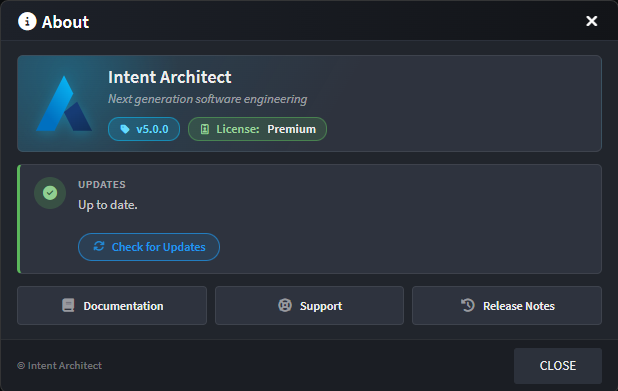

---

## AI Coding Agents in the Software Factory

Intent Architect now has two distinct contexts for agentic work: `modeling` and `coding`. Coding agents are built into the Software Factory Execution and provide a foundational mechanism to realize the subtle, and often sophisticated, business logic code that's required for applications to function. While deterministic code-generation systems can roll out the architecture, infrastructure and boilerplate for our application's design, the coding agents "color in between the lines" resulting in end-to-end working software - massively accelerating feature development and related coding tasks.

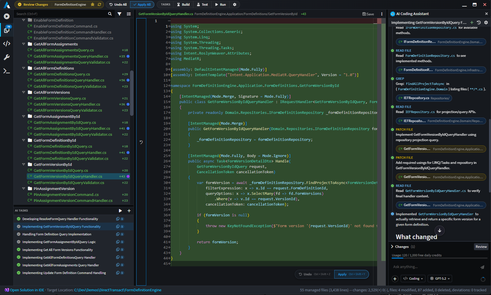

A "golden path" of development that we strive to consistently achieve is one where the developer can describe the design of their system, run the Software Factory Execution, run all coding agents, and out the other side comes working software - perfectly architected, consistent, readable and maintainable. The following features help support this:

- **Auto-created AI Tasks** - an AI Tasks panel (bottom right) helps the user visualize ongoing agent activity and indicate the status of each agent's process. AI tasks can be _auto-created_ by modules (i.e. where code implementation work is detected for the file, for example as detecting a `throw new NotImplementedException(...)`), created manually by the user, or even by coding agents themselves.

- **Optimized Context Engineering** - behind the coding agents is a sophisticated and powerful [context engineering system](xref:ai.context-management) that informs coding agents on how to deal with specific files. This ensures that they conform to the architecture, standards and structure of the application.

- **Comprehensive AI Tooling** - supporting the coding agents is a [suite of tools](xref:ai.tooling) that allow it to discover the codebase, analyze it, and implement features within it (e.g. grep, glob, read file, patch file, etc.). The result is a harness on par with most of the capabilities offered by other AI harnesses in the market.

- **Support for standard context files** - Intent Architect coding agents have integration support for context files that you and your team are already using (e.g. `CLAUDE.md`, `AGENTS.md`, `copilot-instructions.md`, etc.). It will also search in the standard folder structure for [Instruction Files](xref:ai.context-management#2-instruction-files) and [Skills](xref:ai.context-management#3-skills). You can also configure that skills and instructions installed by Intent Architect Modules go into your preferred AI folder (e.g. `.claude`, `.github`, etc.). By default they will be dropped off in the generic `.agents` folder which is respected by most harnesses.

---

## Comprehensive upgrade of AI integration systems

In version 4.6 of Intent Architect, we released our AI Assistant - a chat system with tooling to control Intent Architect's designers. As part of this release we've upgraded this system massively and made the system substantially more transparent, intuitive and powerful. Tool calls are now more obvious, interactive and clear. We've used colors to help the user identify reads from creates, updates and deletes made in their models. As per our last release, model changes are made in memory and not saved without the user's consent.

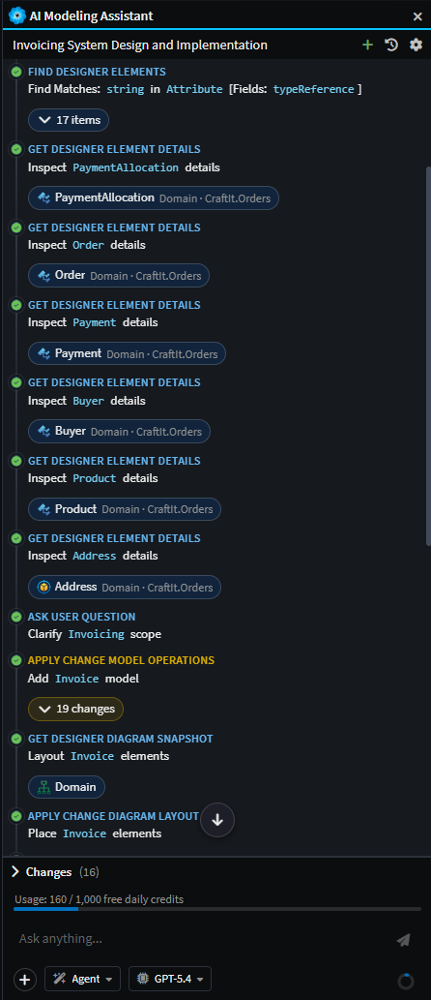

_Example screenshot of the AI Modeling Assistant implementing a change to the domain._

Beyond the visual enhancements and "face lift", the new AI chat systems comes with several key features and enhancements:

- **Conversation history & persistence** - past conversations persist, can be deleted. The status of each task (e.g. in-progress, awaiting approval, completed, etc.) is visible in the history dropdown.

    

- **Model / File attachments** - drag-and-drop files and model elements, paste files (including images), open and select files from hard drive, directly into the chat. Attachments are passed as user messages to the LLM in the appropriate format. This makes passing in Product Requirements Documents (PRDs), code files from external systems, screenshots, etc. easy and straightforward.

    

- **Tool-call visualization** - interactive chips for tool calls, composite tool-call collapsing, "modifications" lists, etc. This feature aims to make it clear and obvious to the user what the agent has done at each step. The chips are interactive in that the user can click them and navigate to them wherever they are in the system. Colors are used to indicate whether a change was a read (blue), create (green), update (yellow), or delete (red).

    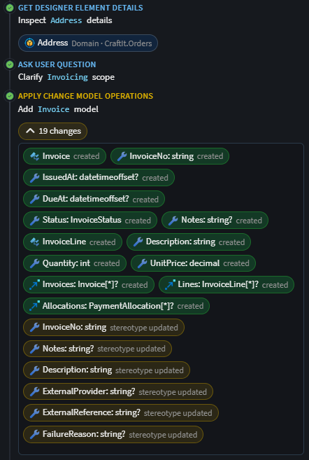

- **Steering** - users can send additional messages to the agent while it's mid-task without interrupting it. The new instructions are picked up on the agent's next turn, allowing the user to adjust direction, add context, or correct course without having to stop and restart the conversation.

- **Custom Agents** - [Custom Agents](xref:ai.custom-agents) can be authored as `.agent.md` markdown files in the `~/intent/.agents/agents` folder. Their frontmatter can specify in which context the agent must appear (i.e. `coding` or `modeling`) and what tools are available to the agent.

    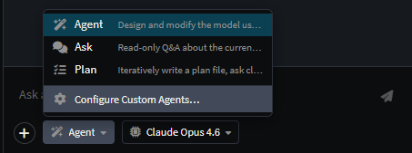

- **Slash Commands** - Standard to most AI development harnesses in the industry, Intent Architect offers slash command functionality. As part of this release, it offers agent switching and [skills](xref:ai.context-management#3-skills) invocation.

    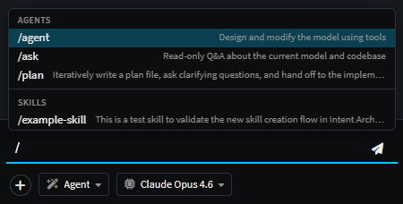

- **AI Configuration dialog** - To make it as easy as possible to get value out of Intent Architect's AI capabilities we created an [AI configuration dialog](xref:ai.configuration) that can be launched by clicking on the `cog` icon button in the AI Assistant toolbar. This dialog lists the [compatible providers](xref:ai.configuration#1-ai-providers) and makes it easy to provide API keys to integrate with your account. It also provides details on our [Intent MCP](xref:ai.configuration#2-intent-mcp) and how to configure [MCP Servers](xref:ai.configuration#3-mcp-servers) that agents in Intent Architect can use.

    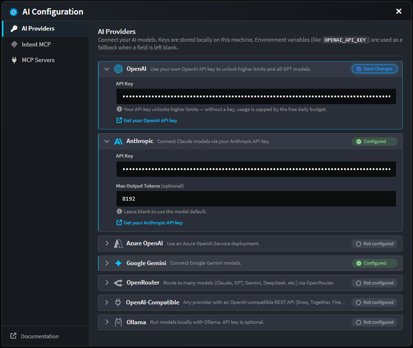

- **Plan mode rebuilt** - Version 4.6 offered a [plan mode](xref:ai.built-in-agents#plan) which we felt was too difficult to control and wasn't on par with other modern planning features. We therefore decided to rebuild the planning mode from scratch, adding critical tools like "Ask User Question", "Implement Plan" and "Update Todos" to help LLM perform accurately for the user. Plans are now presented as markdown files that the user can preview and edit inside of an Intent Architect tab.

---

## MCP Server (Intent Architect as an MCP host)

Intent Architect now exposes itself as an MCP server with a substantial tool suite which allows external agents to "drive" Intent Architect to meet the user's requirements. We considered this a critical capability to include as part of this release since AI tools like Claude Code and Copilot could create friction when editing code that Intent Architect is managing - something we became acutely aware of through our own usage and user feedback. The "Intent MCP" server solves this problem very effectively, giving external agents all the power they need to update the designs in Intent Architect.

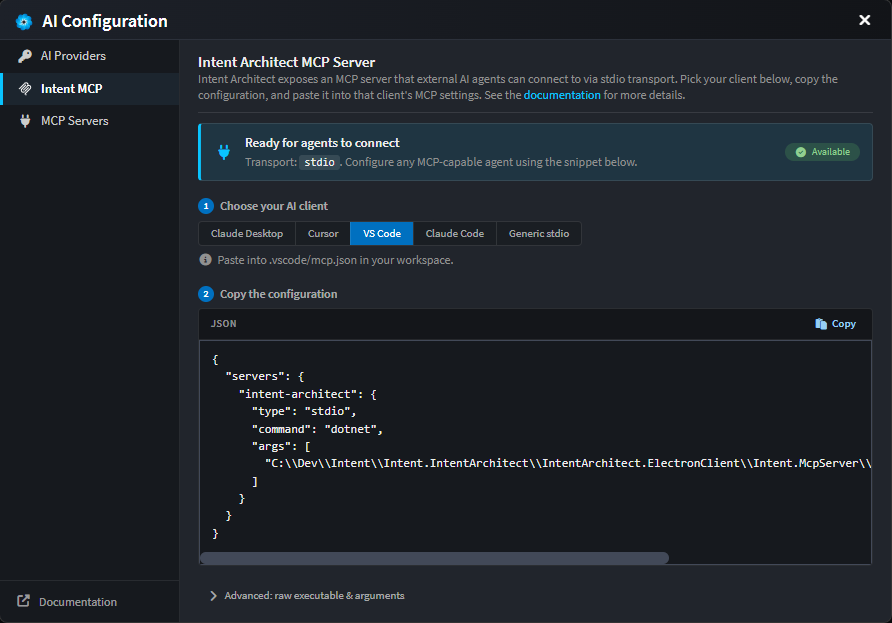

_Details on how to get set up with the [Intent MCP](xref:ai.configuration#2-intent-mcp) can be found in the AI Configuration dialog._

---

## Software Factory Capability Enhancements

In addition to the integration of AI coding agents with the Software Factory Execution, a significant revamp of the software factory UI and capabilities has been included. The layout has been restructured to optimize the available real-estate and maximize the space available to coding diffs and AI conversations. This includes adding top-level controls and status indicators to the toolbar, and a left-hand sidebar with tabs to the fundamental view and some new ones (in order from top to bottom):

- **Execution Output** - A window into the Software Factory Execution process that powers the deterministic code generation systems.
- **Changes** - The staged file changes awaiting the user's confirmation before being applied to the underlying codebase. Switch to this tab with the `ctrl + shift + c` shortcut.
- **Codebase Explorer** - A new view of the entire codebase rooted at the Output Location of the application. Changes will also be shown here. Switch to this tab with the `ctrl + shift + e` shortcut.
- **Customizations** - A list of all customizations / deviations and their approval status. Switch to this tab with the `ctrl + shift + d` shortcut.
- **Terminal** - This new tab allows the user to create new terminal processes (e.g. PowerShell on Windows) and view the status of task-created terminal processes. See more information on the [Software Factory Tasks and the Terminal](xref:application-development.software-factory.terminal-and-tasks). Switch to this tab with the `ctrl + shift + t` shortcut.

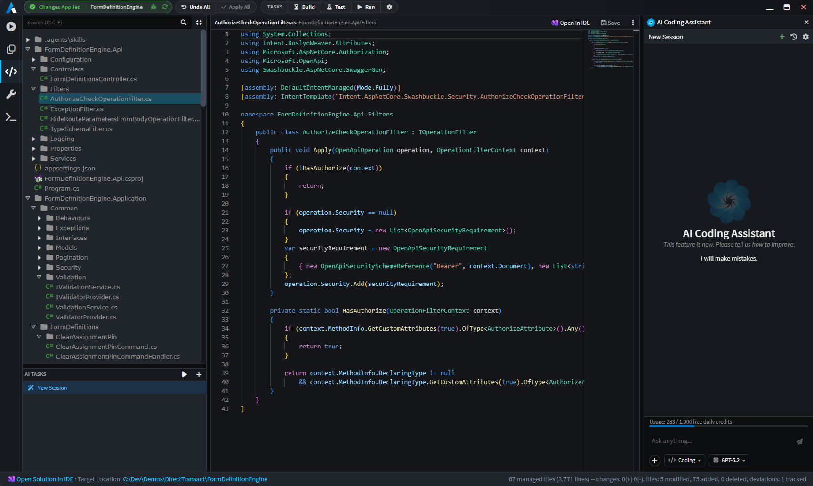

Several other enhancements and new capabilities have been added to the Software Factory Execution. Some of these are listed below:

- **Apply / Undo** - Users can undo applied files during the same Software Factory Execution run.
- **Per file Apply** - Individual files can be applied (and undone) one at a time (`ctrl + shift + y` to apply on the selected file. `ctrl + shift + z` to undo). A context menu on folders also exists for bulk applying at the folder level.
- **View in Designer Option** - A new context menu option which allows the user to navigate from code back to the metadata model in the designer that was responsible for generating that file.
- **Create AI Task** - Another new context menu option which allows the user to create a new AI Task with the selected file(s) attached.

    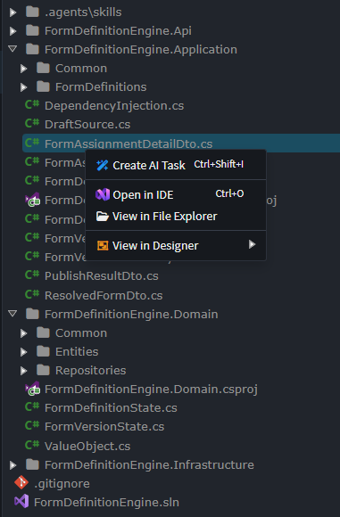

---

## Pop-out Tabs

Viewport tabs can now be popped out into independent windows:

- **"Move to New Window"** - Will pop out the current viewport tab into its own window. This moves the in-memory view into a new window which means any unsaved changes will not be lost.
- **"Copy into New Window"** - Will load up a new copy of the viewport tab. This will not load unsaved changes. Also note that saving one tab will cause the other to request to be reloaded.

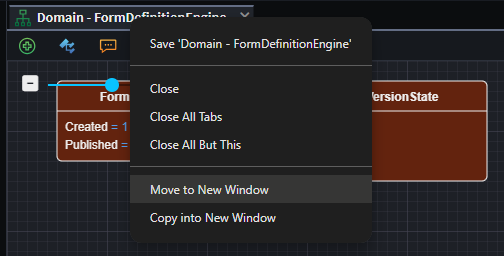

---

## Terminal & Tasks

To bring further convenience to developers, we've added a fully capable PTY (pseudoterminal) into Intent Architect, along with a flexible task configuration system. This allows developers to easily create terminal processes and configure commonly used tasks (e.g. `dotnet build`, `dotnet test`, `dotnet run`, etc.) inside of a `tasks.json` file.

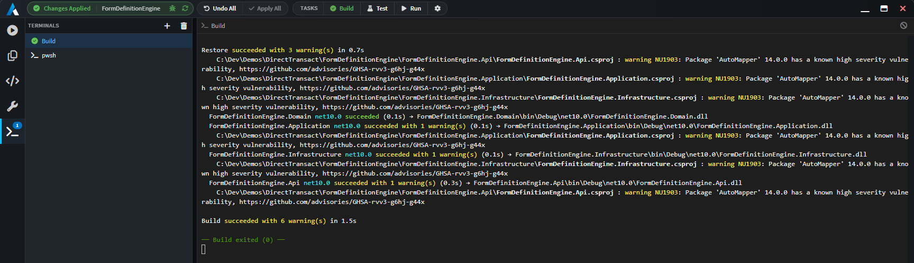

Configured tasks have several options including whether an AI Agent should be started automatically to fix errors. This is useful for example with build tasks since coding agents may have made mistakes that need to be resolved and the automatic creation of an AI Task makes this flow seamless. Below is an example `tasks.json` file:

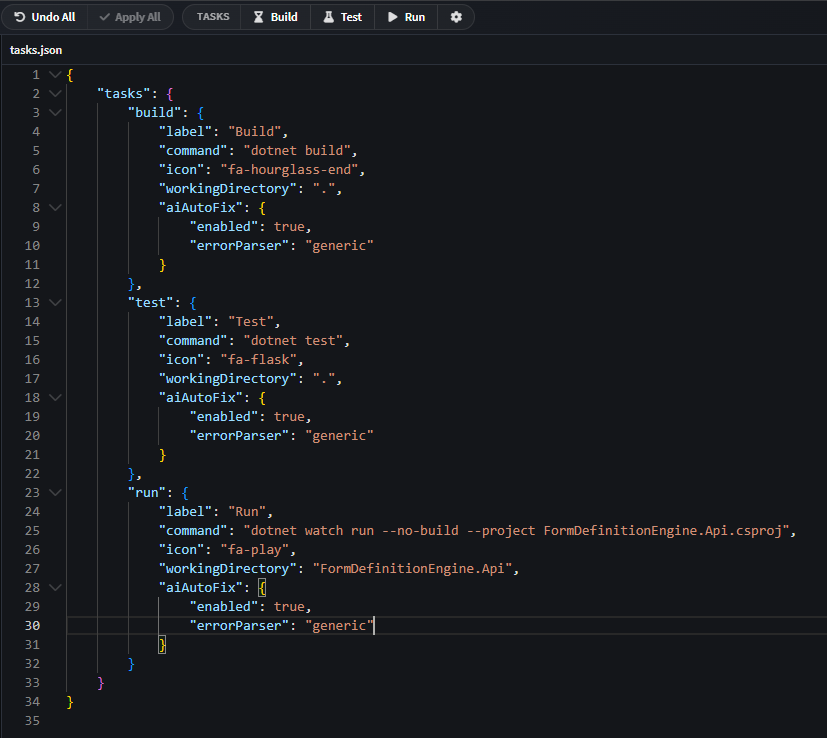

_Access this file directly inside of Intent Architect by clicking on the `cog` icon in the Tasks display, in the top toolbar._

> [!NOTE]
> The `tasks.json` file must be located in the same folder as the `.application.config` file for the application. It's also possible to install the `tasks.json` automatically via an Architecture Template.

---

## Improvements in the Designers

- **View Code context menu option** alongside the Open in IDE on elements - jumps directly to the code in the Software Factory. Does not require the Software Factory to start up completely.
- **In-Memory changes propagated between designers** - this means that changes in one designer are instantly visible in others that have references to its packages. It's no longer a requirement to save the designer before the change is propagated. This also means that Advanced Mapping dialogs will instantly update and show the changes made to referenced elements.
- **Filtering performance** has been improved across all tree-views.
- **Filtering highlights matches** across all tree-views.
- **Suggestions added to context menu** for elements and associations.
- **Newly-added (unsaved) elements** indicated with a subtle faded green background; modified/dirty stay yellow.
- **JS API**: `createAICodingTask(...)` for programmatically creating AI coding tasks in the Software Factory.

---

## Notable Fixes

- Stereotype-text display now updates correctly under undo/redo.
- (macOS) The `Intent.IArchitect.Agent.IPC` process would sometimes remain running after Intent Architect was closed.
