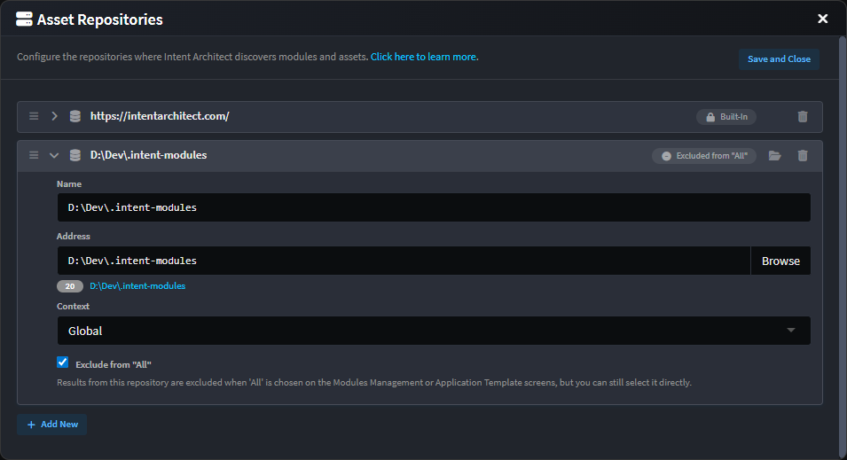

# Release notes: Intent Architect version 5.1

## Version 5.1.0

### Improvements in 5.1.0

- Improvement: The Asset Repository management screen has had a long overdue overhaul:

  

  - It is now possible to have repositories `Excluded from "All"`, when checked the results from the repository are excluded when 'All' is chosen on the Modules Management or Application Template screens, but you can still select it directly.
  - You can now use handles on entries to drag and drop to re-order them.
  - Entries are collapsed by default and can be clicked on to expand them to update their details.
