# About Stereotype Definitions

Stereotypes can only be created and applied in Intent Architect Designers if their `Stereotype Definitions` are accessible. These Definitions need to be created first and can often be found when a [Module](xref:modules.about-modules) is installed in your Application. They offer a blueprint that Intent Architect can recognize when trying to apply them.


| Property     | Value                      | Description                                                                                                                                                                                         |
|--------------|----------------------------|-----------------------------------------------------------------------------------------------------------------------------------------------------------------------------------------------------|
| Target Mode  | Elements of Type           | Only allows the Stereotype to be applied on Elements found in the `Target` property.                                                                                                                |
|              | Elements that reference    | Only allows the Stereotype to be applied on Elements' attributes/fields or associations that reference the Elements found in the `Target` property.                                                 |
|              | All elements               | No constraints on where the Stereotype can be applied.                                                                                                                                              |
| Target       | Elements found in Designer | The Element types upon which the Stereotype Definition may be applied.                                                                                                                              |
| Apply mode   | Manually                   | The user has to explicitly apply a Stereotype on a `Target` Element.                                                                                                                                |
|              | On element created         | When a `Target` Element is created, the Stereotype is automatically applied but it can be removed.                                                                                                  |
|              | Always                     | The Stereotype exists permanently on any `Target` Element and cannot be removed (as long as the Stereotype Definition exists).                                                                      |
| Icon         | Formatted Text             | [Change the icon](xref:user-interface.how-to-use-the-change-icon-dialogue) for the Stereotype by pressing the button with an ellipses.                                                                      |
| Display Icon | Check box                  | When selected, the Stereotype's icon will appear in the tree node and visual modellers for elements on which it is applied.                                                                         |
| Display Text | Function                   | Using the Javascript language, write a formatted text string that will be used by the Designer to add a Display Text where available. Example: `` return `[${properties["Router Link"].value}]` ``. |
| Order        | Number                     | Each Stereotype can be ordered according to this numerical value (in ascending order) in the Properties panel located on the right hand side in Intent Architect within a designer.                 |

## Stereotype Properties

Stereotypes Definitions allow any number of Properties to be added to them. Property names must be unique per Stereotype Definition. By default Stereotype Definition Properties have their `Control Type` set to `Text Box` which allows capturing of free text, but there are many other `Control Types` which can be selected.


| Property             | Type                  | Description                                                                                                                                                                                 |
|----------------------|-----------------------|---------------------------------------------------------------------------------------------------------------------------------------------------------------------------------------------|
| Name                 | Text                  | Specify a friendly name for the Property, spaces and punctuation are allowed.                                                                                                               |
| Control Type         | Type                  | Allows the Property to capture a single line of free text that represents a string. See [here](#control-types) for more detail.                                                             |
| Default Value        | Control Type Value    | Specify a default value in for this Property depending on the Control Type specified.                                                                                                       |
| Placeholder          | Text                  | Specify a description for this Property's input field which a user of the Stereotype can see which describes what is expected.                                                              |
| Is Active Function   | Javascript            | Write a script that returns `true`/`false` in order to determine if the Property will be visible/hidden or not. By default this will be Active.                                             |
| Is Required Function | Javascript            | Write a script that returns `true`/`false` in order to determine if the a value is required for this Property which is validated by Intent Architect. By default this will not be required. |

### Control Types

#### Text Box

Allows the Property to capture a single line of free text that represents a string.

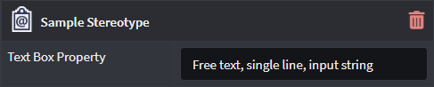

#### Number

Allows only the capture of a Numerical integer value for this Property.

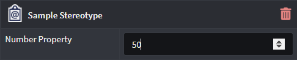

#### Checkbox

Presents a checkbox to capture a boolean value for the Property.

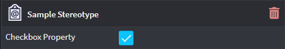

#### Text Area

Allows the Property to capture multiple-lines of free text that represents a string.

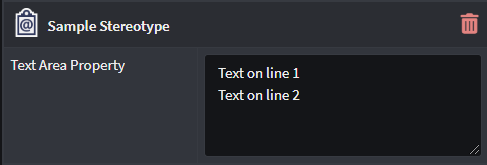

#### Select/Multi-select

##### Options

Provides an additional `Options` field where the Developer can specify explicit options which can be selected for that Stereotype Property.

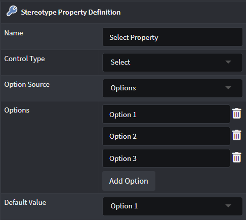

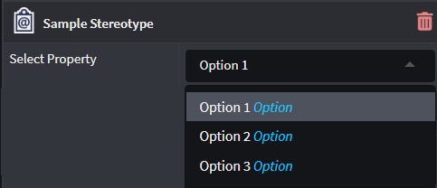

##### Lookup element

Provides an additional `Lookup types` field where the Developer can select Element types in order to make the Property a dropdown control that features instances of those Element types.

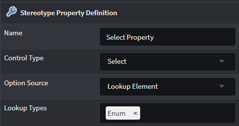

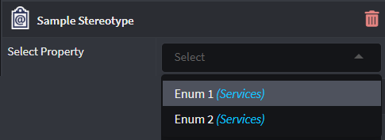

##### Lookup Children

Provides additional `Root Type Function` and `Lookup types` fields where a Developer can determine which Element type's "child elements" can be selected. Use the `Lookup types` to select the Child-Element to be selected and specify the function to evaluate how to determine the Parent-Element in the `Root Type Function` field.

Example of selecting `Enum Literals` from a previously selected `Enum`:


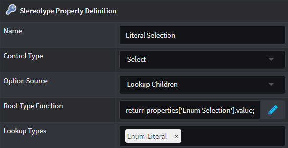

Root Type Function expression:

```js
return properties['Enum Selection'].value;
```

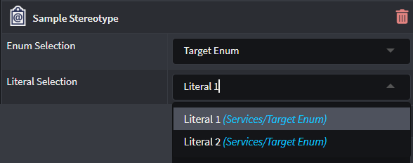

#### Javascript Function

Exposes the Property as a Javascript type field where the Developer can use the built in Javascript editor to define a script which can be leveraged by other Stereotype Properties or Designer elements.

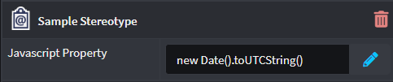

#### Icon

Exposes the Property as a standard Icon selector which acts in the same manner as the `Icon` property found on the Stereotype Definition itself.

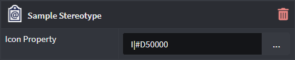

## See also

- [](xref:stereotypes.how-to-use-stereotypes)
