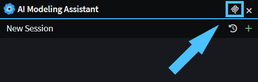

# Intent Architect MCP Server

Intent Architect exposes a [Model Context Protocol (MCP)](https://modelcontextprotocol.io/) server, allowing AI coding agents to interact directly with your Intent Architect solution. The MCP server communicates over the **stdio** transport, making it straightforward to integrate with any MCP-compatible client.

## Getting the executable path

The path to the Intent Architect MCP server executable is available from Intent Architect by clicking the MCP icon on any AI chat window:



## Connecting AI agents to the MCP server

The sections below show how to configure popular AI agents and coding assistants to connect to the Intent Architect MCP server. In each example, replace `<path-to-mcp-server>` with the actual executable path obtained from Intent Architect as described above.

### Claude Code

Add the Intent Architect MCP server to [Claude Code](https://claude.ai/claude-code) by running the following command in your terminal:

```bash
claude mcp add intent-architect -- "<path-to-mcp-server>"
```

Alternatively, add it manually to your Claude Code configuration. For user-level access, edit `~/.claude.json`; for project-level access, edit `.claude/settings.json` in your repository root:

```json
{
  "mcpServers": {
    "intent-architect": {
      "type": "stdio",
      "command": "<path-to-mcp-server>",
      "args": []
    }
  }
}
```

For further information, refer to the [Claude Code MCP documentation](https://docs.anthropic.com/en/docs/claude-code/mcp).

### OpenAI Codex

Add the Intent Architect MCP server to the [OpenAI Codex CLI](https://github.com/openai/codex) by adding the following entry to your `~/.codex/config.json` file:

```json
{
  "mcpServers": {
    "intent-architect": {
      "command": "<path-to-mcp-server>",
      "args": []
    }
  }
}
```

For further information, refer to the [Codex MCP documentation](https://github.com/openai/codex?tab=readme-ov-file#model-context-protocol-mcp-support).

### GitHub Copilot in VS Code

Add the Intent Architect MCP server to GitHub Copilot in VS Code by creating or updating the `.vscode/mcp.json` file in your workspace:

```json
{
  "servers": {
    "intent-architect": {
      "type": "stdio",
      "command": "<path-to-mcp-server>",
      "args": []
    }
  }
}
```

To make the server available across all workspaces, add the equivalent configuration under the `mcp.servers` key in your VS Code User Settings (`settings.json`):

```json
{
  "mcp": {
    "servers": {
      "intent-architect": {
        "type": "stdio",
        "command": "<path-to-mcp-server>",
        "args": []
      }
    }
  }
}
```

For further information, refer to the [VS Code MCP documentation](https://code.visualstudio.com/docs/copilot/chat/mcp-servers).

### GitHub Copilot in Visual Studio

Add the Intent Architect MCP server to GitHub Copilot in Visual Studio by creating or updating the `.mcp.json` file at the root of your solution:

```json
{
  "servers": {
    "intent-architect": {
      "type": "stdio",
      "command": "<path-to-mcp-server>",
      "args": []
    }
  }
}
```

To make the server available globally for all solutions, place the same configuration in `%USERPROFILE%\.mcp.json`.

For further information, refer to the [Visual Studio MCP documentation](https://learn.microsoft.com/visualstudio/ide/mcp-servers).
