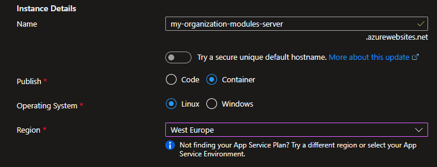

# Module Server

Intent Architect offers a self-hostable "Module Server" in the form of a Docker image. The [](xref:tools.module-server-client-cli) can be used to upload Modules and Application templates to it and then Intent Architect clients can be configured to use the server as a repository for your organization's custom Modules and Application Templates.

## Dependencies

The Module Server uses Microsoft SQL Server for persistence, all editions of SQL Server 2019 and later should be compatible, including the free [SQL Server Express](https://www.microsoft.com/download/details.aspx?id=101064) edition.

A SQL Server schema migration script will need to be manually run on the SQL Server before the Module Server to be able to start up. The migration script is [at the bottom of this article](#sql-server-schema-migration-script).

The Module Server is otherwise self-contained.

## Docker image details

|Name      |Value|
|----------|-|
|Registry  |`crintentarchitectprodzanorth.azurecr.io`|
|Repository|`intent-architect/module-server`|
|User      |`anonymous`|
|Password  |`1Ww/o4nfLPIKdComVBukyVGlmtWVgYm7MgfVPwwnfO+ACRAX3G9B`|

## Configurable environment variables

### `ConnectionStrings__DefaultConnection`

**Description:** The Microsoft SQL Server connection string.

**Default value:** `Server=host.docker.internal;Initial Catalog=Intent;MultipleActiveResultSets=True;Encrypt=False;User ID=module-server;Password=password;`

### `ApiKeys`

**Description:** A semi-colon (`;`) separated list of strings of which any can be used as the value for the `api-key` argument for the [](xref:tools.module-server-client-cli).

**Default value:** (blank)

### `APPLICATIONINSIGHTS_CONNECTION_STRING`

**Description:** Optional. An [Azure Application Insights](https://learn.microsoft.com/azure/azure-monitor/app/app-insights-overview?tabs=net) connection string. Leave unset or use the default value to have Azure Application Insights be disabled for the Module Server.

**Default value:** `InstrumentationKey=00000000-0000-0000-0000-000000000000;`

## Running locally

Ensure [Docker is installed](https://www.docker.com/products/docker-desktop/).

Authenticate against the Intent Architect container registry:

```bash
docker login -u anonymous -p 1Ww/o4nfLPIKdComVBukyVGlmtWVgYm7MgfVPwwnfO+ACRAX3G9B crintentarchitectprodzanorth.azurecr.io
```

In the following command replace `<sql-server-connection-string>` with a valid SQL Server connection string (e.g. `Server=host.docker.internal;Initial Catalog=Intent;MultipleActiveResultSets=True;Encrypt=False;User ID=module-server;Password=password;` will connect to a SQL Server on the Docker host machine, to the `Intent` database using the SQL username of `module-server` and password `password`) and then run it.

```bash
docker run --publish 33800:80 --name module-server -e "ConnectionStrings__DefaultConnection=<sql-server-connection-string>" crintentarchitectprodzanorth.azurecr.io/intent-architect/module-server:latest
```

You can confirm the module server is running by visiting [http://localhost:33800/swagger/](http://localhost:33800/swagger/) in your web browser.

## Deploying to Azure

Here is a simple guide on creating an Azure App Service which runs the Module Server Docker image.

### Create the Azure resources

1. Type **app services** in the search. Under **Services**, select **App Services**.
  
1. In the **App Services** page, select **+ Create** and then select the **+ Web App** option.
  
1. In the **Basics** tab, under **Project details**, ensure the correct subscription is selected and then select to Create new resource group. Type `intentArchitectModuleServerResourceGroup` for the name.
  
1. Under **Instance details**, type a globally unique name for your web app and select **Docker Container**. Select *Linux* for the **Operating System**. Select a **Region** you want to serve your app from.
  
1. Under **App Service Plan**, select **Create new** App Service Plan. Type `moduleServerAppServicePlan` for the name and choose a *Pricing plan*.
  
1. Select the **Next: Docker** > button at the bottom of the page.
1. In the **Docker** tab, select *Single Container* under **Options** and *Private Registry* for the **Image Source**. Under **Private registry options**, set the following values:
   - **Server URL:** `https://crintentarchitectprodzanorth.azurecr.io`
   - **Username:** `anonymous`
   - **Password:** `1Ww/o4nfLPIKdComVBukyVGlmtWVgYm7MgfVPwwnfO+ACRAX3G9B`
   - **Image and tag:** `intent-architect/module-server:latest`
  
1. Select the **Review + create** button at the bottom of the page.
1. After validation runs, select the **Create** button at the bottom of the page.
1. After deployment is complete, select **Go to resource**.

### Set environment variables for the Docker image

1. In the left pane, click on *Configuration*.
  
1. For each of the following press the **+ New application setting**, capture the **Name**, **Value** fields, leave the *Deployment slow setting* checkbox unchecked and press the **OK** button:
   - [Microsoft SQL Server connection string](#connectionstringsdefaultconnection):
     - **Name:** `ConnectionStrings__DefaultConnection`
     - **Value:** (A valid SQL Server connection string)
   - [API keys](#apikeys):
     - **Name:** `ApiKeys`
     - **Value:** (Semi-colon separated list of randomly generated API keys)
   - [Azure Application Insights connection string](#applicationinsightsconnectionstring) (optional):
     - **Name:** `APPLICATIONINSIGHTS_CONNECTION_STRING`
     - **Value:** (A valid Azure Application Insights connection string)
  
1. Press the **💾 Save** button at the top of the pane.

## Configuring Intent Architect clients to be able to use the Module Server

Intent Architect clients can use other Module Servers by entering their address into the **Address** field when [adding a repository](https://docs.intentarchitect.com/articles/application-development/applications-and-solutions/how-to-manage-repositories/how-to-manage-repositories.html).

The value to enter **Address** is "base" URL for the website. For example if you had set up a [local instance](#running-locally) the address would be `http://localhost:33800/`, if you had [deployed it to Azure](#deploying-to-azure) then the address would be something like `https://myorganizationnamemoduleserver.azurewebsites.net/`.

## SQL Server schema migration script

The following SQL Server script can be used to idempotently make sure that the database schema is at the latest version:

```sql
IF OBJECT_ID(N'[ModuleServer].[__EFMigrationsHistory]') IS NULL
BEGIN
    IF SCHEMA_ID(N'ModuleServer') IS NULL EXEC(N'CREATE SCHEMA [ModuleServer];');
    CREATE TABLE [ModuleServer].[__EFMigrationsHistory] (
        [MigrationId] nvarchar(150) NOT NULL,
        [ProductVersion] nvarchar(32) NOT NULL,
        CONSTRAINT [PK___EFMigrationsHistory] PRIMARY KEY ([MigrationId])
    );
END;
GO

BEGIN TRANSACTION;
GO

IF NOT EXISTS (
    SELECT * FROM [ModuleServer].[__EFMigrationsHistory]
    WHERE [MigrationId] = N'20230814124652_Initial'
)
BEGIN
    CREATE TABLE [ApplicationTemplates] (
        [Id] uniqueidentifier NOT NULL,
        [Identifier] nvarchar(150) NOT NULL,
        [MajorVersion] int NOT NULL,
        [MinorVersion] int NOT NULL,
        [PatchVersion] int NOT NULL,
        [DisplayName] nvarchar(150) NOT NULL,
        [ShortDescription] nvarchar(1000) NULL,
        [FullDescription] nvarchar(max) NULL,
        [Priority] int NOT NULL,
        [Authors] nvarchar(150) NULL,
        [IconType] int NULL,
        [IconSource] nvarchar(max) NULL,
        [Tags] nvarchar(1000) NULL,
        [ProjectUrl] nvarchar(512) NULL,
        [LastUpdated] datetime2 NOT NULL,
        [IsListed] bit NOT NULL,
        [CreatedBy] nvarchar(50) NULL,
        [CreateDateTime] datetime2 NULL,
        [UpdatedBy] nvarchar(50) NULL,
        [UpdateDateTime] datetime2 NULL,
        [SupportedClientVersions] nvarchar(64) NOT NULL,
        [MinClientMajor] int NOT NULL,
        [MinClientMinor] int NOT NULL,
        [MinClientPatch] int NOT NULL,
        [MinClientInclusive] bit NOT NULL,
        [MaxClientMajor] int NOT NULL,
        [MaxClientMinor] int NOT NULL,
        [MaxClientPatch] int NOT NULL,
        [MaxClientInclusive] bit NOT NULL,
        [Defaults_Name] nvarchar(128) NOT NULL,
        [Defaults_RelativeOutputLocation] nvarchar(128) NOT NULL,
        [Defaults_PlaceInSameDirectory] bit NOT NULL,
        [Defaults_SeparateIntentFiles] bit NOT NULL,
        [Defaults_SetGitIgnoreEntries] bit NOT NULL,
        CONSTRAINT [PK_ApplicationTemplates] PRIMARY KEY ([Id])
    );
END;
GO

IF NOT EXISTS (
    SELECT * FROM [ModuleServer].[__EFMigrationsHistory]
    WHERE [MigrationId] = N'20230814124652_Initial'
)
BEGIN
    CREATE TABLE [Modules] (
        [Id] uniqueidentifier NOT NULL,
        [Identifier] nvarchar(150) NOT NULL,
        [Summary] nvarchar(1000) NOT NULL,
        [Authors] nvarchar(150) NOT NULL,
        [LatestStableVersion] nvarchar(20) NOT NULL,
        [SupportedClientVersions] nvarchar(64) NULL,
        [IconUrl] nvarchar(max) NULL,
        [Tags] nvarchar(1000) NULL,
        [CreatedBy] nvarchar(50) NULL,
        [CreateDateTime] datetime2 NULL,
        [UpdatedBy] nvarchar(50) NULL,
        [UpdateDateTime] datetime2 NULL,
        CONSTRAINT [PK_Modules] PRIMARY KEY ([Id])
    );
END;
GO

IF NOT EXISTS (
    SELECT * FROM [ModuleServer].[__EFMigrationsHistory]
    WHERE [MigrationId] = N'20230814124652_Initial'
)
BEGIN
    CREATE TABLE [ApplicationTemplateFile] (
        [Id] uniqueidentifier NOT NULL,
        [Data] varbinary(max) NOT NULL,
        CONSTRAINT [PK_ApplicationTemplateFile] PRIMARY KEY ([Id]),
        CONSTRAINT [FK_ApplicationTemplateFile_ApplicationTemplates_Id] FOREIGN KEY ([Id]) REFERENCES [ApplicationTemplates] ([Id]) ON DELETE CASCADE
    );
END;
GO

IF NOT EXISTS (
    SELECT * FROM [ModuleServer].[__EFMigrationsHistory]
    WHERE [MigrationId] = N'20230814124652_Initial'
)
BEGIN
    CREATE TABLE [ModuleVersion] (
        [Id] uniqueidentifier NOT NULL,
        [Description] nvarchar(max) NULL,
        [Version] nvarchar(20) NOT NULL,
        [PublishedDate] datetime2 NOT NULL,
        [Authors] nvarchar(150) NOT NULL,
        [ProjectUrl] nvarchar(1000) NULL,
        [Tags] nvarchar(1000) NULL,
        [SupportedClientVersions] nvarchar(64) NULL,
        [ReleaseNotes] nvarchar(max) NULL,
        [IsListed] bit NOT NULL,
        [ModuleId] uniqueidentifier NOT NULL,
        CONSTRAINT [PK_ModuleVersion] PRIMARY KEY ([Id]),
        CONSTRAINT [FK_ModuleVersion_Modules_ModuleId] FOREIGN KEY ([ModuleId]) REFERENCES [Modules] ([Id]) ON DELETE CASCADE
    );
END;
GO

IF NOT EXISTS (
    SELECT * FROM [ModuleServer].[__EFMigrationsHistory]
    WHERE [MigrationId] = N'20230814124652_Initial'
)
BEGIN
    CREATE TABLE [ModuleDependency] (
        [Id] uniqueidentifier NOT NULL,
        [ModuleVersionId] uniqueidentifier NOT NULL,
        [ModuleId] nvarchar(150) NOT NULL,
        [VersionSpec] nvarchar(40) NOT NULL,
        CONSTRAINT [PK_ModuleDependency] PRIMARY KEY ([Id]),
        CONSTRAINT [FK_ModuleDependency_ModuleVersion_ModuleVersionId] FOREIGN KEY ([ModuleVersionId]) REFERENCES [ModuleVersion] ([Id]) ON DELETE CASCADE
    );
END;
GO

IF NOT EXISTS (
    SELECT * FROM [ModuleServer].[__EFMigrationsHistory]
    WHERE [MigrationId] = N'20230814124652_Initial'
)
BEGIN
    CREATE TABLE [ModuleFile] (
        [Id] uniqueidentifier NOT NULL,
        [Data] varbinary(max) NOT NULL,
        CONSTRAINT [PK_ModuleFile] PRIMARY KEY ([Id]),
        CONSTRAINT [FK_ModuleFile_ModuleVersion_Id] FOREIGN KEY ([Id]) REFERENCES [ModuleVersion] ([Id]) ON DELETE CASCADE
    );
END;
GO

IF NOT EXISTS (
    SELECT * FROM [ModuleServer].[__EFMigrationsHistory]
    WHERE [MigrationId] = N'20230814124652_Initial'
)
BEGIN
    CREATE TABLE [ModuleSpecFile] (
        [Id] uniqueidentifier NOT NULL,
        [Data] nvarchar(max) NOT NULL,
        CONSTRAINT [PK_ModuleSpecFile] PRIMARY KEY ([Id]),
        CONSTRAINT [FK_ModuleSpecFile_ModuleVersion_Id] FOREIGN KEY ([Id]) REFERENCES [ModuleVersion] ([Id]) ON DELETE CASCADE
    );
END;
GO

IF NOT EXISTS (
    SELECT * FROM [ModuleServer].[__EFMigrationsHistory]
    WHERE [MigrationId] = N'20230814124652_Initial'
)
BEGIN
    CREATE UNIQUE INDEX [IX_ApplicationTemplates_Identifier_MajorVersion_MinorVersion_PatchVersion] ON [ApplicationTemplates] ([Identifier], [MajorVersion], [MinorVersion], [PatchVersion]);
END;
GO

IF NOT EXISTS (
    SELECT * FROM [ModuleServer].[__EFMigrationsHistory]
    WHERE [MigrationId] = N'20230814124652_Initial'
)
BEGIN
    CREATE INDEX [IX_ApplicationTemplates_MaxClientMajor_MaxClientMinor_MaxClientPatch_MaxClientInclusive] ON [ApplicationTemplates] ([MaxClientMajor], [MaxClientMinor], [MaxClientPatch], [MaxClientInclusive]);
END;
GO

IF NOT EXISTS (
    SELECT * FROM [ModuleServer].[__EFMigrationsHistory]
    WHERE [MigrationId] = N'20230814124652_Initial'
)
BEGIN
    CREATE INDEX [IX_ApplicationTemplates_MinClientMajor_MinClientMinor_MinClientPatch_MinClientInclusive] ON [ApplicationTemplates] ([MinClientMajor], [MinClientMinor], [MinClientPatch], [MinClientInclusive]);
END;
GO

IF NOT EXISTS (
    SELECT * FROM [ModuleServer].[__EFMigrationsHistory]
    WHERE [MigrationId] = N'20230814124652_Initial'
)
BEGIN
    CREATE INDEX [IX_ModuleDependency_ModuleVersionId] ON [ModuleDependency] ([ModuleVersionId]);
END;
GO

IF NOT EXISTS (
    SELECT * FROM [ModuleServer].[__EFMigrationsHistory]
    WHERE [MigrationId] = N'20230814124652_Initial'
)
BEGIN
    CREATE UNIQUE INDEX [IX_Modules_Identifier] ON [Modules] ([Identifier]);
END;
GO

IF NOT EXISTS (
    SELECT * FROM [ModuleServer].[__EFMigrationsHistory]
    WHERE [MigrationId] = N'20230814124652_Initial'
)
BEGIN
    CREATE INDEX [IX_ModuleVersion_ModuleId] ON [ModuleVersion] ([ModuleId]);
END;
GO

IF NOT EXISTS (
    SELECT * FROM [ModuleServer].[__EFMigrationsHistory]
    WHERE [MigrationId] = N'20230814124652_Initial'
)
BEGIN
    INSERT INTO [ModuleServer].[__EFMigrationsHistory] ([MigrationId], [ProductVersion])
    VALUES (N'20230814124652_Initial', N'8.0.6');
END;
GO

COMMIT;
GO

BEGIN TRANSACTION;
GO

IF NOT EXISTS (
    SELECT * FROM [ModuleServer].[__EFMigrationsHistory]
    WHERE [MigrationId] = N'20230817095136_AddModuleVersionIndex'
)
BEGIN
    CREATE INDEX [IX_ModuleVersions_IsListed_SupportedClientVersions] ON [ModuleVersion] ([IsListed], [SupportedClientVersions]) INCLUDE ([ModuleId]);
END;
GO

IF NOT EXISTS (
    SELECT * FROM [ModuleServer].[__EFMigrationsHistory]
    WHERE [MigrationId] = N'20230817095136_AddModuleVersionIndex'
)
BEGIN
    INSERT INTO [ModuleServer].[__EFMigrationsHistory] ([MigrationId], [ProductVersion])
    VALUES (N'20230817095136_AddModuleVersionIndex', N'8.0.6');
END;
GO

COMMIT;
GO

BEGIN TRANSACTION;
GO

IF NOT EXISTS (
    SELECT * FROM [ModuleServer].[__EFMigrationsHistory]
    WHERE [MigrationId] = N'20230817110919_BreakOutIcons'
)
BEGIN
    ALTER TABLE [Modules] ADD [IconExists] bit NULL;
    DECLARE @defaultSchema AS sysname;
    SET @defaultSchema = SCHEMA_NAME();
    DECLARE @description AS sql_variant;
    SET @description = N'Although this can be inferred by whether or not the association to ModuleIcon is null, by storing it here we don''t have to worry about lazy loading the entity (which is reduces performance) to check if its null or do some other EF query.';
    EXEC sp_addextendedproperty 'MS_Description', @description, 'SCHEMA', @defaultSchema, 'TABLE', N'Modules', 'COLUMN', N'IconExists';
END;
GO

IF NOT EXISTS (
    SELECT * FROM [ModuleServer].[__EFMigrationsHistory]
    WHERE [MigrationId] = N'20230817110919_BreakOutIcons'
)
BEGIN
    CREATE TABLE [ModuleIcons] (
        [Id] uniqueidentifier NOT NULL,
        [Url] nvarchar(max) NOT NULL,
        CONSTRAINT [PK_ModuleIcons] PRIMARY KEY ([Id]),
        CONSTRAINT [FK_ModuleIcons_Modules_Id] FOREIGN KEY ([Id]) REFERENCES [Modules] ([Id]) ON DELETE CASCADE
    );
END;
GO

IF NOT EXISTS (
    SELECT * FROM [ModuleServer].[__EFMigrationsHistory]
    WHERE [MigrationId] = N'20230817110919_BreakOutIcons'
)
BEGIN
    EXECUTE('
                    INSERT INTO [dbo].[ModuleIcons] ([Id], [Url])
                    SELECT [Id], [IconUrl] FROM [Modules]
                    WHERE [IconUrl] IS NOT NULL AND [IconUrl] LIKE ''data:%''

                    UPDATE [dbo].[Modules]
                    SET
                        [IconUrl] = CASE WHEN [IconUrl] IS NOT NULL AND [IconUrl] LIKE ''data:%'' THEN NULL ELSE [IconUrl] END,
                        [IconExists] = CASE WHEN [IconUrl] IS NOT NULL AND [IconUrl] LIKE ''data:%'' THEN 1 ELSE 0 END
                ')
END;
GO

IF NOT EXISTS (
    SELECT * FROM [ModuleServer].[__EFMigrationsHistory]
    WHERE [MigrationId] = N'20230817110919_BreakOutIcons'
)
BEGIN
    DECLARE @var0 sysname;
    SELECT @var0 = [d].[name]
    FROM [sys].[default_constraints] [d]
    INNER JOIN [sys].[columns] [c] ON [d].[parent_column_id] = [c].[column_id] AND [d].[parent_object_id] = [c].[object_id]
    WHERE ([d].[parent_object_id] = OBJECT_ID(N'[Modules]') AND [c].[name] = N'IconExists');
    IF @var0 IS NOT NULL EXEC(N'ALTER TABLE [Modules] DROP CONSTRAINT [' + @var0 + '];');
    ALTER TABLE [Modules] ALTER COLUMN [IconExists] bit NOT NULL;
END;
GO

IF NOT EXISTS (
    SELECT * FROM [ModuleServer].[__EFMigrationsHistory]
    WHERE [MigrationId] = N'20230817110919_BreakOutIcons'
)
BEGIN
    INSERT INTO [ModuleServer].[__EFMigrationsHistory] ([MigrationId], [ProductVersion])
    VALUES (N'20230817110919_BreakOutIcons', N'8.0.6');
END;
GO

COMMIT;
GO

BEGIN TRANSACTION;
GO

IF NOT EXISTS (
    SELECT * FROM [ModuleServer].[__EFMigrationsHistory]
    WHERE [MigrationId] = N'20240130161055_ApplicationTemplate_Version_IsPrerelease'
)
BEGIN
    ALTER TABLE [ApplicationTemplates] ADD [IsPrerelease] bit NOT NULL DEFAULT CAST(0 AS bit);
END;
GO

IF NOT EXISTS (
    SELECT * FROM [ModuleServer].[__EFMigrationsHistory]
    WHERE [MigrationId] = N'20240130161055_ApplicationTemplate_Version_IsPrerelease'
)
BEGIN
    ALTER TABLE [ApplicationTemplates] ADD [Version] nvarchar(20) NOT NULL DEFAULT N'';
END;
GO

IF NOT EXISTS (
    SELECT * FROM [ModuleServer].[__EFMigrationsHistory]
    WHERE [MigrationId] = N'20240130161055_ApplicationTemplate_Version_IsPrerelease'
)
BEGIN
    EXECUTE('
    UPDATE [dbo].[ApplicationTemplates]
    SET Version = CONVERT(varchar(10), MajorVersion) + ''.'' + CONVERT(varchar(10), MinorVersion) + ''.'' + CONVERT(varchar(10), PatchVersion)')
END;
GO

IF NOT EXISTS (
    SELECT * FROM [ModuleServer].[__EFMigrationsHistory]
    WHERE [MigrationId] = N'20240130161055_ApplicationTemplate_Version_IsPrerelease'
)
BEGIN
    INSERT INTO [ModuleServer].[__EFMigrationsHistory] ([MigrationId], [ProductVersion])
    VALUES (N'20240130161055_ApplicationTemplate_Version_IsPrerelease', N'8.0.6');
END;
GO

COMMIT;
GO

BEGIN TRANSACTION;
GO

IF NOT EXISTS (
    SELECT * FROM [ModuleServer].[__EFMigrationsHistory]
    WHERE [MigrationId] = N'20240131082207_UpdatedIndex_IX_ApplicationTemplates_Identifier_Version'
)
BEGIN
    DROP INDEX [IX_ApplicationTemplates_Identifier_MajorVersion_MinorVersion_PatchVersion] ON [ApplicationTemplates];
END;
GO

IF NOT EXISTS (
    SELECT * FROM [ModuleServer].[__EFMigrationsHistory]
    WHERE [MigrationId] = N'20240131082207_UpdatedIndex_IX_ApplicationTemplates_Identifier_Version'
)
BEGIN
    CREATE UNIQUE INDEX [IX_ApplicationTemplates_Identifier_Version] ON [ApplicationTemplates] ([Identifier], [Version]);
END;
GO

IF NOT EXISTS (
    SELECT * FROM [ModuleServer].[__EFMigrationsHistory]
    WHERE [MigrationId] = N'20240131082207_UpdatedIndex_IX_ApplicationTemplates_Identifier_Version'
)
BEGIN
    INSERT INTO [ModuleServer].[__EFMigrationsHistory] ([MigrationId], [ProductVersion])
    VALUES (N'20240131082207_UpdatedIndex_IX_ApplicationTemplates_Identifier_Version', N'8.0.6');
END;
GO

COMMIT;
GO
```
