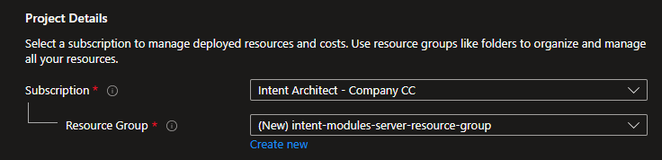

# Module Server

Intent Architect offers a self-hostable "Module Server" in the form of a Docker image. The [](xref:tools.module-server-client-cli) can be used to upload Modules and Application templates to it and then Intent Architect clients can be configured to use the server as a repository for your organization's custom Modules and Application Templates.

## Dependencies

The Module Server uses Microsoft SQL Server for persistence, all editions of SQL Server 2019 and later should be compatible, including the free [SQL Server Express](https://www.microsoft.com/download/details.aspx?id=101064) edition.

The Module Server is otherwise self-contained.

## Docker image details

|Name      |Value|
|----------|-|
|Registry  |`crintentarchitectprodzanorth.azurecr.io`|
|Repository|`intent-architect/module-server`|
|User      |`anonymous`|
|Password  |`1Ww/o4nfLPIKdComVBukyVGlmtWVgYm7MgfVPwwnfO+ACRAX3G9B`|

## Configurable environment variables

### `ConnectionStrings__DefaultConnection`

**Description:** The Microsoft SQL Server connection string.

**Default value:** `Server=host.docker.internal;Initial Catalog=Intent;MultipleActiveResultSets=True;Encrypt=False;User ID=module-server;Password=password;`

### `ApiKeys`

**Description:** A semi-colon (`;`) separated list of strings of which any can be used as the value for the `api-key` argument for the [](xref:tools.module-server-client-cli).

**Default value:** (blank)

### `APPLICATIONINSIGHTS_CONNECTION_STRING`

**Description:** Optional. An [Azure Application Insights](https://learn.microsoft.com/azure/azure-monitor/app/app-insights-overview?tabs=net) connection string. Leave unset or use the default value to have Azure Application Insights be disabled for the Module Server.

**Default value:** `InstrumentationKey=00000000-0000-0000-0000-000000000000;`

## Running locally

Ensure [Docker is installed](https://www.docker.com/products/docker-desktop/).

Authenticate against the Intent Architect container registry:

```bash
docker login -u anonymous -p 1Ww/o4nfLPIKdComVBukyVGlmtWVgYm7MgfVPwwnfO+ACRAX3G9B crintentarchitectprodzanorth.azurecr.io
```

In the following command replace `<sql-server-connection-string>` with a valid SQL Server connection string (e.g. `Server=host.docker.internal;Initial Catalog=Intent;MultipleActiveResultSets=True;Encrypt=False;User ID=module-server;Password=password;` will connect to a SQL Server on the Docker host machine, to the `Intent` database using the SQL username of `module-server` and password `password`) and then run it.

```bash
docker run --publish 33800:80 --name module-server -e "ConnectionStrings__DefaultConnection=<sql-server-connection-string>" crintentarchitectprodzanorth.azurecr.io/intent-architect/module-server:latest
```

You can confirm the module server is running by visiting [http://localhost:33800/swagger/](http://localhost:33800/swagger/) in your web browser.

## Deploying to Azure

Here is a simple guide on creating an Azure App Service which runs the Module Server Docker image.

### Create the Azure resources

1. Type **app services** in the search. Under **Services**, select **App Services**.
  
1. In the **App Services** page, select **+ Create** and then select the **+ Web App** option.
  
1. In the **Basics** tab, under **Project details**, ensure the correct subscription is selected and then select to Create new resource group. Type `intentArchitectModuleServerResourceGroup` for the name.
  
1. Under **Instance details**, type a globally unique name for your web app and select **Docker Container**. Select *Linux* for the **Operating System**. Select a **Region** you want to serve your app from.
  
1. Under **App Service Plan**, select **Create new** App Service Plan. Type `moduleServerAppServicePlan` for the name and choose a *Pricing plan*.
  
1. Select the **Next: Docker** > button at the bottom of the page.
1. In the **Docker** tab, select *Single Container* under **Options** and *Private Registry* for the **Image Source**. Under **Private registry options**, set the following values:
   - **Server URL:** `https://crintentarchitectprodzanorth.azurecr.io`
   - **Username:** `anonymous`
   - **Password:** `1Ww/o4nfLPIKdComVBukyVGlmtWVgYm7MgfVPwwnfO+ACRAX3G9B`
   - **Image and tag:** `intent-architect/module-server:latest`
  
1. Select the **Review + create** button at the bottom of the page.
1. After validation runs, select the **Create** button at the bottom of the page.
1. After deployment is complete, select **Go to resource**.

### Set environment variables for the Docker image

1. In the left pane, click on *Configuration*.
  
1. For each of the following press the **+ New application setting**, capture the **Name**, **Value** fields, leave the *Deployment slow setting* checkbox unchecked and press the **OK** button:
   - [Microsoft SQL Server connection string](#connectionstringsdefaultconnection):
     - **Name:** `ConnectionStrings__DefaultConnection`
     - **Value:** (A valid SQL Server connection string)
   - [API keys](#apikeys):
     - **Name:** `ApiKeys`
     - **Value:** (Semi-colon separated list of randomly generated API keys)
   - [Azure Application Insights connection string](#applicationinsightsconnectionstring) (optional):
     - **Name:** `APPLICATIONINSIGHTS_CONNECTION_STRING`
     - **Value:** (A valid Azure Application Insights connection string)
  
1. Press the **💾 Save** button at the top of the pane.

## Configuring Intent Architect clients to be able to use the Module Server

Intent Architect clients can use other Module Servers by entering their address into the **Address** field when [adding a repository](https://docs.intentarchitect.com/articles/application-development/applications-and-solutions/how-to-manage-repositories/how-to-manage-repositories.html).

The value to enter **Address** is "base" URL for the website. For example if you had set up a [local instance](#running-locally) the address would be `http://localhost:33800/`, if you had [deployed it to Azure](#deploying-to-azure) then the address would be something like `https://myorganizationnamemoduleserver.azurewebsites.net/`.
