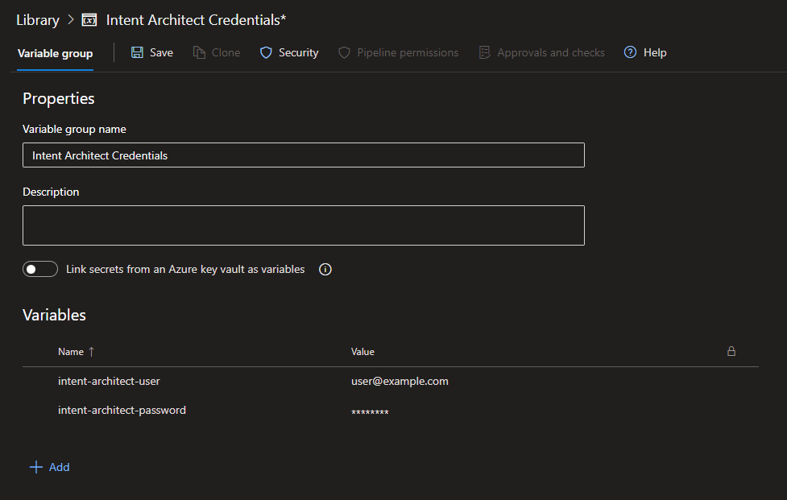

<!-- markdownlint-disable MD033 -->
<!-- markdownlint-disable MD060 -->
# Software Factory CLI

<!-- Workaround to align the column widths consistently -->
<style>
table th:first-of-type {
    width: 375px;
}
</style>

A CLI (command line interface) version of the Intent Architect Software Factory.

## Why use this tool?

This tool can easily be configured as part of your CI/CD pipeline to ensure your Intent Architect design and actual solution codebase are in sync.  This is  analogous to ensuring your codebase compiles and all tests pass when committing code, and is one of the major benefits of a CI/CD pipeline. The intention is to extend the CI/CD pipeline checks and balances to include that all Intent Architect designs are in sync with the underlying codebase. This tool allows developers to apply the same rigor to Intent Architect changes as they do to codebase changes, ensuring a more consistent and reliable codebase. This practice is particularly important when you have a team of developers collaborating on a shared repository.

## Pre-requisites

Latest release version of [.NET](https://dotnet.microsoft.com/download).

> [!NOTE]
> To take advantage of the latest performance improvements available in .NET, newer versions Intent Architect (and subsequently its Software Factory) are upgraded as soon as possible to the latest release of .NET regardless of whether it is an STS or LTS version. While Intent Architect itself ships with the runtime it requires, as the Software Factory CLI is a .NET tool, it will require that you have the latest .NET version installed.

### Additional considerations when running custom modules

If your Intent Architect applications are running custom modules (i.e. modules which are not available at the `https://intentarchitect.com/` repository), you will need to ensure the following:

- The repository location containing your custom modules will need to be [added as a repository with its Context set to `Current Solution`](xref:application-development.applications-and-solutions.how-to-manage-repositories#repository-context).
- The operating system instance running the Software Factory CLI will need access to the location of the `.imod` files in order for it to be able to restore them during execution.

> [!TIP]
> The [](xref:tools.module-server) can be used for self-hosting custom modules to make them available over HTTP.

## Installation

This CLI tool is available as a [.NET Tool](https://docs.microsoft.com/dotnet/core/tools/global-tools) and can be installed with the following command:

```bash
dotnet tool install Intent.SoftwareFactory.CLI --global
```

You should see output to the effect of:

```text
You can invoke the tool using the following command: intent-cli
Tool 'intent.softwarefactory.cli' (version 'x.x.x') was successfully installed.
```

### Common installation errors

#### The required NuGet feed can't be accessed, perhaps because of an Internet connection problem

If `dotnet tool install` fails with an error to the effect of `The required NuGet feed can't be accessed, perhaps because of an Internet connection problem` and it shows a private NuGet feed URL, you can try add the `--ignore-failed-sources` command line option ([source](https://learn.microsoft.com/dotnet/core/tools/troubleshoot-usage-issues#nuget-feed-cant-be-accessed)).

#### The settings file in the tool's NuGet package is invalid: Settings file 'DotnetToolSetting.xml' was not found in the package

If `dotnet tool install` fails with an error to the effect of `The settings file in the tool's NuGet package is invalid: Settings file 'DotnetToolSetting.xml' was not found in the package`, this is a [known misleading error by dotnet when you don't have the tool's target framework installed](https://github.com/dotnet/sdk/issues/38172).

If you're seeing this error on a build server you will need to ensure it has the latest .NET SDK installed, for example on Azure Pipelines you can add the following task to the `.yml` file to install a version of .NET, replacing `<major-version>` with the major version of .NET which should be installed:

```yaml
- task: UseDotNet@2
  displayName: 'Install latest .NET <major-version> SDK'
  inputs:
    version: '<major-version>.x'
```

This task can be used multiple times on the same Pipeline if you need to have multiple .NET SDK versions available, for example if the latest version of .NET is 10 and your code is targeting .NET 8 you can add the following two tasks:

```yaml
- task: UseDotNet@2
  displayName: 'Install latest .NET 8 SDK'
  inputs:
    version: '8.x'

- task: UseDotNet@2
  displayName: 'Install latest .NET 10 SDK'
  inputs:
    version: '10.x'
```

## Updating

A new version of the Software Factory CLI tool is also built and published as part of the automated build process which builds and publishes the Intent Architect desktop application. The version of the tool will always correspond with the version of the desktop application.

The same command for installation (`dotnet tool install Intent.SoftwareFactory.CLI --global`) will update the tool if an update is available and if none is available it reinstalls it making it safe to run the command as often as desired to ensure the tool is up to date.

## Usage

`intent-cli [command] [options]`

## Options

|Option          |Description|
|----------------|-----------|
|`-?, -h, --help`|Show help and usage information|
|`--version`     |Show version information|

## Commands

|Command                                                           |Description|
|------------------------------------------------------------------|-----------|
|`apply-pending-changes <username> <password> <isln-path>`         |Runs the Software Factory and applies any outstanding changes.|
|`ensure-no-outstanding-changes <username> <password> <isln-path>` |Runs the Software Factory and if there are any outstanding changes it prints out an error and exits with a non-zero return code.|

## apply-pending-changes command

Runs the Software Factory and applies any outstanding changes.

### apply-pending-changes usage

```bash
intent-cli apply-pending-changes <username> <password> <isln-path> [options]
```

### apply-pending-changes arguments

|Argument      |Description|
|--------------|-----------|
|`<username>`  |Username for an active Intent Architect account. If you're using an Organization Access Token (OAT), use "token", see [below](#do-i-have-to-use-the-credentials-of-a-user-license) for more information.|
|`<password>`  |Password for the Intent Architect account. If a password is causing a "response file not found" error see [below](#the-command-fails-with-a-response-file-not-found-value-error) for more information and a workaround.|
|`<isln-path>` |Path to the Intent Architect solution (.isln) file or folder containing a single .isln file.|

### apply-pending-changes options

|Option                                                |Description|
|------------------------------------------------------|-----------|
|`--application-id <application-id>`                   |The Id of the Intent Architect application. If unspecified then all applications found in the .isln will be run.|
|`--attach-debugger`                                   |The Software Factory will pause at startup giving you chance to attach a .NET debugger.|
|`--error-logging-command <error-logging-command>`     |Command to use for logging an error. Some continuous integration environments watch output for \"commands\" for logging of errors. Will be automatically configured when the process is detected to be running on the following kinds of build servers:<br/>- Azure Pipelines: By default applies \"{GetErrorLoggingCommand(CiType.AzurePipelines)}\" (see <https://learn.microsoft.com/azure/devops/pipelines/scripts/logging-commands#logissue-log-an-error-or-warning>)<br/><br/>See the documentation on Serilog.Expressions ExpressionTemplate for formatting options: <https://github.com/serilog/serilog-expressions#formatting-with-expressiontemplate>"|
|`--warning-logging-command <warning-logging-command>` |Command to use for logging a warning. Some continuous integration environments watch output for \"commands\" for logging of warnings. Will be automatically configured when the process is detected to be running on the following kinds of build servers:<br/>- Azure Pipelines: By default applies \"{GetWarningLoggingCommand(CiType.AzurePipelines)}\" (see <https://learn.microsoft.com/azure/devops/pipelines/scripts/logging-commands#logissue-log-an-error-or-warning>)<br/><br/>See the documentation on Serilog.Expressions ExpressionTemplate for formatting options: <https://github.com/serilog/serilog-expressions#formatting-with-expressiontemplate>"|
|`-?, -h, --help`                                      |Show help and usage information|

## ensure-no-outstanding-changes command

Runs the Software Factory and if there are any outstanding changes it prints out an error and exits with a non-zero return code.

### ensure-no-outstanding-changes usage

```bash
intent-cli ensure-no-outstanding-changes <username> <password> <isln-path> [options]
```

### ensure-no-outstanding-changes arguments

|Argument      |Description|
|--------------|-----------|
|`<username>`  |Username for an active Intent Architect account. If you're using an Organization Access Token (OAT), use "token", see [below](#do-i-have-to-use-the-credentials-of-a-user-license) for more information.|
|`<password>`  |Password for the Intent Architect account. If a password is causing a "response file not found" error see [below](#the-command-fails-with-a-response-file-not-found-value-error) for more information and a workaround.|
|`<isln-path>` |Path to the Intent Architect solution (.isln) file or folder containing a single .isln file.|

### ensure-no-outstanding-changes options

|Option                                                      |Description|
|------------------------------------------------------------|-----------|
|`--application-id <application-id>`                         |The Id of the Intent Architect application. If unspecified then all applications found in the .isln will be run.|
|`--attach-debugger`                                         |The Software Factory will pause at startup giving you chance to attach a .NET debugger.|
|`--check-deviations, --check-for-unapproved-customizations` |Whether to also check for any unapproved [customizations](xref:application-development.software-factory.customizations-screen).|
|`--continue-on-error`                                       |Whether Software Factory execution should continue to run for other applications when an error is encountered.|
|`--error-logging-command <error-logging-command>`           |Command to use for logging an error. Some continuous integration environments watch output for \"commands\" for logging of errors. Will be automatically configured when the process is detected to be running on the following kinds of build servers:<br/>- Azure Pipelines: By default applies \"{GetErrorLoggingCommand(CiType.AzurePipelines)}\" (see <https://learn.microsoft.com/azure/devops/pipelines/scripts/logging-commands#logissue-log-an-error-or-warning>)<br/><br/>See the documentation on Serilog.Expressions ExpressionTemplate for formatting options: <https://github.com/serilog/serilog-expressions#formatting-with-expressiontemplate>"|
|`--warning-logging-command <warning-logging-command>`       |Command to use for logging a warning. Some continuous integration environments watch output for \"commands\" for logging of warnings. Will be automatically configured when the process is detected to be running on the following kinds of build servers:<br/>- Azure Pipelines: By default applies \"{GetWarningLoggingCommand(CiType.AzurePipelines)}\" (see <https://learn.microsoft.com/azure/devops/pipelines/scripts/logging-commands#logissue-log-an-error-or-warning>)<br/><br/>See the documentation on Serilog.Expressions ExpressionTemplate for formatting options: <https://github.com/serilog/serilog-expressions#formatting-with-expressiontemplate>"|
|`-?, -h, --help`                                            |Show help and usage information|

## FAQ

### The command fails with a "Response file not found '\<value\>'" error

This error will show if a provided argument (typically a password) starts with an `@` character and is due to it being attempted to be parsed as a [response file](https://learn.microsoft.com/dotnet/standard/commandline/syntax#response-files).

To prevent an argument being interpreted as a response file it must be preceded (not necessarily immediately) by an `--` argument, for example:

```bash
intent-cli ensure-no-outstanding-changes -- "user@example.com" "@Password1" "./intent-solution.isln"
```

Be aware that any optional arguments will need to be specified before the `--` argument, for example:

```bash
intent-cli ensure-no-outstanding-changes --application-id "db9e35a9-c663-478a-93cb-ba7c0fffee43" --check-for-unapproved-customizations -- "user@example.com" "@Password1" "./intent-solution.isln"
```

### Do I have to use the credentials of a user license?

To avoid a situation of having to store or use a specific user's credentials on environments like a continuous integration server, an Organization Access Token (OAT) can be used instead.

Please contact us and we will create and provide you an OAT for your organization, you can request as many as needed and optionally specify expiry times.

To use the OAT, use `token` as the username argument the OAT as the password.

### The CLI reports unexpected file renames or changes on the build server but not locally

If the Software Factory CLI running on your build server reports numerous file renames or modifications, but running the same command locally shows no outstanding changes, this is **most commonly caused by filename case sensitivity differences** between operating systems.

#### What you're seeing

**On the build server (typically Linux):**

```text
[ERR] [⚠ Rename    ] MyApplication.sln
[ERR] [⚠ Rename    ] MyApplication.Api/Program.cs
[ERR] [⚠ Rename    ] MyApplication.Api/appsettings.json
[ERR] [🆕 Create   ] MyApplication.Api/Properties/launchSettings.json
[ERR] [⚠ Rename    ] MyApplication.Api.csproj
...
```

**On your local development machine (typically Windows):**

```text
[INF] Completed 1 in 00:00:05.9470192
```

No changes detected.

#### Why this happens

The most common cause of this issue is filename case sensitivity differences:

- **Linux build servers**: Case-sensitive filesystems treat `MyFile.cs` and `myfile.cs` as completely different files
- **Windows development machines**: Case-insensitive filesystems (by default) treat `MyFile.cs` and `myfile.cs` as the same file
- **Git is always case-sensitive**: When files are committed with inconsistent casing, Git tracks both versions, but your local filesystem may only show one

This mismatch causes the build server to detect files that appear to have different casing than what's committed in the repository, resulting in reported renames or recreations.

> [!NOTE]
> While filename casing issues are the most common cause of this discrepancy, other Git configuration differences or repository state issues could potentially cause similar symptoms.

#### How to Fix (remediation steps)

If the case sensitivity issue has already been committed to your repository, here is a method to fix it:

For individual files or folders that need case correction:

```bash
# Step 1: Rename to a temporary name
git mv MyFolder temp-folder
git commit -m "Temp rename step 1"

# Step 2: Rename to correct casing
git mv temp-folder myfolder
git commit -m "Fix folder casing"

git push
```

## Example: Azure Pipelines

> [!TIP]
> Install the `Intent.ContinuousIntegration.AzurePipelines` module into your Intent Architect application to have it automatically generate an `azure-pipelines.yml` file for you, refer its [readme](https://github.com/IntentArchitect/Intent.Modules.NET/blob/development/Modules/Intent.Modules.ContinuousIntegration.AzurePipelines/README.md) for more information.

### Create a variable group with the Intent Architect account details

[Create a variable group](https://docs.microsoft.com/azure/devops/pipelines/library/variable-groups#create-a-variable-group) with the Intent Architect account details, for example:



### Link the variable group to the pipeline you want to use it in

Variable groups are defined globally for an Azure DevOps project, to be able to access a variable group for a particular pipeline, it needs to be [linked to it](https://docs.microsoft.com/azure/devops/pipelines/library/variable-groups#use-a-variable-group).

### Add the variable group and other variables to the pipeline YAML file

To make the variable group available to a stage within your pipeline, it will need to be added to its variables. You may also want to define variables for the other command line arguments and options:

```yml
variables:
- group: 'Intent Architect Credentials'
- name: 'intentSolutionPath'
  value: 'intent'
```

### Create a step to install the CLI

```yml
- task: PowerShell@2
  displayName: 'Install Intent Architect Software Factory CLI'
  inputs:
    targetType: 'inline'
    pwsh: true
    script: 'dotnet tool install Intent.SoftwareFactory.CLI --global'
```

### Create a step to run the CLI

```yml
- task: PowerShell@2
  displayName: 'run intent cli'
  env:
    INTENT_USER: $(intent-architect-user)
    INTENT_PASS: $(intent-architect-password)
    INTENT_SOLUTION_PATH: $(intentSolutionPath)
  inputs:
    targetType: 'inline'
    pwsh: true
    script: |
      intent-cli ensure-no-outstanding-changes -- "$Env:INTENT_USER" "$Env:INTENT_PASS" "$Env:INTENT_SOLUTION_PATH"
```

### A complete YAML file

```yml
trigger:
  batch: 'true'
  branches:
    include:
    - '*'

pool:
  vmImage: 'ubuntu-latest'

variables:
- group: 'Intent Architect Credentials'
- name: 'intentSolutionPath'
  value: 'intent'

steps:

- task: PowerShell@2
  displayName: 'Install Intent Architect Software Factory CLI'
  inputs:
    targetType: 'inline'
    pwsh: true
    script: 'dotnet tool install Intent.SoftwareFactory.CLI --global'

- task: PowerShell@2
  displayName: 'run intent cli'
  env:
    INTENT_USER: $(intent-architect-user)
    INTENT_PASS: $(intent-architect-password)
    INTENT_SOLUTION_PATH: $(intentSolutionPath)
  inputs:
    targetType: 'inline'
    pwsh: true
    script: |
      intent-cli ensure-no-outstanding-changes -- "$Env:INTENT_USER" "$Env:INTENT_PASS" "$Env:INTENT_SOLUTION_PATH"
```

### Run the pipeline

When you run the pipeline, it should now install the CLI and run it.
