# Tutorial: Building an Application with Intent Architect

In this tutorial you will build a complete stand alone application, based roughly off of the Microsoft `eShopOnContainers`. As this tutorial is focused primarily on application building we will simplify the problem space to a single monolithic application, as opposed to the Microservice implementation that is `eShopOnContainers`.

The Tutorial is designed to improve your knowledge around:

* Working with Intent Architect
* Domain Modeling
* Service Modeling

This tutorial will take around 40 minutes.

## Setting up your Intent Architect Solution

* Open Intent Architect.
* Click `Create a new application`.

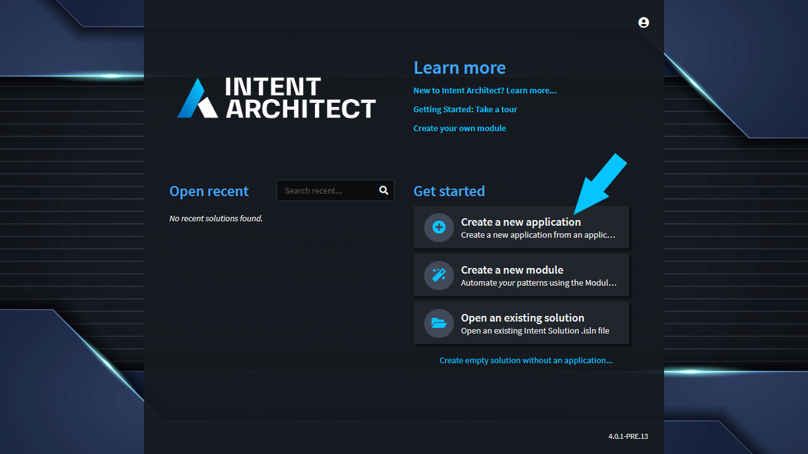

On the first screen of the wizard you can select your desired architecture. For this tutorial use the `Clean Architecture .NET` option:

* Select the `Clean Architecture .NET` application template.
* Change the application name to `SimplifiedEShopTutorial`.
* Check / change the `Location` field (this is where your Intent Architect application will be created).
* Click `Next`.

> [!NOTE]
> In this tutorial we will be using a .NET implementation of the [Clean Architecture](https://blog.cleancoder.com/uncle-bob/2012/08/13/the-clean-architecture.html) as explained by Robert C. Martin (aka "Uncle Bob"). This popular architecture promotes separation of concerns and the dependency rule to create systems that are modular, maintainable, and testable.
> If you are curious about the architecture of this solution, check out our [Webinar on Clean Architecture in .NET 7](https://intentarchitect.com/#/redirect/?category=resources&subCategory=CleanArchitectureWebinar).

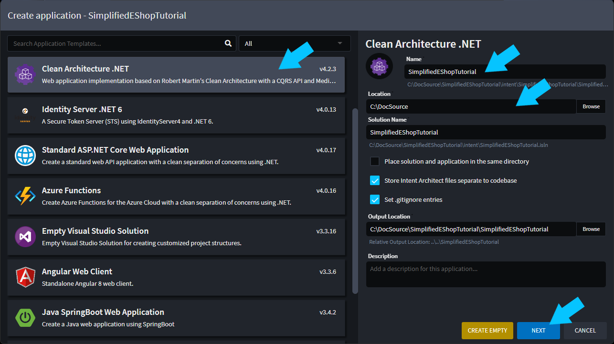

The next screen allows you to configure your selected Architecture, for this tutorial we will use the default configuration:

* Click `Create`.

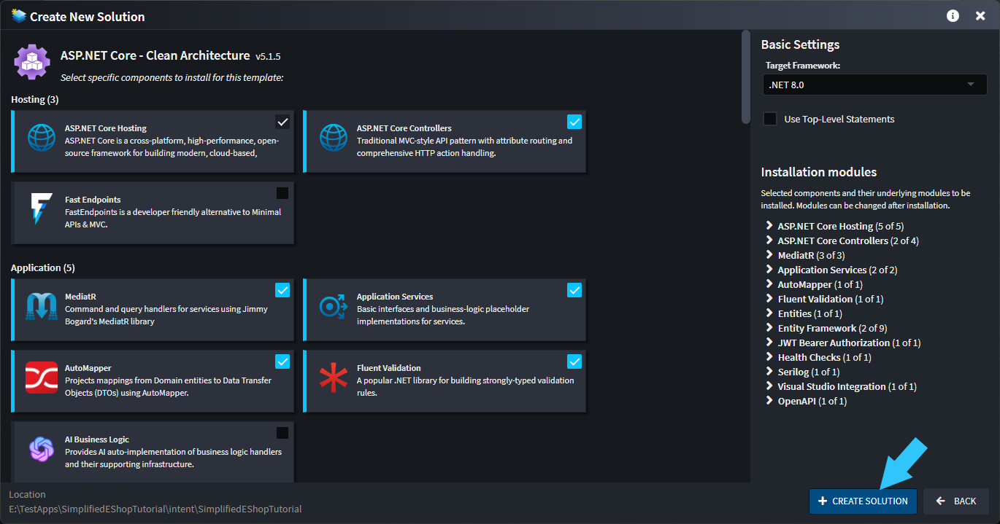

* Intent Architect will now configure your application based on your choices in the setup wizard.
* You will be navigated to the Intent Architect Solution view.
* The Application's icon in the left pane is a spinner while Intent Architect downloads and installs Modules for it.
* When the process is complete the spinner will change to a static icon and the status at the bottom left of the UI will show `Ready`.

You have successfully created an Intent Architect application.

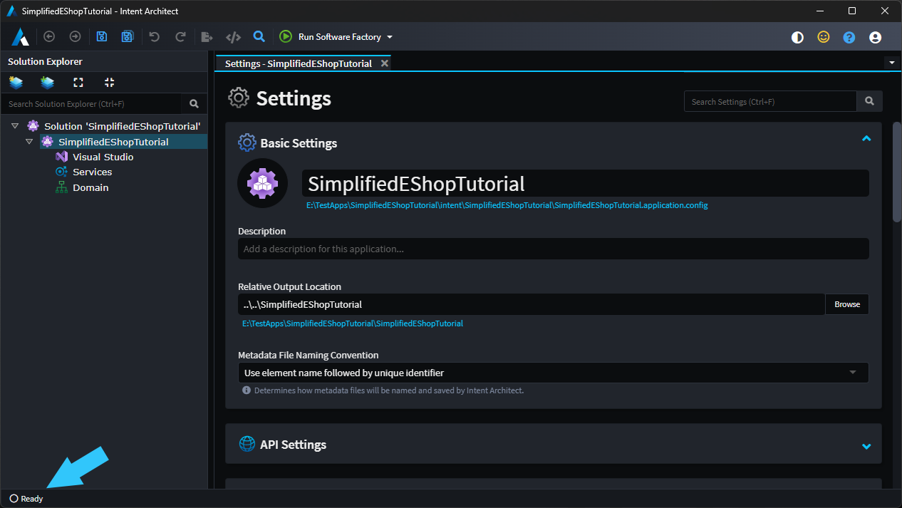

Before you start domain modeling, let's run the Software Factory so that later on when you're modeling you can see the impact of the modeling changes in isolation:

* Run the `Software Factory`, either by pressing `F5` or the button in the tool bar.
* Wait for the `Changes` view to show.
* Click `Apply Changes`.

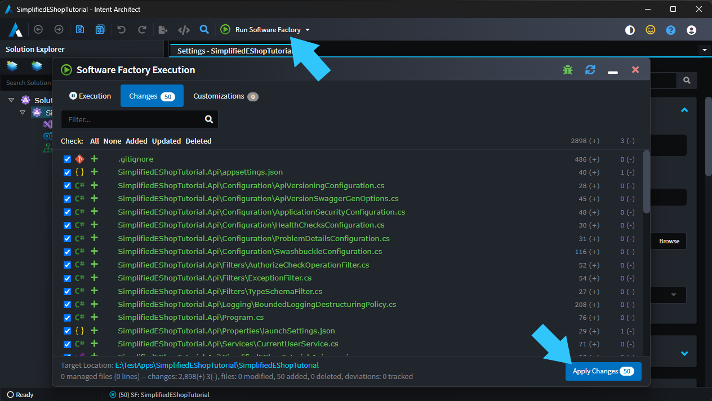

## Modeling the domain

The Microsoft `eShopOnContainers` is an e-commerce web site where customers can browse products, adding them to a shopping cart, to eventually make a purchase. Our business domain is going to reflect the problem domain concepts, here are some of the high-level ones we are going to have to model:

* **Product**, an item for sale on the website.
* **Basket**, the Customer's shopping cart, to which they are adding items as they browse the site.
* **Order**, the Customer's finalized order, when they checkout their shopping cart.

### Adding Entities

Let's start modeling out the domain:

* Open the `Domain` Designer.
* Right-click on the grid and select `New Class`.
* Type in the name, `Basket`.

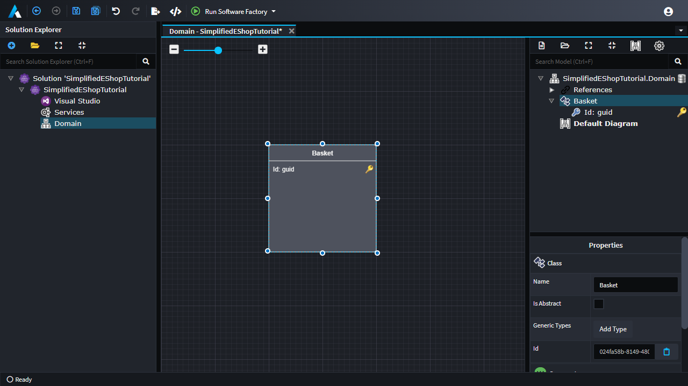

> [!TIP]
> You can dramatically speed up your modeling through the use of keyboard shortcuts:
>
> * `Ctrl` + `Shift` + `C` - Create a new class (focus must be on the Diagram).
> * `Ctrl` + `Shift` + `A` - Add a new attribute (focus must be on the Class).
> * `Ctrl` + `Enter` - Create a new "whatever I have selected".
> * `Esc` - Shift focus up a level (Attribute -> Class -> Diagram).
> * `Ctrl` + `.` - Full list of shortcuts currently available (these are context specific).

Adding more `Entity`s:

* With `Basket` selected press `Ctrl` + `Enter`.
* Type `BasketItem` as your new class's name.
* Press `Ctrl` + `Enter`.
* Type `Product` as your new class's name.
* Click and drag your classes to lay them out.

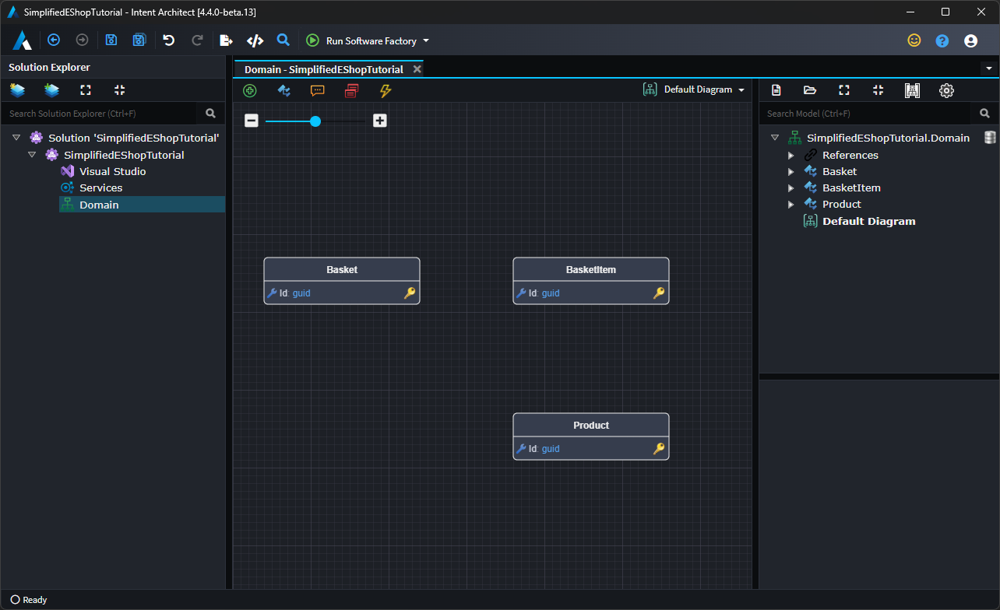

### Modeling Relationships

Now you will model the relationships between these entities:

* Right-click on the `Basket` class, and select `New Association`.
* Click on `BasketItem` .
* In the `Properties` pane, on the lower right,
  * Check `Is Collection` in the `Target End` section.
  * Uncheck `Is Collection` in the `Source End` section.

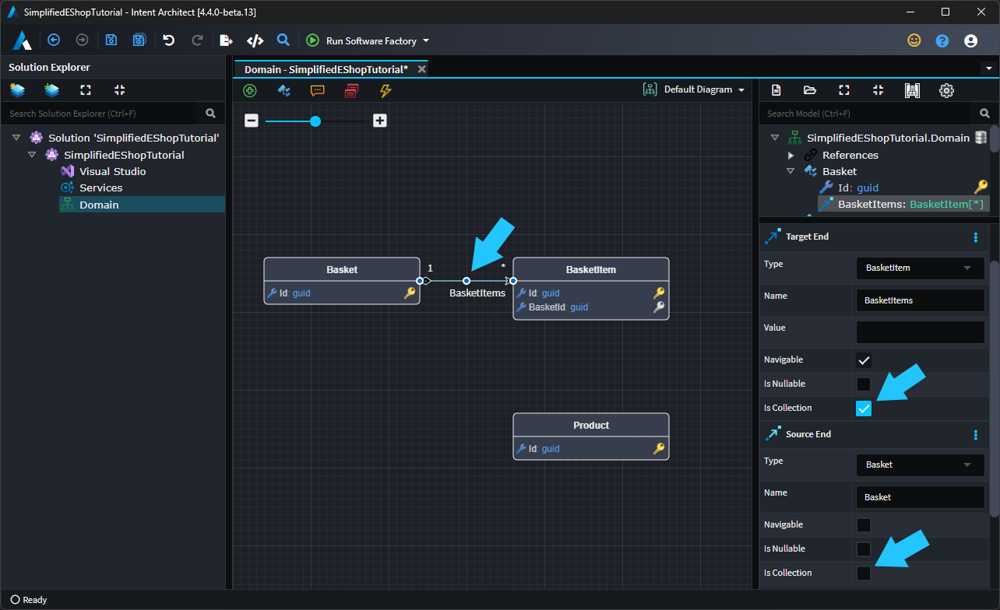

You have configured a *one-to-many* relationship, i.e. a `Basket` has many `BasketItem`s and a `BasketItem` belongs to one `Basket`.

Next let's map the association between `BasketItem` and `Product`:

* Right-click on the `BasketItem` class, and select `New Association`.
* Click on `Product`.

You have configured a *many-to-one* relationship, i.e. a `BasketItem` has one `Product` and a `Product` can be associated with many `BasketItem`s.

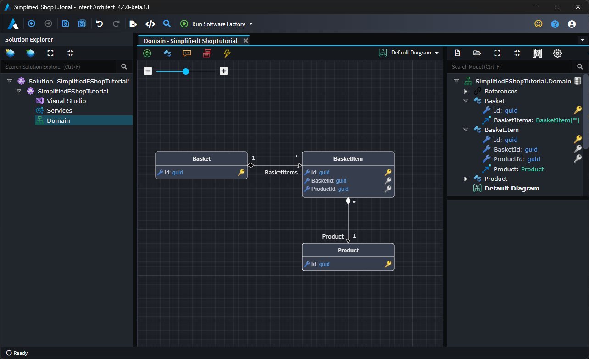

### Modeling Data

To finish these entities up, you will now model their data.

Model the `Product`:

* Right-click on the `Product` entity and select `Add Attribute`.
* Type `Name`, as the default type is `string` you can just press enter.
* To add another attribute, press `Ctrl` + `Enter`.
* Type `Description` of type `string`.
* Again, add another attribute, press `Ctrl` + `Enter`.
* Type `Price`, press `Tab`, start typing `decimal` and when `decimal` is highlighted in the drop down box, press `Enter` to apply it.

> [!TIP]
> You can use the `F2` shortcut to rename things like `Entity`s and `Attribute`s. In the case of `Attribute`s it also allows you to change the `Attribute`'s type.

Model the `BasketItem`:

* Right-click on the `BasketItem` entity and select `Add Attribute`.
* Type `Quantity`, of type `int`.
* Add another attribute, press `Ctrl` + `Enter`.
* Type `UnitPrice`, press `Tab` and select the `decimal` type.

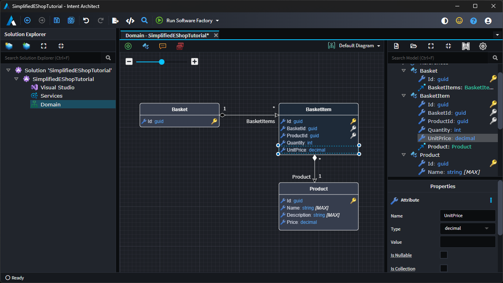

> [!TIP]
> Some other shortcuts you might find useful while modeling:
>
> * `Ctrl` + `S` - Save changes in you current Designer</br>
> * `Ctrl` + `Z` - Undo</br>
> * `Ctrl` + `Y` - Redo</br>

### Model out the rest of the design

You can go ahead and model out the rest of the domain in the same way you just modeled out the first three entities, here is what your domain should look like when you are complete:

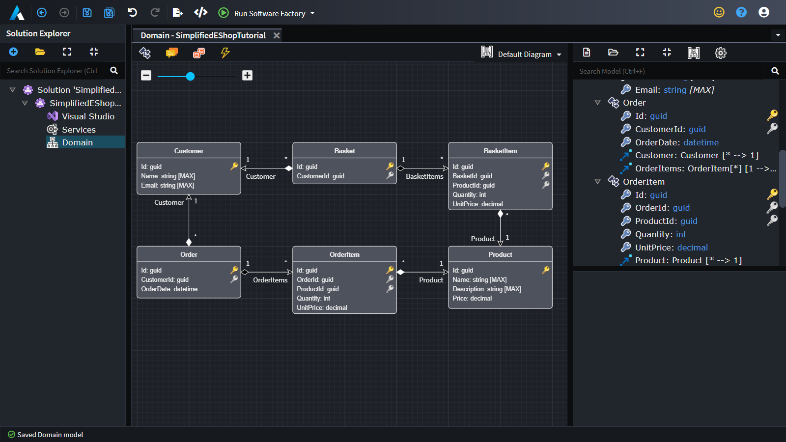

> [!NOTE]
> Even in this simple domain, there are many perfectly valid ways to model this domain. For example, `Basket` could be associated with `Order`. Here we are trying to keep the model as close to the original design where these tables are in completely separate applications and data stores.

The last thing to add to the model will be a `Status` on the order, so that our customer can see what is happening with their order.

Add an `OrderStatus` `Enum` to the model:

* In the tree-view (top right pane), right-click on root node of the tree (`SimplifiedEShopTutorial.Domain`) and click `New Enum`.
* Type in `OrderStatus` as its name.
* Right-click on `OrderStatus` and select `Add Literal`.
* Type `Submitted`, in the `Property` pane below set `Value` to `1`.
* Add two more statuses:
  * `Shipped` = `2`.
  * `Cancelled` = `3`.

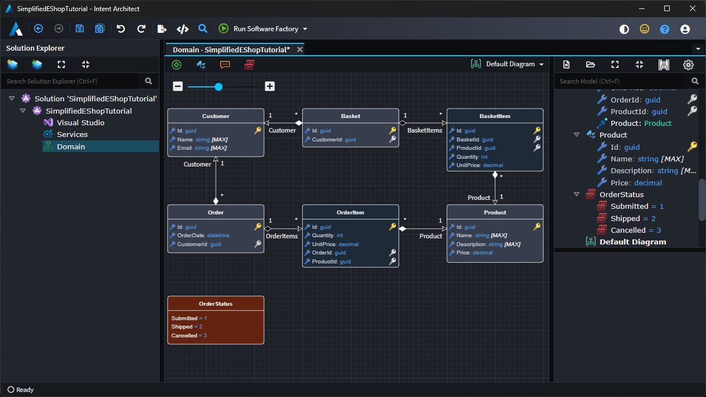

> [!TIP]
> Starting your `Enum` literal values from `1`, as opposed to `0`, is a good practice to catch "default initialization bugs" as uninitialized enums will have a value of `0`.

Add a `Status` attribute to the `Order`:

* On your `Order` entity, add an attribute named `Status` of type `OrderStatus`.

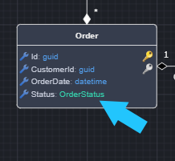

You can now apply your modeling changes to your codebase:

* Save your Modeling (`Ctrl`+ `S`).
* Run the `Software Factory` (`F5`) this will generate all the code related to your Domain Modeling.
* Feel free to review / explore the changes in the `Software Factory` Changes dialog.
* If you double-click on any of the Changes file entries, the proposed file change will be opened in the configured diff tool (by default *Visual Studio Code* will be used, if not installed then it will try use *Visual Studio*).

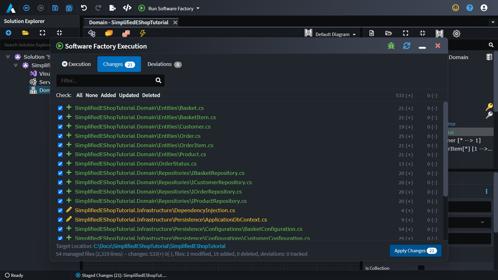

Apply the Changes:

* Click `Apply Changes`.

You have successfully modelled the domain.

## Configuring your database

When the `Clean Architecture .NET` application template was used to create your application, by default it configured it to use `Entity Framework Core` for persistence and defaulted the `Database Provider` to `In Memory`. Although still useful for testing during development, the `In Memory` Database Provider has the limitation that all persisted data is lost each time the application is stopped.

In this section you will change the application's Database Provider to `SQL Server` and then cover using *Entity Framework Core* tooling to create your application's schema in a `SQL Server` instance.

> [!NOTE]
>
> * This section is optional as the tutorial will work with the `Entity Framework Core`'s `In Memory` database provider by default.
> * You will need a [SQL Server](https://www.microsoft.com/sql-server/sql-server-downloads) instance to complete this section of the tutorial.

Let's start by changing your `Database Provider`:

* Open the application setting tab by right-clicking on the Application in the `Solution Explorer` and selecting `Settings`.
* Scroll down to the `Database Settings` section.
* Change `Database Provider` to `SQL Server`.
* Click `Save Changes` (directly under the `Database Setting` section).


Run the Software Factory to apply these changes:

* Run the Software Factory (`F5`).

The changes should appear as follows:

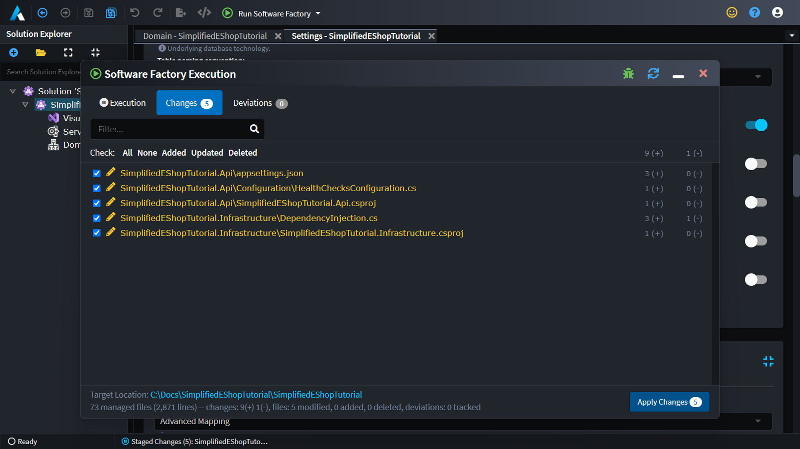

Take a look at the changes to `appsettings.json`, you will see that Intent Architect has added a default connection string for the database as follows:

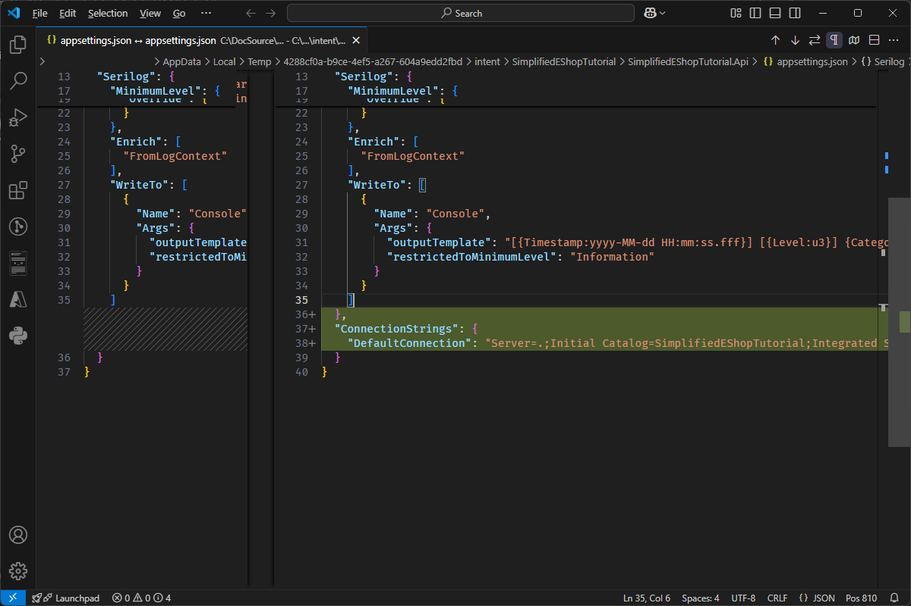

> [!NOTE]
> This connection string may need to be modified depending on your specific SQL Server set up. You can freely edit the connection string as required. The database name has been defaulted to your application name.

Apply these changes to your codebase.

* Click `Apply Changes`.

The next step is to create your application's database. To achieve this you are going to use `Entity Framework Core`'s migration system. Switch to the codebase in your C# IDE, then:

* Navigate to the `SimplifiedEShopTutorial.Infrastructure` project.
* Expand the `Persistence` folder.
* Open the `MIGRATION_README.txt` file.

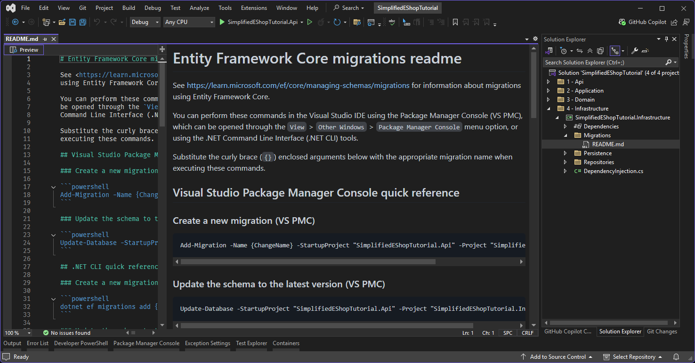

This file is an easy-to-use reference of commonly needed migration commands, pre-configured for this C# solution. Your first step will be to create a new migration:

* Find the `Create a new migration` section.
* Run the migration command, changing `{ChangeName}` to `Initial` (as EF Core's tooling ignores curly braces, `{Initial}` will also work).
  * If you are using Visual Studio, open the `Package Manager Console`. (View > Other Windows > Package Manager Console).
  * Paste the Command into the console: `Add-Migration -Name {ChangeName} -StartupProject "SimplifiedEShopTutorial.Api" -Project "SimplifiedEShopTutorial.Infrastructure"`.
  * Change `{ChangeName}` to `Initial`.
  * Press `Enter`.

At this point the `Entity Framework Core` tooling will produce the following migration code file:

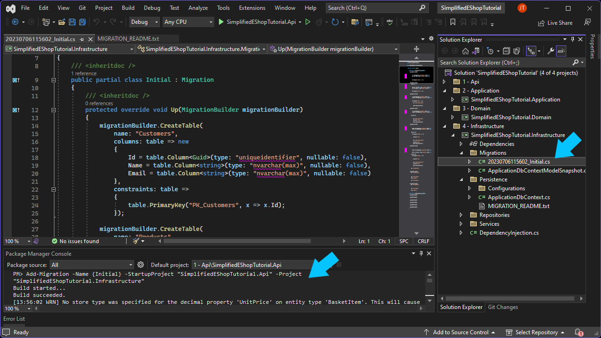

Now you can use another command to apply the migrations which will create/update the application's database schema for you:

* Find the `Update schema to the latest version` section.
* Run the migration command:
  * Again, from the `Package Manager Console`. (View > Other Windows > Package Manager Console)
  * Paste the Command onto the console: `Update-Database -StartupProject "SimplifiedEShopTutorial.Api" -Project "SimplifiedEShopTutorial.Infrastructure"`.
  * Press `Enter`.

At this point the `Entity Framework Core` tooling will connect to your SQL Server, create the database and update the schema accordingly. Using a tool like [SQL Server Management Studio](https://learn.microsoft.com/sql/ssms/download-sql-server-management-studio-ssms) to inspect the database you will see the following:

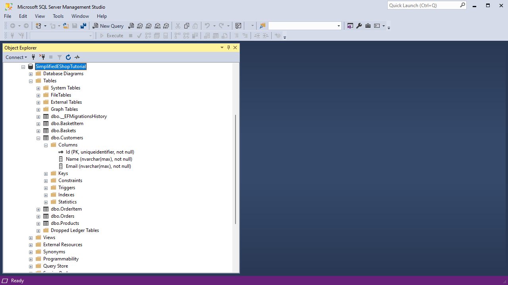

> [!NOTE]
> If you are unable to successfully run the `Update-Database` command, check that your connection string is correct and that the account being used has the required permissions. You may need specific permissions on the SQL Server instance to create a database and alter schemas. You can alternatively use the `Generate a script which detects the current database schema version and updates it to the latest` command which will generate a SQL script. The generated script can then be manually applied to the SQL Server instance using an account with the required permissions.

You have now created a SQL Server database which is based on your modeled design and configured your application to use it.

> [!TIP]
> For more information on `Entity Framework Core` migrations, check out [the official documentation](https://learn.microsoft.com/ef/core/managing-schemas/migrations/?tabs=vs).

## Modeling the services

Next up you are going to want to model the services of your application. Looking at the domain, `Customer`s and `Product`s are really just supporting data for `Basket`s and `Order`s. Given that, you can easily use Intent Architect to create CRUD services for these:

* Open the `Services` Designer.
* In the tree-view in the center pane, right-click on the root node of the tree (`SimplifiedEShopTutorial.Services`) and click `Create CQRS CRUD Operations`.
* In the dialog box select `Customer`.
* Click `Done`.

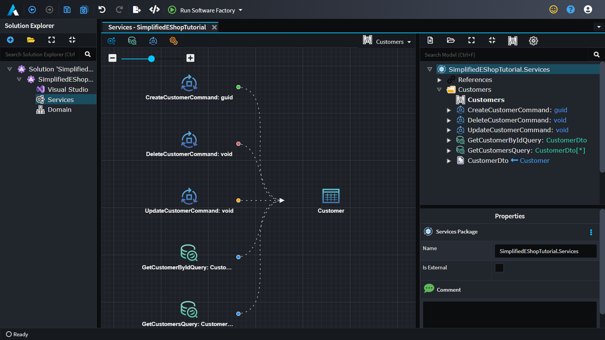

Look at what has been created, you can see a logical `Customer` service in a `CQRS` style. Intent has added all the basic CRUD operations you'd expect to see.

> [!NOTE]
> Simplifying it a bit, the CQRS paradigm is about separating server instructions into two groups:
>
> * `Commands`, these mutate / change the server's state.
> * `Query`s, these only read state, never changing it.

Your next action is to expose these commands and queries as REST endpoints:

* Click on `CreateCustomerCommand`.
* Hold down `Shift`.
* Click on `GetCustomersQuery`.
* You should have all the `Command`s and `Query`s highlighted
* Right-click on any of the highlighted items and select `Expose as Http Endpoint`.

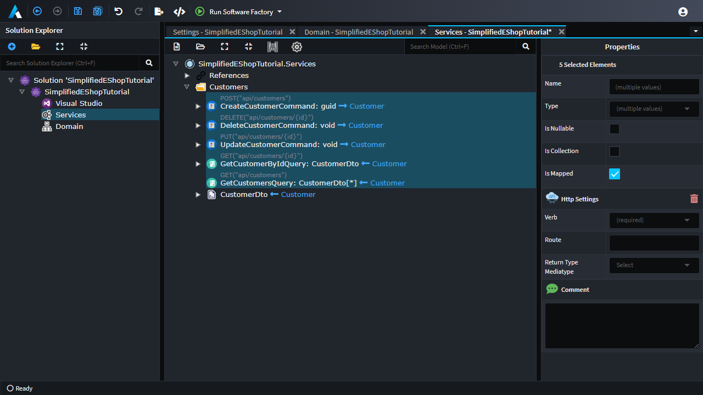

> [!TIP]
> When modeling services in Intent Architect you are modeling application level services, i.e. they are not necessarily available for remote access. In this tutorial
you have chosen to expose your services as HTTP REST endpoints.

Similarly, create a CRUD Service for `Product`s, don't forget to expose them so that we can interact with them through Swagger later on:

* Create your CRUD `Product` service, in the same way you made the `Customer` service.

The `Services` Designer should now look as follows:

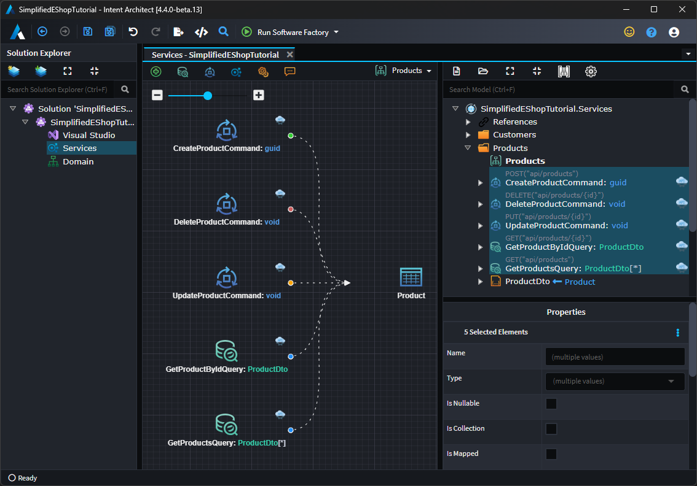

At this point, you can apply these changes and see how your modeling is translating into code:

* Save your Modeling (`Ctrl`+ `S`).
* Run the `Software Factory` (`F5`) this will produce all the code for the two services you just modeled.
* Feel free to review / explore the changes in the `Software Factory` dialog.
* Click `Apply Changes`.

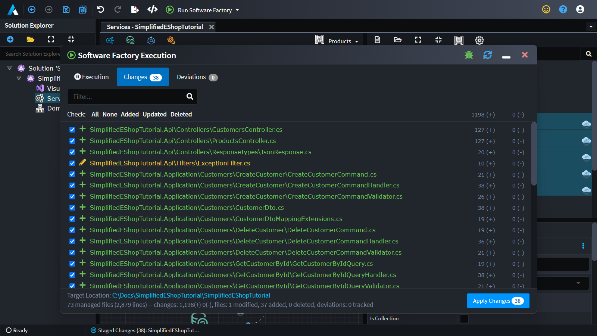

> [!TIP]
> Using Intent Architect's CRUD modules to create services can be a great productivity boost whether you are using them as-is or as a starting point to extend.

Now let's look at our `Basket` service. You can use the Intent CRUD module to create the service and then tailor it to the specific needs.

As before using the `Create CQRS CRUD Operations`, but on the `Basket` this time.
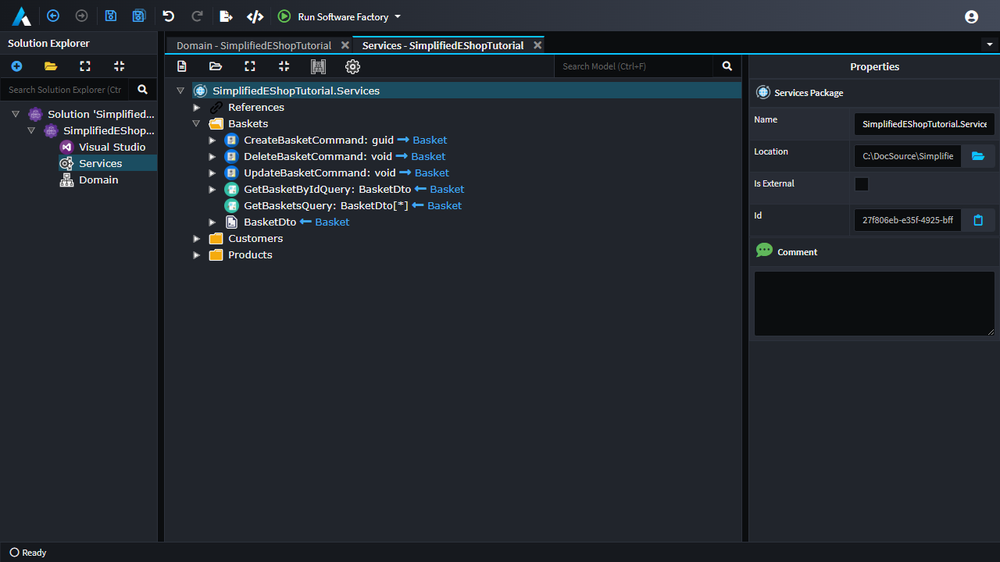

Before we look at the `Command`s, let's update the `BasketDto` to better reflect our needs :

* Right-click on the `BasketDto` and select `Map from Domain`.
* In the tree-view check `BasketItems` node.
* Click `Done`.
* Right-click on the `BasketBasketItemDto` and select `Map from Domain`.
* You can uncheck `BasketId`.
* Expand the `Product` node and check `Name`.
* Click `Done`.
* Expand the `BasketBasketItemDto` node.
* Find the `Name` field
  * Select this field.
  * Press `F2`and change its name to `ProductName`.

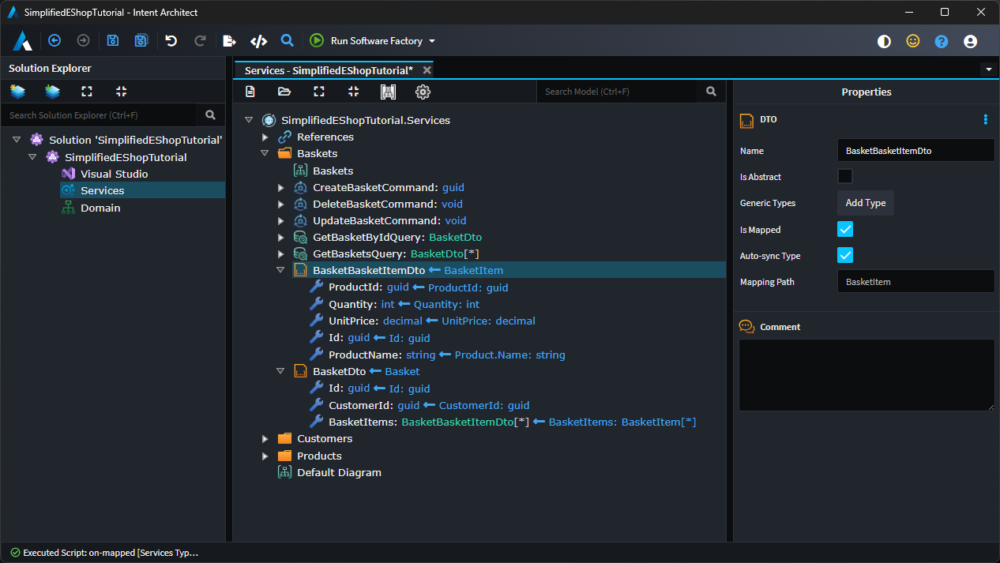

Now you can model the commands. Most of the the current `Command`s meet your requirements and you can use them as is. The customizations to the service will be as follows:

* Get rid of `GetBasketsQuery` as you don't need it.
* Replace `UpdateBasketCommand` with a new `AddItemToBasketCommand`, this feels more aligned to how a customer would interact with the `Basket`.
* Add a `CheckoutCommand` for the customer to place their order.

Remove the unwanted `Command`s and `Query`s:

* Select `GetBasketsQuery` and `UpdateBasketCommand` (you can use the `Ctrl` key to select/de-select multiple nodes ones by one).
* Press `Delete`.

Expose the remaining `Command`s and `Query`s as REST Endpoints:

* Select `CreateBasketCommand`, `DeleteBasketCommand` and `GetBasketByIdQuery`.
* Right-click on any of the highlighted items and select `Expose as Http Endpoint`.

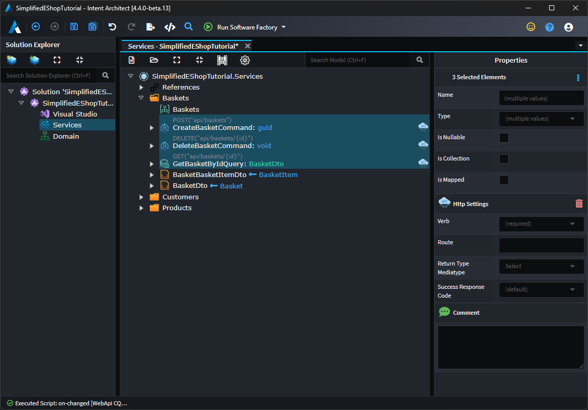

Next you are going to model the `AddToBasketCommand` command:

* Right-click on the `Baskets` folder and select `New Command`.
* Name the command `AddToBasketCommand` and return a `Guid` which will be the `Id` of the newly added `BasketItem`.
* Right-click on `AddToBasketCommand` and select `Map to Domain Data`.
* A dialog will open with an expanded dropdown menu, select `BasketItem`.
* Check the following:
  * `BasketId`
  * `ProductId`
  * `Quantity`
  * `UnitPrice`
* Click `Done`.
* Right-click on `AddToBasketCommand`, and select `Expose as Http Endpoint`.
* In the `Properties` pane, in the `Http Settings` section:
  * Change the `Route` to `api/baskets/{id}/add`.

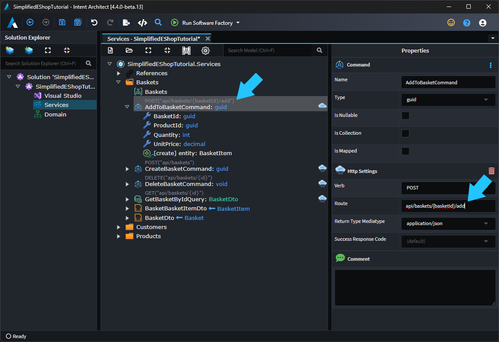

> [!NOTE]
> In the `Services` Designer we have used both `Map from Domain` and `Map to Domain Data`, both mechanisms create design time links between the Domain and Services allowing modules to be aware of these relationships. These mappings are visualized by left and right facing arrows respectively. Right facing arrows are typically used for inbound contracts like `Command`s and `Query`s. Left facing arrows are typically used for outbound contracts, which `DTO`s typically are.

Again, let's look at the results of your modeling:

* Save (`Ctrl`+ `S`).
* Run the `Software Factory` (`F5`).

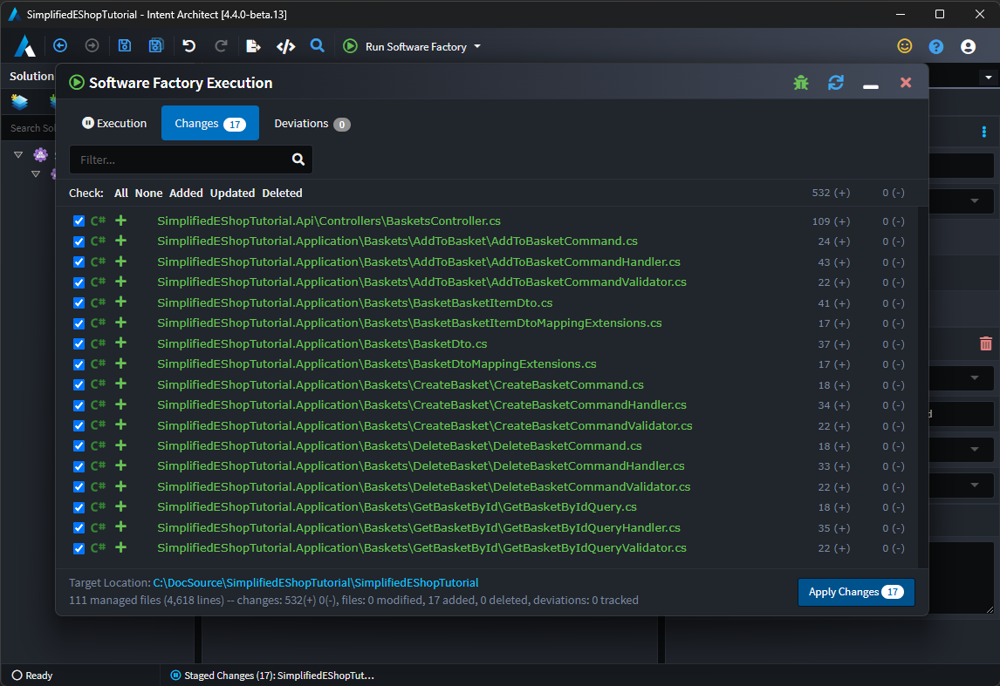

There should be a change to `AddToBasketCommandHandler`, if you double-click and inspect the change, you will notice that this class has been fully implemented for us. Here the CRUD module has figured out what you are trying to do and given you an implementation which meets your requirements.

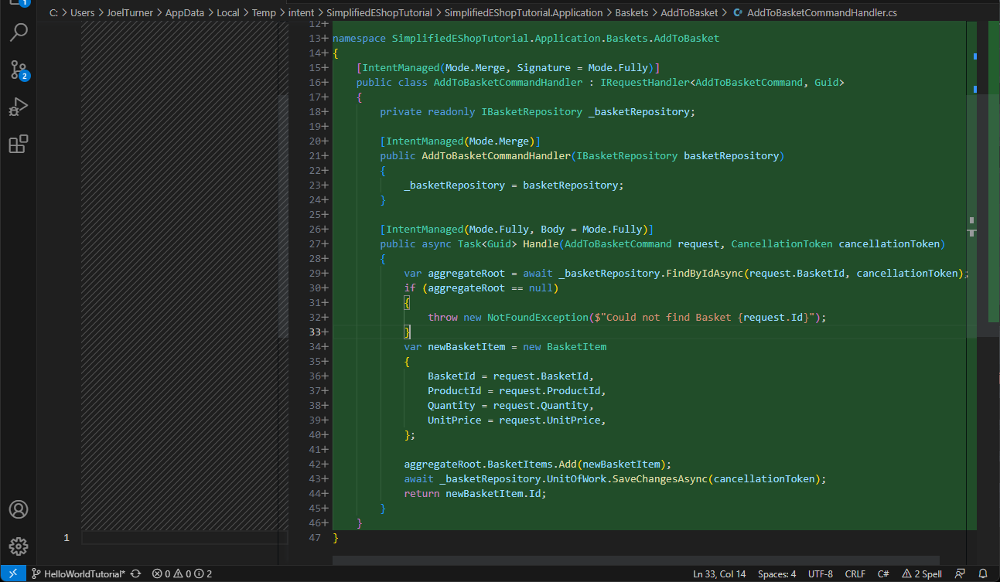

> [!TIP]
> If you were not happy with the convention-based CRUD implementation there are several ways you could opt-out. One way to do this after applying the changes is to open the file in your IDE, adjust the `IntentManged` attribute above the `Handle` method and change `Body = Mode.Fully` to `Body = Mode.Ignore`. This will instruct the Software Factory's Code Management algorithms to "Ignore" the body of the method, allowing you to change the implementation. See [Code Management](xref:application-development.code-weaving-and-generation.about-code-management-csharp) for more details.

Accept all the changes:

* Click `Apply Changes`.

To finish up the `Basket` service, you are going to create the `CheckoutCommand`:

* Right-click on the `Baskets` folder and select `New Command`.
* Name the command `CheckoutCommand` and return a `guid` which will be the identifier of the newly added `Order`.
* Right-click on `CheckoutCommand` and select `Map to Domain Data`
* A dialog will open with an expanded dropdown menu, select `Basket`.
* Check the box next to `Id`.
* Click `Done`.
* Right-click on `CheckoutCommand` and select `Expose as Http Endpoint`
* In the `Properties` pane, in the `Http Settings` section:
  * Change the `Verb` to `POST`.

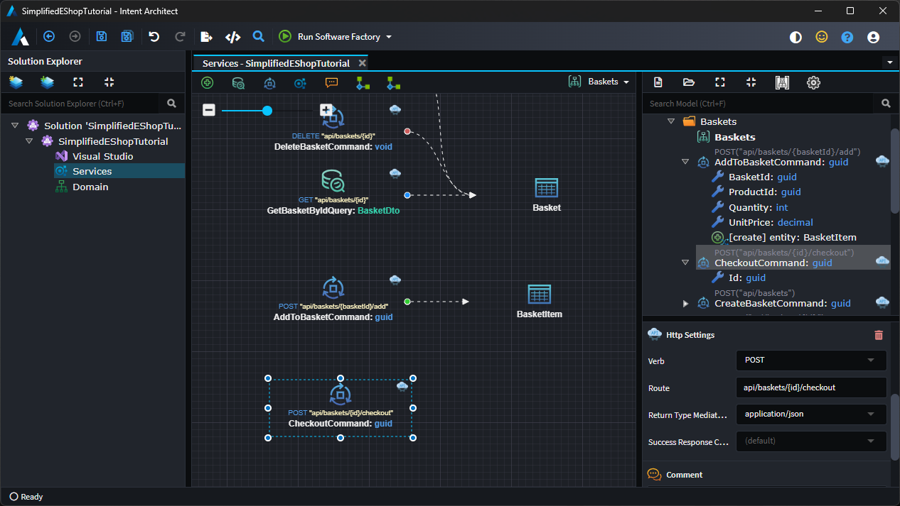

Generate the outputs:

* Save (`Ctrl`+ `S`).
* Run the Software Factory (`F5`).

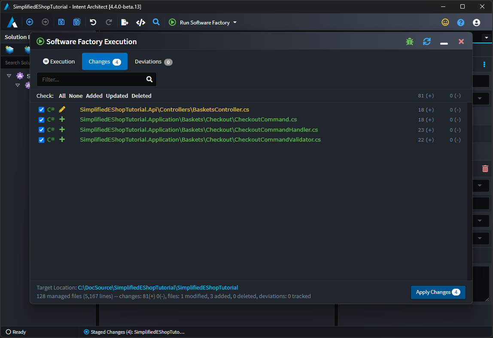

If you double-click the `CheckoutCommandHandler`, you will notice that this class needs to be implemented and that's what you will tackle next:

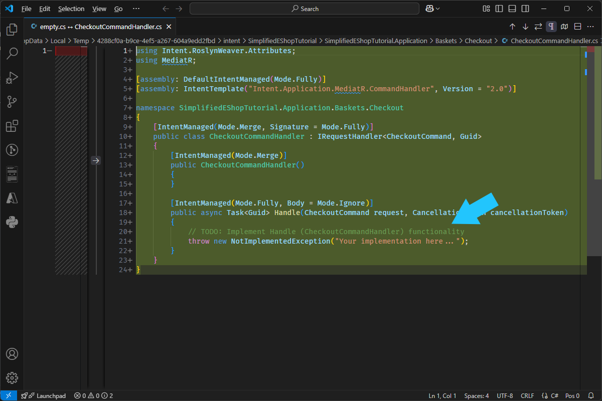

* Click `Apply Changes`.
* Click on the blue hyperlink at the bottom left of the Software Factory dialog, this should open a folder containing all the generated source code.
* Open the `.sln` file.
* Open the `CheckoutCommandHandler.cs` file.

Now you need to implement the `CommandHandler`. Basically this service should create a new `Order` based on the `Basket`. The service should also clear out the customers `Basket`, once the order is created:

* Update the code as follows:

[!code-csharp[](code/complete-CheckoutCommandHandler.cs?highlight=2,7-9,19,20,23,25,26,32-51,54-62)]

Lastly, you will want to implement an order service. This service will allow customers to view their orders. Let's create the service from scratch:

* In the tree-view in the center pane, right-click on the root node and click `New Folder`.
* Name the folder `Orders`.
* Right-click on the `Orders` folder and select `New Query`.
* Name the query `GetMyOrdersQuery`.

You will need to model the `DTO` that this `Query` returns:

* Right-click on the `Orders` folder and select `New DTO`.
* Name the DTO `OrderDto`.
* Right-click on the `OrderDto` and select `Map from Domain`.
* Select `Order` from the expanded dropdown.
* Check the following fields:
  * `OrderDate`
  * `Status`
  * `OrderItems`
* Click `Done`.
* Right-click on the `OrderItemDto` and select `Map from Domain`.
* Expand the `Product` node, check `Name`.
* Click `Done`.
* Rename `Name` to `ProductName`.

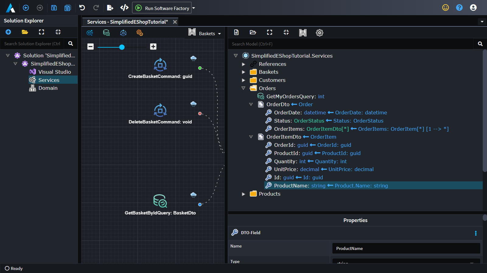

* Select `GetMyOrdersQuery`
* In the `Property` pane change
  * `Type` to `OrderDto`
  * Check `IsCollection`
* Right-click on `GetMyOrdersQuery` and select `Add Property`.
* Name it `CustomerId` of type `guid`.
* Right-click on `GetMyOrdersQuery`, and select `Expose as Http Endpoint`.
* In the `Properties` pane, in the `Http Settings` section:
  * Change the `Route` to `api/orders/my-orders/{customerId}`.

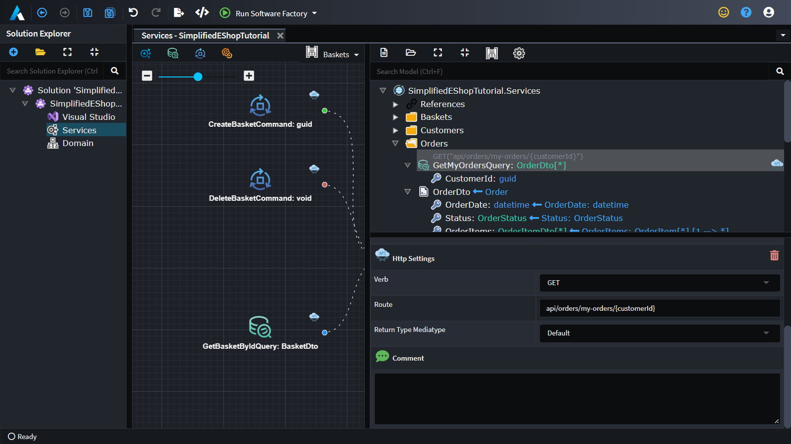

Run the Software Factory:

* Save (`Ctrl`+ `S`).
* Run the Software Factory (`F5`).

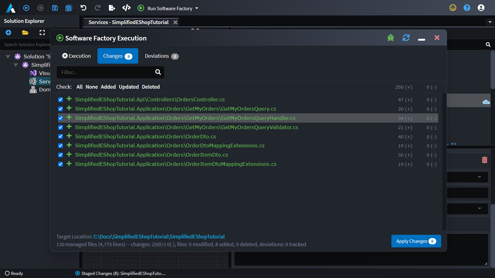

If you double-click the `GetMyOrdersQueryCommandHandler`, you will notice that there is a default implementation but it's not what you need, it's not taking into account the `CustomerId` parameter.

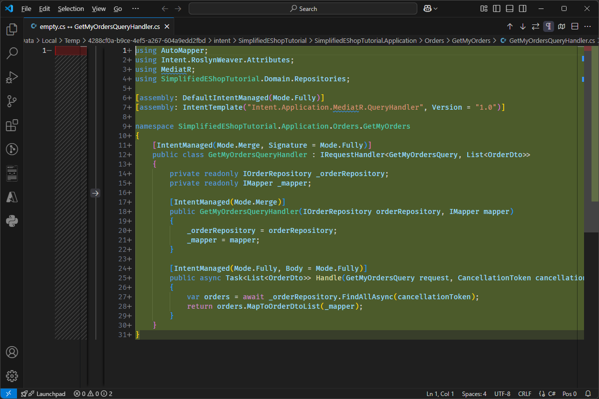

* Click `Apply Changes`.
* Open the generated solution in your C# IDE.
* Open the `GetMyOrdersQueryCommandHandler.cs` file.
* Update the code as follows:

[!code-csharp[](code/complete-GetMyOrdersQueryHandler.cs?highlight=28,31)]

## Running the Application

At this point you are done coding and you can see your application in action:

* Run the application in your C# IDE (`F5` in Visual Studio).

You should be presented with a Swagger UI as follows:

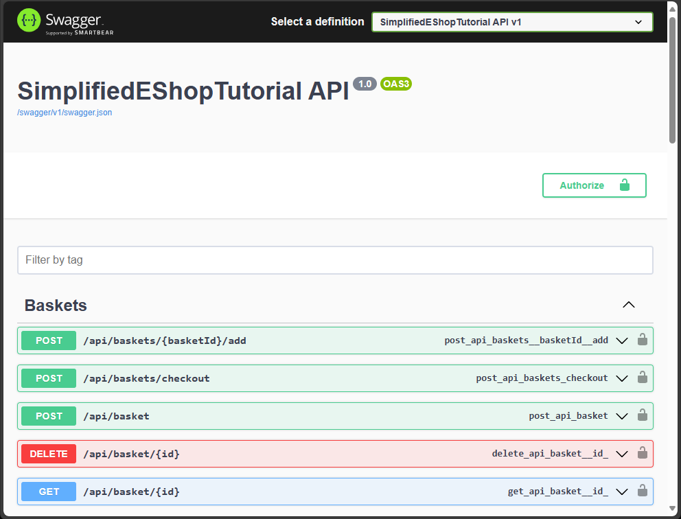

Take a look at all the endpoints, you should see all the services you designed in Intent Architect.

First thing you need to do is create a Customer:

* Click on the `POST /api/customers` row in the Customers section.
* Click the `Try it out` button on the right hand side.
* In the `Request Body` JSON fill in:

```json
{
  "name": "Customer1",
  "email": "Customer1@example.com"
}
```

* Click the big blue `Execute` button.

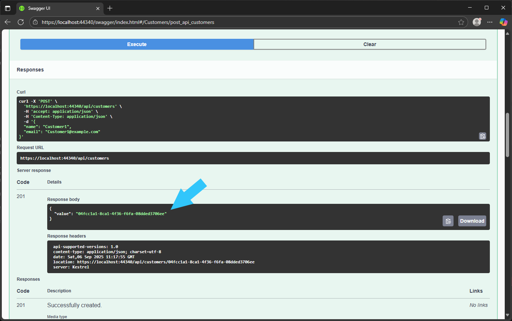

* Record the `CustomerId` response as you will need it later.

In a similar fashion you can create a `Product` using the `POST /api/products` row in the Products section. Don't forget to record your `ProductId` so you can use it later.

Next let's create the customer's shopping cart:

* Click on the `POST /api/baskets` row in the Baskets section.
* Click the `Try it out` button on the right hand side.
* In the `Request Body` JSON fill in (replacing `{CustomerId}` with your customer's Id ):

```json
{
  "customerId": "{CustomerId}",
}
```

* Click the big blue `Execute` button.
* Record the `BasketId` response as you will need it later.

Let's add an item to the basket:

* Click on the `POST /api/baskets/{id}/add` row in the Baskets section.
* Click the `Try it out` button on the right hand side.
* Fill in your `BasketId` in the `Id` field.
* In the `Request Body` JSON fill in (replacing the relevant Ids):

```json
{
  "basketId": "{BasketId}",
  "productId": "{ProductId}",
  "quantity": 3,
  "unitPrice": 150
}
```

* Click the big blue `Execute` button.

Let's check the `Basket` has updated:

* Click on the `GET /api/baskets/{id}` row in the Baskets section.
* Click the `Try it out` button on the right hand side.
* Fill in your `BasketId` in the `Id` field.
* Click the big blue `Execute` button.

You should get a result similar to this:

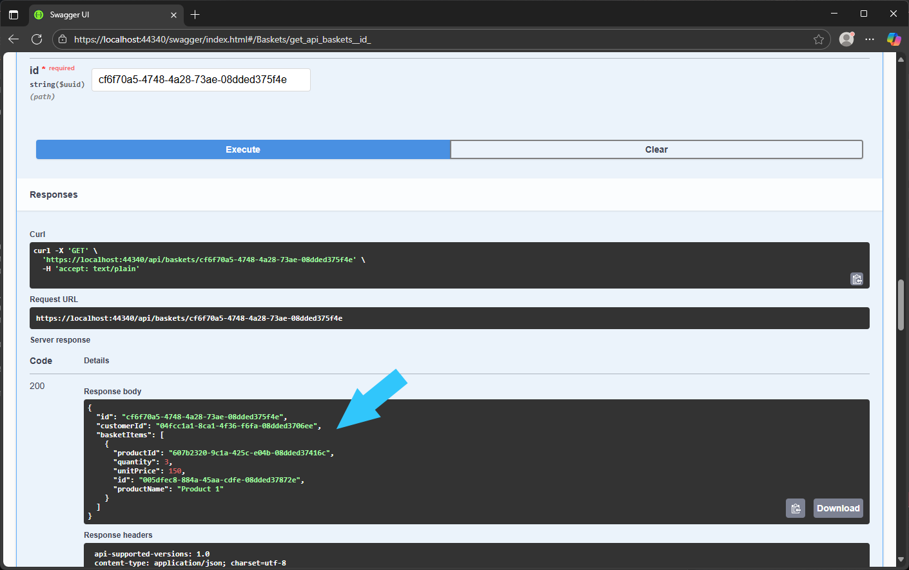

Now you can Checkout your `Basket`:

* Click on the `POST /api/baskets/{id}/checkout` row in the Orders section.
* Click the `Try it out` button on the right hand side.
* Fill in your `BasketId` in the `id` field.
* Click the big blue `Execute` button.

Query the customer's `Order`s to confirm it's been placed:

* Click on the `GET /api/orders/my-orders/{customerId}` row in the Orders section.
* Click the `Try it out` button on the right hand side.
* Fill in your `CustomerId` in the `customerId` field
* Click the big blue `Execute` button

You should get a result similar to this:

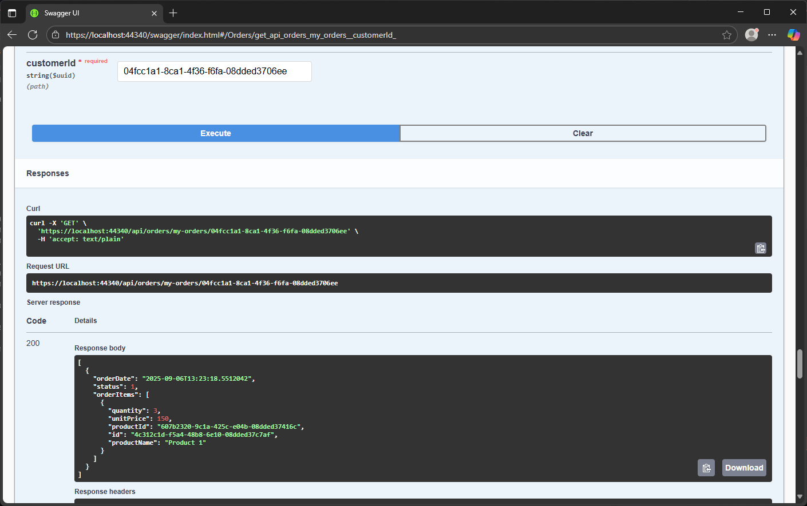

## Securing your services

Configuring security on your services is next on the list, for the purposes of the tutorial we'll just look at securing the `Product` endpoints, but these principles should be applied throughout your application as required.

From inside of Intent Architect:

* Open up the `Services Designer` and expand the `Products` folder.
* Select all the `Command`s and `Query`s (`CreateProductCommand`, `DeleteProductCommand`, etc.).
* Right-click and select `Apply Stereotype` (`F3`).
* In the dialog window, choose the `Authorize` Stereotype.

Note the Visual indicators in the `Service Designer` indicating which service endpoints are secured.

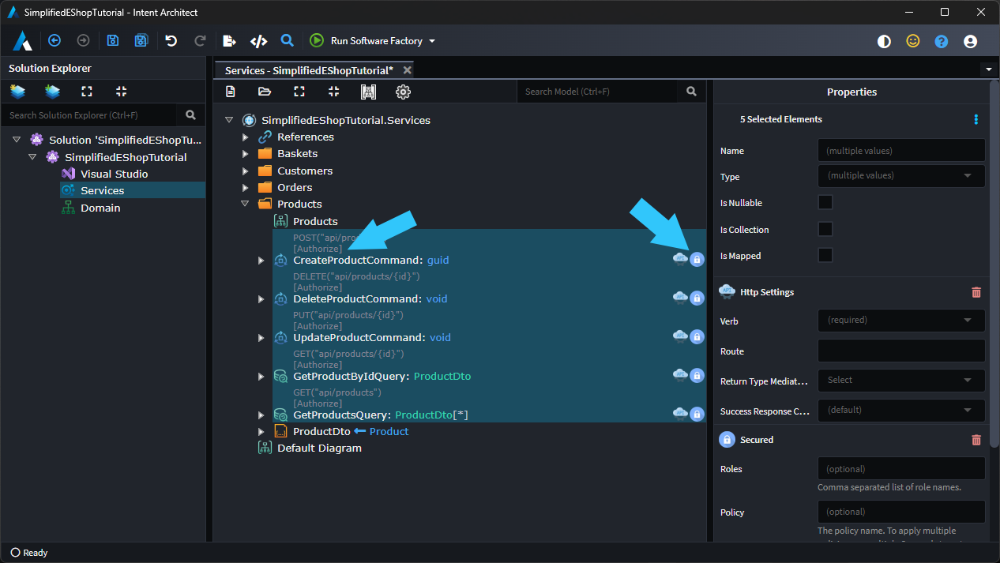

These services will be created as secured endpoints, that is to say they can only be accessed with a valid [JSON Web Token (JWT)](https://en.wikipedia.org/wiki/JSON_Web_Token). We can also apply more fine grained security or authorization through the use of roles. Let's lock down the `Command`s so that only product administrators can access these endpoints:

* Select all the product `Command`s (`CreateProductCommand`, `DeleteProductCommand` and `UpdateProductCommand`).
* In the `Properties` pane on the right hand side, in the `Authorize` section, set Roles to `ProductAdministrator`.
* Save (`ctrl`+`s`).


> [!TIP]
> You can specify multiple roles as a comma separated list.

The `Command` endpoints now not only require consumers to have a valid JWT, but the token must contain the appropriate role for the request to succeed.

Let's apply the changes and see how it affects the code base:

* Run the Software Factory (`F5`).

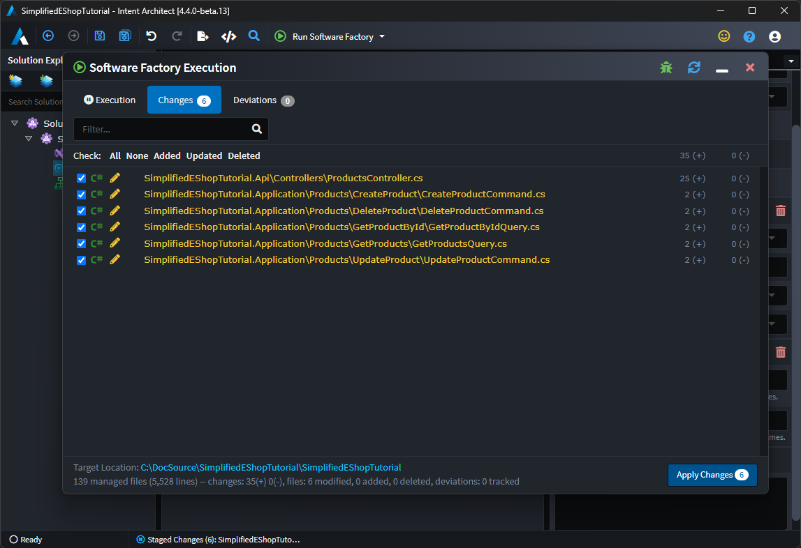

Let's take a closer look at the `ProductsController` changes:

* Double-click on the `ProductsController`.

Here you can see the standard `ASP.NET Core` controller `Authorize` attributes being applied to the controller operations as per your modelled design. Also note that the controllers are now being decorated with the appropriate attributes to indicate that they can now return 401 and 403 HTTP error codes.

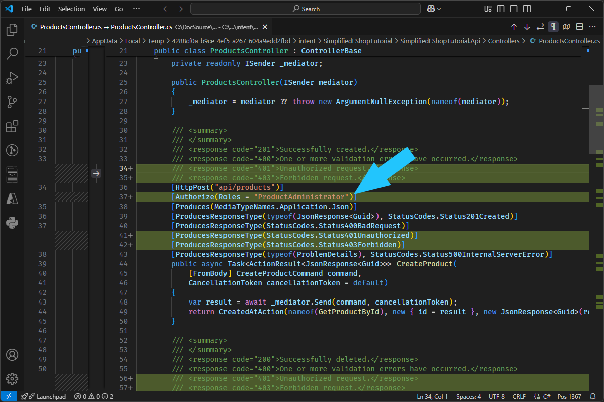

* Click `Apply Changes`.

> [!NOTE]
> You may have noticed in the code that the `Authorize` attributes are not only applied to the `Controller`s, but also to the `Command`s and `Query`s themselves. Security checks are applied at both the `Controller` and the `MediatR` pipeline entry points. This means that any `Command`s and `Query`s processed through the `MediatR` pipeline have the appropriate security applied, even if they do not originate from the `Controller`s.

Attempting to access these endpoints through the Swagger UI without providing a valid JWT will result in the following:

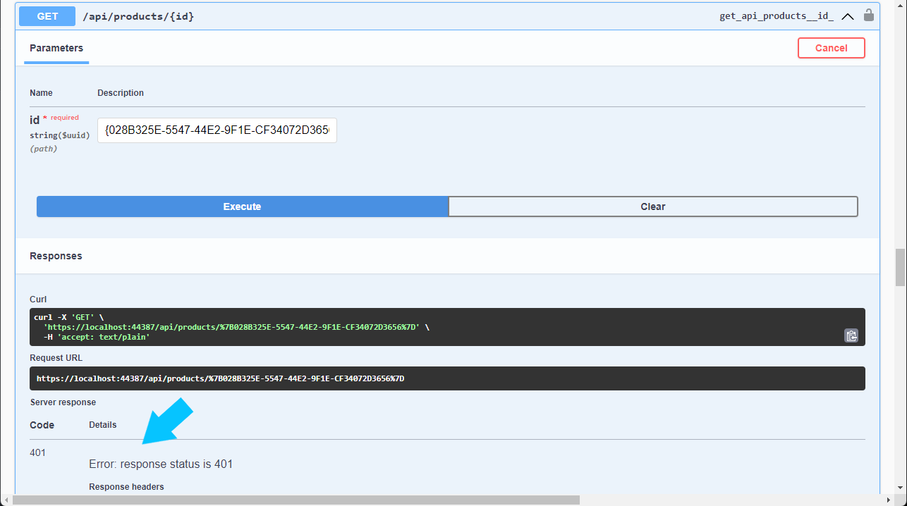

## Next steps

Congratulations, you have built an application using Intent Architect!

We will have more Tutorials like these out in the future.

We also have a series of [webinars](https://www.youtube.com/@IntentArchitect) covering various many facets of Intent Architect.

## Additional related resources

* [Intent Architect Webinar on Clean Architecture in .NET 7](https://intentarchitect.com/#/redirect/?category=resources&subCategory=CleanArchitectureWebinar)
* [Intent Architect Webinar on Domain Modeling in .NET](https://intentarchitect.com/#/redirect/?category=resources&subCategory=Domain-Modeling-Webinar)
