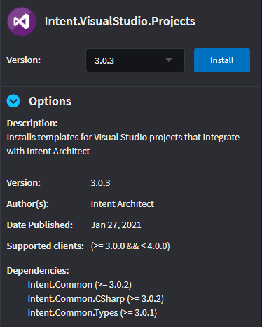
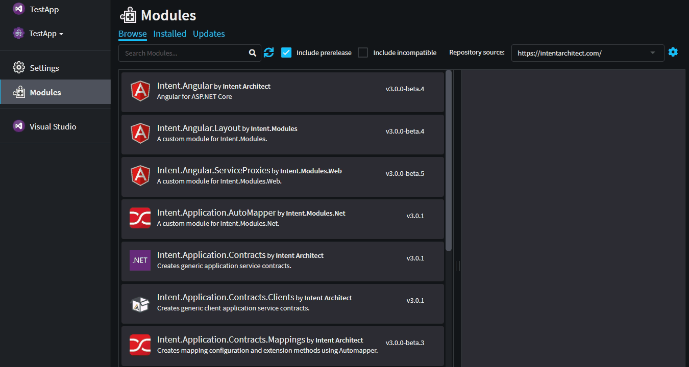
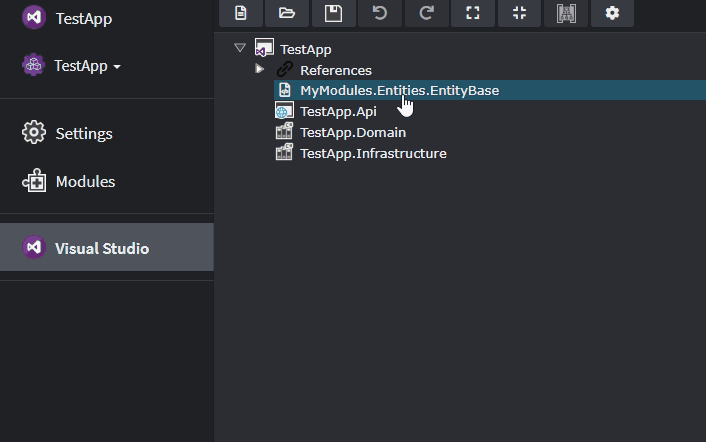

# Install and run the Module

When creating Modules it is often very useful to have a _test_ Application that we can use to test that our Modules are working correctly. This tutorial explains how to create this _test_ Application and how to install and run the Module we created in the [previous tutorial](xref:tutorial/creating-modules-net/create-a-simple-module).

## Create an empty Application
>[!NOTE]
>If you have already created an Application to install your module, you can skip this section and jump straight to the [Install the Module](#install-the-module) section.

To get started, let's create an empty Application.
1. From the home view, click `Create a new application`.
2. Set the Application's name, location and Solution name. _NOTE: You can ignore which Application Template is selected. It won't affect an empty application._
3. Click `CREATE EMPTY`.
4. When prompted with a confirmation, click `YES` to continue.
5. Close the `Application Installation` dialog.

>[!NOTE]
>We typically create Applications with an [Application Template](xref:how-to/create-an-application-template). Empty Applications are useful when there isn't an Application Template that fulfils our needs.

## Set up Visual Studio projects
Application's need a way to know where to output specific code files. Since we're working in .NET we can install the `Intent.VisualStudio.Projects` - a module that installs a Designer to configure our project structure.

To install this module we must navigate to the `Modules` tab within our application.
1. Search for the `Intent.VisualStudio.Projects` Module by typing "visual" into the filter.
2. Select the Module.

3. In the details pane, Click `Install` to install the latest version.

4. Intent Architect will install the module and it's dependencies. Close the `Installation Manager` once it's finished.

You may have noticed that a new `Visual Studio` Designer was installed into our Application. It will allow us to structure the C# projects in our codebase. For this tutorial, we can set up a typical web application project structure which separates Domain, Infrastructure and Api concerns.

1. Click on the `Visual Studio` Designer
2. Create a new `Visual Studio Solution` package by clicking on the `CREATE NEW PACKAGE` button.
3. Fill in the name of the Visual Studio solution, then click `DONE`.
4. Next, create a set of projects by right-clicking on the new Visual Studio Solution package and selecting the project type. We will create an `ASP.NET Core Web Application` and two `Class Library (.NET Core)` projects in this tutorial.

The application structure should look as follows:

5. To create this project structure, run the Software Factory Execution. Intent Architect should stage the changes as follows:

6. Finally, click `APPLY CHANGES` to instruct Intent Architect to create the files in our codebase.

>[!NOTE]
>
## Install the Module

Next, let's install the Module we created in the [previous step](xref:guide/creating-modules-net/create-a-simple-module). To do this we first navigate to the `Modules` tab of our Application.

The default repository for our Modules is still set to the Intent Architect website. This means that we're only able to search for Modules created by the Intent Architect team. Let's change this so that our default repository is the folder where our `MyModule.Entities` was created.

1. Open [User Settings](xref:how-to-guides/change-user-settings).
2. Add a new Repository with a unique `Name` (e.g. "My Modules") and `Address` to the full location of the folder where our Module was created (e.g. `C:\Dev\MyModules\Intent.Modules`).
3. Reorder the repositories so that this new one is at the top.
4. Click `Save`.

5. Select the new Repository from the Repositories dropdown. The `MyModules.Entities` Module should now show.
6. Install the Module.

You many have noticed that the `Installation Manager` mentioned an _Unassigned template_ that was created. 

This is important because it's telling us that we need to assign our `MyModules.Entities.EntityBase` template to an output location. This is done in the `Visual Studio` Designer.

1. Navigate to the `Visual Studio` Designer.
2. Drag the `MyModules.Entities.EntityBase` Template Output into the `TestApp.Domain` project.

We've now told Intent Architect to place our `EntityBase` template in the `TestApp.Domain` project.

>[!NOTE]
>Assigning Template Outputs can be configured to happen automatically when we install a Module. We [use Roles to achieve this](xref:how-to-guides/auto-assign-template-outputs).

## Run the Module
We've created a project structure, installed our Module, and set the Output Target to our `TestApp.Domain` project. We're now ready to run our Module.

1. Run the Software Factory Execution.
2. Note the changes.
3. Click the `APPLY CHANGES` button.
4. Open the codebase to verify that the new `EntityBase.cs` file was created in the correct location.

## Debugging the Module

## What's Next

#### [Extend metadata with Stereotypes]()
[Templates per model](xref:guide/creating-modules-net/templates-per-model)

#### [Extend Templates with Decorators]()
