# The "Hello World" tutorial

## Overview

This tutorial is designed to to give you a feel for what Intent Architect can do, and let you experience the common work flows of the tool. This tutorial covers the basics of:

* Creating an Intent Architect application
* Configuring your Architecture
* Designing your application through modeling
* Realizing your designs as code

By the end of the tutorial you will have built a complete ASP.NET Core web application, implemented using `Clean Architecture` design patterns, with some basic use cases.

This tutorial should take around 5 minutes.

## Create your first Intent Architect application

* Open Intent Architect.
* Click `Create a new solution`.


On the first screen of the wizard you can select your desired architecture. For this tutorial select the `ASP.NET Core - Clean Architecture` option.

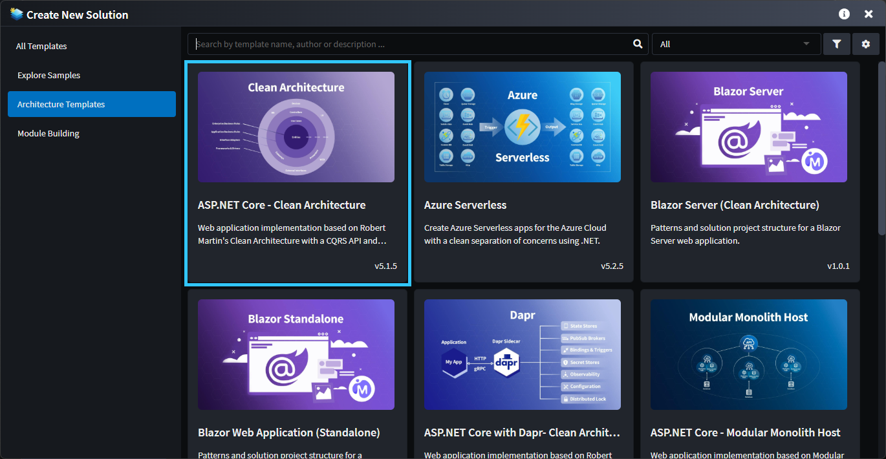

In the `Create New Solution` screen, give your solution and application the name `HelloWorldTutorial`. 

* Click `Select Components`.

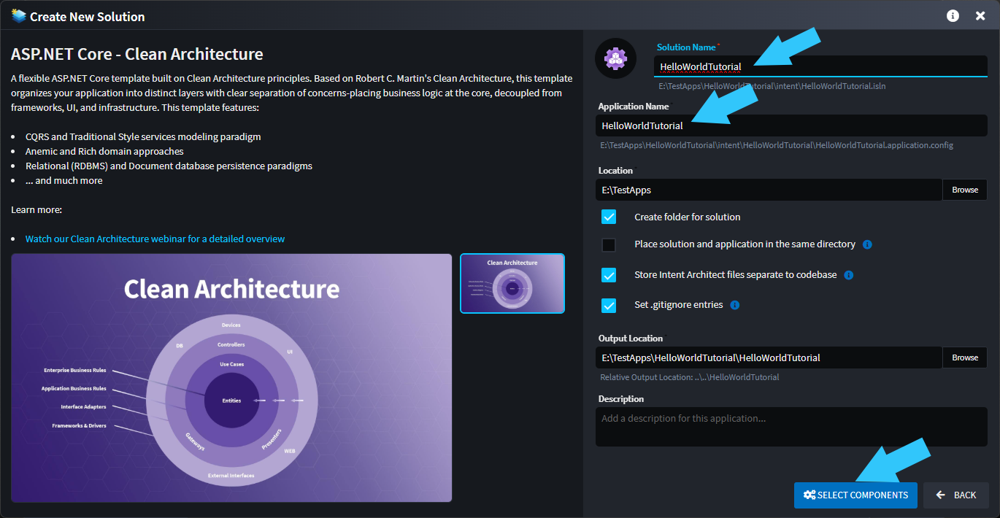

This screen allows you to configure your selected Architecture, for the tutorial you are just going to use the default configuration.

* Click `Create`.

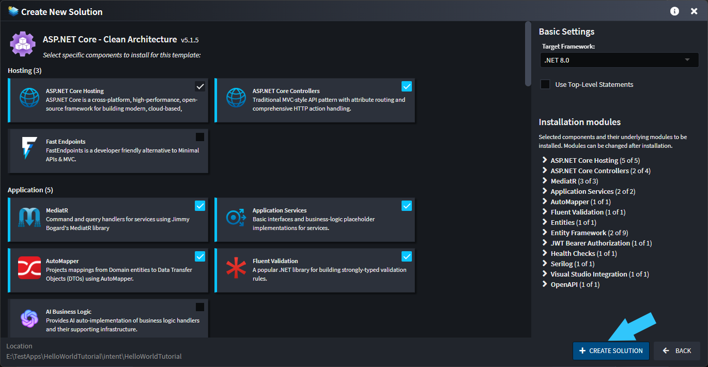

* Intent Architect will now configure your application based on your choices in the setup wizard.
* You will be navigated to the Intent Architect Solution view.
* The Application's icon in the left pane is a spinner while Intent Architect downloads and installs Modules for it.
* When the process is complete the spinner will change to a static icon and the status at the bottom left of the UI will show `Ready`.

You have successfully created an Intent Architect application.


Next you will be designing the more functional aspects of your application, starting with Domain modeling.

## Model your domain

The `Domain` Designer is where you model your business/problem domain (the concepts that exist in your problem space, what data they have, how are they related, etc.).

* Open the `Domain` Designer.

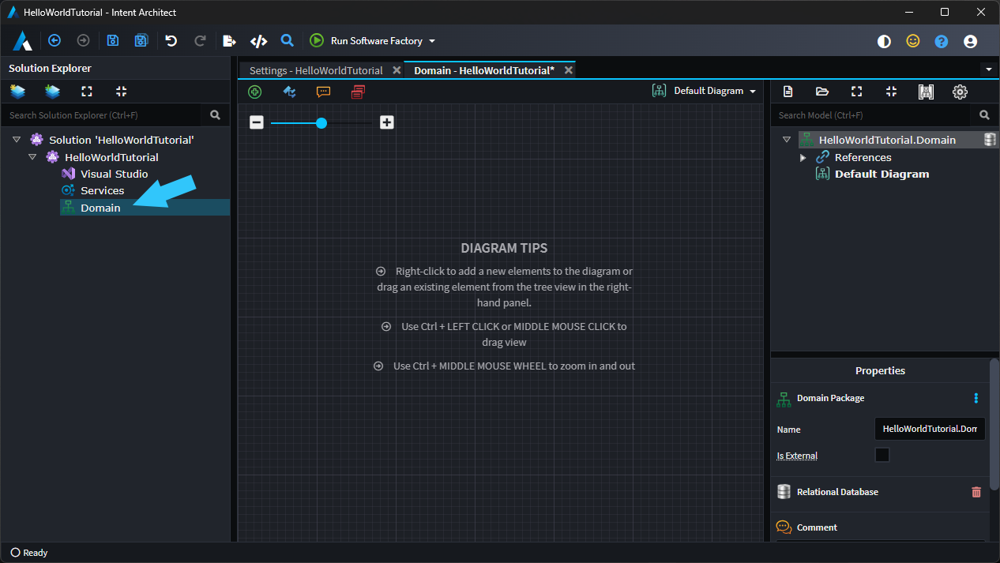

* Right-click anywhere on the grid, and select `New Entity`.
* Change the name to `Planet`.
* Right-click on the `Planet` entity, and select `Add Attribute`.
* Name the attribute `Name` of type `string`.
* Save the domain (`ctrl`+`s`).


> [!NOTE]
> This is the simplest domain model possible for the purposes of the "Hello World" tutorial. Real world domain models are much more complex and interesting. If you want know more about domain modelling check out our [Intent Architect Webinar on Domain Modeling in .NET](https://intentarchitect.com/#/redirect/?category=resources&subCategory=Domain-Modeling-Webinar).

Next you will be moving onto the `Services` Designer.

## Model your services

In the `Services` Designer you describe your application services, which is the contract for how your application can be interacted with. This Designer also allows you to define which services are remotely accessible and how they are exposed.

* Open the `Services` Designer.

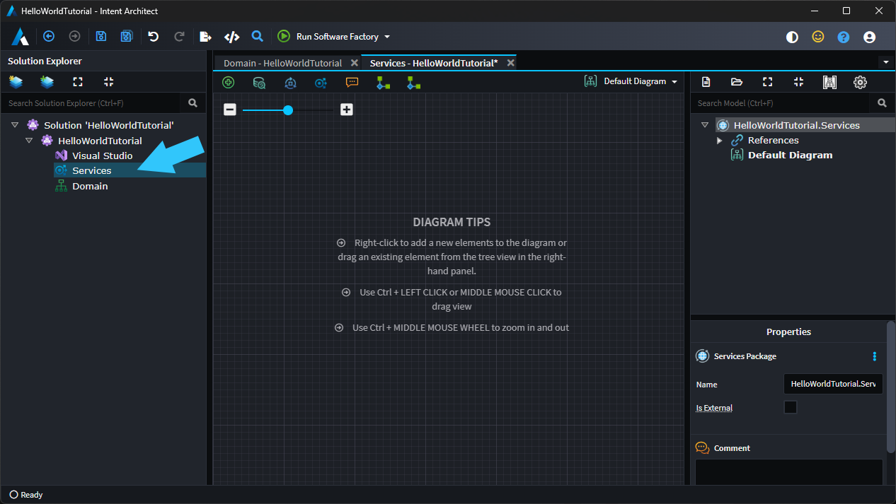

Lets create a service for your `Planet` entity.

* Right-click anywhere on the grid, and select `Create CRUD CQRS Operations`.
* In the dialog window
  * Select `Planet` from the `Entity for CRUD operations` dropdown.
  * Click `Done`.

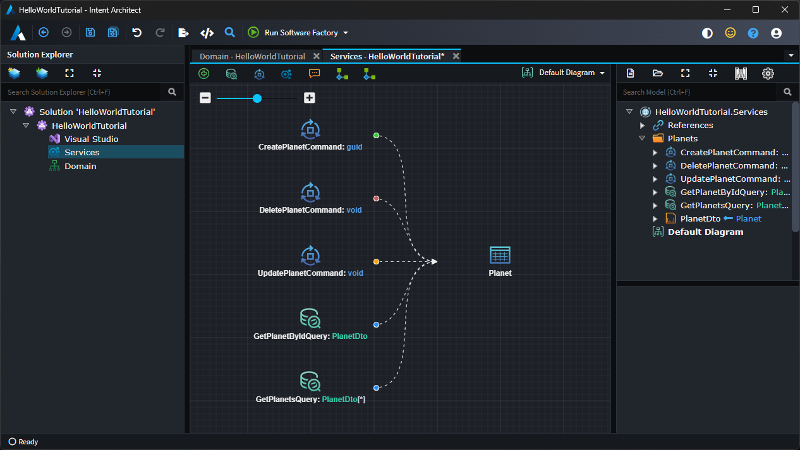

Intent Architect has created a minimalist CQRS style service for you with basic CRUD operations for your `Planet` entity.

> [!NOTE]
> The `ASP.NET Core - Clean Architecture` template has installed an optional CRUD feature, which is what you used to quickly create service definitions and it will create default convention-based service implementations for you. This is a feature which can be used as is, embraced and extended or skipped all together.

These service operations are currently only available within the application, your next step will be to expose these operations as a RESTful API.

In the tree-view on the right-hand side:

* Click on `CreatePlanetCommand`.
* Hold down `Shift`.
* Click on `GetPlanetsQuery`.
* You should have all the `Command`s and `Query`s highlighted.
* Right-click on any of the highlighted items and select `Expose as Http Endpoint`.
* Save the Services (`ctrl`+`s`).

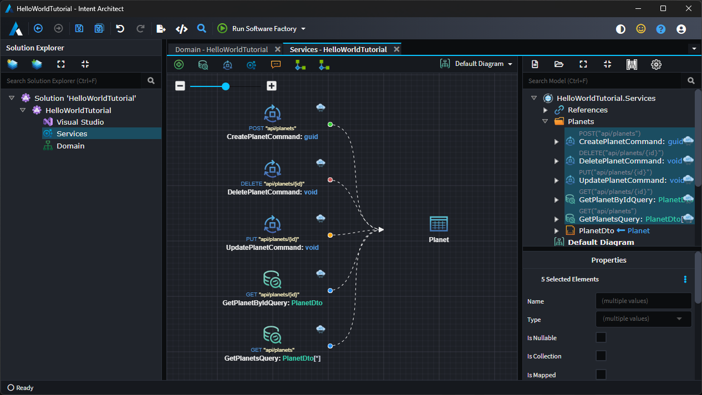

All the `Command`s and `Query`s should now be decorated with REST verbs and routes.

That's designing done, and now you are going to have Intent Architect realize this design as source code.

## Integrate your design into your codebase

In Intent Architect there is a process called the `Software Factory`, this process is responsible for:

* Materializing your design as code
* Integrating that code into you codebase

So, lets see it in action.

* Click `Run Software Factory` (or press `F5`).

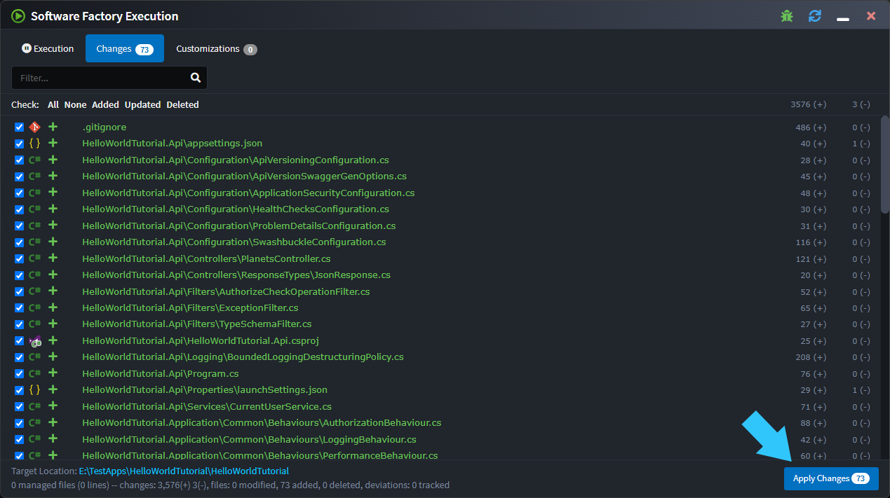

This dialog is presenting you a view of what Intent Architect wants to change in your codebase, giving you an opportunity to review it.

* Click `Apply Changes`.


At this point Intent Architect has generated all the code to fulfill your design.

* Click on the blue hyperlink at the bottom left of the Software Factory dialog.
* This will open a folder containing all the generated source code.

> [!NOTE]
> Because there wasn't an existing codebase Intent Architect has scaffolded the entire solution. Intent Architect is not merely a scaffolding tool, it is a continuous codebase integration tool, i.e. as you make incremental design changes in Intent Architect it is able to integrate these changes back into the existing codebase on a continuous basis.

Now you can open up the solution in your C# IDE.

* Open the `.sln` file.

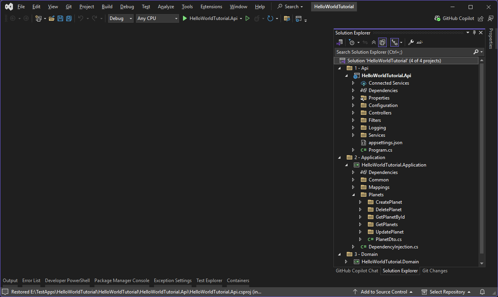

> [!TIP]
> If you are curious about the architecture of this solution, check out our [Intent Architect Webinar on Clean Architecture in .NET](https://intentarchitect.com/#/redirect/?category=resources&subCategory=CleanArchitectureWebinar).

## Run the application

Run the application in your IDE and you should be presented with a Swagger based UI which you can use to interact with the application.

In the UI you can see the 5 service operations you modeled earlier and you are now able to invoke them


Time to create your first `Planet`.

* Click on the `Post` operation.
* Click on `Try it out`, right hand side of screen.
* Update the `name` property in the Request body to `hello world`.

```json
{
  "name": "hello world"
}
```

* Click the big blue `Execute` button.

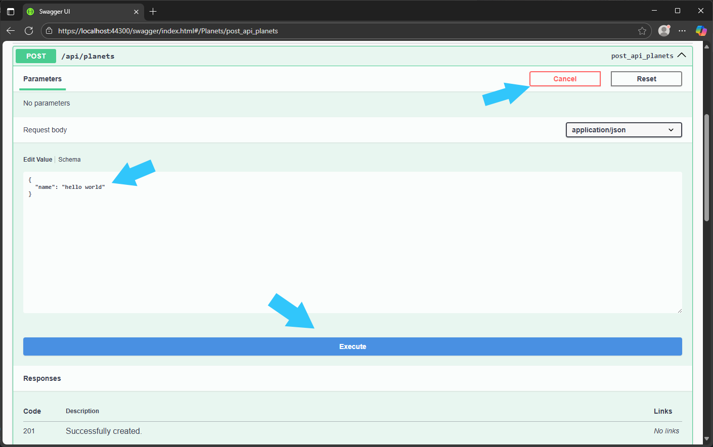

If you scroll down a little you should see a `Server Response` with a code of `201` and in the response body there will be a `guid` which is the `Id` of your newly created `Planet` entity.

If you'd like to verify this:

* Copy to `Planet` id.
* Click on the `GET` operation, with route `/api/planets/{id}`.
* Click on `Try it out`, right hand side of screen.
* Paste the `Planet` id in the `id` text-box.
* Click the big blue `Execute` button.

You should get a response similar to this:

```json
{
  "id": "cf40c444-7dc6-462e-b9c1-5c9e4b8719f7",
  "name": "hello world"
}
```

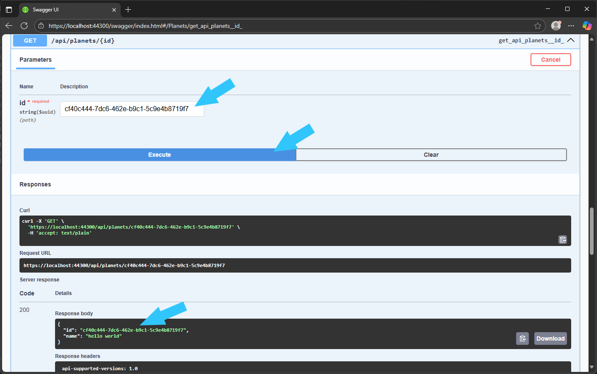

**Congratulations!** You have successfully built your first application using Intent Architect.

At this point you should have some sense of what Intent Architect can do:

* Rapidly build applications.
* Configure your application architecture.
* Visually design your application and domain through modeling.
* Achieve better architectural adherence and consistency through automation.

## Next steps

The next tutorial will take you step by step through building a simplified version of the Microsoft `eShopOnContainers` technology example.

[Tutorial 2: Build an Application](xref:tutorials.building-an-application)

## Additional related resources

[Intent Architect Webinar on Clean Architecture in .NET](https://intentarchitect.com/#/redirect/?category=resources&subCategory=CleanArchitectureWebinar)

[Intent Architect Webinar on Domain Modeling in .NET](https://intentarchitect.com/#/redirect/?category=resources&subCategory=Domain-Modeling-Webinar)
