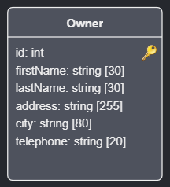
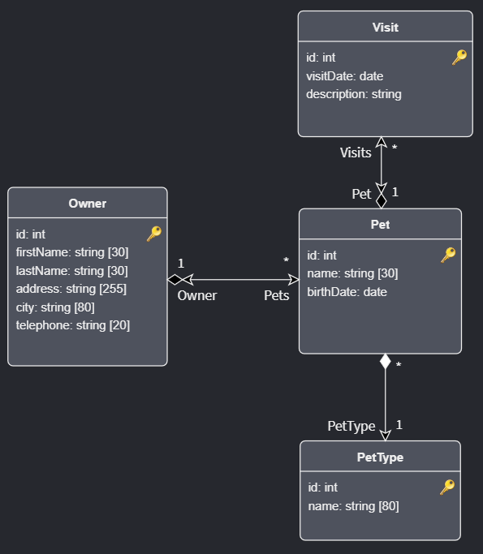
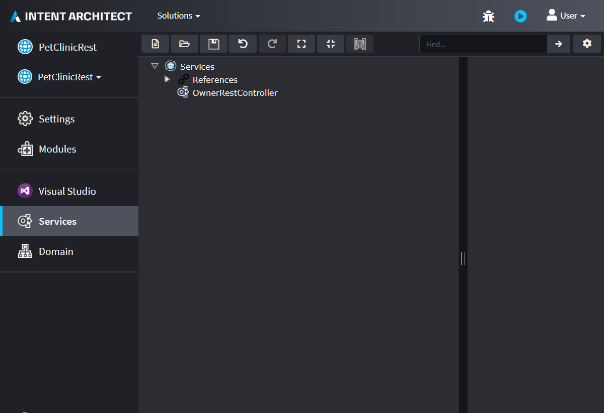

# Create Pet Clinic for the .NET C# Technology Stack

## Prerequisites

- Ensure Intent Architect has been [installed](xref:getting-started.get-the-application).
- The latest [Microsoft Visual Studio for Windows/Mac](https://visualstudio.microsoft.com/), [JetBrains Rider](https://www.jetbrains.com/rider/download/) or any other IDE capable of working with .NET Core projects.

## Create a Sample Pet Clinic Application

On the home screen click `Create a new application`.

Choose the .NET 5.0 Core Application Template.
Fill in a `Name` (such as `PetClinicRest`), review/change the `Location` as desired and click `NEXT`.

You can glance over the modules that it wants to install but you can just continue to click on `CREATE`.

An `Application Installation` dialogue will pop up showing the progress of downloading and installing Modules and Metadata for the Application, once it's finished it will show `Process complete.` and you can click the `CLOSE` button:

<video style="max-width: 100%" muted="true" loop="true" autoplay="true" src="videos/create-new-app.mp4"></video>

## Setting up the Domain

Starting off, we want to create the Pet Clinic domain since this will form part of the core application logic and how we will persist the data in the backend.
Click on the `Domain` designer located on the left panel.

You will be prompted with a dialog box asking you for a name for this Domain package. You can go ahead and create with the Default name.

<video style="max-width: 100%" muted="true" loop="true" autoplay="true" src="videos/create-domain-package.mp4"></video>

### Creating the Domain Entities

In this little Pet Clinic application, there will be the concept of a `Pet` that needs to `Visit` a `Vet` and a `Pet` belongs to an `Owner`.

Add a `Pet` Entity by right clicking on the diagram and selecting `New Class` _or_ you can even right click on the tree-view (on the right hand side) on the `Domain` package item and also selecting `New Class`.

Add the following fields to this `Pet` Entity by also right clicking on the `Pet` diagram element _or_ on the `Pet` tree-view element and then selecting `Add Attribute`.

Add the attributes:
 * `id` of type `int`
 * `name` of type `string`
 * `birthDate` of type `date`

<video style="max-width: 100%" muted="true" loop="true" autoplay="true" src="videos/create-entity-pet.mp4"></video>

Before the `Pet` is complete, there are two minor adjustments that would need to be made to help indicate to the backend persistence layer (i.e. the Database) that the `id` attribute will act as a `Primary Key` and another concern is to limit the length of the `name` field to 30 characters. This can be achieved by adding [Stereotypes](xref:references.stereotypes) to Class attributes.

To do this, right click on the attribute and select `Add Stereotype`. This will present a list of stereotypes for you to add. Select the `Primary Key` stereotype from the list.

Next select the `name` attribute and add the `Text Constraints` stereotype.
Once added, you will need to specify the `Max Length` to be 30.

<video style="max-width: 100%" muted="true" loop="true" autoplay="true" src="videos/add-pet-stereotypes.mp4"></video>

Next, create an Entity `Owner` and supply the fields:
 * `id` of type `int` (Primary Key)
 * `firstName` of type `string` (Max Length: 30 characters)
 * `lastName` of type `string` (Max Length: 30 characters)
 * `address` of type `string` (Max Length: 255 characters)
 * `city` of type `string` (Max Length: 80 characters)
 * `telephone` of type `string` (Max Length: 20 characters)

This is how it should look like:

Next you need to add a "has a" association so that an `Onwer` would have one-or-many `Pets`.
To do this, you need to start with the `Owner` Entity and right click on it and selecting `New Association`.
Notice that a dynamic arrow will appear, starting from the `Owner` entity and following your mouse cursor. Left click on the `Pet` Entity in order to finalize the association. It will now show a straight line with a many-to-one association. This is not the association that you are looking for, instead click on that arrow line and move your attention to the right-hand panel. In the `Target End` you need to ensure that the `Is Collection` is checked and in the `Source End` you need to ensure that the `Navigable` is checked and the `Is Collection` is not.

<video style="max-width: 100%" muted="true" loop="true" autoplay="true" src="videos/add-owner-pet-association.mp4"></video>

>[!NOTE]
>To learn more about these associations, visit [this article](xref:references.domain-designer.associations) for more information.

As an exercise to the reader, try to create the following diagram:

### Creating Services

Now that you have defined your domain, it would be useful to be able to interact with it especially from an API Services perspective.
Click on the `Services` designer located on the left panel.

You will be prompted with a dialog box asking you for a name for this Services package. You can go ahead and create with the Default name.

<video style="max-width: 100%" muted="true" loop="true" autoplay="true" src="videos/create-services-package.mp4"></video>

In this designer you will notice that its more simple to work with than the Domain designer since all we need to do is setup Services and their Data Contracts (usually referred to as DTOs - or Data Transfer Objects).

Start off by creating a `OwnerRestController` service in the `Services` package by right clicking on the `Services` package and selecting `New Service`.
It should look like this:

Before we continue with adding Service operations, let's first define a few Data Contracts that will give structure to our Service operations.
Let's create a new Package and call it `DTOs`.
Right click somewhere in the background and select `Create new package`. Give it the name `DTOs`. Click on the `Save` button. Click on the References section of the `Services` package and select the newly created `DTOs` package. Click on `Save` again.

<video style="max-width: 100%" muted="true" loop="true" autoplay="true" src="videos/create-services-dtos-package.mp4"></video>

Go ahead and right click on the `DTOs` package and create a new `DTO`. Name the DTO, `OwnerDTO`. To preempt the rest, create also the following:
 * `PetDTO`
 * `PetVisitDTO`

It should look like this in the end:

The next section will outline some of the features of Intent Architect which entails doing Domain to DTO mapping.

Starting with the `PetVisitDTO`, right click on it and select `Mapping...`
Click on the dropdown saying `Select an element to map from`.
Notice that you will now see all your Domain Entities in that dropdown.
Choose the `Visit` Entity.
Select only the top-most attributes to map from.

<video style="max-width: 100%" muted="true" loop="true" autoplay="true" src="videos/service-mapping-pet-visit.mp4"></video>

