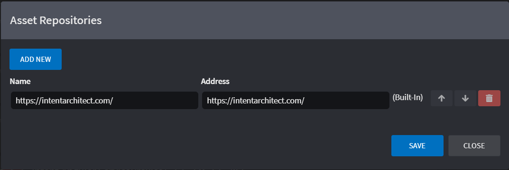

# About Asset Repositories

Repositories are locations where Intent Architect will scan for Modules and Application Templates based on a given context (global, solution or application levels). See this [how-to](xref:applications.how-to-manage-repositories) to know how to manage according to the relevant level.

The Name represents a user friendly descriptor for the Repository where as the Address can be a file storage location, internet address or even a Windows Network location.

Add the repository by clicking on the `ADD NEW` (or `ADD REPOSITORY` from the user settings dialog) button below the list of repositories.

Repositories can be reordered, with the top one being the default. The order of the list also determines the order in which repositories will be searched when restoring modules in an Application. Changing the order can be done by clicking the up and down arrows in line with the repository.
