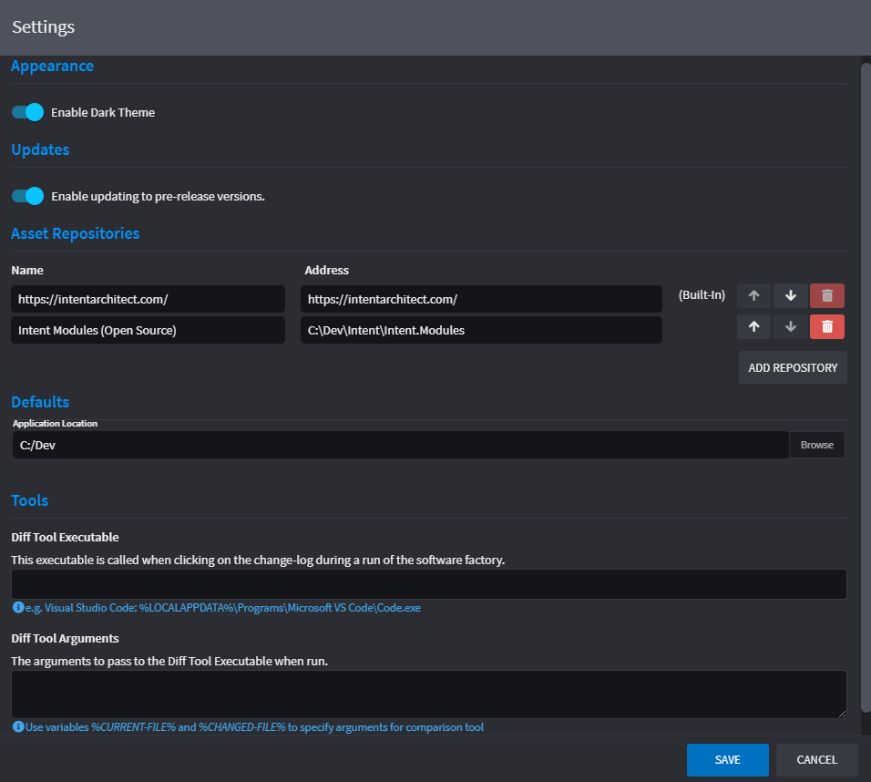

# How to change user settings

To access the user settings:

1. Click your user Display Name dropdown at the top right-hand corner of the screen.
2. Click on `Settings`

## Dark theme

Choose between dark theme or light. By default Intent Architect will use your operating systems' theme settings.

## Updates

From time to time, Intent Architect may release pre-release versions of the product. To be notified and able to update to a new pre-release, enable the `Enable updating to pre-release versions` toggle. It is recommended that you keep this setting disabled as pre-releases can be less stable than official ones.

## Asset Repositories

Asset Repositories represent the default available repositories that are searched when discovering Modules and Application Templates. By default the Intent Architect server is available [https://intentarchitect.com], which hosts all the official Open Source modules.

Repositories can also point to local folders and network locations, and can be overridden at the Intent Solution level and Application level. Local folders need to be fully qualified for User Settings, but can be relative locations for Intent Solutions and Applications.

To add another repository, click the `ADD REPOSITORY` button below the list of repositories.

Repositories can be reordered, with the top one being the default. The order of the list also determines the order in which repositories will be searched when restoring modules in an Application. Changing the order can be done by clicking the up and down arrows in line with the repository.

## Default Application locations

This is the default location that Intent Architect will use when creating a new Application from the home view.

## Diff Tools

Intent Architect supports the use of any Diff tool that can be executed from the CLI. By default (if blank), Intent Architect will use Visual Studio Code if it has been installed. It will fall back to using Visual Studio, and finally, if neither can be found, a Diff tool will need to be specified manually here.
