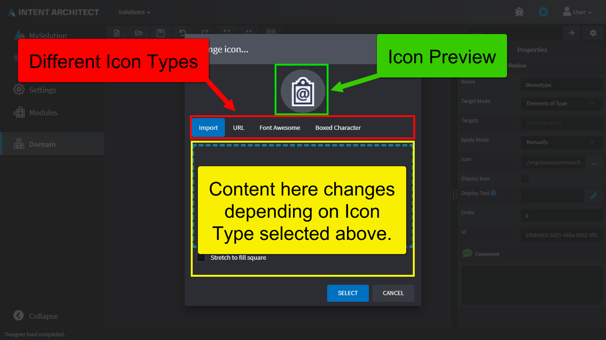
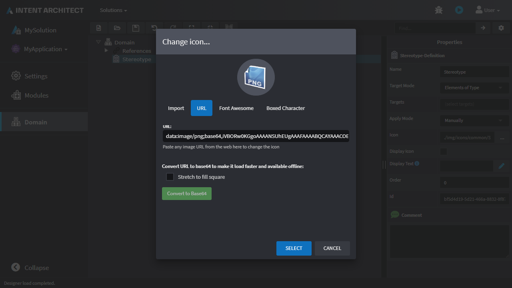
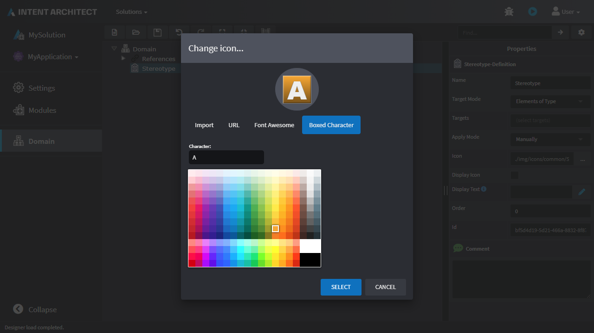

# How to use the Change Icon Dialogue

Intent Architect allows specifying an icon in many different places and this is always done using the the Change Icon Dialogue, this how-to will guide you on how to use it.

## Opening the Dialogue

There are various different places where the Change Icon Dialogue can be opened from, for example by clicking the icon on the Create Application screen:

<video style="max-width: 100%" muted="true" loop="true" autoplay="true" src="videos/choose-application-icon.mp4"></video>

Or on a stereotype definition / property:

<video style="max-width: 100%" muted="true" loop="true" autoplay="true" src="videos/choose-stereotype-icon.mp4"></video>

And some other places too with the same/similar paradigm.

## Overview of the dialogue

The dialogue has the following parts:

- A preview of the icon.
- "Tabs" which can be used to specify which type of icon to use.
- Content specific to the icon type chosen:

## Different Icon Types

You can use the "Tabs" to choose which type of icon to choose.

### Import

This is the easiest way to use any existing image as an icon. You can use Ctrl-V/Cmd+V to paste an image from your clipboard or drag and drop an existing image from a browser window or click on the area to open a browse dialogue:

<video style="max-width: 100%" muted="true" loop="true" autoplay="true" src="videos/icon-type-import.mp4"></video>

### URL

You can put any valid URL to an image in here. You should only ever use URLs to domains which you personally control or you can alternatively use a [Data URL](https://developer.mozilla.org/en-US/docs/Web/HTTP/Basics_of_HTTP/Data_URIs).

### Font Awesome

Intent Architect uses [Font Awesome](https://fontawesome.com/) and enables use of any [these icons](https://fontawesome.com/icons):

### Boxed Character

This makes basic dynamic icons which are a letter with background colour of your choice:

