# June 2023

Welcome to the June 2023 edition of highlights of What's New with Intent Architect.

- Product updates
  - **[JSON document database domain importer CLI tool now available](#json-document-database-domain-importer-cli-tool-now-available)** - A [CLI tool](https://docs.intentarchitect.com/articles/cli-tools/json-metadata-synchronizer/json-metadata-synchronizer.html) is now available for importing object graphs from JSON files into the Domain Designer for document databases (Cosmos DB, MongoDB, etc).
  - **[Intent Architect C# code management attributes and dependency sanitizer CLI tool now available](#intent-architect-c-code-management-attributes-and-dependency-sanitizer-cli-tool-now-available)** - A [CLI tool](https://docs.intentarchitect.com/articles/cli-tools/roslyn-weaver-sanitizer/roslyn-weaver-sanitizer.html) which can be used during a "release build" process to remove all Intent code management attributes and NuGet package dependencies from a Visual Studio solution if required by an organisation policy.
  - **[Hyperlinks inside designers will now open in your operating system's default browser](#hyperlinks-inside-designers-will-now-open-in-your-operating-systems-default-browser)** - Instead of opening these inside a new "Intent Architect" window, these are now opened in your operating system's default browser.
- Documentation updates
  - **[New application building tutorials](#new-application-building-tutorials)** - Added two new tutorials to assist users in becoming better acquainted with application building.
- Designer updates
  - **["New Enum" option now also available on the Domain diagram context menu](#new-enum-option-now-also-available-on-the-domain-diagram-context-menu)** - This context menu option is now also available when right-clicking a Domain diagram whereas before it was only available when right-clicking the tree view.
- Module updates (C#)
  - **[Version AspNetCore.NET services](#version-aspnetcorenet-services)** - Apply version information to Commands, Queries or Service elements in your service designer to make use of the `Microsoft.AspNetCore.Mvc.Versioning` library.
  - **[Generate contracts only for services](#generate-contracts-only-for-services)** - Optionally turn off generation of implementations for a `Service` modelled in the Service designer.
  - **[AspNetCore & AzureFunctions featuring 404 response types for entities not found](#aspnetcore--azurefunctions-featuring-404-response-types-for-entities-not-found)** - CRUD-based patterns will now throw `NotFoundExceptions` when an Entity of given `id` could not be found.
  - **[Service Designer mapping support for `Value Objects` and `Data Contracts`](#service-designer-ability-to-create-mappings-to-value-objects-and-data-contracts)** - Within the Service Designer mappings can be configured for these complex types and the CRUD modules have been updated to support them too.
  - **[Domain Events indicate they are published by `Constructor`s and `Operations`](#domain-events-indicate-they-are-published-by-constructors-and-operations)** - Domain Events can be modelled to reflect the `Constructor`s and/or `Operation`s which publish them.
  - **[Integration Messages can map from `Domain Event`s](#integration-messages-can-map-from-domain-events)** - `Domain Event`'s can be closely related to Integration event, Eventing Designer now supports mapping these relationships.
  - **[Domain Event handlers now fully support `CancellationToken`s when dispatched with Entity Framework](#domain-event-handlers-now-fully-support-cancellationtokens-when-dispatched-with-entity-framework)** - Domain Events are now dispatched from EF's `DbContext` with a `CancellationToken`, allowing cancellation requests to propagate to the Event Handlers.
  - **[Configure subscription based concerns for RabbitMQ / AzureServiceBus using Stereotypes for MassTransit](#configure-subscription-based-concerns-for-rabbitmq--azureservicebus-using-stereotypes-for-masstransit)** - Overwrite default settings for your queues so that MassTransit can set it up automatically for you.
  - **[Improved integration with Open Telemetry and API Responses for HTTP 500 errors](#improved-integration-with-open-telemetry-and-api-responses-for-http-500-errors)** - Open Telemetry is an open framework for collecting and exporting telemetry data in order to observe how your system behaves in real time.
- Pre-released Module updates (C#)
  - **[`Microsoft.Azure.Cosmos` based Cosmos DB domain persistence](#microsoftazurecosmos-based-cosmos-db-domain-persistence)** - A new module which uses non-Entity Framework based Cosmos DB repository implementations for persistence of domain entities.
  - **[Dapr State Management domain persistence](#dapr-state-management-domain-persistence)** - The Dapr State Management module can now persist full object graphs of entities modelled in the Domain Designer.

## Product updates

### JSON document database domain importer CLI tool now available

A [CLI tool](https://docs.intentarchitect.com/articles/cli-tools/json-metadata-synchronizer/json-metadata-synchronizer.html) is now available for importing object graphs from JSON files into the Domain Designer for document databases (Cosmos DB, MongoDB, etc).

### Intent Architect C# code management attributes and dependency sanitizer CLI tool now available

A [CLI tool](https://docs.intentarchitect.com/articles/cli-tools/roslyn-weaver-sanitizer/roslyn-weaver-sanitizer.html) which can be used during a "release build" process to remove all Intent code management attributes and NuGet package dependencies from a Visual Studio solution if required by an organisation policy.

### Hyperlinks inside designers will now open in your operating system's default browser

Instead of opening these inside a new "Intent Architect" window, these are now opened in your operating system's default browser.

## Designer updates

### "New Enum" option now also available on the Domain diagram context menu

This context menu option is now also available when right-clicking a Domain diagram whereas before it was only available when right-clicking the tree view.

## Documentation updates

### New application building tutorials

Two new tutorials have been added to the Intent Architect documentation website.

- [Tutorial:Hello World](https://docs.intentarchitect.com/articles/getting-started/tutorials/hello-world/hello-world-tutorial.html), gives you a quick feel for what using Intent Architect can do.
- [Tutorial: Build an Application](https://docs.intentarchitect.com/articles/getting-started/tutorials/building-an-application/building-an-application.html), a hands on guide to building a complete application using Intent Architect.

## Module updates (C#)

### Version AspNetCore.NET services

Apply version information to Commands, Queries or Service elements in your service designer to make use of the `Asp.Versioning.Mvc` library. Add an `Api Version` (populate it with a few version numbers) and then apply the `API Version Settings` stereotype to the services you wish to apply versioning to.

> [!NOTE]
> This is only available for AspNetCore.NET currently even though the `Api Version` element can be added in other tech-stacks' Services designers.

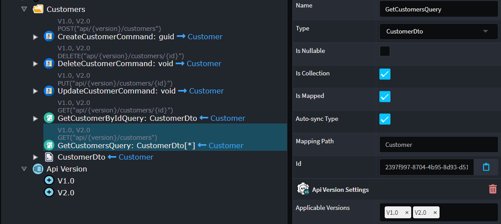

There is also integration with Swashbuckle to produce the different version definitions in the Swagger UI.

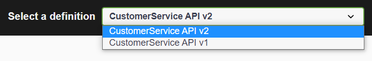

Available from:

- Intent.AspNetCore.Versioning 1.0.2
- Intent.Metadata.WebApi 4.2.2
- Intent.AspNetCore.Controllers 5.2.0
- Intent.AspNetCore.Controllers.Dispatch.MediatR 5.2.0

### Generate contracts only for services

It is now possible to specify that only contracts should be generated for a service by applying the `Contract Only` Stereotype to a Service. When applied, the interface ("contract") for the service will still be generated, but no implementation and corresponding dependency injection registration.

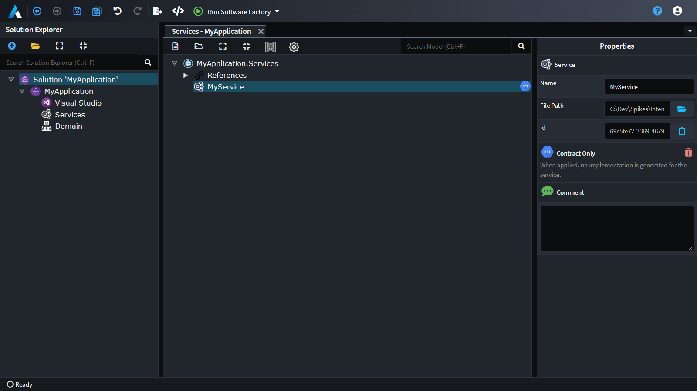

Available from:

- Intent.Application.ServiceImplementations 4.3.0

### AspNetCore & AzureFunctions featuring 404 response types for entities not found

CRUD-based patterns will now throw `NotFoundExceptions` when an Entity of given `id` could not be found. This will be intercepted by middleware to translate into a 404 `Not found` error but may contain additional error details around what kind of Entity could not be found with a given `id`. Also other Exception handling code patterns have received an update too.

In the case for AspNetCore.NET applications, there is now an Exception Filter that will deal with all the known exceptions:

```c#
public class ExceptionFilter : IExceptionFilter
{
    public void OnException(ExceptionContext context)
    {
        switch (context.Exception)
        {
            case ValidationException exception:
                foreach (var error in exception.Errors)
                {
                    context.ModelState.AddModelError(error.PropertyName, error.ErrorMessage);
                }
                context.Result = new BadRequestObjectResult(new ValidationProblemDetails(context.ModelState))
                .AddContextInformation(context);
                context.ExceptionHandled = true;
                break;
            case ForbiddenAccessException:
                context.Result = new ForbidResult();
                context.ExceptionHandled = true;
                break;
            case NotFoundException exception:
                context.Result = new NotFoundObjectResult(new ProblemDetails
                {
                    Detail = exception.Message
                })
                .AddContextInformation(context);
                context.ExceptionHandled = true;
                break;
        }
    }
}
```

> [!NOTE]
> The `Intent.AspNetCore.Controllers.FluentValidation` module has been deprecated (which installed its own FluentValidation Filter class) and will instead (on `Intent.AspNetCore.Controllers` update) update the `ExceptionFilter` class with a check for a `ValidationException`.

As for Azure Functions, there is an additional `catch` statement for `NotFoundExceptions`:

```c#
try
{
    var requestBody = await new StreamReader(req.Body).ReadToEndAsync();
    var dto = JsonConvert.DeserializeObject<SampleDomainCreateDto>(requestBody);
    var result = await _appService.CreateSampleDomain(dto);
    return new CreatedResult(string.Empty, result);
}
catch (NotFoundException exception)
{
    return new NotFoundObjectResult(new { Message = exception.Message });
}
catch (FormatException exception)
{
    return new BadRequestObjectResult(new { Message = exception.Message });
}
```

Available from (only update those that are applicable):

- Intent.AspNetCore.Controllers 5.3.0
- Intent.Entities.Repositories.Api 4.1.0
- Intent.Application.MediatR.CRUD 5.1.1
- Intent.Application.MediatR.CRUD.Tests 1.1.0
- Intent.AzureFunctions.Interop.EntityFrameworkCore 4.1.0
- Intent.Dapr.AspNetCore 1.1.0

### Service Designer ability to create mappings to `Value Objects` and `Data Contracts`

In the Service Designer you can now map `Value Objects` and `Data Contracts` from the domain onto your services. These complex domain types will be realized as DTOs in the service contracts. This functionality brings these option more inline with what is possible with the more common domain `Entity`.

Looking at an example is you had a domain as follows:

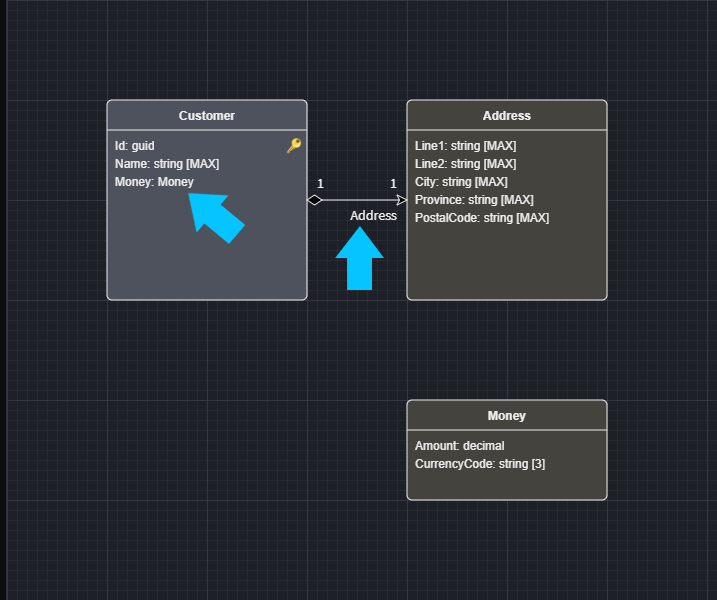

Note the two `Value Object`s in use, Money as an `Attribute` type and Address and an `Association`.

Here is service looks like, using the `Create CQRS Crud Operations` script and mapping in the Address Association :

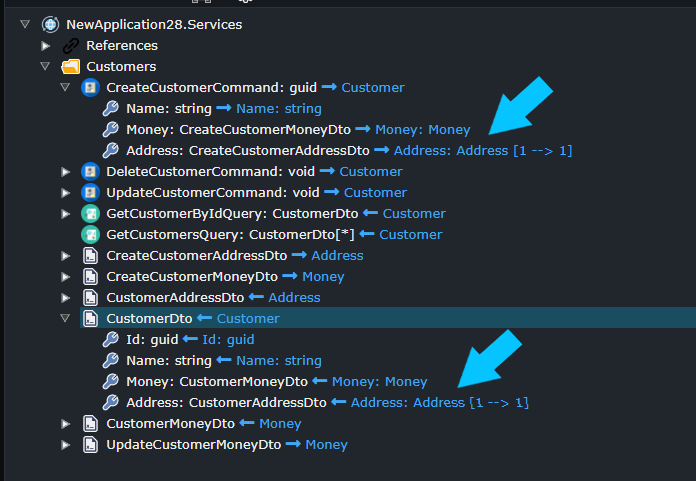

The CRUD implementation scripts will generate code like this:

```csharp

        [IntentManaged(Mode.Fully, Body = Mode.Fully)]
        public async Task<Guid> Handle(CreateCustomerCommand request, CancellationToken cancellationToken)
        {
            var newCustomer = new Customer
            {
                Name = request.Name,
                Money = CreateMoney(request.Money),
                Address = CreateAddress(request.Address),
            };

            _customerRepository.Add(newCustomer);
            await _customerRepository.UnitOfWork.SaveChangesAsync(cancellationToken);
            return newCustomer.Id;
        }

        [IntentManaged(Mode.Fully)]
        public static Money CreateMoney(CreateCustomerMoneyDto dto)
        {
            return new Money(amount: dto.Amount, currencyCode: dto.CurrencyCode);
        }

        [IntentManaged(Mode.Fully)]
        public static Address CreateAddress(CreateCustomerAddressDto dto)
        {
            return new Address(line1: dto.Line1, line2: dto.Line2, city: dto.City, province: dto.Province, postalCode: dto.PostalCode);
        }

```

Similarly,  the CRUD Scripting `Map to Domain Operation`, now fully supports `Data Contract` and `Value Object` types for domain entity `Operation`s and `Constructor`s.

Available from:

- Intent.Application.MediatR.CRUD 5.1.3
- Intent.Application.ServiceImplementations.Conventions.CRUD 4.3.1

### Domain Events indicate they are published by `Constructor`s and `Operations`

The Domain Designer can now be used to model, what is publishing `Domain Events`, to that end  `Constructor`s and `Operation`s have a `Publish Domain Event` option on their context menu, which allows you to indicate what `Domain Event`s they publish.

Here is an example of such a model:

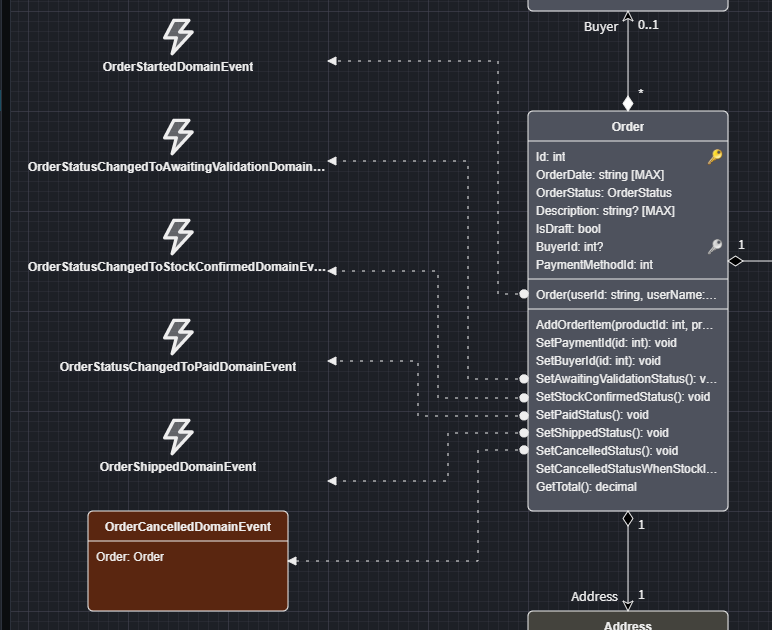

Note the designer also minimal view of domain events, for example the `OrderStartedDomainEvent` is not showing it's `Properties` due it's sizing versus the `OrderCancelledDomainEvent` which has been made larger.

Available from:

- Intent.Modelers.Domain.Events 3.5.0

### Integration Messages can map from `Domain Event`s

`Domain Event`s often result in `Integration Event`s to other systems to make them aware of the change. We have made this easier to do and model by enabling you to model ths relationship. In the `Eventing Designer` on an `Integration Event`, when you select `Map From Domain`, you can now map from `Domain Events`.

Here is an example:

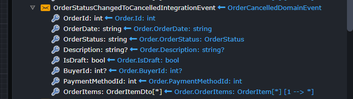

In this example, you can see the `OrderStatusChangedToCancelledIntegrationEvent` is mapped from the `OrderCancelledDomainEvent`.
The `Domain Eventing` modules is aware of these mappings and generate default EventHandlers as follows:

```csharp

    [IntentManaged(Mode.Merge, Signature = Mode.Fully)]
    public class OrderCancelledDomainEventHandler : INotificationHandler<DomainEventNotification<OrderCancelledDomainEvent>>
    {
        private readonly IEventBus _eventBus;

        public OrderCancelledDomainEventHandler(IEventBus eventBus)
        {
            _eventBus = eventBus;
        }

        [IntentManaged(Mode.Fully, Body = Mode.Ignore)]
        public async Task Handle(
            DomainEventNotification<OrderCancelledDomainEvent> notification,
            CancellationToken cancellationToken)
        {
            var integrationEvent = notification.DomainEvent.MapToOrderStatusChangedToCancelledIntegrationEvent();
            _eventBus.Publish(integrationEvent);
        }
    }
```

Available from:

- Intent.DomainEvents 4.1.0
- Intent.MediatR.DomainEvents 4.2.0

- ### Domain Event handlers now fully support `CancellationToken`s when dispatched with Entity Framework

Domain Events are now dispatched from EF's `DbContext` with a `CancellationToken`, allowing cancellation requests to propagate to the Event Handlers.

Available from:

- Intent.DomainEvents 4.1.1
- Intent.EntityFrameworkCore.Interop.DomainEvents 4.0.4
- Intent.MediatR.DomainEvents 1.2.1

### Entity Framework Stored Procedures now support OUTPUT and User Defined Table Type parameters

Parameters for _Stored Procedures_ in the Domain Designer now have an `Is Output Parameter` option and can also reference `Data Contract` collections which are passed to the stored procedure as a populated user defined table type.

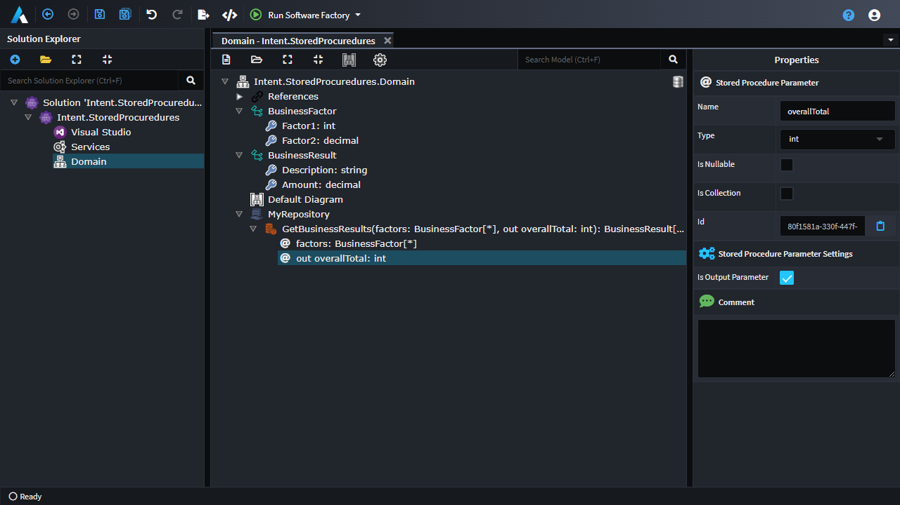

Available from:

- Intent.EntityFrameworkCore.Repositories 4.2.5

### Configure subscription based concerns for RabbitMQ / AzureServiceBus using Stereotypes for MassTransit

Overwrite default settings for your queues so that MassTransit can set it up automatically for you. This is achieved by applying the `Azure Service Bus Consumer Settings` and `Rabbit MQ Consumer Settings` stereotypes (depending on the configured Message broker) inside the Eventing designer by selecting a subscription for a message and applying it there. This also includes an enhancement to the Message retry policy where you can configure the number of attempts as well as intervals inside your `appsettings.json` file:

```json
"MassTransit": {
  "Retry": {
    "RetryCount": 10,
    "Interval": "00:00:30"
  }
}
```

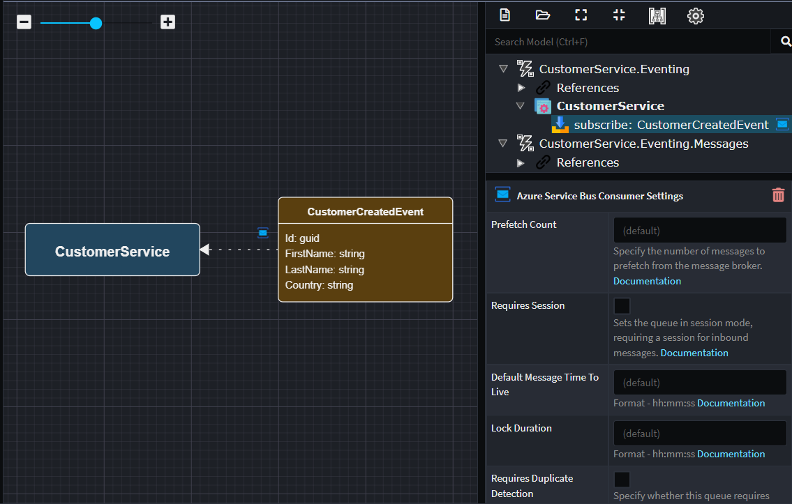

Available from:

- Intent.Eventing.MassTransit 5.0.0
- Intent.Eventing.MassTransit.EntityFrameworkCore 5.0.0
- Intent.Infrastructure.DependencyInjection 4.0.6

### Improved integration with Open Telemetry and API Responses for HTTP 500 errors

[Open Telemetry](https://opentelemetry.io/) is an open framework for collecting and exporting telemetry data in order to observe how your system behaves in real time.

It is integrated with AspNetCore and (if you have it installed) MassTransit and allows you to opt-in to other kind of telemetry data which in turn can be published to APM (Application Performance Monitoring) systems like Azure Application Insights.

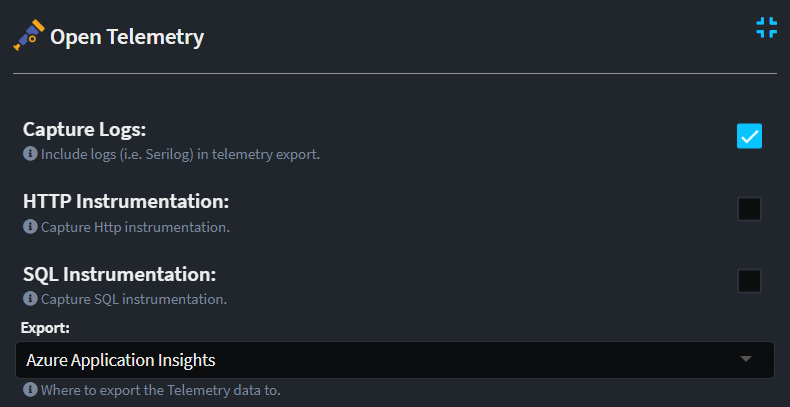

This will produce the kind of trace information that you can find in your APM systems, like the example below where there is 3 different microservices that talk to one another through Http Client and Message Broker integration. It also captured the Serilog messages as part of the conversation.

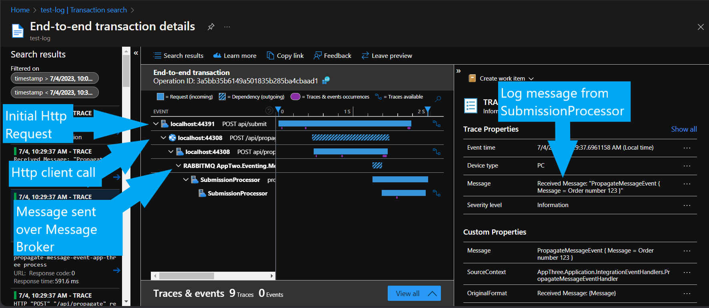

Updated is also the way Internal Server Errors are returned from API services. Initially AspNetCore didn't provide any information other than the HTTP 500 status code and (in Development environments) Exception stack traces.

In Development environments the Exception stack trace is still returned.

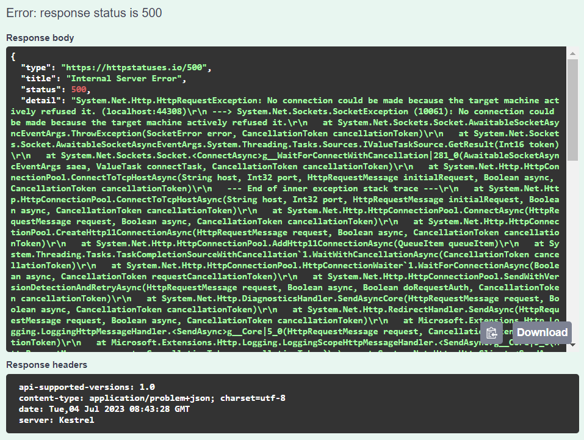

In Production environments the Exception is omitted from the response.

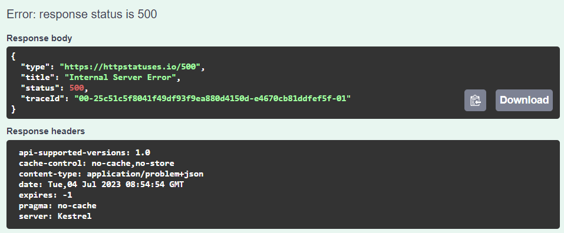

With this update, a `ProblemDetails` object will be returned with a `Trace ID` which can be used by callers to submit for troubleshooting purposes.

The number that is situated between the first two `-` symbols (`25c51c5f8041f49df93f9ea880d4150d` in this case) is the `Operation ID` that you can use in your APM to look up the message trace as shown above.

Available from:

- Intent.AspNetCore (5.1.1)
- Intent.Eventing.MassTransit (5.0.0)
- Intent.OpenTelemetry (1.1.0)

## Pre-released Module updates (C#)

### `Microsoft.Azure.Cosmos` based Cosmos DB domain persistence

A new module which uses non-Entity Framework based Cosmos DB repository implementations for persistence of domain entities.

Leveraging Microsoft employee David Pine's [Azure Cosmos DB Repository .NET SDK](https://github.com/IEvangelist/azure-cosmos-dotnet-repository), our new `Intent.CosmosDB` module adds Cosmos DB concepts to the Domain Designer and generates repository implementation which use Cosmos DB for persistence.

Available from:

- Intent.CosmosDB 1.0.0 (alpha)

### Dapr State Management domain persistence

The Dapr State Management module can now persist full object graphs of entities modelled in the Domain Designer.

This module now generates domain entity repository implementations which use Dapr's State Management building block for persistence. By default the `statestore` Dapr component is used as the persistence target for a Domain package's entities, but this can be overridden by applying the `Dapr State Store Settings` stereotype to the Domain package.

Available from:

- Intent.Dapr.AspNetCore.StateManagement 1.1.0 (alpha)
