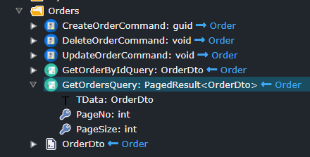
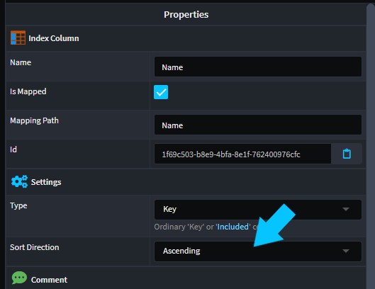

# July 2023

Welcome to the July 2023 edition of highlights of What's New with Intent Architect.

- Module updates (C#)
  - **[MediatR 12.1 upgrade](#mediatr-121-upgrade)** - Upgrade all our modules to work with the latest version of MediatR.
  - **[RDBMS Improved Schema modeling](#rdbms-improved-schema-modeling)** - Improved support for modelling DB schema through a `Schema` stereotype.
  - **[Duplicate Rest route validation](#duplicate-rest-route-validation)** - Service Designer validation to detect duplicate Rest routes on your services.
  - **[Clone/Copy App feature](#clonecopy-app-feature)** - Clone/Copy App is now available in Intent Architect v4.
  - **[CRUD CQRS available on folders](#crud-cqrs-available-on-folders)** - Create CQRS style services from folders in the Service Designer.
  - **[Module Documentation - Entity Framework Core](#module-documentation---entity-framework-core)** - Improved documentation around working with the Entity Framework Core module.
  - **[Services `Paginate` feature](#services-paginate-feature)** - Service's now have a `Paginate` context menu, simplifying configuring pagination in the Services Desginer.
  - **[Index column sort directions](#index-column-sort-directions)** - Modeled Indexes now support configuring the index sort direction for indexed columns.
  - **[EF SQL Table name pluralization convention](#ef-sql-table-name-pluralization-convention)** - You can now configure your SQL table name convention, these are still pluralized by default, but can now be configured.
  - **[Duplicate `Operation` validation](#duplicate-operation-validation)** - Service Designer validation to detect duplicate operations based on operation name and parameter types.
  - **[Swagger - OAuth 2.0 Implicit Flows](#swagger---oauth-20-implicit-flows)** - Added support for configuring OAuth 2.0 Implicit flows for Swagger Authentication.
  - **[CQRS - `Map Constructor / Operation` support inheritance mappings](#cqrs---map-constructor--operation-support-inheritance-mappings)** - The `Map Constructor` and `Map Operation` options in the Domain Designer, now support mapping to base classes.
  - **[XML documentation comment support for `Operation` parameters](#xml-documentation-comment-support-for-operation-parameters)** - Comments placed on `Operation` parameters now become Xml documentation comments on the c# services and interfaces.
  - **[Repositories support composite primary keys](#repositories-support-composite-primary-keys)** - repositories now support composite primary keys.
  - **[`Expose as Http` improved support for composite keys](#expose-as-http-improved-support-for-composite-keys)** - Rest route generation algorithm handles several scenarios better including composite keys.
  - **[Blazor account controller proxy module](#blazor-account-controller-proxy-module)** - New module to create a Blazor proxy for interacting with the `Intent.AspNetCore.Identity.AccountController` module.

## Module updates (C#)

### MediatR 12.1 upgrade

Available from:

- Intent.AspNetCore.Versioning 1.0.2

### RDBMS Improved Schema modeling

Available from:

- Intent.AspNetCore.Versioning 1.0.2

### Duplicate Rest route validation

Available from:

- Intent.AspNetCore.Versioning 1.0.2

### Clone/Copy App feature

Available from:

- Intent.AspNetCore.Versioning 1.0.2

### CRUD CQRS available on folders

Available from:

- Intent.AspNetCore.Versioning 1.0.2

### Module Documentation - Entity Framework Core

We have released documentation around using and configuring EF in Intent. This documentation takes the form of a mark down read me, which is available in the module repository. We have also included this link as the modules `Project Url`, the idea being all our modules will eventually have documentation available in this way.

[Documentation available here.](https://github.com/IntentArchitect/Intent.Modules.NET/blob/development/Modules/Intent.Modules.EntityFrameworkCore/README.md)

Available from:

- Intent.AspNetCore.Versioning 1.0.2

### Services `Paginate` feature

The Service Designer now has a `Paginate` command to make it easier to configure pagination on your `Query`s and `Operation`s.


Configuring the relevant paging data.



Available from:

- Intent.Application.Dtos.Pagination 4.0.5

### Index column sort directions

When defining Indexes either through the `Add Index` or the `Index` stereotype, you can now specify the sort direction either `Ascending` or `Descending`. Sort direction is `Ascending` by default.



Available from:

- Intent.EntityFrameworkCore 4.4.6

### EF SQL Table name pluralization convention

There is a new `Database Settings` named `Table naming convention` available in your application settings.

This setting allows you to configure a convention for your SQL table names. The available options are as follows:

- Pluralized, SQL table name will be the pluralized version of the domain model `Class`'s name.
- Singularized, SQL table name will be the singularized version of the domain model `Class`'s name.
- None, SQL table name will be the same as domain model `Class`'s name.

The default setting `Pluralized` to maintain backwards compatibility.

Available from:

- Intent.EntityFrameworkCore 4.4.5

### Duplicate `Operation` validation

Add a Service Designer validation to detect duplicate operations, i.e. operations where the name and parameter types are identical.

Available from:

- Intent.Modelers.Services 3.4.7

### Swagger - OAuth 2.0 Implicit Flows

The Swagger modules now support setting up OAuth 2.0 Implicit Flow authentication for the Swagger UI. To enable this, in your application settings change Authentication to `OAuth 2.0 - Implicit`.


You then need to configure the relevant security settings in the `app.setting` file.

```json
"Swashbuckle": {
  "Security": {
    "OAuth2": {
      "Implicit": {
        "AuthorizationUrl": "[AuthorizationUrl]",
        "TokenUrl": "[TokenUrl]",
        "Scope": {
          "[Scope Description]": "[ScopeUrl]"
        },
        "ClientId": "[ClientId]"
            }
          }
        }
      }
```

Available from:

- Intent.AspNetCore.Swashbuckle.Security 4.0.4

### CQRS - `Map Constructor / Operation` support inheritance mappings

Both `Map Constructor` and `Map Operation` commands now support mapping from base classes.


Available from:

- Intent.Modelers.Domain 3.4.5

### XML documentation comment support for `Operation` parameters

Enhanced XmlDocComments to add `Operation` `Parameters` comments into the Service and Service Interface classes XmlDoComments.

```csharp
        /// <summary>
        /// Removes a customer.
        /// </summary>
        /// <param name="id">>The customer Id of the customer to remove.</param>
        [IntentManaged(Mode.Fully, Body = Mode.Fully)]
        public async Task DeleteCustomer(Guid id, CancellationToken cancellationToken = default)
```

Available from:

- Intent.Application.ServiceImplementations 4.3.1
- Intent.Application.Contracts 5.0.2

### Repositories support composite primary keys

Repositories now provide support for composite primary keys if required. The syntax for composite usage is as follows.

```csharp
var existingMyEntity = await _myEntityRepository.FindByIdAsync(new(request.KeyPart1Id, request.KeyPart2), cancellationToken);
```

Available from:

- Intent.Entities.Repositories.Api 4.1.1
- Intent.EntityFrameworkCore.Repositories 4.2.6

### `Expose as Http` improved support for composite keys

There was a general overhaul of the algorithm which generated the default Rest routes. The algorithm now better supports

- Composite Primary Keys
- Non-conventionally names primary keys i.e. primary keys not named `id` or `{entity name}Id`

Composite keys will result in routes similar to `/api/entity/{key1}/{key2}`.

Available from:

- Intent.Metadata.WebApi 4.2.4

### Blazor account controller proxy module

The module will generate a `HttpClient` proxy for the `AccountController` produced by the `Intent.AspNetCore.Identity.AccountController` module.
This proxy can be used to easily interact with the controller from within a Blazor application.

Available from:

- Intent.Blazor.HttpClients.AccountController 1.0.0
