# July 2023

Welcome to the July 2023 edition of highlights of What's New with Intent Architect.

- Highlights
  - **[SignalR (Preview)](#signalr-preview)** - Introduced capability to model communication from Service to Clients using SignalR.
  - **[ASP.NET Health Checks](#aspnet-health-checks)** - Add Health checks to your ASP.NET Core app to monitor various aspects of your application to determine if is responding to requests normally.
  - **[Basic Auditing for Entity Framework Core](#basic-auditing-for-entity-framework-core)** - Extend Domain Entities to have fields that record which user created / updated them and at what time.
  - **[Support for `CustomAsync(…)` in FluentValidation modules](#support-for-customasync-to-fluentvalidation-modules)** - Allows returning of custom validation failure reasons.
  - **[Blazor HttpClients](#blazor-httpclients)** - Generate HttpClients in Blazor projects for services and CQRS operations modeled in the Services Designer.

- More updates
  - **[Services `Paginate` feature](#services-paginate-feature)** - Service's now have a `Paginate` context menu, simplifying configuring pagination in the Services Designer.
  - **[Swagger - OAuth 2.0 Implicit Flows](#swagger---oauth-20-implicit-flows)** - Added support for configuring OAuth 2.0 Implicit flows for Swagger Authentication.
  - **[RDBMS Improved Schema modeling](#rdbms-improved-schema-modeling)** - Improved support for modelling DB schema through a `Schema` stereotype.
  - **[Clone/Copy App feature](#clonecopy-app-feature)** - Clone/Copy App is now available in Intent Architect v4.
  - **[MediatR NuGet packages upgraded to 12.1](#mediatr-nuget-packages-upgraded-to-121)** - All our modules have been upgraded to work with the latest version of MediatR.
  - **[Control index column sort direction](#control-index-column-sort-directions)** - Modeled Indexes now support configuring the index sort direction for indexed columns.
  - **[CRUD CQRS context menu option available on folders](#crud-cqrs-available-on-folders)** - Create CQRS style services from folders in the Service Designer.
  - **[Module Documentation - Entity Framework Core](#module-documentation---entity-framework-core)** - Added module readme with documentation on working with the Entity Framework Core module.
  - **[EF SQL Table name pluralization convention](#ef-sql-table-name-pluralization-convention)** - You can now configure your SQL table name convention, these are still pluralized by default, but can now be configured.
  - **[Duplicate REST route validation](#duplicate-rest-route-validation)** - Service Designer validation to detect duplicate REST routes on your services.
  - **[Duplicate `Operation` validation](#duplicate-operation-validation)** - Service Designer validation to detect duplicate operations based on operation name and parameter types.
  - **[CQRS - `Map Constructor / Operation` support for inheritance mappings](#cqrs---map-constructor--operation-support-inheritance-mappings)** - The `Map Constructor` and `Map Operation` options in the Domain Designer now support mapping to attributes on base classes.
  - **[XML documentation comment support for `Operation` parameters](#xml-documentation-comment-support-for-operation-parameters)** - Comments placed on `Operation` parameters now become XML documentation comments on c# services and interfaces.
  - **[Composite primary key support for repositories](#composite-primary-key-support-for-repositories)** - Repositories now support composite primary keys.
  - **[Improved composite and general key support for `Expose as Http`](#improved-composite-and-general-key-support-for-expose-as-http)** - REST route generation algorithm handles several scenarios better, including composite keys.
  - **[Blazor account controller proxy module](#blazor-account-controller-proxy-module)** - New module to create a Blazor proxy for interacting with the `Intent.AspNetCore.Identity.AccountController` module.
  - **[CORS is now configuration driven](#code-generated-by-cors-module-is-now-configuration-driven)** - Use configuration to specify any combination of policies.
  - **[Additional SDK options for .csproj files](#additional-sdk-options-for-csproj-files)** - Including `BlazorWebAssembly` and `Worker` SDKs.
  - **[Document DB inheritance support](#support-for-modeling-generalizations-in-document-db-packages-in-the-domain-designer)** - The Domain Designer and Document DB modules now properly supports modelling generalization in Document DB packages.
  - **[FluentValidation max length rules for fields mapped to Class Operation/Constructor parameters](#fluentvalidation-max-length-rules-for-fields-mapped-to-class-operationconstructor-parameters)** - Generates max length rules for mapped parameters similarly to how they're generated for mapped attributes.
  - **[FluentValidation NuGet packages upgraded to 11.6.0](#fluentvalidation-nuget-packages-upgraded-to-1160)** - Fluent Validation's NuGet packages have been updated to version 11.6.0.
  - **[Microsoft.AspNetCore.Authentication.JwtBearer NuGet package upgraded due to security advisory](#microsoftaspnetcoreauthenticationjwtbearer-nuget-package-upgraded-due-to-security-advisory)** - It's advised to upgrade the listed modules to ensure you aren't running NuGet package versions which are known to be vulnerable.
  - **[Http Client mapping to a Service can select specific operations now](#http-client-mapping-to-a-service-can-select-specific-operations-now)** - Granular reference operation selection now possible.

## Update details

### SignalR (Preview)

Introduced capability to model communication from Service to Clients using SignalR.

This makes working with SignalR not only simple but opens up the ability to model contracts which can be shared between Clients and Services and can be automated.

> [!NOTE]
> This is in Preview and may be subject to change.

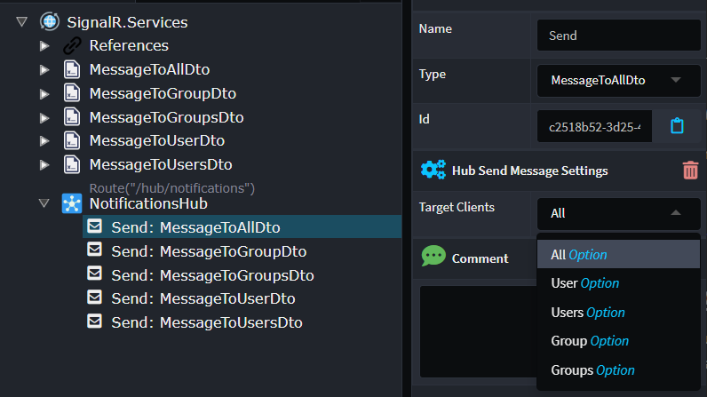

Available from:

- Intent.AspNetCore.SignalR 1.0.0-beta.0

### ASP.NET Health Checks

Add Health checks to your ASP.NET Core app to monitor various aspects of your application to determine if is responding to requests normally.

#### Health check endpoint

See how your application fares by inspecting database connections, message bus connections, etc. All updated automatically when modules that are aware of the health check module's presence.

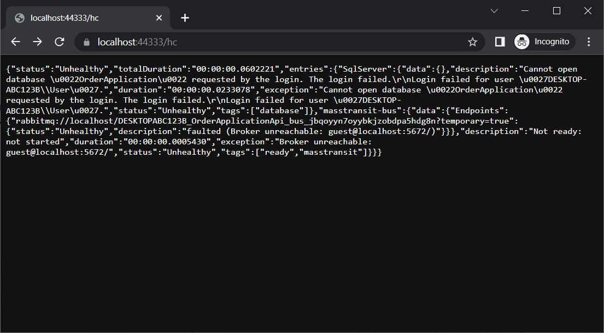

#### Publish metrics to your APM

Automatically publish metrics that help track your application's heartbeat to something like Azure Application Insight's Metrics to measure how healthy your application is and setup alerts under certain conditions.

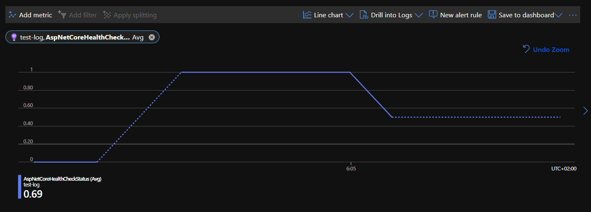

#### Health Check UI

View visually how your application is doing if you're not planning on using an APM. Health Check UI gives you webhook capabilities to notify in the event if something goes wrong.

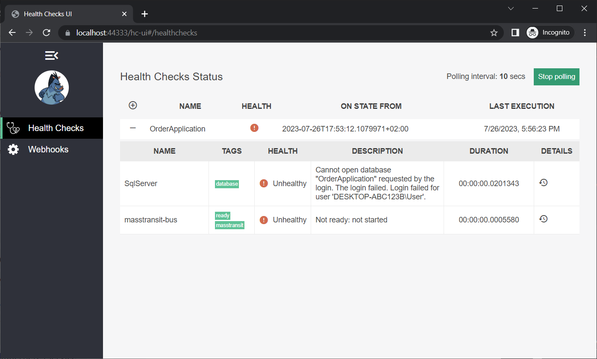

Available from:

- Intent.AspNetCore.HealthChecks 1.0.0

### Basic Auditing for Entity Framework Core

Extend Domain Entities to have fields that record which user created / updated them and at what time.

It is now only a matter of opening the context menu for a Class and selecting `Toggle Basic Auditing`.

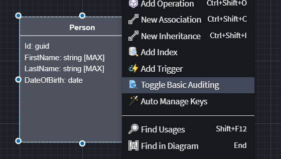

It will produce these fields that are maintained by the module.

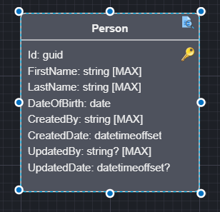

When a Class gets created / updated, it will automatically update the timestamps and the user who touched it.

Available from:

- Intent.EntityFrameworkCore.BasicAuditing 1.0.0

### Support for `CustomAsync(…)` to FluentValidation modules

FluentValidation's `CustomAsync(…)` allows adding of custom validation failure messages which, as with other validation failure messages, is populated into a ASP.NET Core's [RFC 7807 compliant ProblemDetails](https://learn.microsoft.com/dotnet/api/microsoft.aspnetcore.mvc.problemdetails) response.

Previously, the `Validations`' stereotype had a `Has Custom Validation` checkbox property which would create a `.MustAsync(…)` invocation and corresponding method stub on the validator. This property has now been replaced with a more appropriately named `Must` property and its value is automatically migrated from the old `Has Custom Validation` property.

A new `Custom` checkbox property has been added to the stereotype and when checked it will create a `.CustomAsync(…)` invocation and corresponding method stub:

```csharp
private void ConfigureValidationRules()
{
        RuleFor(v => v.Field)
                .NotNull()
                .CustomAsync(ValidateFieldAsync);
}

[IntentManaged(Mode.Fully, Body = Mode.Ignore)]
private async Task ValidateFieldAsync(
        string value,
        ValidationContext<ValidatedCommand> validationContext,
        CancellationToken cancellationToken)
{
        validationContext.AddFailure("Custom failure message");
}
```

The `Validations`' stereotype now appears (depending on the field's type) similar to the following:

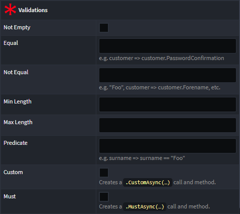

Available from:

- Intent.Application.FluentValidation 3.7.2
- Intent.Application.FluentValidation.Dtos 3.6.1
- Intent.Application.MediatR.FluentValidation 4.3.0

### Blazor HttpClients

It is now possible to generate Blazor compatible HttpClients for services/operations/CQRS endpoints modelled in the Service Designer of same or different Intent Architect applications.

Once the module is installed, in the `Web Client` Designer use the `New Service Proxy` context menu option to get started.

Details and examples on using this module are available in the module's [README](https://github.com/IntentArchitect/Intent.Modules.NET/blob/master/Modules/Intent.Modules.Blazor.HttpClients/README.md).

Available from:

- Intent.Blazor.HttpClients 1.0.1

### Services `Paginate` feature

The Service Designer now has a `Paginate` command to make it easier to configure pagination on your `Query`s and `Operation`s.

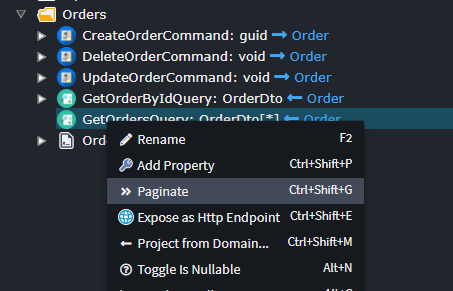

Configuring the relevant paging data.

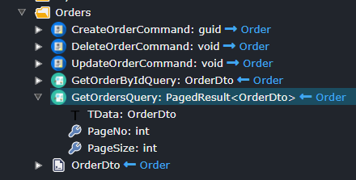

Available from:

- Intent.Application.Dtos.Pagination 4.0.5

### Swagger - OAuth 2.0 Implicit Flows

The Swagger modules now support setting up OAuth 2.0 Implicit Flow authentication for the Swagger UI. To enable this, in your application settings change Authentication to `OAuth 2.0 - Implicit`.

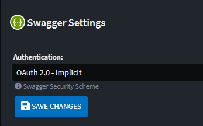

You then need to configure the relevant security settings in the `app.setting` file.

```json
"Swashbuckle": {
    "Security": {
        "OAuth2": {
            "Implicit": {
                "AuthorizationUrl": "[AuthorizationUrl]",
                "TokenUrl": "[TokenUrl]",
                "Scope": {
                    "[Scope Description]": "[ScopeUrl]"
                },
                "ClientId": "[ClientId]"
                        }
                    }
                }
            }
```

Available from:

- Intent.AspNetCore.Swashbuckle.Security 4.0.4

### RDBMS Improved Schema modeling

A new `Schema` stereotype has been added, which can be applied to `Class`s, `Folder`s and / or `Package`s.

This stereotype works hierarchically i.e. if you apply it to a `Package` all tables / views in the package will belong to that schema.
Similarly you can apply the `Schema` stereotype to a folder, all tables / views under that folder belong to that schema.

The "Closest" `Schema` stereotype to the `Class` will apply.

Note. If you have `Table` or `View` stereotypes with schema's specified these are more specific and will override the `Schema` stereotype. If you do not fill the schema in on these stereotypes, the schema name will fall back to the "Closest" `Schema` stereotype.

Available from:

- Intent.EntityFrameworkCore 4.4.6

### Clone/Copy App feature

The `Clone Application`, which was available in previous versions of Intent Architect, is now available in version 4. It is now called `Copy Application` and is available on the Application context menu.

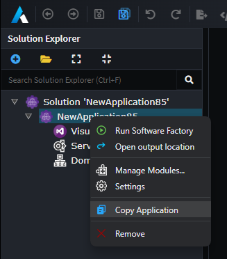

Available from:

- Intent Architect 4.0.2

### MediatR NuGet packages upgraded to 12.1

We have upgraded our MediatR modules from using version `10.x` of the NuGet packages to use the latest `12.1.x` packages. Although the changes to MediatR NuGet packages are considered "breaking", Intent Architect's MediatR module is able to fix these breaking changes in your codebase automatically.

**Noteworthy changes you can expect to see.**

- Dependency Injection registrations for MediatR are now done through the `MediatrServiceConfiguration`.
- `CommandHandler`s and `QueryHandler`s which do not return results now return `Task` instead of `Task<Unit>` and no longer need to return Unit.Value.
- `CommandHandler`s, `QueryHandler`s and `PipelineBehaviour`s method signatures changed in some scenarios.
- `PipelineBehaviour`s must be registered with `MediatrServiceConfiguration` not directly with the container.
- `PipelineBehaviour`s generic constraints change from `TRequest : IRequest<TResponse>` to `TRequest : notnull`.

> [!IMPORTANT]
>
> If you have any **custom** MediatR `PipelineBehaviour`s, please ensure you upgrade them appropriately and ensure they are still running as expected.

Relevant MediatR migration guides:

- [Migration Guide 10.x to 11.0](https://github.com/jbogard/MediatR/wiki/Migration-Guide-10.x-to-11.0)
- [Migration Guide 11.x to 12.0](https://github.com/jbogard/MediatR/wiki/Migration-Guide-11.x-to-12.0)
- [Migration Guide 12.0 to 12.1](https://github.com/jbogard/MediatR/wiki/Migration-Guide-12.0-to-12.1)

Available from:

- Intent.Application.MediatR 4.1.0
- Intent.Application.DependencyInjection.MediatR 3.5.0
- Intent.Application.MediatR.Behaviours 4.2.0
- Intent.MediatR.DomainEvents 4.3.0
- Intent.Application.MediatR.CRUD 5.2.0

### Control index column sort directions

When defining Indexes either through the `Add Index` or the `Index` stereotype, you can now specify the sort direction of either `Ascending` or `Descending`. Sort direction is `Ascending` by default.

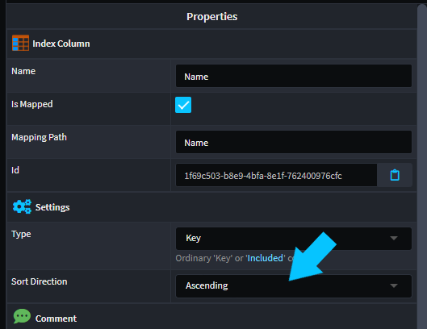

Available from:

- Intent.EntityFrameworkCore 4.4.6

### CRUD CQRS available on folders

`Create CQRS CRUD Operations` is now also available on `Folder`s within the Services Designer.

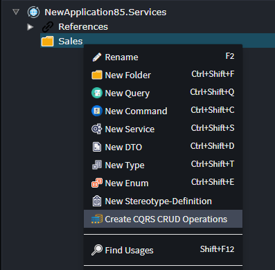

The Rest route generation algorithm has also been enhanced to include the folder structure into the default REST route.

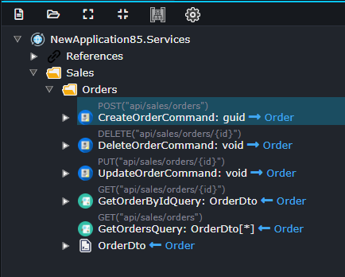

Available from:

- Intent.Metadata.WebApi 4.2.4
- Intent.Application.MediatR.CRUD 5.1.4

### Module Documentation - Entity Framework Core

We have released documentation around using and configuring EF in Intent. This documentation takes the form of a mark down read me, which is available in the module repository. We have also included this link as the modules `Project Url`, the idea being all our modules will eventually have documentation available in this way.

The documentation is viewable [here](https://github.com/IntentArchitect/Intent.Modules.NET/blob/development/Modules/Intent.Modules.EntityFrameworkCore/README.md).

Available from:

- Intent.EntityFrameworkCore 4.4.6

### EF SQL Table name pluralization convention

There is a new `Database Settings` setting named `Table naming convention` available in your application settings.

This setting allows you to configure a convention for your SQL table names. The available options are as follows:

- Pluralized: The SQL table name will be the pluralized version of the domain model `Class`'s name.
- Singularized: The SQL table name will be the singularized version of the domain model `Class`'s name.
- None: The SQL table name will be the same as the domain model `Class`'s name.

The default setting is `Pluralized` to maintain backwards compatibility.

Available from:

- Intent.EntityFrameworkCore 4.4.5

### Duplicate REST route validation

Added a Services Designer validation to detect duplicate REST Routes for `Command`s, `Query`s and `Operations`.

Available from:

- Intent.Metadata.WebApi 4.2.5

### Duplicate `Operation` validation

Add a Service Designer validation to detect duplicate operations, i.e. operations where the name and parameter types are identical.

Available from:

- Intent.Modelers.Services 3.4.7

### CQRS - `Map Constructor / Operation` support inheritance mappings

Both `Map Constructor` and `Map Operation` commands now support mapping from base classes.

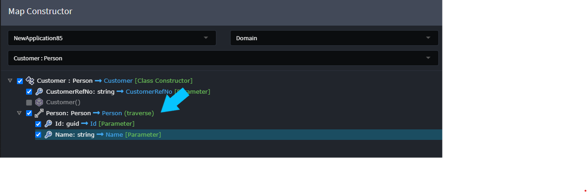

Available from:

- Intent.Modelers.Domain 3.4.5

### XML documentation comment support for `Operation` parameters

Enhanced XML Documentation Comment generation to add `Operation` `Parameter` comments to the generated Service and Service Interface classes.

```csharp
/// <summary>
/// Removes a customer.
/// </summary>
/// <param name="id">>The customer Id of the customer to remove.</param>
[IntentManaged(Mode.Fully, Body = Mode.Fully)]
public async Task DeleteCustomer(Guid id, CancellationToken cancellationToken = default)
```

Available from:

- Intent.Application.ServiceImplementations 4.3.1
- Intent.Application.Contracts 5.0.2

### Composite primary key support for repositories

Repositories now provide support for composite primary keys if required. The syntax for composite usage is as follows.

```csharp
var existingMyEntity = await _myEntityRepository.FindByIdAsync((request.KeyPart1Id, request.KeyPart2), cancellationToken);
```

Available from:

- Intent.Entities.Repositories.Api 4.1.1
- Intent.EntityFrameworkCore.Repositories 4.2.6

### Improved composite and general key support for `Expose as Http`

There was a general overhaul of the algorithm which generated the default REST routes. The algorithm now better supports:

- Composite Primary Keys
- Non-conventionally names primary keys i.e. primary keys not named `id` or `{entity name}Id`

Composite keys will result in routes similar to `/api/entity/{key1}/{key2}`.

Available from:

- Intent.Metadata.WebApi 4.2.4

### Blazor account controller proxy module

The module will generate a `HttpClient` proxy for the `AccountController` produced by the `Intent.AspNetCore.Identity.AccountController` module. This proxy can be used to easily interact with the controller's endpoints from within a Blazor application.

Available from:

- Intent.Blazor.HttpClients.AccountController 1.0.0

### Code generated by CORS module is now configuration driven

The CORS policies to apply are now configuration driven. A `CorsPolicies` section is automatically added to your `appsettings.json` file(s) with the following default configuration:

```json
{
  "CorsPolicies": {
    "Default": {
      "Origins": [
        "*"
      ],
      "Methods": [
        "*"
      ],
      "Headers": [
        "*"
      ]
    }
  }
}
```

As this default configuration is completely open, it's advised to update it to be more restrictive based on your application URLs. The configuration supports optional `Default` and `Named` sections, here is an example of a more complex configuration as JSON:

```json
{
  "CorsPolicies": {
    "Default": {
      "Origins": [
        "https://application1.example.com/",
        "https://application2.example.com/"
      ],
      "Methods": [
        ["POST", "GET"]
      ],
      "Headers": [
        "*"
      ],
      "ExposedHeaders": [
        "*"
      ],
      "AllowCredentials": true
    },
    "Named": {
      "CustomPolicy1": {
        "Origins": [
          "https://application3.example.com/"
        ],
        "Methods": [
          ["GET"]
        ],
        "Headers": [
          "*"
        ],
        "ExposedHeaders": [
          "Content-Encoding"
        ]
      },
      "CustomPolicy2": {
        "Origins": [
          "https://application4.example.com/"
        ],
        "Methods": [
          ["PUT"]
        ],
        "Headers": [
          "*"
        ],
        "PreflightMaxAge": "00:01:00"
      }
    }
  }
}
```

For reference, the configuration is deserialized into the following C# classes so will need to match their structure:

```csharp
public class CorsPolicies
{
    public PolicyOptions? Default { get; set; }
    public Dictionary<string, PolicyOptions>? Named { get; set; }
}

public class PolicyOptions
{
    public string[]? Origins { get; set; }
    public string[]? Methods { get; set; }
    public string[]? Headers { get; set; }
    public string[]? ExposedHeaders { get; set; }
    public bool AllowCredentials { get; set; }
    public TimeSpan? PreflightMaxAge { get; set; }
}
```

Available from:

- Intent.AspNetCore.Cors 3.3.11

### Additional SDK options for .csproj files

All [.NET Core Available SDKs](https://learn.microsoft.com/dotnet/core/project-sdk/overview#available-sdks) are now available for selection on `.NET Project`s in the Visual Studio designer.

Available from:

- Intent.AspNetCore.Cors 3.3.29

### Support for modeling generalizations in Document DB packages in the Domain Designer

Modeling of generalizations is now properly supported for `Class`es in `Document DB` packages, in particular, primary keys are updated/removed from derived types based on their presence in base types and associations will correctly check inheritance hierarchies when generating foreign keys.

Relatedly, modules which generate files based on Document DB packages have been updated as needed to work properly in cases of generalization.

> [!NOTE]
> At this time, only abstract base types are supported.

Available from:

- Intent.CosmosDB 1.0.0-alpha.11
- Intent.Dapr.AspNetCore.StateManagement 1.0.2
- Intent.Metadata.DocumentDB 1.1.2
- Intent.MongoDb 1.0.2

### FluentValidation max length rules for fields mapped to Class Operation/Constructor parameters

The FluentValidation modules would already generate max length validation rule for `Command` and `DTO` fields mapped to `Class` `Attribute`s of type `string` with a `Text Constraints` stereotype with its `MaxLength` value set. An equivalent rule is now generated for fields mapped to `Operation` or `Constructor` `Parameter`s.

### FluentValidation NuGet packages upgraded to 11.6.0

Fluent Validation's NuGet packages have been updated from 9.3.0 to version 11.6.0.

More detail can be found with the [upgrade guide to version 11](https://docs.fluentvalidation.net/en/latest/upgrading-to-11.html).

Available from:

- Intent.Application.FluentValidation 3.7.0
- Intent.Application.FluentValidation.Dtos 3.6.0
- Intent.Application.MediatR.FluentValidation 4.2.0

### Microsoft.AspNetCore.Authentication.JwtBearer NuGet package upgraded due to security advisory

> [!IMPORTANT]
> `Microsoft.AspNetCore.Authentication.JwtBearer` NuGet package versions before 6.x may be affected by [this](https://github.com/dotnet/aspnetcore/issues/35246) security advisory.
>
> So as to not be affected by this known vulnerability, it's advised you install the latest modules listed below which will update the NuGet package as needed.

Available from:

- Intent.AspNetCore.Identity.AccountController 2.0.2
- Intent.Security.JWT 4.1.4
- Intent.Security.MSAL 4.1.4

### Http Client mapping to a Service can select specific operations now

Referencing a Service from the Service Proxy designer will now allow you to select specific operations from that Service as opposed to pulling all the operations all the time.

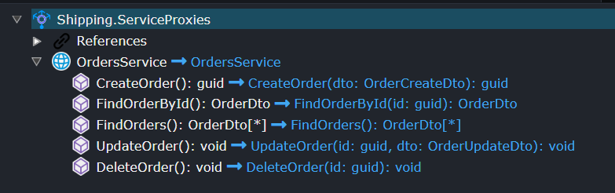

Available from:

- Intent.Integration.HttpClients 4.1.0
