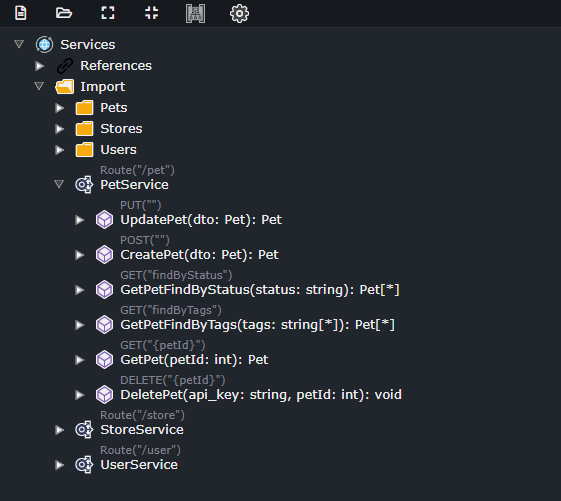
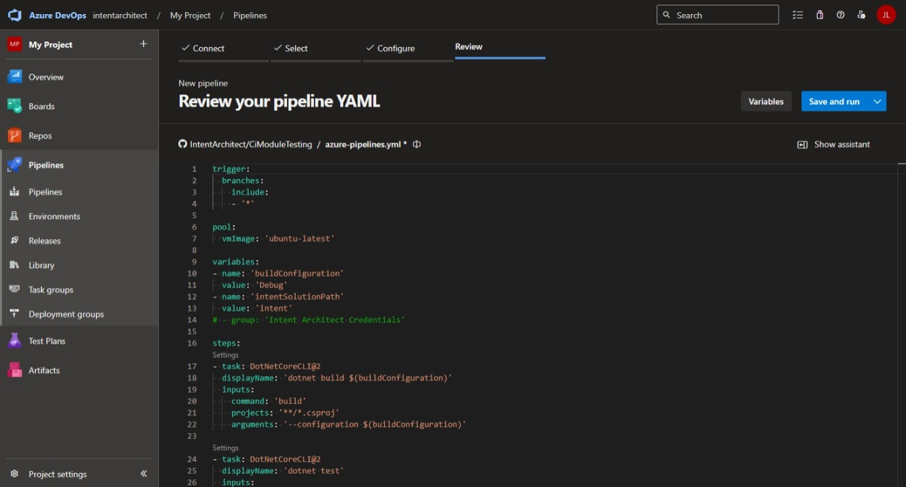
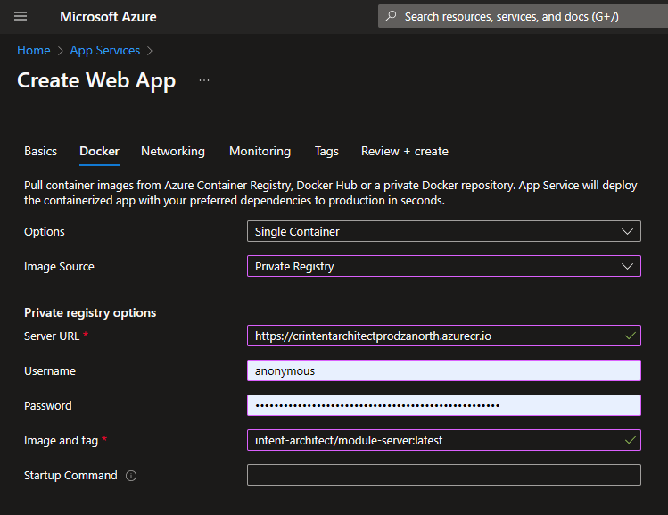
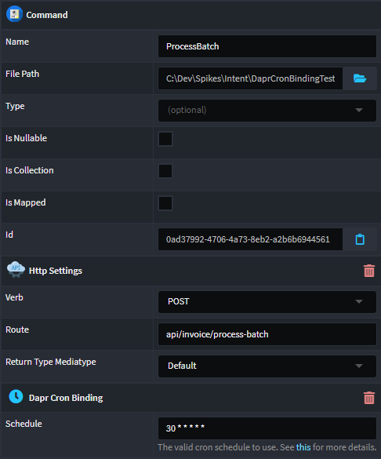
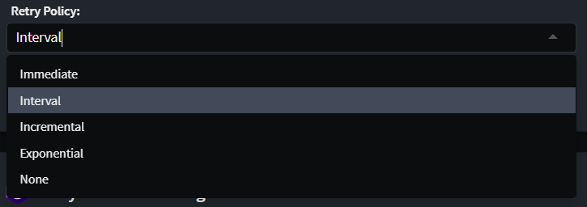

# August 2023

Welcome to the August 2023 edition of highlights of What's New with Intent Architect.

- Highlights

- More updates
  - **[Import OpenApi / Swagger documents into the Services Designer](#import-openapi--swagger-documents-into-the-services-designer)** - Created a new import tool for populating service package metadata from OpenApi / Swagger contracts.
  - **[Module building tutorial updated to use the File builder pattern](#module-building-tutorial-updated-to-use-the-file-builder-pattern)** - The module building tutorial has been updated to use the File builder pattern, more inline with how we recommend building templates today.
  - **[Modeling different Document DB technologies with-in one application](#modeling-different-document-db-technologies-with-in-one-application)** - Domain model packages can now be associated with a specific document store technology.
  - **[Dapr - Configuration Module](#dapr---configuration-module)** - Added a module for patterns around the Dapr Configuration building block.
  - **[Dapr - Secrets Module](#dapr---secrets-module)** - Added a module for patterns around the Dapr Secrets building block.
  - **[MassTransit Finbuckle integration](#masstransit-finbuckle-integration)** - Updated the MassTransit module to  support tenancy on messaging with Finbuckle.
  - **[Improved Queue Trigger support in Azure Functions applications](#improved-queue-trigger-support-in-azure-functions-applications)** - Improved the Azure Functions Queue Trigger functionality to support additional features.
  - **[Abstract domain operations](#abstract-domain-operations)** - Domain operations can now be modeled as abstract.
  - **[DataAnnotation validations on Blazor data contracts](#dataannotation-validations-on-blazor-data-contracts)** - Blazor proxies module now generated DataAnnotation validations on proxy contracts, inline with service modelled validations.
  - **[FluentValidation Custom Validators](#fluentvalidation-custom-validators)** - Ability to add [Custom Validator](https://docs.fluentvalidation.net/en/latest/custom-validators.html#writing-a-custom-validator) rules.
  - **[Shorthand C# Code Management Attributes](#shorthand-c-code-management-attributes)** - Alternative shorthand code management attributes such as `[IntentIgnore]` or `[IntentIgnoreBody]`.
  - **[File level C# Code Management "Tag Mode" control](#file-level-c-code-management-tag-mode-control)** - Specify that Tag Mode is explicit or implicit at a file level.
  - **[Azure Pipelines Module](#azure-pipelines-module)** - Generate a `azure-pipeline.yml` file to have Azure Pipelines build and test your code on every commit.
  - **[Module Server](#module-server)** - Self hostable Module Server for your organization's custom Modules and Application Templates.
  - **[Dapr CRON Binding](#dapr-cron-binding)** - Specify CRON schedules for invocation of `Command`s.
  - **[Azure Functions using `System.Text.Json` instead of `Newtonsoft.Json`](#azure-functions-using-systemtextjson-instead-of-newtonsoftjson)** - The Azure Functions patterns are now utilizing the utilizing System.Text.Json over the previously used Newtonsoft.Json.
  - **[CSharpFileBuilder offers CSharpEnum as part of builder pattern suite](#csharpfilebuilder-offers-csharpenum-as-part-of-builder-pattern-suite)** - Building Modules using the C# File Builder now has Enums as part of its builder suite.
  - **[`Intent.Application.MediatR.CRUD.Tests` now supports new test cases and more](#intentapplicationmediatrcrudtests-now-supports-new-test-cases-and-more)** - Generates unit tests for Paginated services, caters also for commands projecting onto Entity constructors and improved stability changes.
  - **[New delayed publishing messages for MassTransit](#new-delayed-publishing-messages-for-masstransit)** - Publish messages that will be dispatched at a future date using your Message Broker.
  - **[Override topic names in MassTransit](#override-topic-names-in-masstransit)** - Applying the `Message Topology Settings` stereotype on a message allows you to change the Entity Type which translates into a Message Broker's topic / exchange name.

## Update details

### Import OpenApi / Swagger documents into the Services Designer

We have released a new Metadata import tool which can import OpenApi / Swagger (3.*) documents and produce an Intent Architect `Service Package`.
Service can be imported in either the CQRS or traditional services paradigm.

Here is an example of having imported the [Pet Store 3 Swagger](https://petstore3.swagger.io/).



For more information on accessing and using the tool, check out the [documentation](https://docs.intentarchitect.com/articles/tools/open-api-metadata-synchronizer/open-api-metadata-synchronizer.html).

### Module building tutorial updated to use the File builder pattern

On our documentation website, we have updated the Module building tutorial to use the File Builder template paradigm, to be more inline with our own current template building practices.

You can find the start of the tutorial [here](https://docs.intentarchitect.com/articles/module-building/templates-general/tutorial-create-a-template/01-create-a-template-introduction/create-a-template-introduction.html).

### Modeling different Document DB technologies with-in one application

When creating a Domain Modelling package and marking it as a Document DB backed model, through the use of the the `Document Database` package stereotype,  you can now specify which Document DB technology you want this model to be realized as. This stereotype has a Provider property, to specify which specific type of Document Db technology the Domain Package should be realized in. This drop down has the following options.

- Default (None selected), if no provider is specified and you have a single Document DB Provider module installed (e.g. Intent.CosmosDB), that module will be used by default.
- Custom, the backing implementation will need to be implemented through custom code.
- Dynamic installed module providers (e.g. CosmosDB, MongoDd, Dapr), any Document DB Provider implementing modules will show as options here.

If you have multiple Document DB technologies you would need to configure which Domain Packages are for which Document DB technologies.

[Configure you Document DB Provider](./images/document-db-provider.png)

Available from:

- Intent.Metadata.DocumentDB 1.1.3

With the following DocumentDB providers

- Intent.CosmosDB 1.0.0-alpha.14
- Intent.MongoDb 1.0.3
- Intent.Dapr.AspNetCore.StateManagement 1.1.0

### Dapr - Configuration Module

A new module which implements patterns for working with Dapr (Distributed Application Runtime) Configuration component, alongside our existing Dapr modules.
The Dapr Configuration component is all about centralizing configuration for distributed systems.

Check out the module documentation for full [details](https://github.com/IntentArchitect/Intent.Modules.NET/tree/development/Modules/Intent.Modules.Dapr.AspNetCore.Configuration/README.md).

Available from:

- Intent.Dapr.AspNetCore.Secrets 1.0.0

### Dapr - Secrets Module

A new module which implements patterns for working with Dapr (Distributed Application Runtime) Secrets component, alongside our existing Dapr modules.
The Dapr Secrets component is all about centralizing secrets for distributed systems.

Check out the module documentation for full [details](https://github.com/IntentArchitect/Intent.Modules.NET/tree/development/Modules/Intent.Modules.Dapr.AspNetCore.Secrets/README.md).

Available from:

- Intent.Dapr.AspNetCore.Configuration 1.0.0

### MassTransit Finbuckle integration

Our MassTransit module now supports consuming and propagating tenancy information in message headers, when used in conjunction with Finbuckle.

Check out the module documentation for full [details](https://github.com/IntentArchitect/Intent.Modules.NET/blob/development/Modules/Intent.Modules.Eventing.MassTransit/README.md#multitenancy-finbuckle-integration).

Available from:

- Intent.Eventing.MassTransit 5.2.0

### Improved Queue Trigger support in Azure Functions applications

Our AzureFunctions module now has improved support for Queue Triggers. These improvement allow for:

- Gaining access to the message envelope
- Contracting response messages

Check out the module documentation for full [details](https://github.com/IntentArchitect/Intent.Modules.NET/blob/development/Modules/Intent.Modules.AzureFunctions/README.md#queue-triggers).

Available from:

- Intent.AzureFunctions 4.0.7

### Abstract domain operations

In the domain designer, operations can now bw marked as abstract resulting in the expected abstract implementation.

Available from:

- Intent.Entities 4.3.7

### DataAnnotation validations on Blazor data contracts

Blazor proxies now produce DataAnnotation validation attributes, like `Required` on `DTO` contracts inline which any validations configured on the services themselves.

Available from:

- Intent.Blazor.HttpClients 2.0.1

### FluentValidation Custom Validators

It is now possible to apply [Custom Validator Rules](https://docs.fluentvalidation.net/en/latest/custom-validators.html#writing-a-custom-validator) which allow custom failure messages to be specified. Previously it was only possible to add [Predicate Validator](https://docs.fluentvalidation.net/en/latest/custom-validators.html#predicate-validator).

This information is also documented in the [module's readme](https://github.com/IntentArchitect/Intent.Modules.NET/blob/development/Modules/Intent.Modules.Application.FluentValidation/README.md).

Available from:

- Intent.Application.FluentValidation 3.7.3

### Shorthand C# Code Management Attributes

Alternative shorthand code management attributes such as `[IntentIgnore]` or `[IntentIgnoreBody]` can now be used. These have been introduced as a less verbose option to the already existing instructions such as `[IntentManaged(<Mode>, Body = <Mode>)]`.

```csharp
[IntentIgnore]
[IntentFullySignature]
public void ChangeCountry(string country)
{
    throw new NotImplementedException();
}
```

For more information, refer to the [docs](https://docs.intentarchitect.com/articles/application-development/code-management/code-management-csharp/code-management-csharp.html#shorthand-attributes).

Available from:

- Intent.RoslynWeaver 4.2.0

### File level C# Code Management "Tag Mode" control

It is now possible to specify that Tag Mode is explicit or implicit at a file level whereas before it could only be configured globally in application settings.

For more information, refer to the [docs](https://docs.intentarchitect.com/articles/application-development/code-management/code-management-csharp/code-management-csharp.html#tag-mode-attributes).

Available from:

- Intent.RoslynWeaver 4.2.0

### Azure Pipelines Module

Scaffolds a basic Azure Pipelines pipeline which will attempt to compile your solution on every commit and ensure there are no outstanding Intent Architect changes.



See the [module's readme](https://github.com/IntentArchitect/Intent.Modules.NET/blob/master/Modules/Intent.Modules.ContinuousIntegration.AzurePipelines/README.md) for more information.

Available from:

- Intent.ContinuousIntegration.AzurePipelines 1.0.0

### Module Server

A self-hostable "Module Server" in the form of a Docker image is now available. The [Module Server Client CLI](https://docs.intentarchitect.com/articles/tools/module-server-client-cli/module-server-client-cli.html) can be used to upload Modules and Application templates to it and then Intent Architect clients can be configured to use the server as a repository for your organization's custom Modules and Application Templates.



For full details, refer to the [docs](https://docs.intentarchitect.com/articles/tools/module-server/module-server.html).

### Dapr CRON Binding

Right-click any `Command` and apply the `Dapr Cron Binding` stereotype to have it invoked by Dapr on that CRON schedule.



See the [module's readme](https://github.com/IntentArchitect/Intent.Modules.NET/blob/master/Modules/Intent.Modules.Dapr.AspNetCore.Bindings.Cron/README.md) for more information.

Available from:

- Intent.Dapr.AspNetCore.Bindings.Cron 1.0.0

### Azure Functions using `System.Text.Json` instead of `Newtonsoft.Json`

The Azure Functions patterns are now utilizing the utilizing `System.Text.Json` over the previously used `Newtonsoft.Json`. This change aims to offer improved performance and reduced memory footprint for serverless workloads.

Available from:

- Intent.AzureFunctions 4.0.8

### CSharpFileBuilder offers CSharpEnum as part of builder pattern suite

Building Modules using the C# File Builder now has Enums as part of its builder suite.

```csharp
new CSharpFile("Project.Domain", "Enums")
    .AddUsing("System")
    .AddEnum("AddressType", e =>
    {
        e.AddAttribute(@"[Description(""Address Type"")]");
        e.AddLiteral("Residential", "1");
        e.AddLiteral("PostOffice", "2");
        e.AddLiteral("Office", "3");
    });
```

Available from:

- Intent.Common.CSharp 3.3.40

### `Intent.Application.MediatR.CRUD.Tests` now supports new test cases and more

Generates unit tests for Paginated services, caters also for commands projecting onto Entity constructors and improved stability changes.

> [!NOTE]
> Some unit test names and unit test logic has been updated to conform with other names and to fix certain test logic.

For a full list of changes refer to the [release notes](https://github.com/IntentArchitect/Intent.Modules.NET/blob/master/Modules/Intent.Modules.Application.MediatR.CRUD.Tests/release-notes.md).

Available from:

- Intent.Application.MediatR.CRUD.Tests 1.2.0

### New delayed publishing messages for MassTransit

Publish messages that will be dispatched at a future date using your Message Broker.

See the [module's readme](https://github.com/IntentArchitect/Intent.Modules.NET/blob/master/Modules/Intent.Modules.Eventing.MassTransit.Scheduling/README.md) for more information.

Available from:

- Intent.Eventing.MassTransit.Scheduling 1.0.0

### Override topic names in MassTransit

Applying the `Message Topology Settings` stereotype on a message allows you to change the Entity Type which translates into a Message Broker's topic / exchange name.


Available from:

- Intent.Eventing.MassTransit 5.2.0

### Specify Retry policy in MassTransit

Specify the default retry policy in MassTransit by selecting one of the newly added retry policies.



See the [module's readme](https://github.com/IntentArchitect/Intent.Modules.NET/blob/master/Modules/Intent.Modules.Eventing.MassTransit/README.md#retry-policy-setting) for more information.

Available from:

- Intent.Eventing.MassTransit 5.2.0
