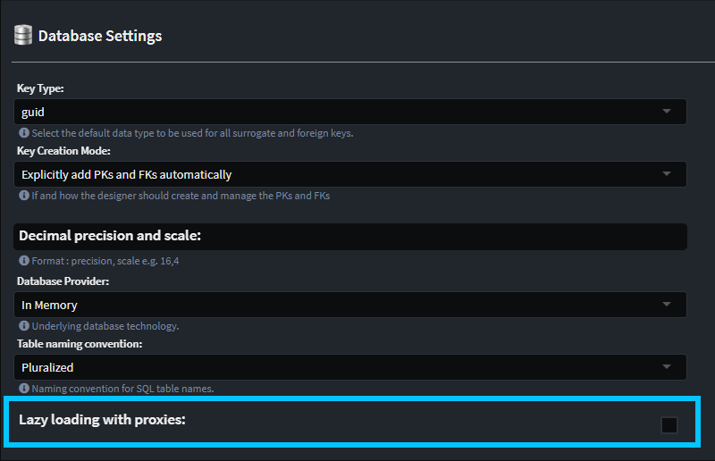

# September 2023

Welcome to the September 2023 edition of highlights of What's New with Intent Architect.

- Highlights
  - **[Highlight 1](#highlight-1)** - Highlight 1 summary.
- More updates
  - **[Blazor WebAssembly bootstrap module](#blazor-webassembly-bootstrap-module)** - Bootstraps a Blazor WebAssembly project.
  - **[Blazor Server bootstrap module](#blazor-server-bootstrap-module)** - Bootstraps a Blazor Server infrastructure into an ASP.Net Core application.
  - **[Intent Architect in your development environment article](#intent-architect-in-your-development-environment-article)** - General guide on how to use Intent Architect within your Software Development Life Cycle.
  - **[Cosmos DB paging support](#cosmos-db-paging-support)** - Cosmos DB module now supports paging patterns inline with our other repository patterns.
  - **[Azure Function Cosmos DB Triggers](#azure-function-cosmos-db-triggers)** - You can not model Cosmos DB triggers in the Service Designer.
  - **[EF Core configurable lazy loading proxies](#ef-core-configurable-lazy-loading-proxies)** - You can now configure whether or not you want you EF Core implementation to support Lazy Loading proxies.
  - **[DB Schema Importer Filtering](#db-schema-importer-filtering)** - You can now apply filtering you which DB artifacts you wish to import.
  - **[Specify Default API Route Prefix](#specify-default-api-route-prefix)** - Define the API Route Prefix for newly created services.
  - **[Validate unique constraints with Fluent Validation](#validate-unique-constraints-with-fluent-validation)** - Enabling this validation will look at your indexed fields to ensure the Fluent Validator can catch whether a Create/Update is violating a unique constraint.

- Java updates
  - **[Updated modules to support Spring Boot v3](#updated-modules-to-support-spring-boot-v3)** - The Spring Boot module now supports a version selection setting to upgrade from v2 to v3.
  - **[Domain entities moved away from using the @Data annotation](#domain-entities-moved-away-from-using-the-data-annotation)** - Following best practices, the Java Spring Boot community suggests avoiding the @Data annotation from Lombok on domain entities.

## Update details

### Blazor WebAssembly bootstrap module

This modules bootstraps a Blazor WebAssembly project into an Intent Architect solution. This includes all the infrastructural setup and a functional Blazor WebAssembly sample.

Full details available in the [documentation](https://github.com/IntentArchitect/Intent.Modules.NET/blob/development/Modules/Intent.Modules.Blazor.WebAssembly/README.md).

Available from:

- Intent.Blazor.WebAssembly 1.0.0-alpha.2

### Blazor Server bootstrap module

This modules bootstraps a Blazor Server infrastructure into an existing Intent Architect ASP.Net Core solution. This include wiring into the existing infrastructural setup and a functional Blazor Server sample.

Full details available in the [documentation](https://github.com/IntentArchitect/Intent.Modules.NET/blob/development/Modules/Intent.Modules.Blazor.Server/README.md).

Available from:

- Intent.Blazor.Server 1.0.0-alpha.1

### Intent Architect in your development environment article

This article covers various aspect's of working with Intent Architect within your Software Development Life Cycle, and covers the following topics:

- How Intent Architect solutions are structured on the file system.
- Using Intent Architect solutions with Version Control.
- Integrating Intent Architect solutions with your CI/CD Pipelines.
- Configuring module discovery.

Available on our website [here](https://docs.intentarchitect.com/articles/application-development/development-environment/intent-in-the-development-environment.html).

### Cosmos DB paging support

This module now supports paging functions of the repository, in-line with our other DB technology modules.

The Cosmos DB repositories now implement overloads as follows:

```csharp

Task<IPagedResult<TDomain>> FindAllAsync(int pageNo, int pageSize, CancellationToken cancellationToken = default);
Task<IPagedResult<TDomain>> FindAllAsync(Expression<Func<TPersistence, bool>> filterExpression, int pageNo, int pageSize, CancellationToken cancellationToken = default);

```

Available from:

- Intent.CosmosDB 1.0.0-alpha.22

### Azure Function Cosmos DB Triggers

Our Azure Function modelling already had support for several trigger types, we have now added `Cosmos DB Trigger` to the list of supported triggers to model.

Full details available in the [documentation](https://github.com/IntentArchitect/Intent.Modules.NET/blob/development/Modules/Intent.Modules.AzureFunctions/README.md#cosmos-db-triggers)

Available from:

- Intent.AzureFunctions 4.0.9

### EF Core configurable lazy loading proxies

Historically our EF Core module generated the code such that is supported Lazy Loading Proxies, this is now configurable. It is turned on by default for backwards compatibility and can be turned if if this functionality is not desired.



Full details available in the [documentation](https://github.com/IntentArchitect/Intent.Modules.NET/blob/development/Modules/Intent.Modules.EntityFrameworkCore/README.md#database-settings---lazy-loading-with-proxies).

Available from:

- Intent.EntityFrameworkCore 4.4.11

### DB Schema Importer Filtering

There have been several enhancements made to our DB import tool, including the ability to filter which DB objects get imported, currently you can filter by:

- Object Type, filter the import based on object type i.e `Table`s, `View`s, and/or `Stored Procedure`s
- Schema, Limit the import to one or more `schema`s.

Full details available in the [documentation](https://github.com/IntentArchitect/Intent.SqlSchemaExtractor/blob/master/README.md#run-the-tool).

Available from:

- Intent.SQLSchemaExtractor.exe 1.1.0

### Specify Default API Route Prefix

Define the API Route Prefix for newly created services.

Example:


Becomes:


Available from:

- Intent.AspNetCore.Controllers 5.4.0

### Validate unique constraints with Fluent Validation

Enabling this validation will look at your indexed fields to ensure the Fluent Validator can catch whether a Create/Update is violating a unique constraint.

Enable it from the Module Settings page:


Add an Index to the Entity:


Ensure the Unique flag is set:


Add services that map to the Entity while using Fluent Validation for DTO validation:


After the Software Factory is executed, you will see code like this:

```csharp
public class CreateContactPersonCommandValidator : AbstractValidator<CreateContactPersonCommand>
{
    private readonly IContactPersonRepository _contactPersonRepository;
    [IntentManaged(Mode.Merge)]
    public CreateContactPersonCommandValidator(IContactPersonRepository contactPersonRepository)
    {
        ConfigureValidationRules();
        _contactPersonRepository = contactPersonRepository;
    }

    private void ConfigureValidationRules()
    {
        RuleFor(v => v.FirstName)
            .NotNull();

        RuleFor(v => v.LastName)
            .NotNull();

        RuleFor(v => v.ContactNumber)
            .NotNull();

        RuleFor(v => v)
            .MustAsync(CheckUniqueConstraint_FirstName_LastName)
            .WithMessage("The combination of FirstName and LastName already exists.");
    }

    private async Task<bool> CheckUniqueConstraint_FirstName_LastName(
        CreateContactPersonCommand model,
        CancellationToken cancellationToken)
    {
        return !await _contactPersonRepository.AnyAsync(p => p.FirstName == model.FirstName && p.LastName == model.LastName, cancellationToken);
    }
}
```

Available from:

- Intent.Application.FluentValidation 3.8.1
- Intent.Application.FluentValidation.Dtos 3.7.0
- Intent.Application.MediatR.FluentValidation 4.4.0

### Updated modules to support Spring Boot v3

The Spring Boot module now supports a version selection setting to upgrade from v2 to v3. This not only provides Maven dependency updates and API code code changes, but also some improved patterns to existing code even under Spring Boot v2.

Available from:

- Intent.Java.SpringBoot 3.6.0

Other Java modules that will require updates:

- Intent.Java.SpringBoot.Security 3.4.0
- Intent.Java.BeanValidation 3.4.0
- Intent.Java.Domain.Maven 1.2.0
- Intent.Java.ModelMapper 3.4.0
- Intent.Java.Persistence.JPA.Queries 3.5.0
- Intent.Java.Persistence.JPA 4.2.0
- Intent.Java.Services.CRUD 3.6.0
- Intent.Java.Spring.Data.Repositories 4.3.0
- Intent.Java.SpringDoc.OpenApi 1.1.0
- Intent.Java.Spring.Cors 3.4.0
- Intent.Java.SpringBoot.Validation 3.4.0
- Intent.Java.Domain 4.2.0

### Domain entities moved away from using the @Data annotation

Following best practices, the Java Spring Boot community suggests avoiding the `@Data` annotation from Lombok on domain entities. More details can be found in this [article](https://thorben-janssen.com/lombok-hibernate-how-to-avoid-common-pitfalls/) and [this blog post](https://jpa-buddy.com/blog/lombok-and-jpa-what-may-go-wrong/).

Available from:

- Intent.Java.Domain 4.2.0
