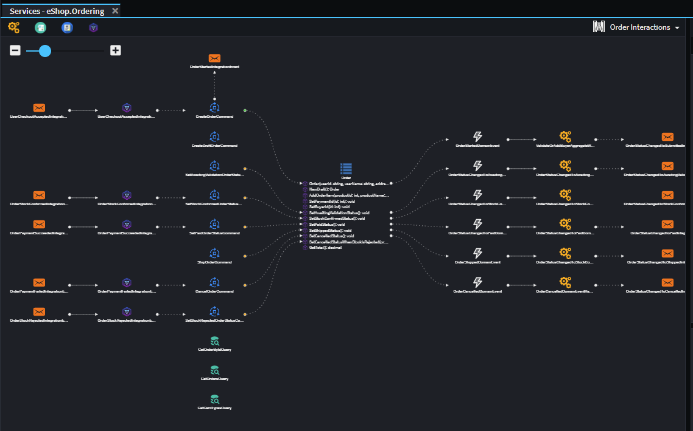
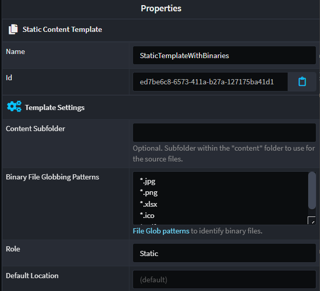
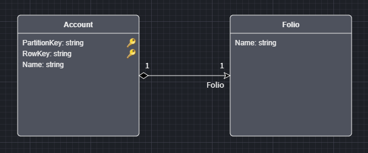

# October 2023

Welcome to the October 2023 edition of highlights of What's New with Intent Architect.

- Highlights
  - **[Intent Architect 4.1 (Beta)](#intent-architect-41-beta)** - Intent Architect 4.1 is now available as a Beta version, with many new product features.
  - **[Binary Output Template support](#binary-output-template-support)** - Intent Architect now supports creating templates which produce binary files, as opposed to text based files.
  - **[Azure Table Storage support](#azure-table-storage-support)** - Azure Table Storage is now available as a persistence option for Domain Modeling.
  - **[Support for NuGet Central Package Management (CPM)](#support-for-nuget-central-package-management-cpm)** - Centralize `.csproj` NuGet package versions using a `Directory.Packages.props` file.

- More updates
  - **[Specify OpenAPI `operationId` values for endpoints](#specify-openapi-operationid-values-for-endpoints)** - Control the OpenAPI `operationId` which is generated into service definitions.
  - **[OpenAPI specifications now have non-nullable fields marked as required](#openapi-specifications-now-have-non-nullable-fields-marked-as-required)** - In the Swagger UI, non-nullable fields on contracts will now show as required.
  - **[Domain Event refinements](#domain-event-refinements)** - Domain eventing implementation can be aligned with domain event modeling.
  - **[CRUD Command/Query consumption convenience](#crud-commandquery-consumption-convenience)** - When Controller parameters match with Command/Query fields, we've made consuming these endpoints easier.
  - **[CRUD scripting improvements around "required"/"non-nullable" aggregational association foreign keys](#crud-scripting-improvements-around-requirednon-nullable-aggregational-association-foreign-keys)** - In the Services Designer, `Map to Domain Data` now automatically adds aggregational association foreign keys for RDBMS domain packages.
  - **[Combine query/command files and their respective handlers and validators](#optionally-have-querycommand-files-along-with-their-respective-handlers-and-validators-all-combined-into-a-single-file)** - Optionally have query/command files along with their respective handlers and validators all combined into a single file.

## Update details

### Intent Architect 4.1 (Beta)

This release of Intent Architect is fully backward compatible with V4.0.x. It does simultaneously come with functionality that is not available in V4.0.x that, if used, would require other team members working on that application to upgrade to V4.1.x or higher.

The main new features are as follows:

- Service Designer Diagrams
- Advanced Mapping System
- Enhanced Diagram Capabilities
- Error Management Enhancements



For more detail, refer to the [product release notes](xref:release-notes.intent-architect-v4.1) and watch our [webinar](https://intentarchitect.com/#/redirect/?category=resources&subCategory=webinar-introduction-to-intent-architect-v4.1) covering the 4.1 changes.

Available from:

- Intent Architect 4.1.*

### Binary Output Template support

If is now possible to create templates which output Binary files as opposed to only supporting text-based files. From within the Module Builder the following Templates support binary output options:

- File Template
- Static Content Template

#### File Template Configuration


#### Static Content Template Configuration



For more detail, refer to the [module documentation](https://github.com/IntentArchitect/Intent.Modules/blob/release/4.1.x/Modules/Intent.Modules.ModuleBuilder/README.md).

Available from:

- Intent Architect 4.1.*
- Intent.ModuleBuilder 3.7.0-beta.1

### Azure Table Storage support

This module brings in a new `Document Database Provider`, `Azure.TableStorage`, allowing you realize your DocumentDB paradigm Domain Models with an Azure Table Storage persistence layer. This module includes

- Modeler customizations.
- Table Storage repositories.
- Table Storage unit of work.
- Improve support for compositional key support in CRUD scripting.



For more detail, refer to the [module documentation](https://github.com/IntentArchitect/Intent.Modules.NET/blob/development/Modules/Intent.Modules.Azure.TableStorage/README.md).

Available from:

- Intent Architect 4.1.*
- Intent.Azure.TableStorage 1.0.0-beta.*

### Support for NuGet Central Package Management (CPM)

In .NET, [Central Package Management (CPM)](https://learn.microsoft.com/nuget/consume-packages/central-package-management) allows management of versions of NuGet packages for multiple .csproj from a central Directory.Packages.props file and an MSBuild property.

You can now specify you wish to use CPM for your Solution and Intent will then manage your NuGet package versions accordingly:


For more information refer to the module's [README](https://github.com/IntentArchitect/Intent.Modules.NET/blob/development/Modules/Intent.Modules.VisualStudio.Projects/README.md#central-package-management).

Available from:

- Intent.VisualStudio.Projects 3.4.0

### Specify OpenAPI `operationId` values for endpoints


A new `OpenAPI Settings` stereotype can be applied to endpoints (Commands, Queries, Operations and Azure Functions) to control its [`operationId`](https://swagger.io/docs/specification/paths-and-operations/), see [here](https://github.com/IntentArchitect/Intent.Modules/blob/development/Modules/Intent.Modules.Metadata.WebApi/README.md) for more information.

Available from:

- Intent.Metadata.WebApi 4.3.1
- Intent.AspNetCore.Controllers 5.4.2
- Intent.AzureFunctions.OpenApi 1.0.3

### OpenAPI specifications now have non-nullable fields marked as required

Swashbuckle has now been configured to automatically mark fields for non-nullable properties as required in the the generated `swagger.json` file.

Available from:

- Intent.AspNetCore.Swashbuckle 4.0.9

### Domain Event refinements

Previously domain eventing infrastructure was added to all Aggregate roots with-in your domain model, we have now added a new application setting "Domain Settings -> Implement Domain Eventing on", which has the following option:

- **All Aggregates**, this option is the original behaviour and is the default option for backwards compatibility.
- **Aggregates with modelled Domain Events**, only Aggregate roots with Domain Event publishing modelled against them, with get the Domain Eventing related code.

Available from:

- Intent.DomainEvents 4.1.2

### CRUD Command/Query consumption convenience

When API Controller parameters match with Command/Query fields, we've made consuming these endpoints easier. Now, you don't need to populate the fields on the Command/Query objects that are already populated via a Route parameter.

Previously you had to specify the Id for an Update Command via the Route parameter and the Command itself. Now if you have a parameter being specified elsewhere (e.g. Url Route), it will prefer that as the source.

```csharp
[HttpPut("api/person/{id}")]
public async Task<ActionResult> UpdatePerson(
    [FromRoute] Guid id,
    [FromBody] UpdatePersonCommand command,
    CancellationToken cancellationToken = default)
{
    if (command.Id == default)
    {
        command.Id = id;
    }
    if (id != command.Id)
    {
        return BadRequest();
    }

    await _mediator.Send(command, cancellationToken);
    return NoContent();
}
```

> [!NOTE]
> Note that specifying the `Id` property in the Command will still be accepted so a check is performed to see whether it is the same as the Route Parameter value.

Available from:

- Intent.AspNetCore.Controllers 5.4.1
- Intent.Application.MediatR 4.1.4
- Intent.AspNetCore.Controllers.Dispatch.MediatR 5.4.0

### CRUD scripting improvements around "required"/"non-nullable" aggregational association foreign keys

In the Services Designer, `Map to Domain Data` now automatically adds aggregational association foreign keys in the RDBMS paradigm.


Looking at the above model, performing `Map to Domain Data` on the `CreateInvoiceCommand` and selecting to include `LineItem` will now include `ProductId` as part of the `CreateInvoiceItemDto`.

Available from:

- Intent.Application.MediatR.CRUD 5.3.1

### Optionally have query/command files along with their respective handlers and validators all combined into a single file

Introduced new "Consolidate Command/Query associated files into single file" setting. When enabled, commands/queries are no longer generated into sub-folders and their respective handlers and validators (as applicable) are now embedded within them as opposed to being generated separately. See the [README](https://github.com/IntentArchitect/Intent.Modules.NET/blob/development/Modules/Intent.Modules.Application.MediatR/README.md#cqrs-settings) for more details.

Available from:

- Intent.Application.MediatR 4.1.4
