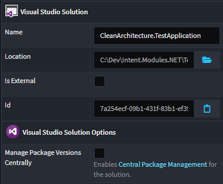
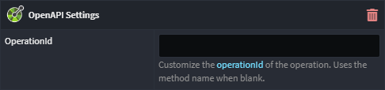
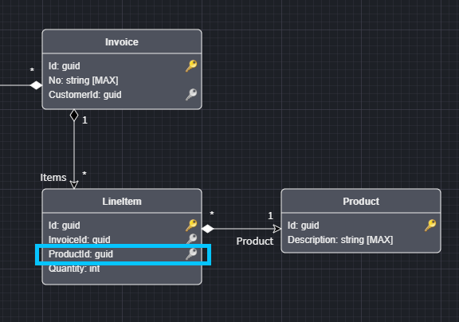

# October 2023

Welcome to the October 2023 edition of highlights of What's New with Intent Architect.

- Highlights

- More updates
  - **[Binary output template support](#binary-output-template-support)** - Intent Architect now support creating templates which produce binary files, as opposed to text based files.
  - **[Azure Table Storage Support](#azure-table-storage-support)** - Azure Table Storage is now available as a persistance option for Domain Modeling.
  - **[Support for NuGet Central Package Management (CPM)](#support-for-nuget-central-package-management-cpm)** - Centralize `.csproj` NuGet package versions using a `Directory.Packages.props` file.
  - **[Specify OpenAPI `operationId` values for endpoints](#specify-openapi-operationid-values-for-endpoints)** - Control the OpenAPI `operationId` which is generated into service definitions.
  - **[Domain Event Refinements](#domain-event-refinements)** - Domain eventing implementation can be aligned with domain event modeling.
  - **[Apple Silicon Support](#apple-silicon-support)** - Intent Architect now runs code natively for Apple Silicon based Macs.
  - **[CRUD Update Command consumption convenience](#crud-update-command-consumption-convenience)** - When Controller parameters match with Update Command fields, we've made consuming these endpoints easier.
  - **[CRUD Scripting improvements](#crud-scripting-improvements)** - In the Services Designer, `Map to Domain Data` now automatically adds aggregational association foreign keys for RDBMS domain packages.

## Update details

### Azure Table Storage Support

This module brings in a new `Document Database Provider`, `Azure.TableStorage`, allowing you realize your DocumentDB paradigm Domain Models with an Azure Table Storage persistance layer. This module includes

- Modeler customizations.
- Table Storage repositories.
- Table Storage unit of work.
- Improve support for compositional key support in CRUD scripting.

For more detail, refer to the [module documentation](https://github.com/IntentArchitect/Intent.Modules.NET/blob/development/Modules/Intent.Modules.Azure.TableStorage/README.md).

Available from:

- Intent Architect 4.1.*
- Intent.Azure.TableStorage 1.0.0-beta.*
- Intent.Application.MediatR.CRUD 6.0.0-beta.0

### Binary output template support


### Support for NuGet Central Package Management (CPM)

In .NET, [Central Package Management (CPM)](https://learn.microsoft.com/nuget/consume-packages/central-package-management) allows management of versions of NuGet packages for multiple .csproj from a central Directory.Packages.props file and an MSBuild property.

You can now specify you wish to use CPM for your Solution and Intent will then manage your NuGet package versions accordingly:



For more information refer to the module's [README](https://github.com/IntentArchitect/Intent.Modules.NET/blob/development/Modules/Intent.Modules.VisualStudio.Projects/README.md#central-package-management).

Available from:

- Intent.VisualStudio.Projects 3.4.0

### Specify OpenAPI `operationId` values for endpoints



A new `OpenAPI Settings` stereotype can be applied to endpoints (Commands, Queries, Operations and Azure Functions) to control its [`operationId`](https://swagger.io/docs/specification/paths-and-operations/), see [here](https://github.com/IntentArchitect/Intent.Modules/blob/development/Modules/Intent.Modules.Metadata.WebApi/README.md) for more information.

Available from:

- Intent.Metadata.WebApi 4.3.1
- Intent.AspNetCore.Controllers 5.4.2
- Intent.AzureFunctions.OpenApi 1.0.3

### Domain Event Refinements

Previously domain eventing infrastructure was added to all Aggregate roots with-in your domain model, we have now added a new application setting "Domain Settings -> Implement Domain Eventing on", which has the following option:

- **All Aggregates**, this option is the original behaviour and is the default option for backwards compatibility.
- **Aggregates with modelled Domain Events**, only Aggregate roots with Domain Event publishing modelled against them, with get the Domain Eventing related code.

Available from:

- Intent.DomainEvents 4.1.2

### Apple Silicon Support

macOS releases are now published as "universal" packages which will run code natively for both Intel and Apple Silicon based Macs.

Available from:

- Intent Architect 4.1

### CRUD Update Command consumption convenience

When Controller parameters match with Update Command fields, we've made consuming these endpoints easier. Now, you don't need to populate the fields on the Command that are already populated via a Route parameter.

Previously you had to specify the Id for an Update Command via the Route parameter and the Command itself. Now if you have a parameter being specified elsewhere (e.g. Url Route) is found, it will prefer that as the source. Note the specifying the `Id` property in the Command will still be accepted so it needs to be the same as the Route Parameter value.

```csharp
[HttpPut("api/person/{id}")]
public async Task<ActionResult> UpdatePerson(
    [FromRoute] Guid id,
    [FromBody] UpdatePersonCommand command,
    CancellationToken cancellationToken = default)
{
    if (command.Id == default)
    {
        command.Id = id;
    }
    if (id != command.Id)
    {
        return BadRequest();
    }

    await _mediator.Send(command, cancellationToken);
    return NoContent();
}
```

Available from:

- Intent.AspNetCore.Controllers 5.4.1
- Intent.Application.MediatR 4.1.4
- Intent.AspNetCore.Controllers.Dispatch.MediatR 5.4.0

### CRUD Scripting improvements

In the Services Designer, `Map to Domain Data` now automatically adds aggregational association foreign keys in the RDBMS paradigm.



Looking at the above model, performing `Map to Domain Data` on the `CreateInvoiceCommand` and selecting to include `LineItem` will now include `ProductId` as part of the `CreateInvoiceItemDto`.

Available from:

- Intent.Application.MediatR.CRUD 5.3.1
