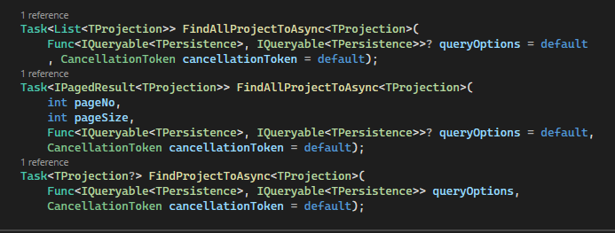
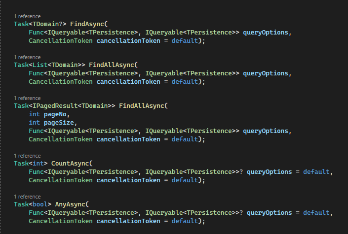
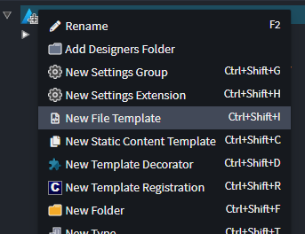
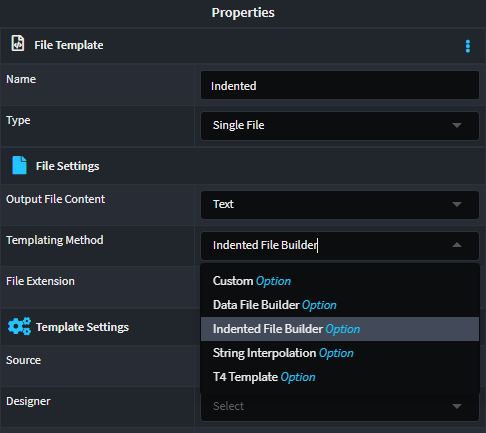
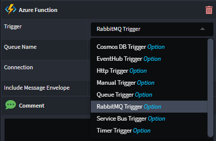
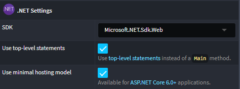

# November 2023

Welcome to the November 2023 edition of highlights of What's New with Intent Architect.

- Highlights
  - **[.NET 8 support](#net-8-support)** - All modules have been updated to support .NET 8.
  - **[OData Query support](#odata-query-support)** - Leverage OData query functionality on your ASP.Net Core controllers.
  - **[AutoMapper Projection support on EF repositories](#automapper-projection-support-on-ef-repositories)** - Added support to for AutoMapper Projections on the EF repository pattern.
  - **[Improvements to C# statement merging](#c-code-management-statement-block-merging-improvements)** - Improvements to heuristics and instructions for controlling statement merging behaviour within method bodies.
  - **[EF repository enhancements](#ef-repository-enhancements)** - Added several overloads to EF repositories to make LINQ features more available.
- More updates
  - **["Indented" and "data" template file builders](#indented-and-data-file-builders-for-templates)** - More quickly author templates for files such as JSON and YAML and in a way that can be easily extended by other modules.
  - **[Documentation on Designer Scripting with Javascript](#documentation-on-designer-scripting-with-javascript)** - New article that introduces and explains the designer scripting capabilities of Intent Architect.
  - **[RabbitMQ Trigger for Azure Functions added](#rabbitmq-trigger-for-azure-functions-added)** - RabbitMQ Triggers for queue integration now available on the Azure Functions module.
  - **[EF Bulk Operations module](#ef-bulk-operations-module)** - Extends EF repositories to support Bulk Operations.
  - **[Synchronous method support on EF repositories](#synchronous-method-support-on-ef-repositories)** - Optionally add synchronous repository method overloads through an application setting.
  - **[Email Address Validation](#email-address-validation)** - "Email Address" checkbox property added to the "Validation" stereotype.
  - **[Prevent updates to Basic Auditing created values](#prevent-basic-auditings-created-column-values-from-being-updated-later)** - Possible updates to CreatedBy and CreatedDate values are now blocked.
  - **[Account Controller improvements](#account-controller-improvements)** - Multiple improvements to the the refresh token endpoint.
  - **[Software Factory statistics improvements](#removed-dependency-on-git-executable-for-software-factory-statistics)** - Gathering Software Factory statistics (lines managed, added, remove) is now faster and no longer requires Git.
  - **[IApplicationDbContext option now available](#iapplicationdbcontext-interface)** - It is now possible to expose Entity Framework's `DbSet`s to your application's "Application" layer.
  - **[Entity Framework split queries support](#enable-entity-framework-split-queries)** - It is now possible enable [split queries](https://learn.microsoft.com/ef/core/querying/single-split-queries#enabling-split-queries-globally) for an application.
  - **[NET 6+ Simple Hosting Model](#net-6-simple-hosting-model)** - Support for `Use minimal hosting model` and `Use top-level statements` on `.NET Project`s.
  - **[AutoMapper version upgrade](#automapper-version-upgrade)** - Upgraded various AutoMapper dependencies to the latest version.

## Update details

### .NET 8 support

Final support for Intent Architect's modules for .NET 8 has been added, this includes auto upgrading of NuGet packages to their .NET 8 versions.

> [!NOTE]
> Intent Architect will need to be upgraded to the 4.1.0 beta or greater before the following modules will be visible.

Available from:

- Intent.Application.DependencyInjection 4.0.7
- Intent.Application.MediatR.Behaviours 4.2.7
- Intent.Modules.AspNetCore.Docker 3.3.9
- Intent.AspNetCore.HealthChecks 2.0.0
- Intent.AspNetCore.Identity.AccountController 3.0.1
- Intent.AspNetCore.Identity 4.0.8
- Intent.Modules.AspNetCore.MultiTenancy 5.1.0
- Intent.AspNetCore.Versioning 1.0.4
- Intent.EntityFrameworkCore.DesignTimeDbContextFactory 4.0.7
- Intent.EntityFrameworkCore 4.4.16
- Intent.Eventing.GoogleCloud.PubSub 1.0.6
- Intent.IdentityServer4.Identity.EFCore 4.0.6
- Intent.Infrastructure.DependencyInjection 4.0.8
- Intent.Security.JWT 4.1.7
- Intent.Security.MSAL 4.1.7
- Intent.VisualStudio.Projects 3.5.0

### OData Query support

This modules adds OData Query support to your CQRS paradigm service end points, specifically `Query`s.


For more detail, refer to the [module documentation](https://github.com/IntentArchitect/Intent.Modules.NET/blob/development/Modules/Intent.Modules.AspNetCore.ODataQuery/README.md).

Available from:

- Intent.AspNetCore.ODataQuery 1.0.0-beta.*

### AutoMapper Projection support on EF repositories

The AutoMapper not add Projection support to the Entity Framework Core Repository's.
The following methods will query the relevant `Entity` and the use AutoMapper->ProjectTo functionality to materialize the results.



Available from:

- Intent.Application.AutoMapper 5.0.0

### C# Code Management statement block merging improvements

Improvements have been made to code management within statement blocks.

- For most statement types, old statements will now be removed from existing files when a template's output has changed.
- Instead of using `// [IntentMatch("…")]` above statements to control how they match with a statement generated by a template, one should now use the more intuitive `// [IntentFully(Match = "…")]` or `// [IntentIgnore(Match = "…")]` instructions.

For more information on controlling statement code management behaviour, refer to [our Docs article](https://docs.intentarchitect.com/articles/application-development/code-management/code-management-csharp/code-management-csharp.html#block-statement-code-management-behaviour).

Available from:

- Intent.OutputManager.RoslynWeaver 4.4.0

### EF repository enhancements

Added several overloads to EF repositories to make generic LINQ features easier to express, for example OrderBy, Include, etc.



Available from:

- Intent.EntityFrameworkCore.Repositories 4.3.0

### Indented and Data File builders for templates

New `IndentedFile` and `DataFile` classes have been introduced which work in essentially the same way as the `CSharpFile` class where they employ use of a builder pattern to allow easy authoring of templates.

Both of these new classes should be immediately familiar to anyone who has used the `CSharpFile` builder when authoring templates, they add an interface to the template allowing other modules to access them for potential manipulation without requiring a hard dependency. Furthermore, metadata can be added to the different parts of the files for further introspection and structure.

The `IndentedFile` class is used for authoring of simple "indented" files, it has a `WithItems("…")` and a `WithContent("…")` method. The former will increase indentation and the latter will add content at the current indentation.

The `Datafile` class is used for authoring of structured data files such as JSON and YAML and has methods such as `WithArray("…")`, `WithObject("…")` and  `WithValue("…")`.

To get started, ensure you have the latest module builder installed and create a _New File Template_:



Then in the properties pane on the right, select the desired _Template Method_:



Once you've run the Software Factory, author your template:

```csharp
public class YamlTestTemplate : IntentTemplateBase<object>, IDataFileBuilderTemplate
{
    [IntentManaged(Mode.Fully)]
    public const string TemplateId = "CustomModule.YamlTest";

    [IntentManaged(Mode.Fully, Body = Mode.Ignore)]
    public YamlTestTemplate(IOutputTarget outputTarget, object model = null) : base(TemplateId, outputTarget, model)
    {
        DataFile = new DataFile($"YamlTest")
            .WithYamlWriter()
            .WithRootObject(this, @object =>
            {
                @object
                    .WithObject("objectField", @object => {
                        @object.WithValue("field1", "value1");
                        @object.WithValue("field1", "value2");
                    })
                    .WithArray("arrayField", array => {
                        array.WithValue("value1");
                        array.WithValue("value2");
                    })
                    .WithValue("multilineField", """
                                                 A multiline statement's first line.
                                                 Additional line.
                                                 
                                                 After a blank line.
                                                 """)
                ;
            });
    }

    [IntentManaged(Mode.Fully)]
    public IDataFile DataFile { get; }

    [IntentManaged(Mode.Fully)]
    public override ITemplateFileConfig GetTemplateFileConfig() => DataFile.GetConfig();

    [IntentManaged(Mode.Fully)]
    public override string TransformText() => DataFile.ToString();
}
```

Available from:

- Intent.Common 3.5.0
- Intent.ModuleBuilder 3.7.0

### Documentation on Designer Scripting with Javascript

We've brought out an article that introduces and explains the designer scripting capabilities of Intent Architect. It provides a scripting editor for automating various operations, such as creating elements and associations, and offers TypeScript declarations for understanding the available functions.

The article also explains how to use event-triggered scripts for associations and elements, enabling developers to execute custom logic when specified events occur.

The new article is now available for you to read and please share with us whether you found this article helpful. [Click here to read it](https://docs.intentarchitect.com/articles/module-building/designer-scripting/designer-scripting.html).

### RabbitMQ Trigger for Azure Functions added

We have made an improvement on the Azure Functions module, which now includes the ability to select RabbitMQ Triggers for queue integration. This feature allows developers to create functions that are triggered by messages in a RabbitMQ queue, providing a seamless integration between Azure Functions and RabbitMQ.



Available from:

- Intent.AzureFunctions 4.0.13-pre.4

### EF Bulk Operations module

This module provides patterns for doing Bulk data operation with Entity Framework Core using the `EFCore BulkExtensions`.

For more detail, refer to the [module documentation](https://github.com/IntentArchitect/Intent.Modules.NET/blob/development/Modules/Intent.Modules.EntityFrameworkCore.BulkOperations/README.md).

Available from:

- Intent.EntityFrameworkCore.BulkOperations 1.0.0-beta.*

### Synchronous method support on EF repositories

Added support for Synchronous versions of EF repository methods. This option is off by default but can be opted into through application settings, `Database Settings -> Add synchronous methods to repositories`.

Available from:

- Intent.EntityFrameworkCore.Repositories 4.3.0

### Email Address Validation

An "Email Address" checkbox property has been added to the "Validation" stereotype, when checked it applies the [Email Validator](https://docs.fluentvalidation.net/en/latest/built-in-validators.html#email-validator) in FluentValidation modules and the [EmailAddressAttribute](https://learn.microsoft.com/dotnet/api/system.componentmodel.dataannotations.emailaddressattribute) in DataAnnotations modules.

Available from:

- Intent.Application.FluentValidation 3.8.3
- Intent.Application.FluentValidation.Dtos 3.7.1
- Intent.Application.MediatR.FluentValidation 4.4.2
- Intent.Blazor.HttpClients.Dtos.DataAnnotations 1.0.1
- Intent.Blazor.HttpClients.Dtos.FluentValidation 1.0.1

### Prevent Basic Auditing's "created" column values from being updated later

The Basic Auditing pattern now ensures that any attempted changes to the `CreatedBy` and `CreatedDate` properties on entities being updated are discarded before being saved to the database.

Available from:

- Intent.Entities.BasicAuditing 1.0.2

### Account Controller improvements

The Account Controller's refresh token endpoint has been improved in the following ways to be more inline with [Microsoft's identity management API introduced with .NET 8](https://devblogs.microsoft.com/dotnet/whats-new-with-identity-in-dotnet-8/):

- The `RefreshToken` token endpoint has had its name changed to `Refresh`, verb changed from `GET` to `POST` and the `RefreshToken` is now to be supplied in the body of the request.
- The access token is no longer supplied in the body or query string and the endpoint is instead decorated with an `[Authorized]` attribute meaning that, as usual for secured endpoints, the access token will now need to supplied in the header.
- When using the refresh token endpoint, the returned access token now has its claims updated with the latest for the user.

Available from:

- Intent.AspNetCore.Identity.AccountController 3.0.0

### Removed dependency on `git` executable for Software Factory statistics

During Software Factory execution, statistics of how many lines are managed and have been added or removed by the Software Factory are calculated and are visible on the "Changes" view.

Previously this was achieved using the Git executable, however, if Git was not available in a computer's path during Software Factory execution this would cause warnings and prevent statistics from being calculated. Furthermore, as calculating diffs for many files considerably increased the Software Factory execution time, it would be skipped if there were more than 50 files requiring changes.

In the latest version of Intent Architect, an in process diff algorithm is now used which removes the need for Git to be available and it also makes the diff calculations practically instant allowing statistics to always be calculated regardless of the number of changes.

Available from:

- Intent Architect 4.1.0-beta

### IApplicationDbContext interface

It is now possible to enable generation of an `IApplicationDbContext` interface for use in an application's "Application" layer to allow access to Entity Framework's `DbSet`s. See the module [documentation](https://github.com/IntentArchitect/Intent.Modules.NET/blob/development/Modules/Intent.Modules.EntityFrameworkCore/README.md#database-settings---generate-dbcontext-interface) for more information.

Available from:

- Intent.EntityFrameworkCore 4.4.15

### Enable Entity Framework split queries

It is now possible to [enable split queries globally](https://learn.microsoft.com/ef/core/querying/single-split-queries#enabling-split-queries-globally) by selecting the _Enable split queries globally_ application setting.

Available from:

- Intent.EntityFrameworkCore 4.4.15

### .NET 6+ Simple Hosting Model

It is now possible to specify `Use minimal hosting model` and `Use top-level statements` on `.NET Project`s when their `SDK` is set to `Microsoft.NET.Sdk.Web`:

.

> [!NOTE]
> Installing the updated version of the `Intent.VisualStudio.Projects` module will cause several other module to have their versions bumped as they needed to be updated to correctly update either `Startup.cs` or `Program.cs` depending on the settings chosen.

Available from:

- Intent.VisualStudio.Projects 3.5.0

### AutoMapper version upgrade

Upgrades AutoMapper modules to the latest NuGet packages.

Available from:

- Intent.Application.AutoMapper 5.0.0
- Intent.Application.DependencyInjection.AutoMapper 4.0.0
