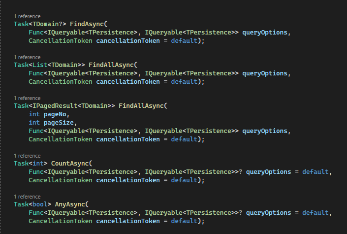

# November 2023

Welcome to the November 2023 edition of highlights of What's New with Intent Architect.

- Highlights
  - **[AutoMapper Projection support on EF repositories](#automapper-projection-support-on-ef-repositories)** - Added support to for AutoMapper Projections on the EF repository pattern.
  - **[EF repository enhancements](#ef-repository-enhancements)** - Added several overloads to EF repositories to make LINQ features more available.
- More updates
  - **[Documentation on Designer Scripting with Javascript](#documentation-on-designer-scripting-with-javascript)** - New article that introduces and explains the designer scripting capabilities of Intent Architect.
  - **[Synchronous method support on EF repositories](#synchronous-method-support-on-ef-repositories)** - Optionally add synchronous repository method overloads through an application setting.
  - **[Email Address Validation](#email-address-validation)** - "Email Address" checkbox property added to the "Validation" stereotype.
  - **[Prevent updates to Basic Auditing created values](#prevent-basic-auditings-created-column-values-from-being-updated-later)** - Possible updates to CreatedBy and CreatedDate values are now blocked.
  - **[IApplicationDbContext option now available](#iapplicationdbcontext-interface)** - It is now possible to expose Entity Framework's `DbSet`s to your application's "Application" layer.
  - **[Entity Framework split queries support](#enable-entity-framework-split-queries)** - It is now possible enable [split queries](https://learn.microsoft.com/ef/core/querying/single-split-queries#enabling-split-queries-globally) for an application.
  - **[AutoMapper version upgrade](#automapper-version-upgrade)** - Upgraded various AutoMapper dependencies to the latest version.

## Update details

### AutoMapper Projection support on EF repositories

The AutoMapper not add Projection support to the Entity Framework Core Repository's.
The following methods will query the relevant `Entity` and the use AutoMapper->ProjectTo functionality to materialize the results.

Available from:

- Intent.Application.AutoMapper 5.0.0

### EF repository enhancements

Added several overloads to EF repositories to make generic LINQ features easier to express, for example OrderBy, Include, etc.

Available from:

- Intent.EntityFrameworkCore.Repositories 4.3.0

### Documentation on Designer Scripting with Javascript

We've brought out an article that introduces and explains the designer scripting capabilities of Intent Architect. It provides a scripting editor for automating various operations, such as creating elements and associations, and offers TypeScript declarations for understanding the available functions.

The article also explains how to use event-triggered scripts for associations and elements, enabling developers to execute custom logic when specified events occur.

The new article is now available for you to read and please share with us whether you found this article helpful. [Click here to read it](https://docs.intentarchitect.com/articles/module-building/designer-scripting/designer-scripting.html).

### Email Address Validation

An "Email Address" checkbox property has been added to the "Validation" stereotype, when checked it applies the [Email Validator](https://docs.fluentvalidation.net/en/latest/built-in-validators.html#email-validator) in FluentValidation modules and the [EmailAddressAttribute](https://learn.microsoft.com/dotnet/api/system.componentmodel.dataannotations.emailaddressattribute) in DataAnnotations modules.

Available from:

- Intent.Application.FluentValidation 3.8.3
- Intent.Application.FluentValidation.Dtos 3.7.1
- Intent.Application.MediatR.FluentValidation 4.4.2
- Intent.Blazor.HttpClients.Dtos.DataAnnotations 1.0.1
- Intent.Blazor.HttpClients.Dtos.FluentValidation 1.0.1

### Synchronous method support on EF repositories

Added support for Synchronous versions of EF repository methods. This option is off by default but can be opted into through application settings, `Database Settings -> Add synchronous methods to repositories`.

Available from:

- Intent.EntityFrameworkCore.Repositories 4.3.0

### Prevent Basic Auditing's "created" column values from being updated later

The Basic Auditing pattern now ensures that any attempted changes to the `CreatedBy` and `CreatedDate` properties on entities being updated are discarded before being saved to the database.

Available from:

- Intent.Entities.BasicAuditing 1.0.2

### IApplicationDbContext interface

It is now possible to enable generation of an `IApplicationDbContext` interface for use in an application's "Application" layer to allow access to Entity Framework's `DbSet`s. See the module [documentation](https://github.com/IntentArchitect/Intent.Modules.NET/blob/development/Modules/Intent.Modules.EntityFrameworkCore/README.md#database-settings---generate-dbcontext-interface) for more information.

Available from:

- Intent.EntityFrameworkCore 4.4.15

### Enable Entity Framework split queries

It is now possible to [enable split queries globally](https://learn.microsoft.com/ef/core/querying/single-split-queries#enabling-split-queries-globally) by selecting the _Enable split queries globally_ application setting.

Available from:

- Intent.EntityFrameworkCore 4.4.15

### AutoMapper version upgrade

Upgrades AutoMapper modules to the latest NuGet packages.

Available from:

- Intent.Application.AutoMapper 5.0.0
- Intent.Application.DependencyInjection.AutoMapper 4.0.0
