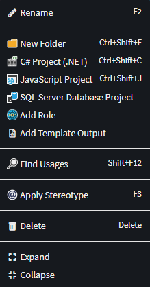
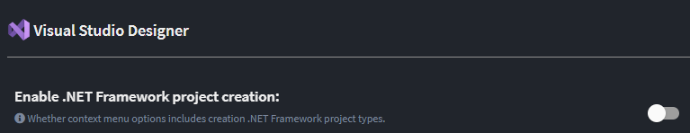
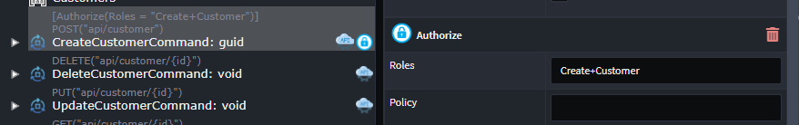
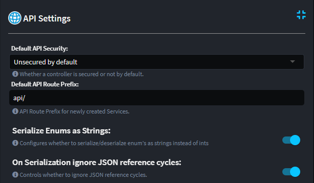
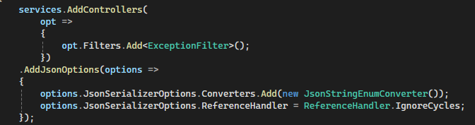

# What's new with Intent Architect (January 2024)

Welcome to the January 2024 edition of highlights of What's New with Intent Architect.

We hope you also had a great break at the end of the year at which time at Intent Architect we also generally wind down a bit meaning we don't have as much to show as usual, but we nevertheless managed to get some great things done.

- Highlights
  - **[Intent 4.2 beta now available](xref:release-notes.intent-architect-v4.2)** - Of particular note, version 4.2 introduces tracking of code management instruction deviations allowing you to see in the Software Factory execution window all files which have deviations like `Mode.Ignore` added to them.
- More updates
  - **[Support for Visual Studio JavaScript/TypeScript (`.esproj`) projects](#support-for-visual-studio-javascripttypescript-esproj-projects-and-other-visual-studio-designer-updates)** - Create [JavaScript/TypeScript (`.esproj`)](https://learn.microsoft.com/visualstudio/javascript/javascript-in-visual-studio#project-templates) projects and other quality of life improvements.
  - **[Significant improvements to Software Factory speed](#significant-improvements-to-software-factory-speed)** - We've made improvements to Modules and Intent itself to make the Software Factory run faster. 
  - **[Role based authorization - composite role support](#roles-based-authorization---composite-role-support)** - add the ability to describe more complex role requirements for authorization.
  - **[Configuration options for ASP.NET Core contract serialization](#configuration-options-for-aspnet-core-contract-serialization)** - added some configuration options to tweak ASP.NET Core Json serialization options.
  - **[Creation of Solution Folders for templates with relative output paths](#creation-of-solution-folders-for-templates-with-relative-output-paths)** - Sub-folders can now be created when a `Template Output` is in a Solution Folder.
  
## Update details

### Support for Visual Studio JavaScript/TypeScript (`.esproj`) projects and other Visual Studio Designer updates

It is now possible to create [JavaScript/TypeScript (`.esproj`)](https://learn.microsoft.com/visualstudio/javascript/javascript-in-visual-studio#project-templates) project types in the Visual Studio designer using the new `JavaScript Project` (`Ctrl + Shift + J`) context menu option.

Additionally, the context menu options have been cleaned up so that obsolete options no longer show and .NET Framework project types are hidden by default:

> [!TIP]
> The `C# Project (.NET)` option is a "universal" .NET Core / .NET 5+ C# project type which can be used for any .NET assembly type by changing the `SDK` and other options on it.

If you need to create .NET Framework projects, there is a new setting which can be used to have the options show again on the context menu:

Available from:

- Intent.VisualStudio.Projects 3.6.0

### Significant improvements to Software Factory speed

A change was made in the `Intent.Common.CSharp` module which significantly improves the Software Factory execution time. On especially large projects reductions of sometimes around 60 seconds have been observed.

Separately, in order for us to determine the number of lines of code added/removed during a Software Factory execution, previously the Git executable was used and its result parsed. Although it was quite quick per file, it would add up significantly when a lot of files had changes, so we had disabled this process when needing to be done on more than 50 files at time. We have now moved this calculation to be fully in process making it practically free in terms of time taken, allowing Software Factory execution times to improve and also allowing us to remove the 50 file limitation and removing the requirement that Git be installed.

Available from:

- Intent.Common.CSharp 3.4.1
- Intent Architect 4.1.0

### Roles based authorization - composite role support

When configuring security in the `Service Designer`,  the `Authorization` stereotype can now use the `+` syntax to require multiple roles.

For Example:

- `Role1+Role2`, requires the consumer to have both `Role1` and `Role2`.
- `Role1,Role2+Role3`, requires the consumers to have (`Role1` or `Role2`) and `Role3`.

Available from:

- Intent.AspNetCore.Controllers 6.0.0

### Configuration options for ASP.NET Core contract serialization

We have added 2 new `API Settings`

- Serialize Enums as Strings. 
- On Serialization ignore JSON reference cycles.

These setting control the following code:

Available from:

- Intent.AspNetCore.Controllers 6.0.0

### Creation of Solution Folders for templates with relative output paths

When a template's `Template Output` (including those of [static content templates](xref:module-building.templates-general.how-to-generate-static-files)) is placed in a Solution Folder in the Visual Studio Designer and its relative output is in a sub-folder, corresponding [Solution Folders](https://learn.microsoft.com/visualstudio/ide/solutions-and-projects-in-visual-studio#solution-folder) are now created in the `.sln` file.

Available from:

- Intent.VisualStudio.Projects 3.6.0
