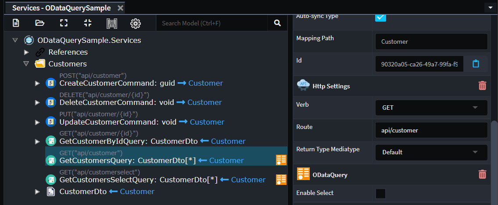
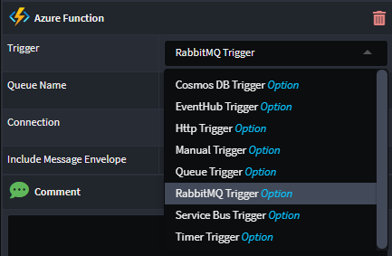

# January 2024

Welcome to the January 2024 edition of highlights of What's New with Intent Architect.

- Highlights
- More updates
  - **[OData Query support](#odata-query-support)** - Leverage OData query functionality on your ASP.Net Core controllers.
  - **[Improvements to C# statement merging](#c-code-management-statement-block-merging-improvements)** - Improvements to heuristics and instructions for controlling statement merging behaviour within method bodies.
  - **[RabbitMQ Trigger for Azure Functions added](#rabbitmq-trigger-for-azure-functions-added)** - RabbitMQ Triggers for queue integration now available on the Azure Functions module.
  - **[EF Bulk Operations module](#ef-bulk-operations-module)** - Extends EF repositories to support Bulk Operations.

## Update details

### OData Query support

This modules adds OData Query support to your CQRS paradigm service end points, specifically `Query`s.

For more detail, refer to the [module documentation](https://github.com/IntentArchitect/Intent.Modules.NET/blob/development/Modules/Intent.Modules.AspNetCore.ODataQuery/README.md).

Available from:

- Intent.AspNetCore.ODataQuery 1.0.0-beta.*

### C# Code Management statement block merging improvements

Improvements have been made to code management within statement blocks.

- For most statement types, old statements will now be removed from existing files when a template's output has changed.
- Instead of using `// [IntentMatch("…")]` above statements to control how they match with a statement generated by a template, one should now use the more intuitive `// [IntentFully(Match = "…")]` or `// [IntentIgnore(Match = "…")]` instructions.

For more information on controlling statement code management behaviour, refer to [our Docs article](https://docs.intentarchitect.com/articles/application-development/code-management/code-management-csharp/code-management-csharp.html#block-statement-code-management-behaviour).

Available from:

- Intent.OutputManager.RoslynWeaver 4.4.0

### RabbitMQ Trigger for Azure Functions added

We have made an improvement on the Azure Functions module, which now includes the ability to select RabbitMQ Triggers for queue integration. This feature allows developers to create functions that are triggered by messages in a RabbitMQ queue, providing a seamless integration between Azure Functions and RabbitMQ.

Available from:

- Intent.AzureFunctions 4.0.13-pre.4

### EF Bulk Operations module

This module provides patterns for doing Bulk data operation with Entity Framework Core using the `EFCore BulkExtensions`.

For more detail, refer to the [module documentation](https://github.com/IntentArchitect/Intent.Modules.NET/blob/development/Modules/Intent.Modules.EntityFrameworkCore.BulkOperations/README.md).

Available from:

- Intent.EntityFrameworkCore.BulkOperations 1.0.0-beta.*
