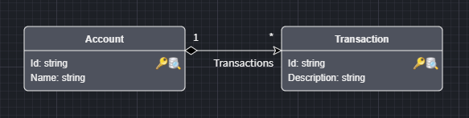
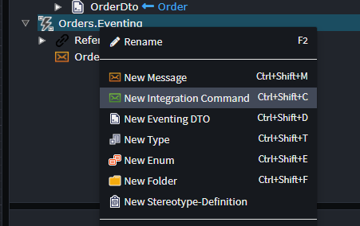
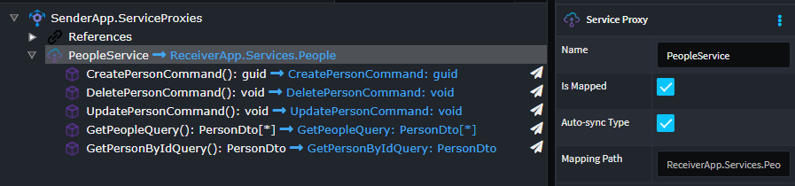
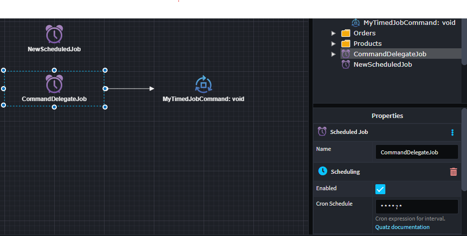
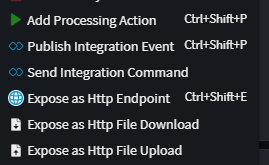
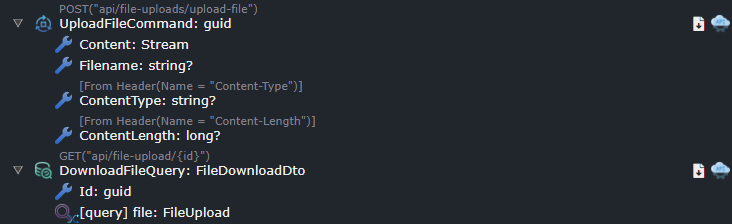
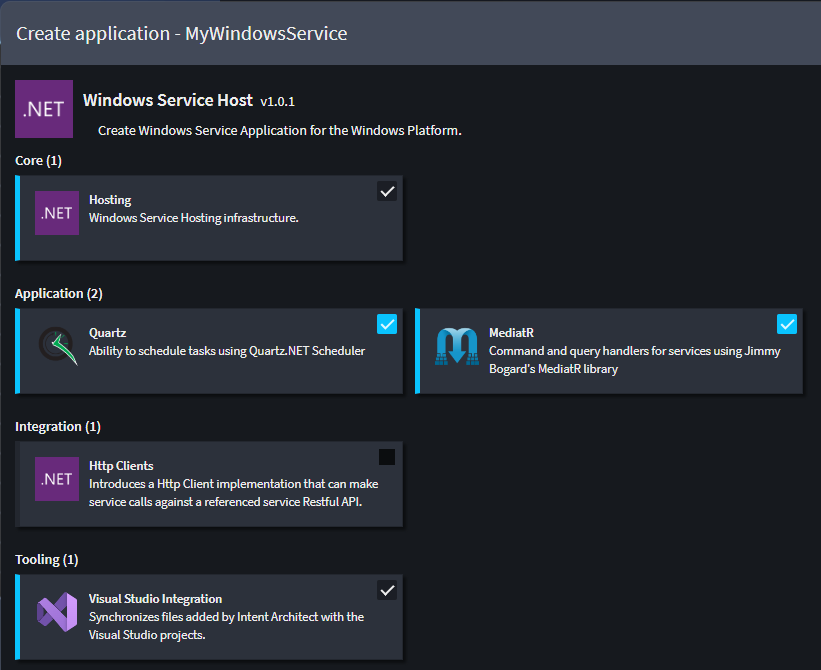
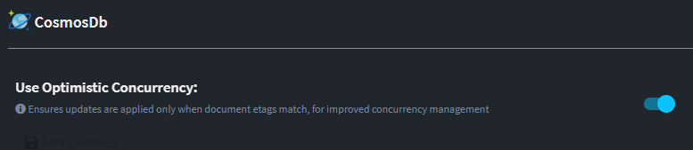
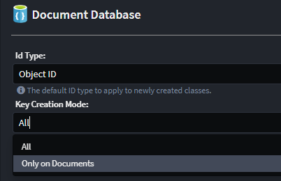

# What's new with Intent Architect (February 2024)

Welcome to the February 2024 edition of highlights of What's New with Intent Architect.

- Highlights

- More updates
  - **[Model your Domain and persist it in a Redis Stack through Object Mapper](#model-your-domain-and-persist-it-in-a-redis-stack-through-object-mapper)** - Redis Stack is now available as a persistence option for Domain Modeling.
  - **[Send Integration Commands using MassTransit](#send-integration-commands-using-masstransit)** - Send a command to a specific recipient through a designated queue.
  - **[Model Request/Response interactions over message brokers with MassTransit](#model-requestresponse-interactions-over-message-brokers-with-masstransit)** - Use MassTransit to exchange commands/queries between applications, similar to HTTP calls, via a message broker.
  - **[ASP.NET Core Integration Tests module](#aspnet-core-integration-tests-module)** - Adds an integration testing project to your solution with support for containerized persistence.
  - **[ASP.NET Core Integration Tests CRUD module](#aspnet-core-integration-tests-crud-module)** - Implements integration tests for CRUD style services.
  - **[Quartz.NET Scheduler module](#quartznet-scheduler-module)** - Add scheduled jobs to your services design.
  - **[Http file upload / download support](#http-file-upload--download-support)** - Model ASP.NET Core file uploads / downloads in the `Services Designer` .
  - **[Windows Service Hosting](#windows-service-hosting)** - Application Template and patterns for modelling Windows Service applications.
  - **[CosmosDB optimistic concurrency](#cosmosdb-optimistic-concurrency-through-etags)** - Our CosmosDB patterns now implement optimistic concurrency through eTags.
  - **[DocumentDB Domain Designer key automation enhancement](#documentdb-domain-designer-key-automation-enhancement)** - A new option to configure how the DocumentDB designer manages keys.

## Update details

### Model your Domain and persist it in a Redis Stack through Object Mapper



This module brings in a new `Document Database Provider`, `Redis OM`, allowing you realize your DocumentDB paradigm Domain Models with a Redis Stack persistence layer. This module includes

- Modeler customizations.
- Repositories using Object Mapper.
- Unit of work pattern.

For more detail, refer to the [module documentation](https://github.com/IntentArchitect/Intent.Modules.NET/blob/development/Modules/Intent.Modules.Redis.Om.Repositories/README.md).

Available from:

- Intent.Redis.Om.Repositories 1.0.0

### Send Integration Commands using MassTransit

Send a command to a specific recipient through a designated queue.



For more detail, refer to the [module documentation](https://github.com/IntentArchitect/Intent.Modules.NET/blob/development/Modules/Intent.Modules.Eventing.MassTransit/README.md).

Available from:

- Intent.Eventing.MassTransit 6.0.2

### Model Request/Response interactions over message brokers with MassTransit

Use MassTransit to exchange commands/queries between applications, similar to HTTP calls, via a message broker.



For more detail, refer to the [module documentation](https://github.com/IntentArchitect/Intent.Modules.NET/blob/development/Modules/Intent.Modules.Eventing.MassTransit.RequestResponse/README.md).

Available from:

- Intent.Eventing.MassTransit.RequestResponse 1.0.0

### ASP.NET Core Integration Tests module

This module adds an xUnit testing project to you ASP.NET Core application which contains Integrations Tests which can be run to validate your application is working end-to-end against containerized infrastructure like databases e.g. MS SQL Server, Postgres or CosmosDB Emulator. These tests do not replace Unit testing but rather compliment it ensuring the individually tested pieces work together correctly.

```csharp

    [IntentManaged(Mode.Merge, Signature = Mode.Fully)]
    [Collection("SharedContainer")]
    public class MyCustomEndpointTests : BaseIntegrationTest
    {
        public MyCustomEndpointTests(IntegrationTestWebAppFactory factory) : base(factory)
        {
        }

        [Fact]
        public async Task MyCustomEndpoint_ShouldDoX()
        {
            //Arrange
            var client = new MyCustomServiceHttpClient(CreateClient());

            //Act
            client.InvokeMyCustomEndpoint();

            //Assert
            ...
        }
    }
```

See the [module documentation](https://github.com/IntentArchitect/Intent.Modules.NET/blob/master/Modules/Intent.Modules.AspNetCore.IntegrationTesting/README.md) for more details.

Available from:

- Intent.AspNetCore.IntegrationTesting 1.0.1

### ASP.NET Core Integration Tests CRUD module

This module extends the `Intent.AspNetCore.IntegrationTesting`, offer test implementations for CRUD style services. It does this by consuming your `Services` both ServiceModel and CQRS, in the Service Designer and generates an Integration test for each Endpoint.

For a service to be eligible is must implement at least

- Create{Entity} - returning either the Primary Key or a DTO with a mapped Primary Key.
- Get{Entity}ById - returning an Entity based DTO taking a single parameter of the Entitiys primary key.

```csharp
        [Fact]
        public async Task CreateCustomer_ShouldCreateCustomer()
        {
            //Arrange
            var client = new CustomersServiceHttpClient(CreateClient());

            var dataFactory = new TestDataFactory(WebAppFactory);
            await dataFactory.CreateCustomerDependencies();

            var command = dataFactory.CreateCommand<CustomerCreateDto>();

            //Act
            var customerId = await client.CreateCustomerAsync(command);

            //Assert
            var customer = await client.FindCustomerByIdAsync(customerId);
            Assert.NotNull(customer);
        }
```

See the [module documentation](https://github.com/IntentArchitect/Intent.Modules.NET/blob/development/Modules/Intent.Modules.AspNetCore.IntegrationTests.CRUD/README.md) for more details.

Available from:

- Intent.AspNetCore.IntegrationTests.CRUD 1.0.1

### Quartz.NET Scheduler module

This module allows you to module scheduled jobs in the services designer. These scheduled job are then realized using the Quartz.NET Scheduler.



See the [module documentation](https://github.com/IntentArchitect/Intent.Modules.NET/blob/master/Modules/Intent.Modules.QuartzScheduler/README.md) for more details.

Available from:

- Intent.QuartzScheduler 1.0.0

### Http file upload / download support

In `Service Designer` there are 2 new content menu options :

- `Expose as Http File Upload`, available on `Command`s and `Service Operation`s
- `Expose as Http File Download`, available on `Command`s, `Query`s and `Service Operation`s



Leading to service endpoints as follows:



These options will configure your service endpoint to Upload / Download a file.

Available from:

- Intent.AspNetCore.Controllers 6.0.3

### Windows Service Hosting

New Application Template available : `Windows Service Host` for modelling Windows Service applications.



Available from:

- Intent.WindowsServiceHost 1.0.0

### CosmosDB optimistic concurrency through eTags

We have introduced optimistic concurrency using eTags into our CosmosDB patterns, this pattern ensures documents which are read and written back, within a transaction, are not modified externally between the read and the write.

To this end we introduced a new setting to the CosmosDB module:

- `Use Optimistic Concurrency`, this setting enables / disables optimistic concurrency through the use of eTags and is on by default.



This is a behavioural change in the module, you can simply turn off this feature to have parity with what the module was doing previously.

Available from:

- Intent.CosmosDB 1.1.0

### DocumentDB Domain Designer key automation enhancement

The designers key automation is now configurable :

- `All` - The designer will manage keys on document / aggregate roots, as well as Compositional child collections.
- `Only on Documents` - The designer will only manage keys on document / aggregate roots

`All` is how the designer previously worked and is the default, `Only on Documents` is a new option for teams who want to manage child keys more explicitly.



Available from:

- Intent.Metadata.DocumentDB 1.1.10
