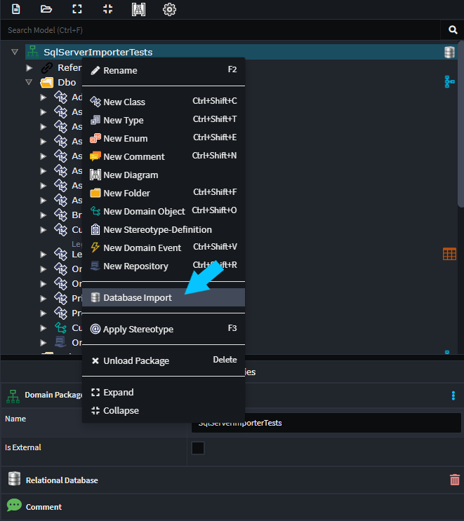
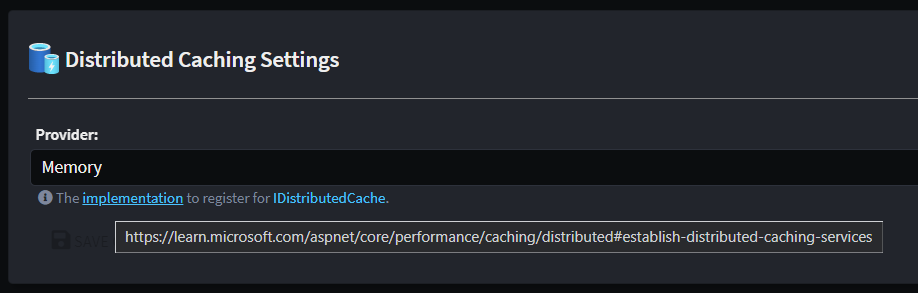

# What's new in Intent Architect (March 2024)

Welcome to the March 2024 edition of highlights of What's New in Intent Architect.

- Highlights
  - **[SqlServerImporter module](#sqlserverimporter-module)** - Reverse engineer your domain model from an existing SQL Server database.
  - **[Open Telemetry Protocol for generic exports](#open-telemetry-module-now-has-open-telemetry-protocol-for-generic-exports)** - Enables generic export capabilities for systems like Jaeger and Elastic Search.
  - **[Serilog module enhancements](#serilog-module-has-extensible-sink-options-with-newly-added-file-and-graylog-sinks)** - Introduces File and Graylog sink options, enhancing logging capabilities.
  - **[New Bugsnag module for error monitoring](#new-bugsnag-module-for-error-monitoring-and-reporting)** - Offers cloud-based error monitoring and reporting for web and mobile apps.
  - **[Java weaver update](#java-weaver-updated-to-java-17-grammar)** - Supports Java 17 grammar, including text block quotes.

- More updates
  - **[Improved Time/TimeSpan support](#improved-timetimespan-support)** - Sql Server Importer and Swagger UI not have better for Time / TimeSpan.
  - **[Basic markdown support for Application Settings' hints](#basic-markdown-support-for-application-settings-hints)** - Module authors can add links and basic formatting to application setting hints.

## Update details

### SqlServerImporter module

The `SqlServerImporter` module will import / reverse engineer a Domain Model from a SQL Server Database. Simply right click on your `Domain Package` and select `Database Import`.

For more detail, refer to the [module documentation](https://github.com/IntentArchitect/Intent.Modules.NET/blob/master/Modules/Intent.Modules.SqlServerImporter/README.md).

Available from:

- Intent.SqlServerImporter 1.0.1

### Open Telemetry Module now has Open Telemetry Protocol for generic exports

The OpenTelemetry module has been enhanced with the `OpenTelemetry Protocol`, which serves as a universal exporter for various systems including Jaeger and Elastic Search.

Available from:

- Intent.OpenTelemetry 2.0.3

### Serilog Module has Extensible Sink Options with newly added File and Graylog sinks

We've relocated the Serilog sink configuration from the `Program.cs` file to the `appsettings.json` file, offering more flexibility in including custom sinks. New support for Graylog and File sinks has been added, broadening the logging functionality.

Available from:

- Intent.Modules.AspNetCore.Logging.Serilog 5.1.0

### New Bugsnag Module for Error Monitoring and Reporting

Integrate with Bugsnag for advanced, cloud-based error monitoring and reporting across web and mobile applications.

Available from:

- Intent.Bugsnag 1.0.0

### Java Weaver Updated to Java 17 Grammar

The Java Weaver now accommodates Java 17 grammar, enhancing support for modern Java features including the use of text block quotes.

Available from:

- Intent.Code.Weaving.Java 1.0.0
- Intent.Common.Java 4.0.0

### Improved Time/TimeSpan support

The Swagger UI is now configured, by default, to support string based `TimeSpan` representations e.g. "00:00:00".
The `Intent.SQLSchemaExtractor` tool and `Intent.SqlServerImporter` module now support Sql `Time` type.

Available from:

- Intent.AspNetCore.Controllers 6.0.4

### Entity Framework Core support for Keyless Entity Types and basic TimescaleDB usage

The Entity Framework Core module now supports [Keyless Entity Types](https://learn.microsoft.com/ef/core/modeling/keyless-entity-types) which (amongst other use cases) is necessary to be able to use [TimescaleDB](https://www.timescale.com/) with Entity Framework Core.

Available from:

- Intent.EntityFrameworkCore 5.0.0

### Basic markdown support for Application Settings' hints

Module authors can now use the following markdown in hints for application settings and have it rendered by Intent Architect:

- Links - `[Intent Architect website](http://intentarchitect.com/)` renders as: [Intent Architect website](http://intentarchitect.com/)
- Italics - `*italicized text*` renders as: *italicized text*
- Bold - `**bolded text**` renders as: **bolded text**
- Inline code - `` `inline code` `` renders as: `inline code`
