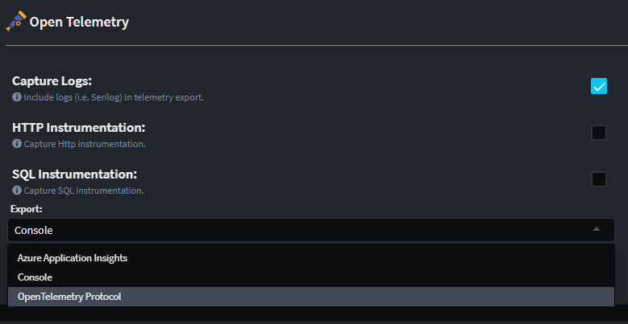
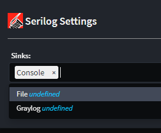
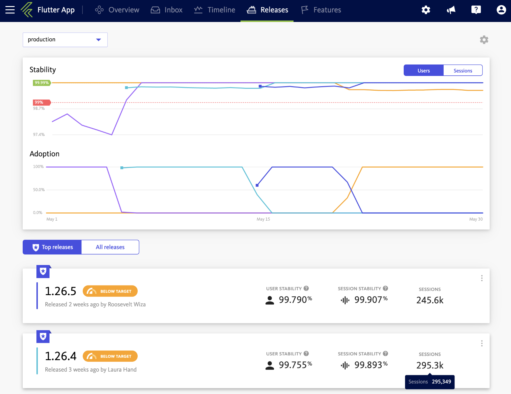

# What's new in Intent Architect (March 2024)

Welcome to the March 2024 edition of highlights of What's New with Intent Architect.

- Highlights

- More updates

## Update details

### Open Telemetry module now has `Open Telemetry Protocol` for generic exports

Added `OpenTelemetry Protocol` which acts as a generic exporter for most systems including [Jaeger](https://www.jaegertracing.io/docs/1.48/apis/#opentelemetry-protocol-stable) and [Elastic Search](https://www.elastic.co/guide/en/observability/current/open-telemetry.html).

Available from:

- Intent.OpenTelemetry 2.0.3

### Serilog module has extensible sink options with newly added File and Graylog sinks

The configuration for the Serilog sink has been relocated from the Program.cs file to the `appsettings.json` file. This change gives developers the flexibility to include custom sinks in their projects, even if they are not directly supported by Intent Architect.

Support for [Graylog](https://github.com/serilog-contrib/serilog-sinks-graylog) and File sink options has been introduced, expanding the logging capabilities.

Available from:

- Intent.Modules.AspNetCore.Logging.Serilog 5.1.0

### New Bugsnag module for error monitoring and reporting

Integrate with [Bugsnag](https://www.bugsnag.com/) which is a cloud-based error monitoring and reporting tool for web and mobile apps.

Available from:

- Intent.Bugsnag 1.0.0

### Java weaver updated to Java 17 grammar

Java Weaver updated to support Java 17 grammar (includes support now for `"""` text block quotes).

Available from:

- Intent.Code.Weaving.Java 1.0.0
- Intent.Common.Java 4.0.0
