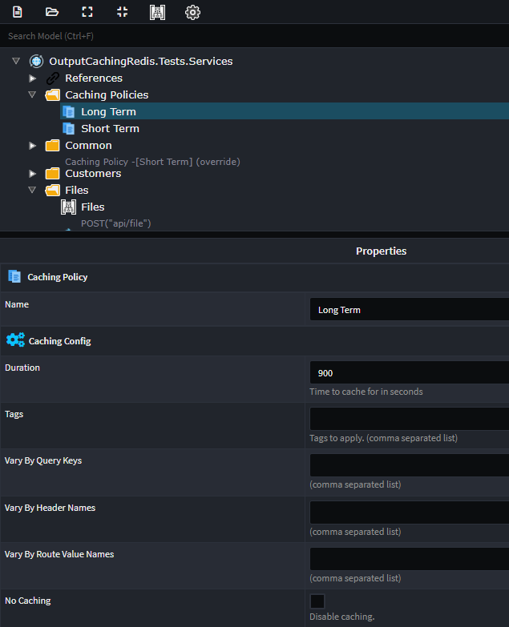
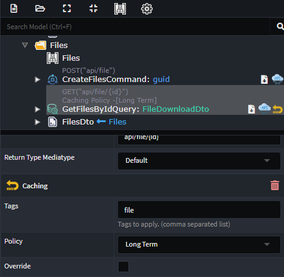

# What's new in Intent Architect (April 2024)

Welcome to the April 2024 edition of highlights of What's New in Intent Architect.

- Highlights
  - **[CosmosDB multi-tenancy now supports database isolation](#cosmosdb-multi-tenancy-now-supports-database-isolation)** - Store CosmosDB tenant's data in tenant specific databases.
  - **[OpenApi.Importer Module](#openapiimporter-module)** - Import Services from OpenAPI/Swagger documents.
  - **[Amazon S3 Object Storage Module](#amazon-s3-object-storage-module)** - New support for S3 integration in .NET applications.
  - **[EF Multiple Database Support](#ef-multiple-database-support)** - connect to multiple databases within the same application.
  - **[ASP.NET Core output caching with Redis](#aspnet-core-output-caching-with-redis)** - A new module which allows you to model service output caching and realize it using Redis.
  - **[Type `date` in C# will become `DateOnly`](#type-date-in-c-will-become-dateonly)** - The Intent Architect type `date` used to generate `DateTime` in C# but will now generate the new `DateOnly` type.

## Update details

### CosmosDB multi-tenancy now supports database isolation

If you are using the `Intent.Modules.AspNetCore.MultiTenancy` module, our `Intent.CosmosDB` module now supports the `Data Isolation` - `Separate Database` option.

You can configure each tenant to have their own database connection string.

For more detail, refer to the [module documentation](https://github.com/IntentArchitect/Intent.Modules.NET/blob/master/Modules/Intent.Modules.CosmosDB/README.md).

Available from:

- Intent.CosmosDB 1.1.2

### OpenApi.Importer Module

The `Intent.OpenApi.Importer` module enhances the `Service Designer` allowing you to import / reverse engineer service models from OpenApi documents.

In the `Service Designer`, right click on your service package (or a folder in the package) and select the `OpenApi Import` context menu option.

Selecting this option will provide you with the following dialog:

For more detail, refer to the [module documentation](https://github.com/IntentArchitect/Intent.Modules.NET/blob/master/Modules/Intent.Modules.OpenApi.Importer/README.md).

Available from:

- Intent.OpenApi.Importer 1.0.0

### Amazon S3 Object Storage Module

The `Amazon S3 Object Storage` module for .NET provides an easier-to-use API via the `IObjectStorage` interface. This release simplifies interactions such as uploading, downloading, listing, and deleting objects with Amazon S3, enabling developers to focus more on business logic and less on backend infrastructure.

For more details, refer to the [module documentation](https://github.com/IntentArchitect/Intent.Modules.NET/blob/development/Modules/Intent.Modules.AmazonS3.ObjectStorage/README.md).

Available from:

- Intent.AmazonS3.ObjectStorage 1.0.0

### EF Multiple Database Support

This feature allows you to specify different database connections and providers for each Domain package, enabling the creation of specialized DbContexts tailored to each connection string. It simplifies the management of multiple databases by automatically generating DbContext types based on the selected database provider and connection string, enhancing flexibility and ease of use in database operations.

> [!NOTE]
>
> For this release, the unit of work pattern still only applies to the main `ApplicationDbContext`, for the additional `DbContext`s the `SaveChanges` methods will need to be called manually. Should you have a project which requires the unit of work pattern to apply to additional `DbContext`s, please each out to us at [Intent Architect Support](https://github.com/IntentArchitect/Support).

Available from:

- Intent.EntityFrameworkCore 5.0.4

### ASP.NET Core output caching with Redis

Create caching polices and apply this to your services, allowing you to model your service output caching.

To create Policies simply add them to you service designer as follows:

On the policy you can configure all the various caching options, which output caching supports.

To apply caching to you end-points, simply apply the `Caching` stereotype, and select the appropriate `Caching Policy`.

For more detail, refer to the [module documentation](https://github.com/IntentArchitect/Intent.Modules.NET/blob/development/Modules/Intent.Modules.AspNetCore.OutputCaching.Redis/README.md).

Available from:

- Intent.AspNetCore.OutputCaching.Redis 1.0.0

### Type `date` in C# will become `DateOnly`

The Intent Architect type `date` used to generate `DateTime` in C# but will now generate the new `DateOnly` type. Some enhancements have been made to accommodate this `DateOnly` type in other modules such as Entity Framework where using `DateOnly` on EF 6 & 7 will make use of the `ErikEJ.EntityFrameworkCore.SqlServer.DateOnlyTimeOnly` nuget package for compatibility with SQL Server.

> [!NOTE]
>
> Prior to this version of the module, any data in Intent Architect designers referencing the date
> type would generate `System.DateTime` in C# code, but going forward they will instead generate
> `System.DateOnly`. To avoid causing code compilation issues and possible bugs, on upgrading
> the `Intent.Common.CSharp` module will change all designer references using `date` to instead use `datetime`.
> Should you wish to maintain date uses in your designers, you can simply roll-back the changes that
> get made to the `.xml` files in your source code management software (e.g. Git). Please don't
> hesitate to reach out to our [Support](https://github.com/IntentArchitect/Support) should you
> have any comments or questions.

Available from:

- Intent.Common.CSharp 3.6.0
- Intent.EntityFrameworkCore 5.0.2 (if applicable)
- Intent.AspNetCore.Controllers 6.0.5 (if applicable)
