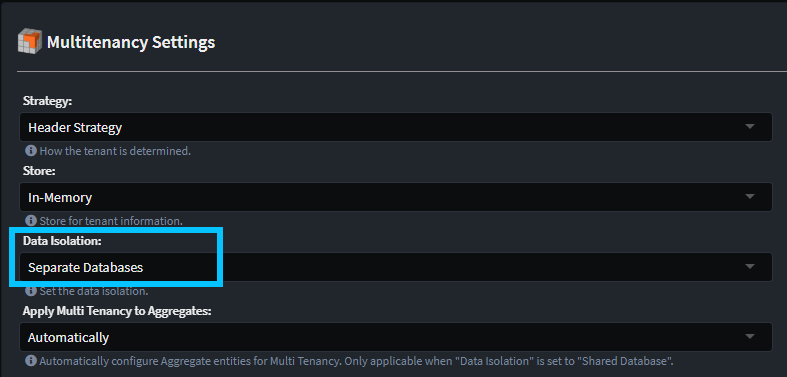
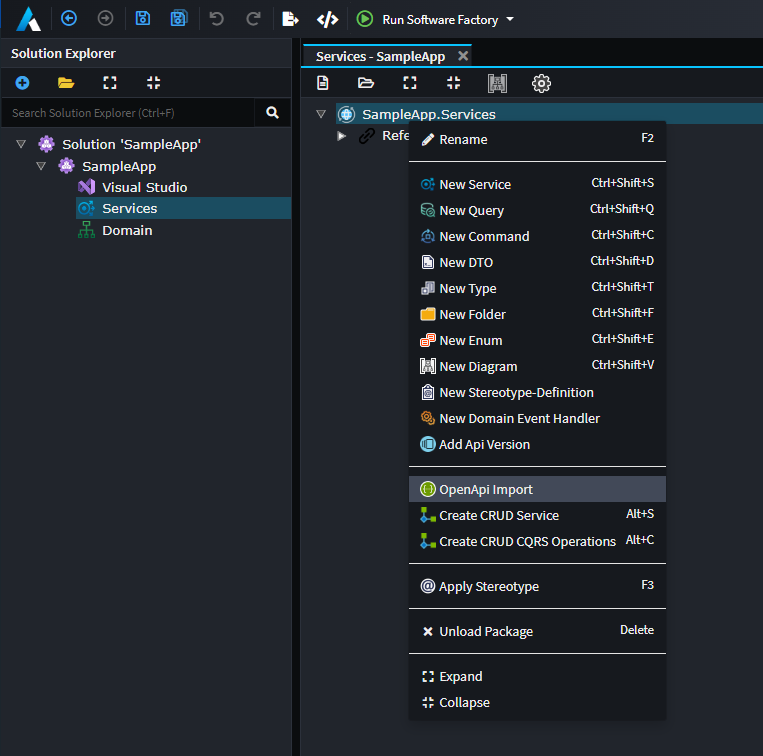
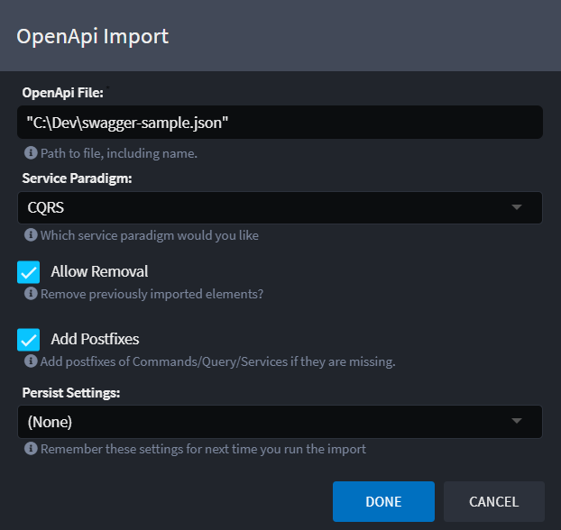

# What's new in Intent Architect (April 2024)

Welcome to the April 2024 edition of highlights of What's New in Intent Architect.

- Highlights

- More updates
  - **[CosmosDB multi-tenancy now supports database isolation](#cosmosdb-multi-tenancy-now-supports-database-isolation)** - Have you CosmosDB tenants data stored in tenant specific databases.
  - **[OpenApi.Importer Module](#openapiimporter-module)** - Import Services from OpenAPI/Swagger documents.
  - **[`IDistributedCache` support (beta)](#idistributedcache-support-beta)** - Use Redis or memory to cache application data.
  - **[Entity Framework Core second level caching (beta)](#entity-framework-core-second-level-caching-beta)** - Cache the results of EF queries.

## Update details

### CosmosDB multi-tenancy now supports database isolation

If you are using the `Intent.Modules.AspNetCore.MultiTenancy` module, our `Intent.CosmosDB` module now supported the `Data Isolation` - `Separate Database option`.

You can configure then configure each tenant to have their own connection string.

For more detail, refer to the [module documentation](https://github.com/IntentArchitect/Intent.Modules.NET/blob/master/Modules/Intent.Modules.CosmosDB/README.md).

Available from:

- Intent.CosmosDB 1.1.2

### OpenApi.Importer Module

The `Intent.OpenApi.Importer` module enhances the `Service Designer` allowing you to import / reverse engineer service models from OpenApi documents.

In the `Service Designer`, right click on your service package (or a folder in the package) and select the `OpenApi Import` context menu option.

Selecting this option will provide you with the following dialog:

For more detail, refer to the [module documentation](https://github.com/IntentArchitect/Intent.Modules.NET/blob/master/Modules/Intent.Modules.OpenApi.Importer/README.md).

Available from:

- Intent.OpenApi.Importer 1.0.0

### `IDistributedCache` support (beta)

Support is now available for [distributed caching](https://learn.microsoft.com/aspnet/core/performance/caching/distributed) for an application through the [`IDistributedCache`](https://learn.microsoft.com/dotnet/api/microsoft.extensions.caching.distributed.idistributedcache) and [`IDistributedCacheWithUnitOfWork`](https://github.com/IntentArchitect/Intent.Modules.NET/blob/master/Modules/Intent.Modules.AspNetCore.DistributedCaching/README.md#the-idistributedcachewithunitofwork-interface) interfaces. A distributed cache is a cache shared by multiple app servers, typically maintained as an external service to the app servers that access it.

Support for the following the `IDistributedCache` implementations are immediately available:

- [Memory](https://learn.microsoft.com/aspnet/core/performance/caching/distributed#distributed-memory-cache)
- [Stack Exchange Redis](https://learn.microsoft.com/aspnet/core/performance/caching/distributed#distributed-redis-cache)

Available from:

- Intent.AspNetCore.DistributedCaching 1.0.0-beta.0

### Entity Framework Core second level caching (beta)

It is now possible to enable second level caching for Entity Framework Core through use of the [EFCoreSecondLevelCacheInterceptor](http://www.nuget.org/packages/EFCoreSecondLevelCacheInterceptor/) NuGet package.

Second level caching is a query cache. The results of EF commands will be stored in the cache, so that the same EF commands will retrieve their data from the cache rather than executing them against the database again.

Caching can be opted into on by using the [`.Cacheable(...)` IQueryable extension method](https://github.com/VahidN/EFCoreSecondLevelCacheInterceptor/blob/master/src/EFCoreSecondLevelCacheInterceptor/EFCachedQueryExtensions.cs) or enabled globally.

For further details on using second level caching, refer to the [library's README](https://github.com/VahidN/EFCoreSecondLevelCacheInterceptor).

Available from:

- Intent.EntityFrameworkCore.SecondLevelCaching 1.0.0-beta.0
