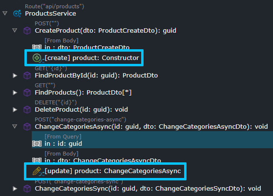
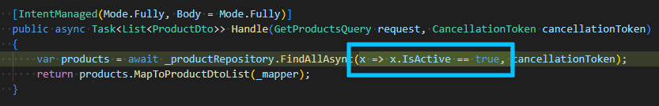

# What's new in Intent Architect (May 2024)

Welcome to the May 2024 edition of highlights of What's New in Intent Architect.

We’re thrilled to announce that our team has been working diligently on our upcoming 4.3 release, focused on front end automation—a long-term goal we are excited to achieve. Our initial release will feature a Blazor implementation, and we aim to have an alpha release available by the end of June.

We value your input and feedback, and we invite you to try it out. If you're interested in participating in the trial, please reach out to us at sarah@intentarchitect.com.

- Highlights
  - **[`IDistributedCache` support (beta)](#idistributedcache-support-beta)** - Use Redis or memory to cache application data.
  - **[Entity Framework Core second level caching (beta)](#entity-framework-core-second-level-caching-beta)** - Cache the results of EF queries.
  - **[Improvements to Service model modelling with the advanced mapping system](#improvements-to-service-model-modelling-with-the-advanced-mapping-system)** - This paradigm now has more parity with the CQRS paradigm .
  - **[CRUD support for mapping literals](#improvements-to-service-model-modelling-with-the-advanced-mapping-system)** - This paradigm now has more parity with the CQRS paradigm.
  - **[Change the installation path of Intent Architect](#change-the-installation-path-of-intent-architect)** - On Windows it is now possible to install Intent Architect to a location other than `Program Files.`

- More updates

## Update details

### `IDistributedCache` support (beta)

Support is now available for [distributed caching](https://learn.microsoft.com/aspnet/core/performance/caching/distributed) for an application through the [`IDistributedCache`](https://learn.microsoft.com/dotnet/api/microsoft.extensions.caching.distributed.idistributedcache) and [`IDistributedCacheWithUnitOfWork`](https://github.com/IntentArchitect/Intent.Modules.NET/blob/master/Modules/Intent.Modules.AspNetCore.DistributedCaching/README.md#the-idistributedcachewithunitofwork-interface) interfaces. A distributed cache is a cache shared by multiple app servers, typically maintained as an external service to the app servers that access it.

Support for the following the `IDistributedCache` implementations are immediately available:

- [Memory](https://learn.microsoft.com/aspnet/core/performance/caching/distributed#distributed-memory-cache)
- [Stack Exchange Redis](https://learn.microsoft.com/aspnet/core/performance/caching/distributed#distributed-redis-cache)

Available from:

- Intent.AspNetCore.DistributedCaching 1.0.0-beta.0

### Entity Framework Core second level caching (beta)

It is now possible to enable second level caching for Entity Framework Core through use of the [EFCoreSecondLevelCacheInterceptor](http://www.nuget.org/packages/EFCoreSecondLevelCacheInterceptor/) NuGet package.

Second level caching is a query cache. The results of EF commands will be stored in the cache, so that the same EF commands will retrieve their data from the cache rather than executing them against the database again.

Caching can be opted into on by using the [`.Cacheable(...)` IQueryable extension method](https://github.com/VahidN/EFCoreSecondLevelCacheInterceptor/blob/master/src/EFCoreSecondLevelCacheInterceptor/EFCachedQueryExtensions.cs) or enabled globally.

For further details on using second level caching, refer to the [library's README](https://github.com/VahidN/EFCoreSecondLevelCacheInterceptor).

Available from:

- Intent.EntityFrameworkCore.SecondLevelCaching 1.0.0-beta.0

### Improvements to Service Model modelling with the advanced mapping system

Service Operations can now be mapped onto domain entity `Constructors` and `Operations`.

For example given this domain:

You can now map service end points as follows:

Available from:

- Intent.Application.ServiceImplementations.Conventions.CRUD 5.0.7

### CRUD support for mapping literals

When mapping CRUD implementation you can now specify literals, as opposed to mappings, for example:

Will now produce the following code:

Available from:

- Intent.Application.MediatR.CRUD 6.0.10

### Change the installation path of Intent Architect

Intent Architect's Windows installer will now allow you to change the installation path of Intent Architect during initial installation.

Available from:

- Intent Architect 4.2.5-pre.0
