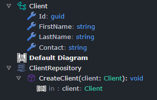
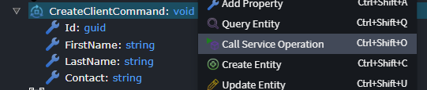
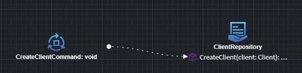
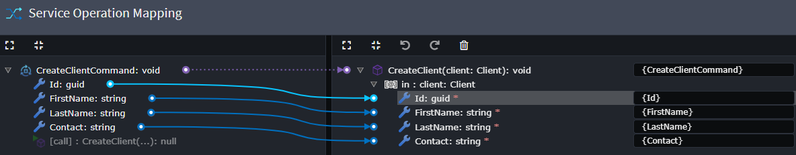

# What's new in Intent Architect (July 2024)

Welcome to the July 2024 edition of highlights of What's New in Intent Architect.

- Highlights
  - **[Service security modeling](#service-security-modeling)** - Add the ability to model `Role`s  and `Policys` in the Service Designer.
  - **[MongoDb Integration Testing support](#mongodb-integration-testing-support)** - Added support for MongoDb Integration testing.
  - **[MongoDb repository improvements](#mongodb-repository-improvements)** - Improved QOL features on the MongoDb Repository pattern.
  - **[CosmosDB repository improvements](#cosmosdb-repository-improvements)** - Improved QOL features on the CosmosDB Repository pattern.
  - **[OpenAPI Importer improvements](#openapi-importer-improvements)** - General improvement on the OpenAPI importer module.

- More updates
  - **[Domain Service support for Generic types](#domain-service-support-for-generic-types)** - `DomainService`s now support modeling Generic operations.
  - **[Razor Code Management](#razor-code-management)** - "Code Management" capabilities for `.razor` files for intelligent and powerful code merging between existing and generated content.
  - **[Map CQRS Operations and Application Services to Repository Operations](#map-cqrs-operations-and-application-services-to-repository-operations)** - Add bespoke Operations on Repositories in the Domain designer and invoke them from Services using mappings in the Services designer.

## Update details

### Service security modeling

We have added a new feature for the Service Designer letting you model you service endpoint `Role`s and `Policy`s. You can now add these to our service design as follows:


And then use these modeled concepts on your `Authorize` / `Secured` stereotypes, as follows


There is also an option to migrate your existing security configuration to this new system.

For more detailed information see [Module Documentation](https://github.com/IntentArchitect/Intent.Modules.NET/blob/development/Modules/Intent.AspNetCore.Controllers/README.md).
Available from:

- Intent.AspNetCore.Controllers 6.0.9-pre.0

### MongoDb Integration Testing support

The `Intent.AspNetCore.IntegrationTesting` now has support for our Mongo Modules. The module will provision and wire-up a MongoDb container, using `Testcontainers.MongoDb`, for the integration tests to run against.

For more detailed information see [Module Documentation](https://github.com/IntentArchitect/Intent.Modules.NET/blob/master/Modules/Intent.Modules.AspNetCore.IntegrationTesting/README.md).

Available from:

- Intent.AspNetCore.IntegrationTesting 1.0.5

### MongoDb repository improvements

Improved the MongoDb repository pattern to have better LINQ Support.

Added LINQ methods

```csharp

Task<IPagedList<TDomain>> FindAllAsync(
    int pageNo, 
    int pageSize,
    Func<IQueryable<TDocumentInterface>, IQueryable<TDocumentInterface>> queryOptions,
    CancellationToken cancellationToken = default);

Task<TDomain?> FindAsync(
    Func<IQueryable<TDocumentInterface>, IQueryable<TDocumentInterface>> queryOptions, 
    CancellationToken cancellationToken = default);

Task<List<TDomain>> FindAllAsync(
    Func<IQueryable<TDocumentInterface>, IQueryable<TDocumentInterface>> queryOptions, 
    CancellationToken cancellationToken = default);

Task<int> CountAsync(
    Func<IQueryable<TDocumentInterface>, IQueryable<TDocumentInterface>>? queryOptions = default, 
    CancellationToken cancellationToken = default);

Task<bool> AnyAsync(
    Func<IQueryable<TDocumentInterface>, IQueryable<TDocumentInterface>>? queryOptions = default, 
    CancellationToken cancellationToken = default);

```

Available from:

- Intent.MongoDb.Repositories 1.2.0

### CosmosDB repository improvements

Our cosmos repository pattern has been improve in two ways:

- New methods providing LINQ access
- Protected methods making SQL more accessible for inherited repositories

Added LINQ methods

```csharp

Task<IPagedList<TDomain>> FindAllAsync(
    int pageNo, 
    int pageSize,
    Func<IQueryable<TDocumentInterface>, IQueryable<TDocumentInterface>> queryOptions,
    CancellationToken cancellationToken = default);

Task<TDomain?> FindAsync(
    Func<IQueryable<TDocumentInterface>, IQueryable<TDocumentInterface>> queryOptions, 
    CancellationToken cancellationToken = default);

Task<List<TDomain>> FindAllAsync(
    Func<IQueryable<TDocumentInterface>, IQueryable<TDocumentInterface>> queryOptions, 
    CancellationToken cancellationToken = default);

Task<int> CountAsync(
    Func<IQueryable<TDocumentInterface>, IQueryable<TDocumentInterface>>? queryOptions = default, 
    CancellationToken cancellationToken = default);

Task<bool> AnyAsync(
    Func<IQueryable<TDocumentInterface>, IQueryable<TDocumentInterface>>? queryOptions = default, 
    CancellationToken cancellationToken = default);

```

Added SQL methods

```csharp

protected async Task<List<TDomain>> FindAllAsync(
    QueryDefinition queryDefinition,
    CancellationToken cancellationToken = default);

protected async Task<TDomain?> FindAsync(
    QueryDefinition queryDefinition,
    CancellationToken cancellationToken = default);
```

Available from:

- Intent.CosmosDB 1.2.0

### OpenAPI Importer improvements

The Importer now respects the OpenApi `Required` property when importing service definition. adjusting definitions accordingly.
There has also been various smaller improvements which make the tool better at interpreting OpenAPI documents.

Available from:

- Intent.OpenApi.Importer 1.1.0

### Domain Service support for Generic types

You can now model Domain Service with Generic type operations.


Available from:

- Intent.DomainServices 1.1.5

### Razor Code Management

[Code Management / Merging](xref:application-development.code-management.about-code-management) capabilities for `.razor` files for intelligent and powerful code merging between existing and generated content.

For more information, refer to [this](xref:application-development.code-weaving-and-generation.about-code-management-razor) Docs article.

Available from:

- Intent.Code.Weaving.Razor 1.0.0-beta.0

### Map CQRS Operations and Application Services to Repository Operations

Add Operations on Repositories in the Domain designer and invoke them from Services using mappings in the Services designer.

Example Repository with Operation:



Example Command:



Example invocation from Command to Repository Operation:





Available from:

- Intent.Modelers.Services.DomainInteractions 1.1.4

Ensure you are using at least the versions of the following modules (if you have them installed):

- Intent.Application.MediatR.CRUD 6.0.12
- Intent.Application.ServiceImplementations.Conventions.CRUD 5.0.9
