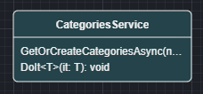

# What's new in Intent Architect (July 2024)

Welcome to the July 2024 edition of highlights of What's New in Intent Architect.

- Highlights
  - **[Service security modeling](#service-security-modeling)** - Add the ability to model `Role`s  and `Policy`s in the Service Designer.
  - **[HttpClient authorization provider security option](#httpclient-authorization-provider-security-option)** - Integration HttpClients now has a new security pattern for injecting access tokens.
  - **[Ordered pagination for CRUD patterns](#ordered-pagination-for-crud-patterns)** - Our CRUD pagination patterns now support ordering.
  - **[MongoDb Integration Testing support](#mongodb-integration-testing-support)** - Added support for MongoDb Integration testing.
  - **[CosmosDB repository query improvements](#cosmosdb-repository-query-improvements)** - Improved QOL features on the CosmosDB Repository query pattern.

- More updates
  - **[OpenAPI Importer improvements](#openapi-importer-improvements)** - General improvement on the OpenAPI importer module.
  - **[HttpClient grouped configuration](#httpclient-grouped-configuration)** - Shared service proxy configuration.
  - **[MongoDb repository query improvements](#mongodb-repository-query-improvements)** - Improved QOL features on the MongoDb Repository pattern.
  - **[CosmosDB explicit optimistic concurrency](#cosmosdb-explicit-optimistic-concurrency)** - Ability to model and use optimistic concurrency outside of the repository.
  - **[Domain Service support for Generic types](#domain-service-support-for-generic-types)** - `DomainService`s now support modeling Generic operations.
  - **[Razor Code Management](#razor-code-management)** - "Code Management" capabilities for `.razor` files for intelligent and powerful code merging between existing and generated content.


## Update details

### Service security modeling

We have added a new feature for the Service Designer letting you model you service endpoint `Role`s and `Policy`s. You can now add these to our service design as follows:


And then use these modeled concepts on your `Authorize` / `Secured` stereotypes, as follows


There is also an option to migrate your existing security configuration to this new system.

For more detailed information see [Module Documentation](https://github.com/IntentArchitect/Intent.Modules.NET/blob/development/Modules/Intent.AspNetCore.Controllers/README.md).
Available from:

- Intent.AspNetCore.Controllers 6.0.9

### HttpClient authorization provider security option

Our `Intent.Integration.HttpClients` module now has a new `Authorization Setup` option in the `Integration Http Client Settings` section of application settings.

The option is `Authorization Header Provider`, this option allows you inject in a scoped service which can resolve the proxy service calls `Authorization` header. This mechanism is very flexible and can be extended for a variety of security scenarios.

For more detailed information see [Module Documentation](https://github.com/IntentArchitect/Intent.Modules.NET/blob/development/Modules/Intent.Modules.Integration.HttpClients/README.md#authorization-header-provider).

Available from:

- Intent.Integration.HttpClients 5.1.9

### Ordered pagination for CRUD patterns

Our CRUD pagination patterns now supports an `OrderBy` parameter, which allows you to specify the ordering for the pagination.


The order by is specified using dynamic Linq, for example `Surname desc, Name asc`.

For more detailed information see [Module Documentation](For more detailed information see [Module Documentation](https://github.com/IntentArchitect/Intent.Modules.NET/blob/master/Modules/Intent.Modules.AspNetCore.IntegrationTesting/README.md).
).

Available from:

- Intent.Application.MediatR.CRUD 6.0.14
- Intent.Application.Dtos.Pagination 4.0.10

### MongoDb Integration Testing support

The `Intent.AspNetCore.IntegrationTesting` now has support for our Mongo Modules. The module will provision and wire-up a MongoDb container, using `Testcontainers.MongoDb`, for the integration tests to run against.

For more detailed information see [Module Documentation](https://github.com/IntentArchitect/Intent.Modules.NET/blob/master/Modules/Intent.Modules.AspNetCore.IntegrationTesting/README.md).

Available from:

- Intent.AspNetCore.IntegrationTesting 1.0.5

### MongoDb repository query improvements

Improved the MongoDb repository pattern to have better LINQ Support.

Added LINQ methods

```csharp

Task<IPagedList<TDomain>> FindAllAsync(
    int pageNo, 
    int pageSize,
    Func<IQueryable<TDocumentInterface>, IQueryable<TDocumentInterface>> queryOptions,
    CancellationToken cancellationToken = default);

Task<TDomain?> FindAsync(
    Func<IQueryable<TDocumentInterface>, IQueryable<TDocumentInterface>> queryOptions, 
    CancellationToken cancellationToken = default);

Task<List<TDomain>> FindAllAsync(
    Func<IQueryable<TDocumentInterface>, IQueryable<TDocumentInterface>> queryOptions, 
    CancellationToken cancellationToken = default);

Task<int> CountAsync(
    Func<IQueryable<TDocumentInterface>, IQueryable<TDocumentInterface>>? queryOptions = default, 
    CancellationToken cancellationToken = default);

Task<bool> AnyAsync(
    Func<IQueryable<TDocumentInterface>, IQueryable<TDocumentInterface>>? queryOptions = default, 
    CancellationToken cancellationToken = default);

```

Available from:

- Intent.MongoDb.Repositories 1.2.0

### CosmosDB repository query improvements

Our cosmos repository pattern has been improve in two ways:

- New methods providing LINQ access
- Protected methods making SQL more accessible for inherited repositories

Added LINQ methods

```csharp

Task<IPagedList<TDomain>> FindAllAsync(
    int pageNo, 
    int pageSize,
    Func<IQueryable<TDocumentInterface>, IQueryable<TDocumentInterface>> queryOptions,
    CancellationToken cancellationToken = default);

Task<TDomain?> FindAsync(
    Func<IQueryable<TDocumentInterface>, IQueryable<TDocumentInterface>> queryOptions, 
    CancellationToken cancellationToken = default);

Task<List<TDomain>> FindAllAsync(
    Func<IQueryable<TDocumentInterface>, IQueryable<TDocumentInterface>> queryOptions, 
    CancellationToken cancellationToken = default);

Task<int> CountAsync(
    Func<IQueryable<TDocumentInterface>, IQueryable<TDocumentInterface>>? queryOptions = default, 
    CancellationToken cancellationToken = default);

Task<bool> AnyAsync(
    Func<IQueryable<TDocumentInterface>, IQueryable<TDocumentInterface>>? queryOptions = default, 
    CancellationToken cancellationToken = default);

```

Added SQL methods

```csharp

protected async Task<List<TDomain>> FindAllAsync(
    QueryDefinition queryDefinition,
    CancellationToken cancellationToken = default);

protected async Task<TDomain?> FindAsync(
    QueryDefinition queryDefinition,
    CancellationToken cancellationToken = default);
```

Available from:

- Intent.CosmosDB 1.2.0

### OpenAPI Importer improvements

The importer now respects the following OpenApi concepts when importing service definitions.

- `secured`
- `required`
- `allOf`
- `x-enumNames`

The importer now respects  concepts when importing service definition
There has also been various smaller improvements which make the tool better at interpreting OpenAPI documents.

Available from:

- Intent.OpenApi.Importer 1.1.0

### HttpClient grouped configuration

You can now have a single configuration for all service proxies from a single package, instead of having to configure each one individually.
You can still configure them individually if you require variation.

```json
{
  "HttpClients": {
    "SomeApplication.Services": {
      "Uri": "https://localhost:44350/",
      "Timeout": "00:01:00"
    }
  }
}
```

For more information check out the module [documentation](https://github.com/IntentArchitect/Intent.Modules.NET/blob/development/Modules/Intent.Modules.Integration.HttpClients/README.md#configuring-your-service-proxies-in-your-appsettingsjson).

Available from:

- Intent.Integration.HttpClients 5.1.9

### CosmosDB explicit optimistic concurrency

The repository already had support for implicit optimistic concurrency, ensuring documents written to Cosmos had not changed since they were read within the same service call.
You can now leverage the `ETag` directly for more more scenario's include cross service calls.

For more information check out the module [documentation](https://github.com/IntentArchitect/Intent.Modules.NET/blob/development/Modules/Intent.Modules.CosmosDB/README.md#explicit-optimistic-concurrency).

Available from:

- Intent.CosmosDB 1.2.1

### Domain Service support for Generic types

You can now model Domain Service with Generic type operations.



Available from:

- Intent.DomainServices 1.1.5

### Razor Code Management

[Code Management / Merging](xref:application-development.code-management.about-code-management) capabilities for `.razor` files for intelligent and powerful code merging between existing and generated content.

For more information, refer to [this](xref:application-development.code-weaving-and-generation.about-code-management-razor) Docs article.

Available from:

- Intent.Code.Weaving.Razor 1.0.0-beta.0
