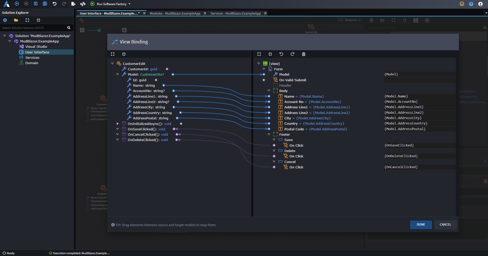
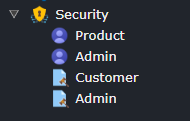
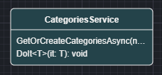

# What's new in Intent Architect (August 2024)

Welcome to the August 2024 edition of highlights of What's New in Intent Architect.

- Highlights
  - **[Intent Architect v4.3 beta release](#intent-architect-v43-beta-release)** - This version includes several new features and improvements with support for **front-end design capabilities**.
  - **[Service security modeling](#service-security-modeling)** - Add the ability to model `Role`s and `Policy`s in the Service Designer.
  - **[HttpClient authorization provider security option](#httpclient-authorization-provider-security-option)** - Integration HttpClients now has a new security pattern for injecting access tokens.
  - **[Ordered pagination for CRUD patterns](#ordered-pagination-for-crud-patterns)** - Our CRUD pagination patterns now support ordering.
  - **[MongoDb Integration Testing support](#mongodb-integration-testing-support)** - Added support for MongoDb Integration testing.
  - **[CosmosDB repository query improvements](#cosmos-db-repository-query-improvements)** - Improved QOL features on the CosmosDB Repository query pattern.

- More updates
  - **[OpenAPI Importer improvements](#openapi-importer-improvements)** - General improvements on the OpenAPI importer module.
  - **[HttpClient grouped configuration](#httpclient-grouped-configuration)** - Shared service proxy configuration.
  - **[MongoDb repository query improvements](#mongodb-repository-query-improvements)** - Improved QOL features on the MongoDb Repository pattern.
  - **[Cosmos DB explicit optimistic concurrency](#cosmos-db-explicit-optimistic-concurrency)** - Ability to model and use optimistic concurrency outside of the repository.
  - **[Domain Service support for Generic types](#domain-service-support-for-generic-types)** - `DomainService`s now support modeling Generic operations.
  - **[Ignore endpoints for OpenAPI](#ignore-endpoints-for-openapi)** - Prevent endpoints from being generated for OpenAPI specifications and Swagger UI.
  - **[Advanced Mapping system documentation for module builders](#advanced-mapping-system-tutorial-for-module-builders)** - Tutorial now available for module builders wanting to leverage the advanced mapping system.

## Update details

### Intent Architect v4.3 beta release

The 4.3 beta is available as a side-by-side install, so you can keep your current version of Intent Architect running along side the beta. The beta can be acquired from our [downloads page](https://intentarchitect.com/#/downloads) in the `Pre-Release(s)` section.



If you would like to experience the front-end design capabilities visit our [MudBlazor sample repository on GitHub](https://github.com/IntentArchitect/Intent.Samples.MudBlazor).

For full details on what's in this release, check out the [4.3 release notes](xref:release-notes.intent-architect-v4.3).

### Service security modeling

We have added a new feature for the Service Designer letting you model service endpoint `Role`s and `Policy`s. You can now add these to our service design as follows:



And then use these modeled concepts on your `Authorize` / `Secured` stereotypes, as follows:


There is also an option to migrate your existing security configuration to this new system.

For more detailed information, see the [Module Documentation](https://github.com/IntentArchitect/Intent.Modules.NET/blob/development/Modules/Intent.AspNetCore.Controllers/README.md).

Available from:

- Intent.AspNetCore.Controllers 6.0.9

### HttpClient authorization provider security option

Our `Intent.Integration.HttpClients` module now has a new `Authorization Setup` option in the `Integration Http Client Settings` section of application settings.

The option is `Authorization Header Provider`, which allows you to inject a scoped service that can resolve the proxy service call's `Authorization` header. This mechanism is very flexible and can be extended for a variety of security scenarios.

For more detailed information, see [Module Documentation](https://github.com/IntentArchitect/Intent.Modules.NET/blob/development/Modules/Intent.Modules.Integration.HttpClients/README.md#authorization-header-provider).

Available from:

- Intent.Integration.HttpClients 5.1.9

### Ordered pagination for CRUD patterns

Our CRUD pagination patterns now support an `OrderBy` parameter, which allows you to specify the ordering for the pagination.


The order by is specified using dynamic LINQ, for example `Surname desc, Name asc`.

For more detailed information, see [Module Documentation](https://github.com/IntentArchitect/Intent.Modules.NET/blob/master/Modules/Intent.Modules.AspNetCore.IntegrationTesting/README.md).

Available from:

- Intent.Application.MediatR.CRUD 6.0.14
- Intent.Application.Dtos.Pagination 4.0.10

### MongoDb Integration Testing support

The `Intent.AspNetCore.IntegrationTesting` now has support for our MongoDb Modules. The module will provision and wire-up a MongoDb container, using `Testcontainers.MongoDb`, for the integration tests to run against.

For more detailed information, see the [Module Documentation](https://github.com/IntentArchitect/Intent.Modules.NET/blob/master/Modules/Intent.Modules.AspNetCore.IntegrationTesting/README.md).

Available from:

- Intent.AspNetCore.IntegrationTesting 1.0.5

### MongoDb repository query improvements

Improved the MongoDb repository pattern to have better LINQ support.

The following LINQ methods have been added:

```csharp
Task<IPagedList<TDomain>> FindAllAsync(
    int pageNo, 
    int pageSize,
    Func<IQueryable<TDocumentInterface>, IQueryable<TDocumentInterface>> queryOptions,
    CancellationToken cancellationToken = default);

Task<TDomain?> FindAsync(
    Func<IQueryable<TDocumentInterface>, IQueryable<TDocumentInterface>> queryOptions, 
    CancellationToken cancellationToken = default);

Task<List<TDomain>> FindAllAsync(
    Func<IQueryable<TDocumentInterface>, IQueryable<TDocumentInterface>> queryOptions, 
    CancellationToken cancellationToken = default);

Task<int> CountAsync(
    Func<IQueryable<TDocumentInterface>, IQueryable<TDocumentInterface>>? queryOptions = default, 
    CancellationToken cancellationToken = default);

Task<bool> AnyAsync(
    Func<IQueryable<TDocumentInterface>, IQueryable<TDocumentInterface>>? queryOptions = default, 
    CancellationToken cancellationToken = default);
```

Available from:

- Intent.MongoDb.Repositories 1.2.0

### Cosmos DB repository query improvements

Our Cosmos DB repository pattern has been improved in the following ways:

- New methods providing LINQ access.
- Protected methods making SQL more accessible for inherited repositories.

The following LINQ methods have been added:

```csharp
Task<IPagedList<TDomain>> FindAllAsync(
    int pageNo, 
    int pageSize,
    Func<IQueryable<TDocumentInterface>, IQueryable<TDocumentInterface>> queryOptions,
    CancellationToken cancellationToken = default);

Task<TDomain?> FindAsync(
    Func<IQueryable<TDocumentInterface>, IQueryable<TDocumentInterface>> queryOptions, 
    CancellationToken cancellationToken = default);

Task<List<TDomain>> FindAllAsync(
    Func<IQueryable<TDocumentInterface>, IQueryable<TDocumentInterface>> queryOptions, 
    CancellationToken cancellationToken = default);

Task<int> CountAsync(
    Func<IQueryable<TDocumentInterface>, IQueryable<TDocumentInterface>>? queryOptions = default, 
    CancellationToken cancellationToken = default);

Task<bool> AnyAsync(
    Func<IQueryable<TDocumentInterface>, IQueryable<TDocumentInterface>>? queryOptions = default, 
    CancellationToken cancellationToken = default);
```

The following SQL methods have been added:

```csharp
protected async Task<List<TDomain>> FindAllAsync(
    QueryDefinition queryDefinition,
    CancellationToken cancellationToken = default);

protected async Task<TDomain?> FindAsync(
    QueryDefinition queryDefinition,
    CancellationToken cancellationToken = default);
```

Available from:

- Intent.CosmosDB 1.2.0

### OpenAPI Importer improvements

The importer now respects the following OpenAPI concepts when importing service definitions:

- `secured`
- `required`
- `allOf`
- `x-enumNames`

There have also been various smaller improvements which make the tool better at interpreting OpenAPI documents.

Available from:

- Intent.OpenApi.Importer 1.1.0

### HttpClient grouped configuration

You can now have a single configuration for all service proxies from a single package, instead of having to configure each one individually. You can still configure them individually if you require variation.

```json
{
  "HttpClients": {
    "SomeApplication.Services": {
      "Uri": "https://localhost:44350/",
      "Timeout": "00:01:00"
    }
  }
}
```

For more information, check out the module [documentation](https://github.com/IntentArchitect/Intent.Modules.NET/blob/development/Modules/Intent.Modules.Integration.HttpClients/README.md#configuring-your-service-proxies-in-your-appsettingsjson).

Available from:

- Intent.Integration.HttpClients 5.1.9

### Cosmos DB explicit optimistic concurrency

The repository already had support for implicit optimistic concurrency, ensuring documents written to Cosmos had not changed since they were read within the same service call. You can now leverage the `ETag` directly for more scenarios including cross service calls.

For more information, check out the module [documentation](https://github.com/IntentArchitect/Intent.Modules.NET/blob/development/Modules/Intent.Modules.CosmosDB/README.md#explicit-optimistic-concurrency).

Available from:

- Intent.CosmosDB 1.2.1

### Domain Service support for Generic types

You can now model Domain Services with Generic type operations.



Available from:

- Intent.DomainServices 1.1.5

### Ignore endpoints for OpenAPI

It is now possible to prevent endpoints from being generated in OpenAPI specifications, and by implication making them ignored by other tools using the OpenAPI specification, such as Swagger UI.

To ignore an endpoint, apply the _OpenAPI Settings_ stereotype to a Command, Query, Service Operation, or Azure Function and select the _Ignore_ checkbox:


When applied, it will add an `[ApiExplorerSettings(IgnoreApi = true)]` attribute to controllers and/or methods for ASP.NET Core WebAPI or the `[OpenApiIgnore]` attribute to Azure Functions.

Available from:

- Intent.AspNetCore.Controllers 6.0.9
- Intent.AzureFunctions 4.1.1

### Advanced Mapping system tutorial for module builders

Module builders wishing to leverage Intent Architect's advanced mapping system can now refer to our [](xref:module-building.tutorial-advanced-mapping) for a guide on how to do so.