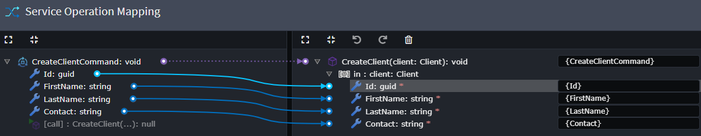
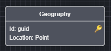
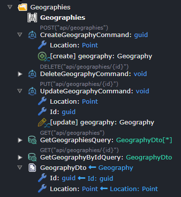
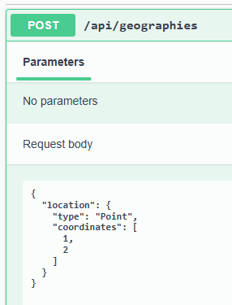
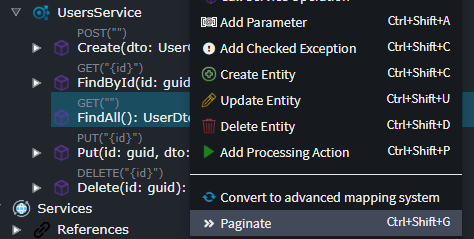
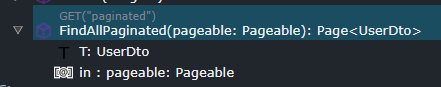
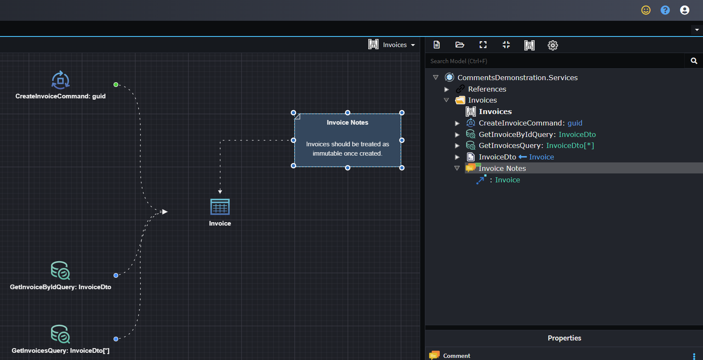

# What's new in Intent Architect (September 2024)

Welcome to the September 2024 edition of highlights of What's New in Intent Architect.

- Highlights

- More updates
  - **[Map CQRS Operations and Application Services to Repository Operations](#map-cqrs-operations-and-application-services-to-repository-operations)** - Add bespoke Operations on Repositories in the Domain designer and invoke them from Services using mappings in the Services designer.
  - **[Razor Code Management](#razor-code-management)** - "Code Management" capabilities for `.razor` files for intelligent and powerful code merging between existing and generated content.
  - **[NetTopologySuite for GIS capabilities](#nettopologysuite-for-gis-capabilities)** - Geospatial integration with Entity Framework ORM for SQL Server, MySQL, and PostgreSQL.
  - **[Service Pagination introduced for Java SpringBoot module](#service-pagination-introduced-for-java-springboot-module)** - Paginate services in Java SpringBoot with Intent Architect.
  - **[Use comments in the Services Designer](#use-comments-to-the-services-designer)** - Comments can now be used in the Services Designer in the the same way that that they can be used in the to Domain Designer.

## Update details

### Map CQRS Operations and Application Services to Repository Operations

Add Operations on Repositories in the Domain designer and invoke them from Services using mappings in the Services designer.

Example Repository with Operation:


Example Command:


Example invocation from Command to Repository Operation:




Available from:

- Intent.Modelers.Services.DomainInteractions 1.1.4

Ensure you are using at least the versions of the following modules (if you have them installed):

- Intent.Application.MediatR.CRUD 6.0.12
- Intent.Application.ServiceImplementations.Conventions.CRUD 5.0.9

### Razor Code Management

[Code Management / Merging](xref:application-development.code-management.about-code-management) capabilities for `.razor` files for intelligent and powerful code merging between existing and generated content.

For more information, refer to [this](xref:application-development.code-weaving-and-generation.about-code-management-razor) Docs article.

Available from:

- Intent.Code.Weaving.Razor 1.0.0-beta.0

### NetTopologySuite for GIS capabilities

The [NetTopologySuite](https://nettopologysuite.github.io/NetTopologySuite/) library is introduced for Geographic Information System (GIS) capabilities allowing you to incorporate geospatial data in your applications using Intent Architect with Entity Framework for SQL Server, MySQL, and PostgreSQL.

Specify `Point` in your Domain.



Have your Services also contain this `Point` as part of request and response messages.



Schema as represented in Swagger.



Available from:

- Intent.NetTopologySuite 1.0.0

### Service Pagination introduced for Java SpringBoot module

Paginate services in Java SpringBoot with Intent Architect.

Right click on a service returning a collection of a DTO.



It will now be decorated with the appropriate paginated types.



Controller action code sample.

```java
@GetMapping(path = "/paginated")
@Operation(summary = "FindAllPaginated")
@ApiResponses(value = {
    @ApiResponse(responseCode = "200", description = "Returns the specified Page<UserDto>."),
    @ApiResponse(responseCode = "400", description = "One or more validation errors have occurred."),
    @ApiResponse(responseCode = "404", description = "Can\'t find an Page<UserDto> with the parameters provided.") })
public ResponseEntity<Page<UserDto>> FindAllPaginated(@Parameter(required = true)  Pageable pageable) {
    if (pageable.isUnpaged()) {
        pageable = PageRequest.of(0, 150);
    }

    final Page<UserDto> result = usersService.FindAllPaginated(pageable);

    return new ResponseEntity<>(result, HttpStatus.OK);
}
```

Available from:

- Intent.Java.SpringBoot 4.0.1
- Intent.Java.Services.CRUD 4.0.1

### Use comments to the Services Designer

It is now possible to use comments in the Services Designer in the the same way that that comments could already already be used in the to Domain Designer.



Available from:

- Intent.Modelers.Services 3.7.5
