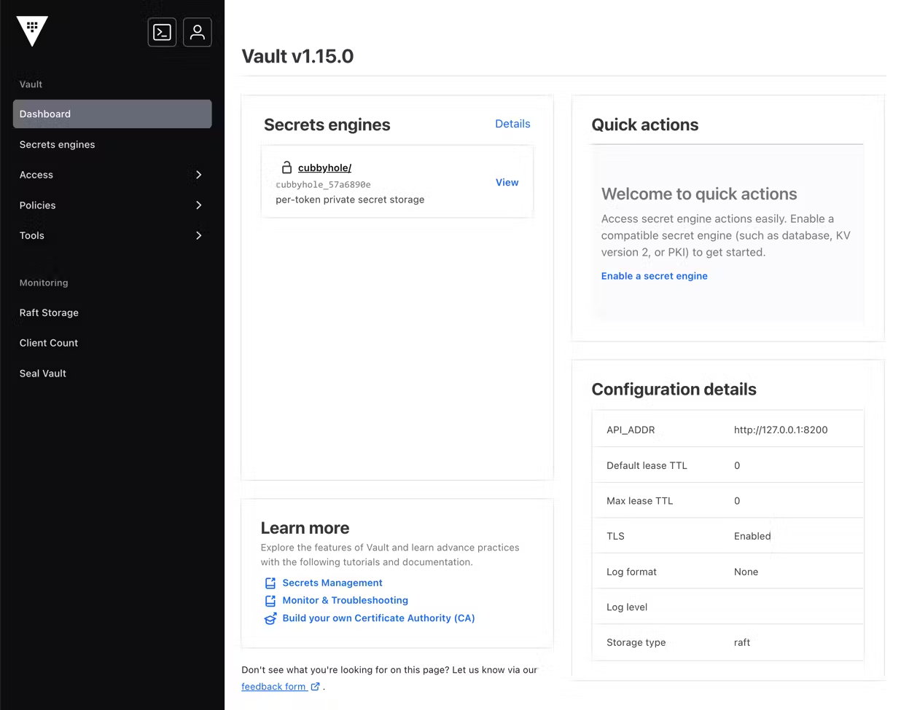

# What's new in Intent Architect (September 2024)

Welcome to the September 2024 edition of What's New in Intent Architect.

- Highlights
  - **[Razor Code Management](#razor-code-management)** - "Code Management" capabilities for `.razor` files, offering intelligent and powerful code merging between existing and generated content.
  - **[NetTopologySuite for GIS capabilities](#nettopologysuite-for-gis-capabilities)** - Geospatial integration with Entity Framework ORM for SQL Server, MySQL, and PostgreSQL.
  - **[NuGet modeling for module builders](#nuget-modeling-for-module-builders)** - Ability to model NuGet package dependencies for modules.
  - **[HashiCorp Vault secrets integration with .NET configuration](#hashicorp-vault-secrets-integration-with-net-configuration)** - Access secrets from a HashiCorp Vault for .NET configuration.
  - **[Use comments in the Services Designer](#use-comments-in-the-services-designer)** - Comments can now be used in the Services Designer in the same way they can be used in the Domain Designer.

- More updates
  - **[Enforce Enums using SQL constraints with EF Core](#enforce-enums-using-sql-constraints-with-ef-core)** - Automatically set up SQL constraints to enforce data integrity on enums.
  - **[Swagger UI defaults ModelRendering to Example](#swagger-ui-defaults-modelrendering-to-example)** - The default view of request payloads in Swagger UI is now set to `Example` instead of `Model` (schema).
  - **[Service Pagination introduced for Java SpringBoot module](#service-pagination-introduced-for-java-springboot-module)** - Paginate services in Java SpringBoot with Intent Architect.

## Update details

### Razor Code Management

[Code Management / Merging](xref:application-development.code-management.about-code-management) capabilities for `.razor` files offer intelligent and powerful code merging between existing and generated content.

For more information, refer to [this](xref:application-development.code-weaving-and-generation.about-code-management-razor) Docs article.

Available from:

- Intent.Code.Weaving.Razor 1.0.0-beta.0

### NetTopologySuite for GIS capabilities

The [NetTopologySuite](https://nettopologysuite.github.io/NetTopologySuite/) library is introduced for Geographic Information System (GIS) capabilities, allowing you to incorporate geospatial data into your applications using Intent Architect with Entity Framework for SQL Server, MySQL, and PostgreSQL.

Specify `Point` in your Domain.


Have your Services also contain this `Point` as part of request and response messages.


Schema as represented in Swagger:


Available from:

- Intent.NetTopologySuite 1.0.0

### NuGet modeling for module builders

For module builders, we have introduced the ability to model NuGet package dependencies for your modules.


Modeling your NuGet packages provides the following benefits:

- Modules can "vote" on which versions of a NuGet package they want to install if multiple modules are trying to install the same package.
- NuGet integration for fetching the latest versions of packages.
- Support for package versioning per .NET Framework.

For more detailed information, see this [article](https://docs.intentarchitect.com/articles/module-building/templates-csharp/how-to-model-nuget-dependencies-csharp/how-to-model-nuget-dependencies-csharp.html).

Available from:

- Intent.ModuleBuilder.CSharp 3.6.1-pre.0

### HashiCorp Vault secrets integration with .NET configuration

HashiCorp Vault provides organizations with identity-based security to automatically authenticate and authorize access to secrets and other sensitive data. Access secrets from a HashiCorp Vault for configuration in .NET.

Learn more by visiting the module documentation [here](https://github.com/IntentArchitect/Intent.Modules.NET/blob/master/Modules/Intent.Modules.HashiCorp.Vault/README.md).

If you have `MySecret` stored in the Vault, you can access it using `IConfiguration`:

```csharp
public static void Configuration(IConfiguration configuration) 
{
    var superSecret = configuration["MySecret"];
}
```



Available from:

- Intent.HashiCorp.Vault 1.0.0

### Use comments in the Services Designer

It is now possible to use comments in the Services Designer in the same way that comments could already be used in the Domain Designer.


Available from:

- Intent.Modelers.Services 3.7.5

### Enforce Enums using SQL constraints with EF Core

We have introduced a new setting, `Enum check constraints`, for the `Intent.EntityFrameworkCore` module. When this is enabled, any `enum`-based attributes in the domain will have SQL `check constraints` configured so that only valid values can be saved in the column.

For more detailed information, see the [module documentation](https://github.com/IntentArchitect/Intent.Modules.NET/blob/master/Modules/Intent.Modules.EntityFrameworkCore/README.md#database-settings---enum-check-constraints).

Available from:

- Intent.EntityFrameworkCore 5.0.9

### Swagger UI defaults ModelRendering to Example

The default view of request payloads in Swagger UI now defaults to `Example` instead of `Model` (schema).

It will present the payload structure like this in Swagger UI:


Instead of this, as it did before:


Available from:

- Intent.AspNetCore.Swashbuckle 5.1.0

### Service Pagination introduced for Java SpringBoot module

Paginate services in Java SpringBoot with Intent Architect.

Right-click on a service returning a collection of a DTO.


It will now be decorated with the appropriate paginated types.


Controller action code sample:

```java
@GetMapping(path = "/paginated")
@Operation(summary = "FindAllPaginated")
@ApiResponses(value = {
    @ApiResponse(responseCode = "200", description = "Returns the specified Page<UserDto>."),
    @ApiResponse(responseCode = "400", description = "One or more validation errors have occurred."),
    @ApiResponse(responseCode = "404", description = "Can't find a Page<UserDto> with the parameters provided.") })
public ResponseEntity<Page<UserDto>> FindAllPaginated(@Parameter(required = true) Pageable pageable) {
    if (pageable.isUnpaged()) {
        pageable = PageRequest.of(0, 150);
    }

    final Page<UserDto> result = usersService.FindAllPaginated(pageable);

    return new ResponseEntity<>(result, HttpStatus.OK);
}
```

Available from:

- Intent.Java.SpringBoot 4.0.1
- Intent.Java.Services.CRUD 4.0.1
