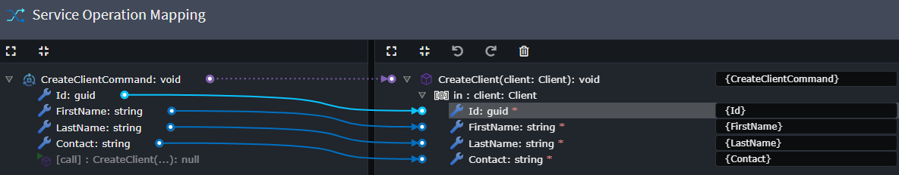

# What's new in Intent Architect (October 2024)

Welcome to the October 2024 edition of highlights of What's New in Intent Architect.

- Highlights

- More updates
  - **[Map CQRS Operations and Application Services to Repository Operations](#map-cqrs-operations-and-application-services-to-repository-operations)** - Add bespoke Operations on Repositories in the Domain designer and invoke them from Services using mappings in the Services designer.
  - **[CosmosDB Module Enums stored as String](#cosmosdb-module-enums-stored-as-string)** - CosmosDB module now allows Enums to be stored as strings in your documents.
  - **[OpenTelemetry Module Enhanced with Expanded Configurations and New Export Options](#opentelemetry-module-enhanced-with-expanded-configurations-and-new-export-options)** - The OpenTelemetry module now supports expanded configuration options and introduces a new export option.
  - **[Import Stored Procedures for Repositories](#import-stored-procedures-for-repositories)** - Import definitions of Stored Procedures from SQL Server into your Domain Repository.
  - **[C# code management: Overriding return statements is now easier](#c-code-management-overriding-return-statements-is-now-easier)** - Return statements can now be ignored more simply.

## Update details

### Map CQRS Operations and Application Services to Repository Operations

Add Operations on Repositories in the Domain designer and invoke them from Services using mappings in the Services designer.

Example Repository with Operation:


Example Command:


Example invocation from Command to Repository Operation:




Available from:

- Intent.Modelers.Services.DomainInteractions 1.1.4

Ensure you are using at least the versions of the following modules (if you have them installed):

- Intent.Application.MediatR.CRUD 6.0.12
- Intent.Application.ServiceImplementations.Conventions.CRUD 5.0.9

### CosmosDB Module Enums stored as String

CosmosDB module now allows Enums to be stored as strings in your documents.

You can switch this on with the "Store enums as string" setting.


The Document's that represent Entities in the Infrastructure layer will then decorate the Enum Properties with a `JsonConverter` attribute when the setting is switched on.

```c#
[JsonConverter(typeof(EnumJsonConverter))]
public EnumExample EnumExample { get; set; }
```

This will allow Enums to be persisted in CosmosDB as `strings` however it is also durable in that it can also parse Enums in their `int` representations allowing for backward compatibility.

Available from:

- Intent.CosmosDB 1.2.4

### OpenTelemetry Module Enhanced with Expanded Configurations and New Export Options

The OpenTelemetry module now features expanded configuration options, allowing users to enable metrics alongside the previously available traces and logs. Additional instrumentation has been introduced with Trace or Metric indicators, providing greater flexibility in monitoring applications.


Moreover, a new export option, "Azure Monitor OpenTelemetry Distro," has been added, which offers hybrid capabilities that blend OpenTelemetry and Azure Application Insights' proprietary features, such as "Live Metrics."


Users can also configure the application instance name in conjunction with the application service name for better identification.

```json
"OpenTelemetry": {
    "ServiceName": "My Sample Service",
    "ServiceInstanceId": "Development"
}
```

Available from:

- Intent.OpenTelemetry 2.2.0

### Import Stored Procedures for Repositories

Import definitions of Stored Procedures from SQL Server into your Domain Repository.

You can right click on a Repository and select `Stored Procedure Import`.


Specify names of stored procedures as a comma separated list.


Import Stored Procedures either as Operations or Specialized elements.


> [!NOTE]
>
> Stored Procedure elements will be phased out in favor of using Operations once the Operations variant has reached parity with the specialized elements.

Available from:

- Intent.SqlServerImporter 1.0.6

### C# code management: Overriding return statements is now easier

Previously when wanting to "override" a generated return statement in a fully managed method you would need to qualify the `// IntentIgnore` with a `(Match = "return")`, now only a simple `// IntentIgnore` is required:

```csharp
// Generated:
[IntentFully]
public int Method()
{
    return 0;
}

// What was previously required to override the return statement:
[IntentFully]
public int Method()
{
    // IntentIgnore(Match = "return")
    return 1;
}

// What is now required to override the return statement:
[IntentFully]
public int Method()
{
    // IntentIgnore
    return 1;
}
```

Available from:

- Intent.OutputManager.RoslynWeaver 4.7.7
