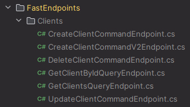

# What's new in Intent Architect (November 2024)

Welcome to the November 2024 edition of highlights of What's New in Intent Architect.

- Highlights
  - **[Hangfire Scheduler](#hangfire-scheduler-module)** - Model scheduled jobs in the Services Designer, and have them realized using [Hangfire](http://www.hangfire.io)
  - **[Google Cloud Storage Module](#google-cloud-storage-module)** - New support for Google Cloud Storage integration in .NET applications.
  - **[FastEndpoints an alternative to ASP.NET Core Controllers](#fastendpoints-an-alternative-to-aspnet-core-controllers)** - FastEndpoints is a developer friendly alternative to Minimal APIs & MVC.
  - **[Specify custom implicit usings](#specify-custom-implicit-global-usings-for-projects)** - Specify custom implicit usings from inside the Visual Studio designer.
  - **[Generate a .gitignore file](#gitignore-file-generation)** - Automatically generate a .NET .gitignore file for your application
  - **[Command field default values](#command-field-default-values)** - Default values configured on CQRS Command fields are now used in the Command's constructor.
  - **[Specify default values for associations](#specify-default-values-for-associations)** - Specify default values for properties generated for associations.

## Update details

### Hangfire Scheduler Module

This module allows you to model scheduled jobs in the Services Designer. These scheduled job are then realized using the [Hangfire](https://hangfire.io/).


See the [module documentation](https://github.com/IntentArchitect/Intent.Modules.NET/blob/development/Modules/Intent.Modules.Hangfire/README.md) for more details.

Available from:

- Intent.Hangfire 1.0.0-beta.3

### Google Cloud Storage Module

The `Google Cloud Storage` module for .NET provides an easier-to-use API via the `ICloudStorage` interface. This release simplifies interactions such as uploading, downloading, listing, and deleting objects with Google Cloud Storage, enabling developers to focus more on business logic and less on backend infrastructure.

For more details, refer to the [module documentation](https://github.com/IntentArchitect/Intent.Modules.NET/blob/development/Modules/Intent.Modules.Google.CloudStorage/README.md).

Available from:

- Intent.Google.CloudStorage 1.0.0-beta.1

### FastEndpoints an alternative to ASP.NET Core Controllers

FastEndpoints is a developer friendly alternative to Minimal APIs & MVC. Its performance is on par with Minimal APIs. Use Intent Architect to perform a drop-in replacement of ASP.NET Controllers by uninstalling the following modules before installing FastEndpoints.

Uninstall the following:

- Intent.AspNetCore.Versioning (if present)
- Intent.AspNetCore.Controllers.Dispatch.MediatR (if present)
- Intent.AspNetCore.Controllers.Dispatch.ServiceContract (if present)
- Intent.AspNetCore.Controllers

Instead of the `Controllers` folder you will see a `FastEndpoints` folder in your `API` project. Instead of a Controller class filled with Action methods, and instead of having a file containing many Minimal API routes, you have a class per endpoint.



An example of a FastEndpoint class:

```csharp
public class CreateClientCommandEndpoint : Endpoint<CreateClientCommand, JsonResponse<Guid>>
{
    private readonly ISender _mediator;

    public CreateClientCommandEndpoint(ISender mediator)
    {
        _mediator = mediator ?? throw new ArgumentNullException(nameof(mediator));
    }

    public override void Configure()
    {
        Post("api/clients");
        Description(b =>
        {
            b.WithTags("Clients");
            b.Accepts<CreateClientCommand>(MediaTypeNames.Application.Json);
            b.Produces<JsonResponse<Guid>>(StatusCodes.Status201Created, contentType: MediaTypeNames.Application.Json);
            b.ProducesProblemDetails();
            b.ProducesProblemDetails(StatusCodes.Status500InternalServerError);
        });
        AllowAnonymous();
        Options(x => x.WithVersionSet(">>Api Version<<").MapToApiVersion(new ApiVersion(1.0)));
    }

    public override async Task HandleAsync(CreateClientCommand req, CancellationToken ct)
    {
        var result = default(Guid);
        result = await _mediator.Send(req, ct);
        await SendCreatedAtAsync<GetClientByIdQueryEndpoint>(new { id = result }, new JsonResponse<Guid>(result), cancellation: ct);
    }
}
```

This will respect your selected dispatch pattern whether it is CQRS with MediatR or the Traditional Services dispatch pattern.

Read more about FastEndpoints [here](https://fast-endpoints.com/).

> [!NOTE]
>
> FastEndpoints itself may not support every capability like ASP.NET Core Controllers does and similarly the Module for Intent Architect is in beta so it may not be on par. If you find that it is missing a capability you're looking for, please reach out to us on [github](https://github.com/IntentArchitect/Support) and log a feature request.

Available from:

- Intent.FastEndpoints 1.0.0-beta.8


### Specify custom implicit (global) usings for projects

You can now generate custom [implicit using directives](https://learn.microsoft.com/dotnet/core/project-sdk/overview#implicit-using-directives) inside the Visual Studio designer:


Which will cause `<Using Include="..." />` elements to be generated in the `.csproj`:

```xml
<Project Sdk="Microsoft.NET.Sdk">

  <PropertyGroup>
    <TargetFramework>net8.0</TargetFramework>
    <GenerateDocumentationFile>true</GenerateDocumentationFile>
    <NoWarn>$(NoWarn);1591</NoWarn>
    <Nullable>enable</Nullable>
  </PropertyGroup>

  <ItemGroup>
    <Using Include="Shouldly" />
  </ItemGroup>

</Project>
```

Available from:

- Intent.VisualStudio.Projects 3.8.1

### .gitignore file generation

You can now specify the inclusion of a .NET .gitignore file as part of your application.


Available from:

- Intent.VisualStudio.Projects 3.8.2

### Command field default values

When a default values is set on a Command field in the Services Designer:


The value will now pull through and be used on the Command constructor:


Available from:

- Intent.Application.MediatR 4.2.9
- Intent.Modelers.Services.CQRS 5.0.1

### Specify default values for associations

You can now specify default values for associations, for example:


Which will cause the following to be generated for the `Lines` property:

```csharp
public class Invoice
{
    public Guid Id { get; set; }

    public string Number { get; set; }

    public DateTime Date { get; set; }

    public virtual ICollection<Line> Lines { get; set; } = new();
}
```

Available from:

- Intent.Modelers.Domain 3.11.0
