# What's new in Intent Architect (December 2024)

Welcome to the 2024 Christmas edition of highlights of What's New in Intent Architect.

We are proud to announce the release of Intent Architect 4.4 beta. This release has been largely focused on improving product usability and feature discoverability. This version is fully backwards compatible.

- Highlights
  - **[Help Topics, in product](#help-topics-in-product)** - Context-aware help topics available in-product by pressing F1.
  - **[Suggestions](#suggestions)** - A new hint system to accelerate modeling and help discover modeling options.
  - **[Search Everywhere](#search-everywhere)** - Search across all applications with a unified search experience.
  - **[SonarQube analysis](#sonarqube-module)** - Real-time code quality analysis using [SonarQube](https://www.sonarsource.com/products/sonarlint/).
  - **[Azure Functions upgradeable to Isolated Processes for .NET 8](#azure-functions-upgradeable-to-isolated-processes-for-net-8)** - Support for Azure Functions in Isolated Processes targeting .NET 8.

- More updates
  - **[Find Usages](#find-usages)** - Rework "Find Usages" functionality.
  - **[Add to Diagram](#add-to-diagram)** - Easily locate and add elements to your diagrams.
  - **[Solution folders](#solution-folders)** - Organize applications using solution folders.
  - **[Filtered searching](#filtered-searching)** - Filtered searches in Solution Explorer and tree views.
  - **[.NET 9 support](#net-9-support)** - Added support for .NET 9.
  - **[AutoMapper `ProjectTo` option for CRUD Patterns](#automapper-projectto-option-for-crud-patterns)** - Configure CRUD patterns to use AutoMapper's `ProjectTo` functionality.
  - **[Finbuckle multi-tenancy support for MongoDB](#finbuckle-multi-tenancy-support-for-mongodb)** - Multi-tenancy with separate databases for MongoDB.
  - **[Finbuckle multi-tenancy support for Google Cloud Storage](#finbuckle-multi-tenancy-support-for-google-cloud-storage)** - Multi-tenancy with separate storage accounts for Google Cloud Storage.
  - **[Service Designer Authorization improvements](#service-designer-authorization-improvements)** - New security module and enhanced authorization capabilities.
  - **[ASP.NET Core MVC module](#aspnet-core-mvc-module)** - Generate basic MVC controllers and views from services in the Service Designer.
  - **[Multi-tenancy route strategy](#multi-tenancy-route-strategy)** - Identify tenants using route parameters in multi-tenant applications.
  - **[Custom Swagger examples](#custom-swagger-examples)** - Add custom examples for DTO fields and parameters in Swagger UI.

## Update details

### Help Topics, in product

Intent Architect now includes built-in `Help`. Pressing `F1` within the context of a designer opens the `Help` dialog. The dialog provides help topics that can be further filtered using the search bar.

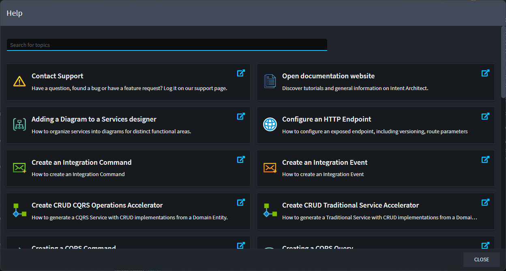

The `Help` dialog is context-aware. For example:

- Pressing F1 in a designer displays help topics specific to that designer.
- Selecting an `Element` such as a domain `Class` or CQRS `Command` filters help topics relevant to the selected element.

Available from:

- Intent Architect 4.4.0

### Suggestions

`Suggestion`s are a new feature intended to give context-specific assistance to modelers. When hovering your mouse over an `Element` that has suggestions, you will see a Light Bulb icon, indicating that suggestions are available.

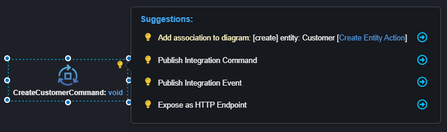

Suggestions aim to assist with the following:

- Quickly model common scenarios, for example:
  - Publishing an `Integration Event` from a CQRS Command.
  - Subscribing to an `Integration Event`.
  - Publishing a `Domain Event` from a domain behavior.
- Add related Elements/Associations for existing Diagram Elements.
- Discover modeling options.

Available from:

- Intent Architect 4.4.0

### Search Everywhere

The Search Everywhere dialog allows you to quickly find aspects of your design using a unified, incremental search box that also supports abbreviation matching.  
The search is performed across applications, and the search results provide full context to make it easy to identify the desired result.

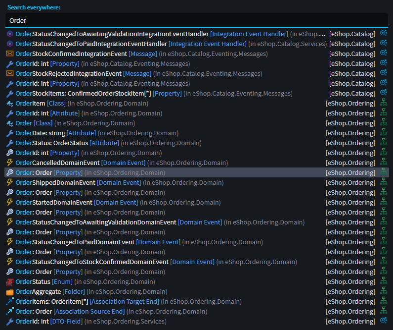

You can access the Search Everywhere dialog using its shortcut (Ctrl+T).

Available from:

- Intent Architect 4.4.0

### SonarQube module

This module installs the SonarQube IDE linter into your application, providing real-time code quality analysis and feedback on the quality, readability, and complexity of the code.

An example of some warnings raised by SonarQube (as well as other analysis tools):

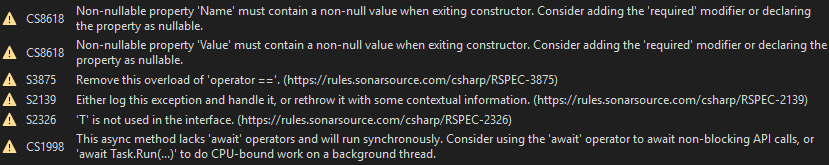

Available from:

- Intent.SonarQube 1.0.0

### Azure Functions upgradeable to Isolated Processes for .NET 8

Azure Functions for Isolated Processes are now accessible by configuring your API project to target .NET 8 and setting the Output Type to `Console` in the Visual Studio designer.

To learn about migrating existing Azure Functions from .NET 6 In-Process to .NET 8 Isolated Processes, [click here](https://github.com/IntentArchitect/Intent.Modules.NET/blob/development/Modules/Intent.Modules.AzureFunctions/README.md#migrating-from-in-process-functions).

Available from:

- Intent.AzureFunctions 5.0.1

### Find Usages

The `Find Usages` (Shift+F12) feature has been vastly improved, leveraging the new `Search Everywhere` feature.

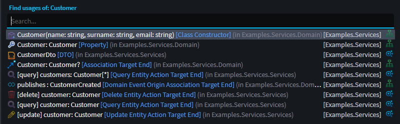

Find usages will present you with a list of all references to the modeled element, including across applications.

Example use cases for this feature:

- Who is subscribing to this Integration Event?
- What would be affected if I change this domain attribute?

Available from:

- Intent Architect 4.4.0

### Filtered searching

When searching in the `Solution Explorer` and `designer tree-view`, these trees now filter to only show matching search results.

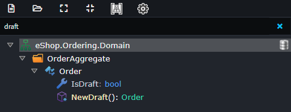

Available from:

- Intent Architect 4.4.0

### Add to Diagram

Diagrams in the `Service Designer` and `Domain Designer` have a new feature, `Add to Diagram` (Ctrl+Shift+A), which assists with finding and adding items onto the diagram.

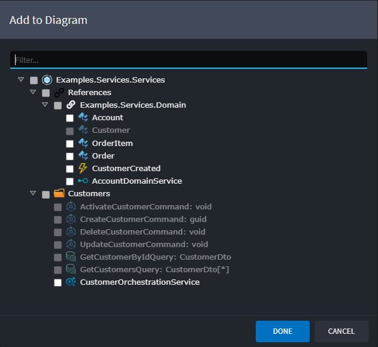

The dialog will show you all elements, which aren't currently on your diagram, which you can add to it. This list includes elements in the current package as well as referenced packages.

Common use cases for this feature:

- Adding elements to model against like:
  - Integration Messages, for Integration Subscriptions.
  - Entities, for CRUD implementations.
  - Domain Services, for modeling Service Operation Calls.
  - Domain Events, for Domain Event subscriptions.
- Adding Custom Commands/Queries to an existing Diagram.
- Creating custom Diagrams.

Available from:

- Intent Architect 4.4.0
- Intent.Modelers.Domain 3.12.0-beta.*
- Intent.Modelers.Services 3.9.0-beta.*

### Solution folders

You can now group applications together by adding folders to the solution explorer. This is particularly useful if you have:

- Many Microservices.
- Logically similar applications you'd like to group together.

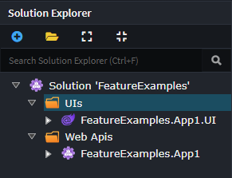

Available from:

- Intent Architect 4.4.0

### .NET 9 support

We have added full support for .NET 9. When creating applications you can configure to target .NET 9 and all of our modules have been updated to resolve the latest NuGet packages for your targeted .NET Framework.

The current default for new applications is .NET 8 as it is the latest LTS.

### AutoMapper `ProjectTo` option for CRUD patterns

There is now an option to have your CRUD data queries realized using `AutoMapper`'s `ProjectTo` feature. There is a new application setting under "Domain Interaction Settings" called "Default Query Implementation" which has the following options:

- **Default**, the current CRUD implementation.
- **Project To**, CRUD queries with be implemented using `ProjectTo`.

Here is an example of `Query` implementation  using the `ProjectTo` option.

```csharp
public async Task<List<CustomerDto>> Handle(GetCustomersQuery request, CancellationToken cancellationToken)
{
    var customers = await _customerRepository.FindAllProjectToAsync<CustomerDto>(cancellationToken);
    return customers;
}
```

Available from:

- Intent.Application.AutoMapper 5.1.6
- Intent.Modelers.Services.DomainInteractions 2.0.3
- Intent.Application.MediatR.CRUD 6.0.22
- Intent.Application.ServiceImplementations.Conventions.CRUD 5.0.19

### Finbuckle multi-tenancy support for MongoDB

If you install the `Intent.Modules.AspNetCore.MultiTenancy` module with the MongoDB module, you can  now configure what type of Multi-tenancy you want to use. You can set the MongoDB Data Isolation to the following options:

- **Separate Database**, each tenant will connect to their own database.
- **None**, disable multi-tenancy.

See the [module documentation](https://github.com/IntentArchitect/Intent.Modules.NET/blob/master/Modules/Intent.Modules.MongoDb/README.md#multi-tenancy-support) for more details.

Available from:

- Intent.MongoDb 1.0.18
- Intent.Modules.AspNetCore.MultiTenancy 5.1.5

### Finbuckle multi-tenancy support for Google Cloud Storage

If you install the `Intent.Modules.AspNetCore.MultiTenancy` module with the Google Cloud Storage module, you can  now configure what type of Multi-tenancy you want to use. You can set the Google Cloud Storage Data Isolation to the following options:

- **Separate Storage Account**, each tenant will connect to their own storage account.
- **None**, disable multi-tenancy.

See the [module documentation](https://github.com/IntentArchitect/Intent.Modules.NET/blob/development/Modules/Intent.Modules.Google.CloudStorage/README.md#multitenancy-support) for more details.

Available from:

- Intent.Google.CloudStorage 1.0.0-beta.4
- Intent.Modules.AspNetCore.MultiTenancy 5.1.5

### Service Designer authorization improvements

Various improvements have been made around defining authorization within the services designer.

#### Consolidation of security related designer concepts into single `Intent.Metadata.Security` module

The `Secured`, `Unsecured` stereotypes and security related designer settings have been moved from the `Intent.Metadata.WebApi` module to a new `Intent.Metadata.Security` module. This new module will automatically be installed on updating to the latest version `Intent.Metadata.WebApi`.

This has allowed us to remove the separate `Authorize` stereotype for CQRS operations as it was previously impossible to use the existing `Secured` and `Unsecured` stereotypes without adding a dependency to `Intent.Metadata.WebApi`. Any existing `Authorize` stereotypes applied will be automatically converted to `Secured` stereotypes.

#### Apply multiple `Secured` stereotypes

It is now possible to apply multiple `Secured` stereotypes to `Services`, `Operations`, `Commands` and `Queries`. When multiple `Secured` stereotypes are applied they are treated as all needing to have their security requirements fulfilled while for a specific `Secured` stereotype if there are multiple policies or roles applied, only a single one of them has to be fulfilled. Overall this gives more flexibility in representing certain security requirements.

#### Apply the `Secured` to a Service package

It is now possible to apply `Secured` or `Unsecured` stereotypes to a Services package within the Services package which will apply security requirements (such as policies and/or roles) to all Service Operations, Commands or Queries within that package.

Available from:

- Intent.Application.MediatR 4.3.0
- Intent.Application.MediatR.Behaviours 4.3.0
- Intent.AspNetCore.Controllers 7.0.0
- Intent.AspNetCore.Controllers.Dispatch.MediatR 6.0.0
- Intent.HotChocolate.GraphQL 5.0.0
- Intent.HotChocolate.GraphQL.AspNetCore 6.0.0
- Intent.HotChocolate.GraphQL.AzureFunctions 2.0.0
- Intent.HotChocolate.GraphQL.Dispatch.MediatR 2.0.0
- Intent.HotChocolate.GraphQL.Dispatch.Services 2.0.0
- Intent.Metadata.WebApi 4.6.4
- Intent.Metadata.Security Intent.Metadata.Security 1.0.0

### ASP.NET Core MVC module

View stubs and basic MVC controllers can now be generated for, and which dispatch to, Services in the Service designer.

To get started with the module simply right-click a Service in the Services Designer and select the _Expose with MVC_ option:

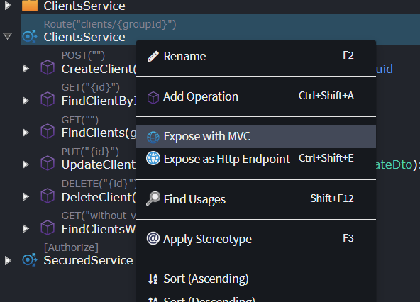

Once exposed, various settings can be configured for particular operations:

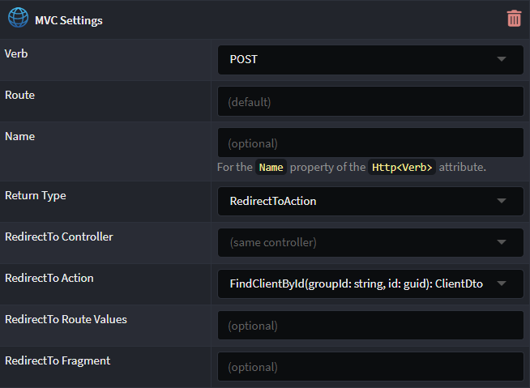

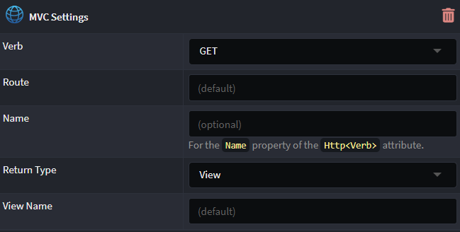

See the [README](https://github.com/IntentArchitect/Intent.Modules.NET/blob/development/Modules/Intent.Modules.AspNetCore.Mvc/README.md) for more information.

Available from:

- Intent.AspNetCore.Mvc 1.0.0-beta.2

### Multi-tenancy Route Strategy

When configuring multi-tenancy settings, `Route` is now as strategy option, as well as the `parameter` name to use as the tenant:

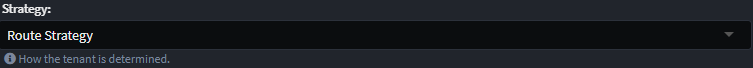
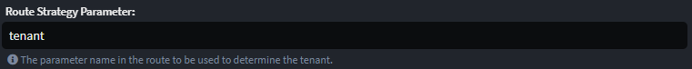

The `route parameter` specified can then be used as a valid placeholder when defining an HTTP route:

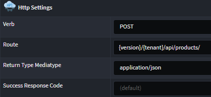

Available from:

- Intent.Modules.AspNetCore.MultiTenancy 5.1.5

### Custom Swagger examples

An `OpenAPI Settings` stereotype is now available to manually be applied to `DTO Field`s and `parameters`.

The value entered for `Example Value` will reflect in the OpenAPI specification and on the Swagger UI.

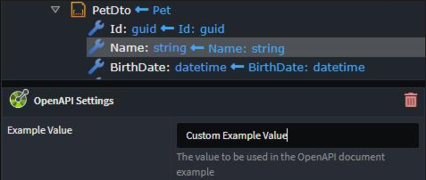

Available from:

- Intent.Modules.Metadata.WebApi - 4.6.4
- Intent.Application.Dtos - 4.4.3
- Intent.Application.MediatR - 4.3.0
- Intent.AspNetCore.Controllers - 7.0.0
- Intent.AspNetCore.Controllers.Dispatch.MediatR - 6.0.0
