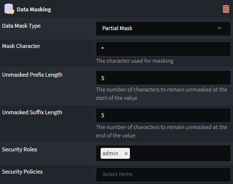
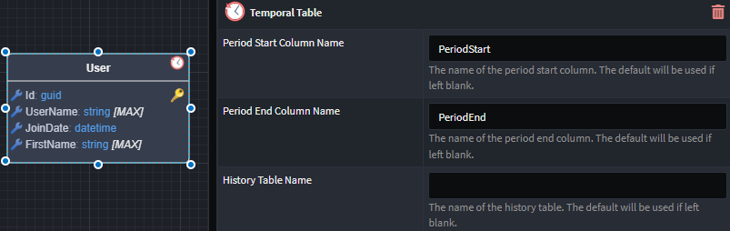

# What's new in Intent Architect (January 2025)

- Highlights
  - **[Data Masking Support](#data-masking-module)** - Mask sensitive data from unauthorized users when using Entity Framework Core.
  - **[Temporal Table Support](#temporal-table-module)** - SQL Server/Azure SQL Temporal table support is now available, enabling tracking of historical data changes.

- More updates
  - **[Custom Validation Messages](#custom-validation-message)** - Add custom validation messages for `Regular Expression` and `Must` validations.

## Update details

### Data Masking Module

It is now possible to mask specific `properties` on a `class` with `data masking` requirements.

Several masking types are available, with built-in security integration to ensure that authorized users can still access the unmasked data.

Available from:

- Intent.EntityFrameworkCore.DataMasking 1.0.0-beta.3

### Temporal Table Module

`Classes` can now be marked as `Temporal Tables`, which will automatically keep track of all data ever stored in the table, even after the data has been updated or deleted.

The module will configure Entity Framework Core, as well as update the relevant `repositories` allowing for the retrieval of the historical data.

Available from:

- Intent.EntityFrameworkCore.TemporalTables 1.0.0-beta.2

### Custom Validation Messages

Custom validation messages can now be specified for `Regular Expression` and `Must` validations.

Available from:

- Intent.Application.FluentValidation 3.10.1
- Intent.Application.FluentValidation.Dtos 3.11.1
- Intent.Application.MediatR.FluentValidation 4.8.1
