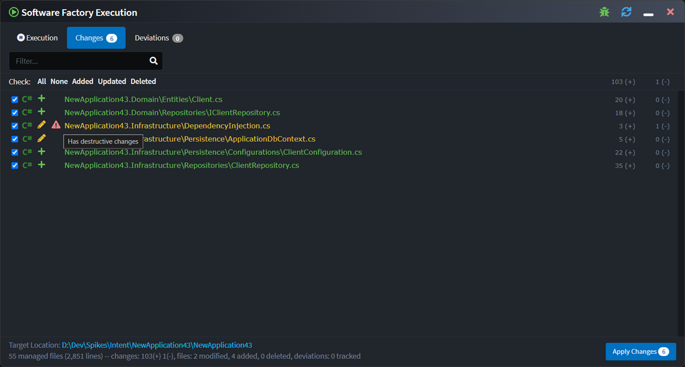

# What's new in Intent Architect (February 2025)

Welcome to the February 2025  edition of highlights of What's New in Intent Architect.

- Updates
  - **[Destructive Changes Detection](#destructive-changes-detection)** - Be warned of changes from the Software Factory which are overwriting manually written code.
  - **[Module-based Contextual Help](#module-based-contextual-help)** - Pressing F1 in the Designers will now bring contextual help topics (4.4 Feature).
  - **[Data Masking Support](#data-masking-module)** - Mask sensitive data from unauthorized users when using Entity Framework Core.
  - **[Temporal Table Support](#temporal-table-module)** - SQL Server/Azure SQL Temporal table support is now available, enabling tracking of historical data changes.
  - **[Custom Validation Messages](#custom-validation-messages)** - Add custom validation messages for `Regular Expression` and `Must` validations.

## Update details

### Destructive changes detection

The Software Factory changes view will now bring attention to changes which are known to be "destructive" of user written code:

A pending change is deemed as having destructive changes when it is removing or replacing code from a file which is known to have been added manually.

Available from:

- Intent Architect 4.4.0
- Intent.OutputManager.RoslynWeaver 4.9.0

### Module-based Contextual Help

With the release of Intent Architect 4.4, many of our modules have been enhanced to leverage the new contextual help feature. Now, when pressing F1 within any designer, you will receive module-specific help topics tailored to the modules you have installed. This feature is context-sensitive, meaning that pressing F1 on a Model will present relevant documentation specific to that context.

Additionally, all existing module documentation has been migrated to our website under the respective "Modules" sections. These topics remain accessible via the in-product help system, allowing for seamless navigation between in-app guidance and comprehensive online documentation.

### Data Masking Module

It is now possible to mask specific `properties` on a `class` with `data masking` requirements.

Several masking types are available, with built-in security integration to ensure that authorized users can still access the unmasked data.

Available from:

- Intent.EntityFrameworkCore.DataMasking 1.0.0-beta.3

### Temporal Table Module

`Classes` can now be marked as `Temporal Tables`, allowing SQL Server/Azure SQL to automatically track historical data changes, even after updates or deletions.

The module configures Entity Framework Core and updates relevant `repositories` for easy retrieval of historical data.

Available from:

- Intent.EntityFrameworkCore.TemporalTables 1.0.0-beta.2

### Custom Validation Messages

Custom validation messages can now be specified for `Regular Expression` and `Must` validations.

Available from:

- Intent.Application.FluentValidation 3.10.1
- Intent.Application.FluentValidation.Dtos 3.11.1
- Intent.Application.MediatR.FluentValidation 4.8.1
