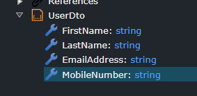

# What's new in Intent Architect (March 2025)

Welcome to the March 2025 edition of highlights of What's New in Intent Architect. Here's a roundup of the latest updates and improvements.

- Highlights
  - **[Soft Delete Pattern for Cosmos DB](#soft-delete-pattern-for-cosmos-db)** - Soft Delete functionality is now available for the CosmosDB module.
  - **[Improved HTTP Route Heuristics](#improved-http-route-heuristics)** - Enhanced heuristics to generate better HTTP routes, reducing conflicts.
  - **[Map Stored Procedure Invocations](#map-stored-procedure-invocations)** - Map stored procedure invocations for automated generation of CQRS and Service Operation implementations.
  - **[Permission constants](#permission-constants)** - Constants are now generated and reused for modeled roles and policies to improve maintainability.
  - **[Manage Particular Attributes in Razor Files](#manage-particular-attributes-in-razor-files)** - Control merge behaviour on an attribute-by-attribute basis for components / HTML Elements in `.razor` files.

- More updates
  - **[Improved SQL Server Importer Filter File](#improved-sql-server-importer-filter-file)** - Added a filter to control which SQL schema elements are imported.
  - **[Improved Domain-to-DTO Field Mapping in Services Designer](#improved-domain-to-dto-field-mapping-in-services-designer)** -  Enhancements to field mapping from domain entities to DTOs.
  - **[Domain Services Registration Options](#domain-service-registration-options)** - Greater flexibility in configuring `Domain Service`s registration with dependency injection.
  - **[204 response codes for nullable endpoints](#204-response-codes-for-nullable-endpoints)** - Automatic addition of 204 No Content responses for nullable-returning operations.

## Update details

### Soft Delete Pattern for Cosmos DB

The Soft Delete functionality that was originally on the Entity Framework Core module has been extended so that it also now is available for the CosmosDB module. Thus in the same module you have Soft Delete functionality for both Entity Framework Core and CosmosDB.


By applying the `Soft Delete Entity` stereotype on a Class, it will introduce the `ISoftDelete` interface on your Domain Entity which will also introduce these class memebers:

```c#
public bool IsDeleted { get; set; }

void ISoftDelete.SetDeleted(bool isDeleted)
{
    IsDeleted = isDeleted;
}
```

The `CosmosDBRepositoryBase` is also updated to detect those Entities for setting the `IsDeleted` upon removal and filtering based on `IsDeleted == false` when querying.

> [!NOTE]
>
> We have deprecated the `Intent.EntityFrameworkCore.SoftDelete`. If you have that module installed before, update it to version 1.0.6 which will install `Intent.Entities.SoftDelete`. You may now safely uninstall the deprecated module.

Available from:

- Intent.Entities.SoftDelete 1.0.0

### Improved HTTP Route Heuristics

The heuristic algorithm for generating HTTP REST routes has been improved for better relevance and reduced conflict likelihood. Additionally, handling of acronyms and initialisms has been refined for increased accuracy.

An example of the previous route generation:


Compared with the updated route generation:


Available from:

- Intent.Metadata.WebApi 4.7.3

### Map Stored Procedure Invocations

It is now possible to map repository operations to stored procedures enabling scenarios of being able to fully generate CQRS / Service Operation implementations which invoke and return results for Stored Procedure with output parameters.


For more information and examples refer to the [module documentation](https://docs.intentarchitect.com/articles/modules-common/intent-modules-modelers-domain-storedprocedures/intent-modules-modelers-domain-storedprocedures.html).

Available from:

- Intent.Modules.Modelers.Domain.StoredProcedures 1.1.4
- Intent.EntityFrameworkCore.Repositories 4.7.5

### Permission Constants

Instead of using a `string literal` to define a `role` or `permission`, a constant is now automatically generated and used. This enhances code maintainability, reduces the risk of errors from typos and provides a centralized place for the permissions.

An example of the static `Permissions` class:

``` csharp
public static class Permissions
{
    public const string RoleCreate = "role:create";
    public const string RoleRead = "role.read";
    public const string PolicyUpdate = "policy.update";

    public static IEnumerable<string> All()
    {
        yield return RoleCreate;
        yield return RoleRead;
        yield return PolicyUpdate;
    }
}
```

An example of a controller action that uses the `constant` instead of the string literal:

``` csharp
[HttpPost("api/products")]
[Authorize(Roles = Permissions.RoleCreate)]
public async Task<ActionResult<JsonResponse<Guid>>> CreateProduct(
    [FromBody] CreateProductCommand command,
    CancellationToken cancellationToken = default)
{
    var result = await _mediator.Send(command, cancellationToken);
    return CreatedAtAction(nameof(GetProductById), new { id = result }, new JsonResponse<Guid>(result));
}
```

Available from:

- Intent.AspNetCore 6.0.8
- Intent.Application.MediatR 4.3.2
- Intent.AspNetCore.Controllers 7.1.1
- Intent.AspNetCore.Mvc 1.0.0-beta.4
- Intent.EntityFrameworkCore.DataMasking 1.0.0-beta.5
- Intent.FastEndpoints 1.0.1

### Manage Particular Attributes in Razor Files

It is now possible to specify on an attribute-by-attribute basis the merge behaviour on a component or HTML element, for example you can fully manage an element except for the `class` attribute as follows:

```razor
@Intent.Fully
@Intent.IgnoreAttributes("class")
<div class="content-block">
    content
</div>
```

For more information refer to [the documentation](https://docs.intentarchitect.com/articles/application-development/code-management/code-management-razor/code-management-razor.html#management-modes).

Available from:

- Intent.Code.Weaving.Razor 1.0.4

### Improved SQL Server Importer Filter File

Specify which Tables to include and which Columns to exclude using the SQL Server Importer.

The improvements include:

- Richer definition experience using a JSON file with a structure you can learn about [here](https://docs.intentarchitect.com/articles/modules-dotnet/intent-sqlserverimporter/intent-sqlserverimporter.html#import-filter-file).
- When you import you can now specify a relative file path to the file used for filtering based on the package you are importing into.
- You can specify which SQL Tables to import, which Columns to exclude.
- Specifying the Schemes to filter on has moved to this filter file.

Available from:

- Intent.SqlServerImporter 1.1.0

### Improved Domain-to-DTO Field Mapping in Services Designer

When mapping from the Domain Entity to a DTO, mapping fields will first try to match with existing fields before creating new ones.

As an example, you have a predefined DTO.



When you `Map from Domain` you can them select the Domain Entity to map from and select the Attributes you wish to map onto the DTO.


The mapped DTO will now have the existing fields mapped because they matched by name.


Available from:

- Intent.Modelers.Services 3.9.2

### Domain Service Registration Options

The global default scope for how `Domain Services` are registered can now be controlled under the `Domain Settings` settings section:


Changing the registration scope of an individual service can be done via the `Service Registration Scope` setting on the Domain Service itself:


Available from:

- Intent.DomainServices 1.1.8

### 204 response codes for nullable endpoints

If a controller method is known to be able to return a nullable result a `[ProducesResponseType(StatusCodes.Status204NoContent)]` is now automatically added to it.

Available from:

- Intent.AspNetCore.Controllers 7.1.1
