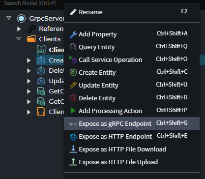
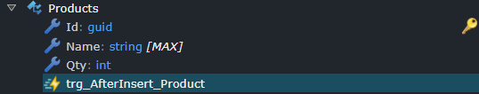

# What's new in Intent Architect (April 2025)

Welcome to the April 2025 edition of highlights of What's New in Intent Architect. Here's a roundup of the latest updates and improvements.

- Highlights
  - **[Ocelot API Gateway Modeling](#ocelot-api-gateway-modeling)** - Model your API Gateways for routing requests or setting up a lightweight BFF using Ocelot.
  - **[Central Package Management Enhancements](central-package-management-enhancements)** - The output location `Directory.Packages.props` file can now be controlled through a variety of options.
  - **[Expose Commands/Queries/Services as gRPC Endpoints](#expose-commandsqueriesservices-as-grpc-endpoints)** - You can now expose services over gRPC which will generate all the necessary `.proto` files and gRPC service implementations.

- More updates
  - **[SQL Importer Trigger Awareness](#sql-importer-trigger-awareness)** - When using the [SQL Server Importer](https://docs.intentarchitect.com/articles/modules-dotnet/intent-sqlserverimporter/intent-sqlserverimporter.html) triggers are now detected and modeled in the Domain Designer.
  - **[Data Contract Attribute Naming Customization](#data-contract-attribute-customization)** - Data Contract attribute names can now be customized to align with the SQL column name.

## Update details

### Ocelot API Gateway Modeling

Model your API Gateways for routing requests or setting up a lightweight BFF using [Ocelot](https://ocelot.readthedocs.io/en/latest/introduction/bigpicture.html).

Reference your Intent Architect application which holds the API endpoints you wish to cover with an API Gateway then create the API Gateway Routes that holds Route Associations to those endpoints.

Additional information available [here](https://docs.intentarchitect.com/articles/modules-dotnet/intent-apigateway-ocelot/intent-apigateway-ocelot.html).

Available from:

- Intent.ApiGateway.Ocelot 1.0.0-beta.2

### Expose Commands/Queries/Services as gRPC Endpoints

Our new module allows exposing Services Operations, Commands and Queries over [gRPC](https://grpc.io/) using the [Grpc.AspNetCore NuGet package](https://www.nuget.org/packages/Grpc.AspNetCore).

In the same way you would expose an HTTP Endpoint for WebApi, simply use the context menu option to expose a Command, Query, Service or Operation as a gRPC endpoint:

The module will generate `.proto` files, service implementations to dispatch the endpoint and all relevant mapping logic to convert incoming and outgoing protocol buffers to and from DTOs/Commands/Queries.

Additional information available [here](https://docs.intentarchitect.com/articles/modules-dotnet/intent-aspnetcore-grpc/intent-aspnetcore-grpc.html).

Available from:

- Intent.AspNetCore.Grpc 1.0.0-beta.0

### SQL Importer Trigger Awareness

When using the [SQL Server Importer](https://docs.intentarchitect.com/articles/modules-dotnet/intent-sqlserverimporter/intent-sqlserverimporter.html) to import an existing database schema into Intent Architect, tables and views with defined triggers will now be correctly identified and marked accordingly.

Additional information available [here](https://docs.intentarchitect.com/articles/modules-dotnet/intent-sqlserverimporter/intent-sqlserverimporter.html#trigger-imports).

Available from:

- Intent.SqlServerImporter 1.1.1

### Data Contract Attribute Customization

The `Column` stereotype can now be applied to `Data Contract Attributes` and realized in code, enabling SQL column names to differ from the modeled names.

Available from:

- Intent.Entities 5.1.11-pre.0

### Central Package Management Enhancements

When `Central Package Management` is enabled in a solution, the output location of `Directory.Packages.props` can now be explicitly specified or automatically detected based on the location of an existing file.

Additional information available [here](https://docs.intentarchitect.com/articles/modules-dotnet/intent-visualstudio-projects/intent-visualstudio-projects.html#central-package-management).

Available from:

- Intent.VisualStudio.Projects 3.8.10
